# 智能办公系统 OA PRD

## 文档信息

| 项目 | 内容 |
| --- | --- |
| 文档名称 | 智能办公系统 OA PRD |
| 当前版本 | V1 |
| 适用对象 | 产品经理、研发工程师、测试工程师、实施顾问、系统管理员 |
| 企业背景 | 中小型制造业企业，需要通过 Web 端智能办公平台支撑人力资源、费控和综合办公管理 |
| 需求来源 | 《智能办公系统-人力资源模块PRD.md》与《费控综合功能.md》 |
| 交付范围 | 合并版 OA PRD；人力资源模块按原 PRD 保留，费控与综合模块按页面功能纳入统一结构 |
| 编写日期 | 2026-06-28 |

## 背景与目标

### 业务背景

制造业企业的日常办公需要在人力资源、费用控制和行政综合管理之间形成统一协作。人力资源模块提供组织、岗位、员工和流程基础；费控模块本期聚焦预算管理、费用申请、费用报销、发票夹和费用类型；综合模块覆盖资产、会议、用章、办公用品、知识、公文、公告、新闻、制度和证照等行政业务。

### 产品目标

1. 建立统一组织、岗位、员工和权限基础，支撑 OA 全模块协同。
2. 支撑人力资源从招聘、入职、考勤、绩效到薪酬的数据闭环。
3. 支撑费控从预算控制、费用申请、费用报销、发票归集到付款追溯的业务闭环。
4. 支撑综合办公中的资产、会议、用章、物品、知识、公文、公告、新闻、制度和证照管理。
5. 通过流程、权限、消息、附件、日志和导入导出能力保障业务可控、可查、可追溯。

### 成功标准

| 维度 | 标准 |
| --- | --- |
| 业务覆盖 | 覆盖人力资源模块、费控模块、综合模块和系统功能。 |
| 主数据一致 | 组织、岗位、员工、部门、角色、权限和附件等基础数据在各模块统一复用。 |
| 流程闭环 | 人资、费控、综合办公的申请、审批、登记、台账和统计均有明确状态和处理结果。 |
| 权限可控 | 不同角色按页面、按钮、数据范围和敏感字段控制访问与操作。 |
| 可验收 | 每个模块有可测试的页面、字段、状态、异常处理和验收标准。 |

## 用户与角色

| 角色 | 典型诉求 | 核心权限 |
| --- | --- | --- |
| HR 管理员 | 管理组织、员工、招聘、考勤、绩效、薪酬和 HR 看板 | 人力资源模块全量管理权限 |
| 人资专员 | 维护员工、合同、招聘、入转调离等业务数据 | 人资业务新增、编辑、导入、导出和流程发起 |
| 部门经理 | 查看本部门员工和费用事项，处理审批和评分 | 本部门数据查看、审批和处理权限 |
| 普通员工 | 提交假勤、费用申请、费用报销、会议、用章、用品和证照相关申请 | 本人数据查看和本人申请权限 |
| 财务人员 | 处理费用申请打款、费用报销、发票夹和预算管理 | 费控审核、付款登记、预算维护权限 |
| 行政人员 | 管理资产、会议、用章、办公用品、知识、公文、公告、新闻、制度和证照 | 综合模块维护、登记、发布和台账权限 |
| 资产管理员 | 维护资产台账、入库、领用、调拨、借用、维修、盘点和处置 | 固定资产全流程处理权限 |
| 系统管理员 | 维护流程、角色、权限、消息、附件、日志和系统基础配置 | 系统功能管理权限 |

## 范围说明

### 本期范围

| 业务大类 | 一级范围 | 说明 |
| --- | --- | --- |
| 人力资源模块 | 工作台、组织架构、员工管理、招聘管理、入转调离、考勤管理、绩效管理、薪酬管理、数据分析 | 延续人力资源 PRD 的全量业务范围。 |
| 费控模块 | 预算管理、费用申请、费用报销、发票夹、费用类型 | 覆盖预算控制、申请审批、报销处理、发票归集和费用分类维护。 |
| 综合模块 | 固定资产、会议、用章、办公用品、知识库、公文、通知公告、新闻、制度规范、证照管理 | 覆盖行政综合管理、内容发布、资产物品流转和证照台账。 |
| 系统功能 | 流程、角色、权限、消息、附件、日志、导入导出、数据权限 | 作为全局基础能力支撑三大业务模块。 |

### 不在本期明确实现的范围

| 范围 | 说明 |
| --- | --- |
| 薪资自动核算引擎 | 薪资模块以导入、审批、归档和工资条发放为主，不包含完整自动算薪。 |
| 第三方平台深度集成 | 招聘、考勤、发票、电子签、支付、会议设备等外部系统集成需单独确认。 |
| 复杂预算管控模型 | 本期定义预算占用、发生和剩余金额，不包含多维预算预测和复杂分摊模型。 |
| 移动端完整原生应用 | 本 PRD 以 Web 端和必要 H5 场景为主，原生 App 能力另行规划。 |

### 版本分期建议

| 版本 | 建设目标 | 必做范围 | 依赖模块 | 延期影响 |
| --- | --- | --- | --- | --- |
| MVP | 建立组织、员工、权限、流程和基础办公闭环 | 组织架构、员工主档、入转调离、基础流程、角色权限、基础费控申请、行政基础台账 | 系统用户、组织权限、审批中心、附件中心 | 后续模块缺少统一人员、权限和流程基础。 |
| V1 | 跑通人资核心、费控核心和行政高频流程 | 考勤、薪酬、预算管理、费用申请、费用报销、发票夹、费用类型、资产、会议、用章、办公用品 | MVP 主数据、流程管理、消息提醒 | 高频办公事项仍需线下处理。 |
| V2 | 补齐管理增强和经营分析能力 | 招聘、绩效、知识、公文、公告、新闻、制度、证照、综合看板 | MVP/V1 业务数据稳定归档 | 统计分析、制度知识沉淀和综合治理能力不足。 |

### 交付边界控制

研发排期、测试计划、客户验收和上线培训均以版本边界为准。进入某版本范围的功能必须同时满足页面、字段、数据、权限、流程、异常处理和验收用例完整可测。

## 术语定义

| 术语 | 定义 |
| --- | --- |
| 人力资源模块 | 支撑组织、员工、招聘、入转调离、考勤、绩效、薪酬和 HR 数据分析的业务模块。 |
| 费控模块 | 支撑预算管理、费用申请、费用报销、发票夹和费用类型的业务模块。 |
| 综合模块 | 支撑固定资产、会议、用章、办公用品、知识、公文、公告、新闻、制度和证照等行政办公业务的模块。 |
| 系统功能 | 跨模块复用的流程、权限、消息、附件、日志、导入导出、数据权限和基础配置能力。 |
| 单据 | 员工、行政、财务或 HR 发起的申请、登记、处理或审批记录。 |
| 台账 | 用于长期保存、查询、追溯业务结果的数据清单。 |
| 审批 | 单据提交后由负责人、部门、HR、行政或财务等角色完成的确认动作。 |
| 登记 | 业务执行后补充实际结果的动作，如付款、发放、归还、用章、维修、办理结果。 |
| 员工主档 | 员工在系统中的统一档案，作为人资、费控和综合办公业务的人员基础数据。 |
| 预算占用 | 费用申请或费用报销提交后，对可用预算形成的预占金额。 |
| 费用核销 | 费用申请、发票和费用报销之间的关联确认与结果追溯。 |

## 功能页面清单

| 业务模块 | 页面名称 | 页面路径 | 页面目标 | 核心操作 |
| --- | --- | --- | --- | --- |
| 人力资源模块 | 人资工作台 | 工作台 / 人资模块 | 汇总 HR 待办、预警、指标和快捷入口 | 查看待办、跳转处理、查看预警、快捷新建 |
| 人力资源模块 | 组织列表 | 人资模块 / 组织架构 / 组织管理 | 维护组织基础信息 | 新增、编辑、维护排序号、停用、选中后删除、导入、导出 |
| 人力资源模块 | 组织详情 | 人资模块 / 组织架构 / 组织管理 / 详情 | 查看组织详情和关联人员 | 查看、编辑、查看下级组织 |
| 人力资源模块 | 组织架构图 | 人资模块 / 组织架构 / 组织架构图 | 可视化展示组织和汇报关系 | 展开、收起、缩放、下载架构图 |
| 人力资源模块 | 岗位列表 | 人资模块 / 组织架构 / 岗位管理 | 维护岗位、职级和编制 | 新增、编辑、停用、选中后删除、导入、导出 |
| 人力资源模块 | 员工信息 | 人资模块 / 员工管理 / 员工信息 | 维护员工完整信息表 | 新增、编辑、选中后删除、导入、导出 |
| 人力资源模块 | 员工档案 | 人资模块 / 员工管理 / 员工档案 | 维护员工多条档案记录 | 新增、编辑、选中后删除、导入、导出教育经历、工作经历、家庭成员、附件存档 |
| 人力资源模块 | 合同与协议列表 | 人资模块 / 员工管理 / 合同与协议 | 管理劳动合同和协议 | 签订合同、编辑、解除、终止、导入、导出、到期提醒 |
| 人力资源模块 | 招聘需求列表 | 人资模块 / 招聘管理 / 招聘需求 | 管理招聘需求 | 新增、编辑、发布、关闭、选中后删除 |
| 人力资源模块 | 简历筛选列表 | 人资模块 / 招聘管理 / 简历筛选 | 管理候选人简历筛选 | 新增、编辑、选中后删除 |
| 人力资源模块 | 人才库列表 | 人资模块 / 招聘管理 / 人才库 | 沉淀候选人资源 | 新增、详情、编辑、选中后删除 |
| 人力资源模块 | 发起面试列表 | 人资模块 / 招聘管理 / 发起面试 | 安排和跟进面试 | 新增、编辑、选中后删除 |
| 人力资源模块 | Offer 管理列表 | 人资模块 / 招聘管理 / Offer 发放 | 管理 Offer 发放和确认 | 新增、编辑、选中后删除 |
| 人力资源模块 | 待入职列表 | 人资模块 / 入转调离 / 入职管理 / 待入职 | 管理预计入职员工 | 手动添加、快速入职、查看、编辑、确认入职、放弃入职、选中后删除、导入、导出 |
| 人力资源模块 | 已入职列表 | 人资模块 / 入转调离 / 入职管理 / 已入职 | 查看已入职员工 | 查看、导出 |
| 人力资源模块 | 已放弃入职列表 | 人资模块 / 入转调离 / 入职管理 / 已放弃 | 查看放弃入职记录 | 选中后删除、导出、重新入职 |
| 人力资源模块 | 待转正列表 | 人资模块 / 入转调离 / 转正管理 / 待转正 | 管理待转正员工 | 新增、编辑、选中后删除、提交 |
| 人力资源模块 | 已转正列表 | 人资模块 / 入转调离 / 转正管理 / 已转正 | 查看已转正员工 | 查看 |
| 人力资源模块 | 待调动列表 | 人资模块 / 入转调离 / 人员调动 / 待调动 | 管理待调动员工 | 新增、编辑、选中后删除、提交 |
| 人力资源模块 | 已调动列表 | 人资模块 / 入转调离 / 人员调动 / 已调动 | 查看已调动记录 | 导出 |
| 人力资源模块 | 已放弃调动列表 | 人资模块 / 入转调离 / 人员调动 / 已放弃 | 查看放弃调动记录 | 选中后删除、导出 |
| 人力资源模块 | 待离职列表 | 人资模块 / 入转调离 / 离职管理 / 待离职 | 管理待离职员工 | 新增、编辑、选中后删除、提交 |
| 人力资源模块 | 已离职列表 | 人资模块 / 入转调离 / 离职管理 / 已离职 | 查看离职记录状态为已离职的员工 | 导出 |
| 人力资源模块 | 已放弃离职列表 | 人资模块 / 入转调离 / 离职管理 / 已放弃 | 查看放弃离职记录 | 选中后删除、导出 |
| 人力资源模块 | 考勤打卡 | 人资模块 / 考勤管理 / 考勤打卡 | 员工移动端打卡入口 | 上班打卡、下班打卡、外勤打卡 |
| 人力资源模块 | 补卡申请 | 人资模块 / 考勤管理 / 补卡申请 | 处理缺卡补录 | 新增、编辑、提交、撤回、选中后删除 |
| 人力资源模块 | 请假申请 | 人资模块 / 考勤管理 / 请假申请 | 处理请假流程 | 新增、编辑、提交、撤回、选中后删除 |
| 人力资源模块 | 加班申请 | 人资模块 / 考勤管理 / 加班申请 | 处理加班流程 | 新增、编辑、提交、撤回、选中后删除 |
| 人力资源模块 | 外出申请 | 人资模块 / 考勤管理 / 外出申请 | 处理短时外出流程 | 新增、编辑、提交、撤回、选中后删除 |
| 人力资源模块 | 出差申请 | 人资模块 / 考勤管理 / 出差申请 | 处理出差流程 | 新增、编辑、提交、撤回、选中后删除 |
| 人力资源模块 | 考勤组管理 | 人资模块 / 考勤管理 / 考勤组管理 | 配置参与考勤人员、负责人、考勤时间、打卡方式和专项规则 | 新增考勤组、编辑、选中后删除、维护人员、配置负责人、配置打卡方式、挂载规则 |
| 人力资源模块 | 班次管理 | 人资模块 / 考勤管理 / 班次管理 | 配置上下班时间 | 新增班次、编辑、选中后删除、维护负责人、上下班时间、弹性打卡 |
| 人力资源模块 | 排班管理 | 人资模块 / 考勤管理 / 排班管理 | 按周期维护员工排班 | 班次外观、考勤班次、排班周期、排班设置、预置休息日、Excel 批量排班、导出记录、班次人数统计 |
| 人力资源模块 | 考勤规则管理 | 人资模块 / 考勤管理 / 考勤规则管理 | 配置加班、外出出差、补卡、节假日和其他规则 | 新增、编辑、复制、启停、维护适用范围与优先级 |
| 人力资源模块 | 假期管理 | 人资模块 / 考勤管理 / 假期管理 | 配置假期规则和员工假期余额 | 假期规则、额度规则、适用范围、员工余额、余额调整、余额日志 |
| 人力资源模块 | 打卡记录 | 人资模块 / 考勤管理 / 打卡记录 | 查询原始打卡流水 | 查询、修正、导出 |
| 人力资源模块 | 日考勤统计 | 人资模块 / 考勤管理 / 日考勤统计 | 查看每日考勤结果 | 自动计算结果查询、触发补算任务、触发重算任务、查看明细、导出 |
| 人力资源模块 | 月考勤统计 | 人资模块 / 考勤管理 / 月考勤统计 | 查看月度考勤汇总 | 生成、确认、锁定、导出 |
| 人力资源模块 | 考核计划列表 | 人资模块 / 绩效管理 / 考核计划 | 管理绩效考核周期 | 新增、编辑、选中后删除、发起考核、查看进度 |
| 人力资源模块 | 考核进度 | 人资模块 / 绩效管理 / 考核进度 | 跟进员工考核任务 | 查看员工考核列表、详情、终止考核、查看评分明细和附件 |
| 人力资源模块 | 考核模板 | 人资模块 / 绩效管理 / 考核模板 | 维护评分模板 | 新增、编辑、选中后删除、配置指标、维护模板类型 |
| 人力资源模块 | 考核指标 | 人资模块 / 绩效管理 / 考核指标 | 维护指标库 | 新增、编辑、选中后删除、维护指标类型 |
| 人力资源模块 | 薪资审批列表 | 人资模块 / 薪酬管理 / 薪资审批 | 管理薪资批次和审批 | 选择薪资月份、导入明细、选中明细后删除、发起审批 |
| 人力资源模块 | 工资条 | 人资模块 / 薪酬管理 / 工资条 | 发放和查看工资条 | 生成、发放、撤回、员工查看 |
| 人力资源模块 | 员工花名册 | 人资模块 / 数据分析 / 员工花名册 | 查询导出员工全量台账 | 查询、字段配置、导出 |
| 人力资源模块 | 入离职统计报表 | 人资模块 / 数据分析 / 入离职统计报表 | 分析入职离职趋势 | 查询、图表、明细、导出 |
| 人力资源模块 | 考勤汇总看板 | 人资模块 / 数据分析 / 考勤汇总看板 | 分析出勤和异常 | 查询、钻取、导出 |
| 人力资源模块 | 薪资统计看板 | 人资模块 / 数据分析 / 薪资统计看板 | 分析薪资总额和结构 | 查询、钻取、导出 |
| 人力资源模块 | HR 看板 | 人资模块 / 数据分析 / HR 看板 | 展示人资综合指标 | 查看指标、趋势、预警 |
| 费控模块 | 预算管理 | 费控管理/预算管理 | 按年度、部门控制预算；查看已申请、已报销和剩余金额 | 列表、预算设置弹窗、预算调整弹窗 |
| 费控模块 | 费用申请 | 费控管理/费用申请 | 发起费用申请；付款方式支持对公付款、对私付款、个人垫款 | 列表、费用申请弹窗、财务打款弹窗 |
| 费控模块 | 费用报销 | 费控管理/费用报销 | 对个人垫款或已发生费用发起报销；可引用发票夹数据统计报销金额 | 列表、报销申请弹窗、财务审核弹窗、付款登记弹窗 |
| 费控模块 | 发票夹 | 费控管理/发票夹 | 上传或手填发票，识别并查验发票信息，供费用报销引用 | 列表、发票维护弹窗 |
| 费控模块 | 费用类型 | 费控管理/费用类型 | 维护费用分类和分组规则 | 列表、费用类型维护弹窗 |
| 综合模块 | 资产台账 | 固定资产管理/资产台账 | 查看企业全部固定资产；查看资产当前使用人、部门和状态 | 列表、资产档案维护弹窗 |
| 综合模块 | 资产入库 | 固定资产管理/资产入库 | 登记资产采购或其他入库；批量生成资产编号和二维码 | 列表、入库登记弹窗 |
| 综合模块 | 资产领用 | 固定资产管理/资产领用 | 员工申请领用闲置资产；管理员确认发放 | 列表、领用申请弹窗、发放登记弹窗 |
| 综合模块 | 资产调拨 | 固定资产管理/资产调拨 | 调整资产使用部门、使用人或存放地点；保留调拨前后记录 | 列表、调拨申请弹窗 |
| 综合模块 | 资产借用 | 固定资产管理/资产借用 | 员工临时借用资产；管理预计归还和实际归还 | 列表、借用申请弹窗、归还登记弹窗 |
| 综合模块 | 资产维修 | 固定资产管理/资产维修 | 提交资产故障维修申请；登记维修结果和维修费用 | 列表、维修申请弹窗、维修结果弹窗 |
| 综合模块 | 资产盘点 | 固定资产管理/资产盘点 | 按部门、地点或分类创建盘点任务；支持扫码盘点 | 列表、盘点任务创建弹窗 |
| 综合模块 | 资产处置 | 固定资产管理/资产处置 | 提交资产报废、报损或出售申请；审批后登记实际处置结果 | 列表、处置申请弹窗、处置结果弹窗 |
| 综合模块 | 资产分类 | 固定资产管理/资产分类 | 维护业务数据并支持查询处理 | 列表、资产分类维护弹窗 |
| 综合模块 | 会议预约 | 会议管理/会议预约 | 查看会议室占用情况；创建、修改和取消会议预约 | 列表、会议预约弹窗 |
| 综合模块 | 我的会议 | 会议管理/我的会议 | 查看本人发起和参加的会议；查看会议详情和材料 | 列表、详情 |
| 综合模块 | 会议签到 | 会议管理/会议签到 | 参会人员扫码签到；管理人员查看签到结果 | 列表、详情 |
| 综合模块 | 会议纪要 | 会议管理/会议纪要 | 记录会议内容和会议结论；记录会议决议及责任人 | 列表、纪要登记弹窗 |
| 综合模块 | 会议室管理 | 会议管理/会议室管理 | 维护业务数据并支持查询处理 | 列表、会议室维护弹窗 |
| 综合模块 | 用章申请 | 用章管理/用章申请 | 提交用章申请；支持普通用章和印章外带 | 列表、用章申请弹窗、用章登记弹窗、归还登记弹窗 |
| 综合模块 | 印章档案 | 用章管理/印章档案 | 维护企业印章信息；记录保管人和存放位置 | 列表、印章档案维护弹窗 |
| 综合模块 | 用品领用 | 办公用品管理/用品领用 | 员工申请领用办公用品；管理员确认实际发放数量 | 列表、领用申请弹窗、发放登记弹窗 |
| 综合模块 | 入库管理 | 办公用品管理/入库管理 | 登记采购、退回和盘盈入库；入库后自动增加库存 | 列表、用品入库登记弹窗 |
| 综合模块 | 其他出库 | 办公用品管理/其他出库 | 处理报损、报废、批量发放和其他出库；出库后自动扣减库存 | 列表、出库登记弹窗 |
| 综合模块 | 实时库存 | 办公用品管理/实时库存 | 查看用品当前库存和可用库存；查看低库存用品 | 列表、详情 |
| 综合模块 | 库存流水 | 办公用品管理/库存流水 | 查看每次库存增加和减少记录；追溯关联业务单据 | 列表、详情 |
| 综合模块 | 库存盘点 | 办公用品管理/库存盘点 | 创建库存盘点任务；录入实际库存 | 列表、盘点任务创建弹窗 |
| 综合模块 | 用品基础资料 | 办公用品管理/用品基础资料 | 维护办公用品档案；维护用品分类和存放位置 | 列表、用品维护弹窗、用品分类维护弹窗、存放位置维护弹窗 |
| 综合模块 | 文档中心 | 知识库/文档中心 | 创建和上传知识文档；按部门或人员控制查看权限 | 列表、文档发布弹窗 |
| 综合模块 | 文档分类 | 知识库/文档分类 | 维护业务数据并支持查询处理 | 列表、文档分类维护弹窗 |
| 综合模块 | 发文登记 | 公文管理/发文登记 | 登记企业正式发文；上传正式文件和附件 | 列表、发文登记弹窗 |
| 综合模块 | 收文登记 | 公文管理/收文登记 | 登记外部或上级单位来文；指定承办部门和承办人 | 列表、收文登记弹窗、办理结果弹窗 |
| 综合模块 | 通知公告 | 通知公告/通知公告 | 发布企业内部通知；按部门或人员设置接收范围 | 列表、通知发布弹窗 |
| 综合模块 | 通知分类 | 通知公告/通知分类 | 维护业务数据并支持查询处理 | 列表、通知分类维护弹窗 |
| 综合模块 | 新闻中心 | 新闻管理/新闻中心 | 发布企业新闻和文化资讯；支持封面、图片和正文展示 | 列表、新闻发布弹窗 |
| 综合模块 | 新闻分类 | 新闻管理/新闻分类 | 维护业务数据并支持查询处理 | 列表、新闻分类维护弹窗 |
| 综合模块 | 制度中心 | 制度规范/制度中心 | 新建和发布企业制度；管理制度当前版本和历史版本 | 列表、制度发布弹窗、修订弹窗、废止弹窗 |
| 综合模块 | 制度分类 | 制度规范/制度分类 | 维护业务数据并支持查询处理 | 列表、制度分类维护弹窗 |
| 综合模块 | 证照台账 | 证照管理/证照台账 | 维护企业和员工证照档案；设置证照到期提醒 | 列表、证照档案维护弹窗、证照借用登记弹窗、证照归还登记弹窗、证照续期登记弹窗 |
| 综合模块 | 证照分类 | 证照管理/证照分类 | 维护业务数据并支持查询处理 | 列表、证照分类维护弹窗 |
| 系统功能 | 流程管理 | 系统设置 / 流程管理 | 配置审批流程 | 新增、编辑、启停、发布流程 |
| 系统功能 | 角色管理 | 系统设置 / 角色管理 | 管理系统角色 | 新增、编辑、分配用户、授权 |
| 系统功能 | 权限管理 | 系统设置 / 权限管理 | 配置页面、按钮、数据、字段权限 | 授权、回收、查看权限 |

## 数据对象与关键字段

### 主数据对象

| 对象 | 关键字段 | 唯一性/规则 |
| --- | --- | --- |
| 组织 | 组织编码、组织名称、组织类型、上级组织、负责人、排序号、状态 | 组织编码唯一；组织类型分为公司、部门；停用组织不可被新业务选择。 |
| 岗位 | 岗位编码、岗位名称、所属部门、职级、编制人数、状态 | 岗位编码唯一；岗位停用后保留历史引用。 |
| 员工 | 工号、姓名、手机号码、证件号、所属部门、岗位、员工状态、入职日期 | 工号唯一；手机号码和证件号按企业规则校验；员工状态枚举包含在职、试用期、离职。 |
| 合同 | 合同编号、工号、合同类型、签订日期、开始日期、结束日期、状态、附件 | 同一员工可存在多份合同；生效合同需控制时间重叠。 |

### 业务对象

| 对象 | 关键字段 | 核心状态 |
| --- | --- | --- |
| 招聘需求 | 需求编号、招聘岗位、招聘人数、所属部门、期望到岗日期、状态 | 草稿、已发布、招聘中、已关闭、已取消 |
| 候选人 | 候选人编号、姓名、手机号、来源、意向岗位、状态 | 待筛选、已通过、已淘汰、已转人才库、已发起面试 |
| 面试 | 面试编号、候选人、面试岗位、面试官、面试时间、状态、面试结果 | 待安排、待面试、已完成、已取消；面试结果为通过、未通过、待定 |
| Offer | Offer 编号、候选人、岗位、薪资约定、预计入职日期、状态 | 草稿、已发放、已确认、已拒绝、已撤回、已转入职 |
| 入职记录 | 入职编号、员工/候选人、所属部门、岗位、预计入职日期、来源、个人信息完善状态、状态 | 待入职、已入职、已放弃 |
| 转正记录 | 转正编号、工号、试用期开始、预计转正日期、实际转正日期、状态、流程状态 | 状态：待转正、已转正、已取消；流程状态：未发起、审批中、审批通过、审批驳回、已撤回、已终止 |
| 调动记录 | 调动编号、工号、调出部门、调入部门、调出岗位、调入岗位、生效日期、状态、流程状态 | 状态：待调动、待生效、已调动、已放弃；流程状态：未发起、审批中、审批通过、审批驳回、已撤回、已终止 |
| 离职记录 | 离职编号、工号、离职原因、最后工作日、交接状态、状态、流程状态 | 状态：待离职、已离职、已放弃；流程状态：未发起、审批中、审批通过、审批驳回、已撤回、已终止 |
| 考勤申请 | 申请编号、工号、申请类型、开始时间、结束时间、时长、状态、流程状态 | 状态：草稿、已生效、已撤销；流程状态：未发起、审批中、审批通过、审批驳回、已撤回、已终止 |
| 打卡记录 | 打卡编号、工号、打卡时间、打卡地点、打卡方式、打卡状态 | 正常、迟到、早退、缺卡、外勤、异常 |
| 考勤结果 | 工号、日期、班次、出勤时长、异常类型、假勤时长、结果状态、最后计算时间 | 待计算、已计算、已更新、计算异常、已锁定 |
| 绩效计划 | 计划编号、计划名称、周期、考核范围、模板、状态 | 草稿、已发布、评分中、审核中、已确认、已关闭、已终止 |
| 薪资批次 | 批次编号、薪资月份、批次类型、发薪范围、总人数、总金额、状态、流程状态 | 状态：草稿、待归档、已归档、已撤销；流程状态：未发起、审批中、审批通过、审批驳回、已撤回、已终止 |
| 工资条 | 工资条编号、批次编号、工号、发放状态、查看状态 | 待发放、已发放、已查看、已撤回 |

### 状态模型规则

审批类业务对象统一拆分为业务状态、流程状态和生效状态。页面展示可组合呈现，但数据设计和测试验收必须分别校验。

| 状态类型 | 含义 | 示例 | 使用规则 |
| --- | --- | --- | --- |
| 业务状态 | 业务对象在当前业务链路中的阶段 | 待入职、已入职、待调动、已调动、待归档、已归档 | 用于列表分组、业务查询和业务结果判断。 |
| 流程状态 | 审批流程实例的处理进度 | 未发起、审批中、审批通过、审批驳回、已撤回、已终止 | 仅用于审批待办、当前节点和流程历史展示，不直接代表业务已生效。 |
| 生效状态 | 审批结果是否已写回主数据或归档数据 | 未生效、待生效、已生效、已取消 | 用于控制是否写回员工主档、考勤结果、薪资归档快照等下游数据。 |

| 适用对象 | 业务状态来源 | 流程状态来源 | 生效状态来源 |
| --- | --- | --- | --- |
| 转正、调动、离职 | 对应生命周期单据 | 审批中心流程实例 | 审批最终通过、生效日期任务。 |
| 考勤申请 | 假勤申请单据 | 审批中心流程实例 | 审批通过、撤销、更正流程。 |
| 绩效计划 | 绩效任务和评分进度 | 绩效审核流程实例 | 绩效结果确认和归档动作。 |
| 薪资批次 | 薪资批次单据 | 薪资审批流程实例 | 审批通过后的归档动作。 |

## 权限设计

| 权限类型 | 控制规则 |
| --- | --- |
| 页面权限 | 无菜单权限时不展示入口；直接访问 URL 时后端拦截。 |
| 按钮权限 | 新增、编辑、删除、导入、导出、审批、发放、撤回等动作独立授权。 |
| 数据权限 | HR 可按授权组织查看；部门经理查看本部门及授权下级；员工仅查看本人相关数据。 |
| 字段权限 | 证件号、手机号码、工资卡银行账号、薪资金额、绩效结果等敏感字段按角色脱敏或隐藏。 |
| 流程权限 | 审批任务以流程节点处理人为准，防止越权审批和重复审批。 |
| 导出权限 | 员工、合同、考勤、绩效、薪资等导出需单独授权并记录审计日志。 |

### 角色权限矩阵

下表为默认权限基线，实施时可在角色管理中复制、收窄或扩展；后端接口、页面入口、按钮动作、导出任务和字段返回均需按同一权限结果校验。

| 角色 | 页面/数据范围 | 查看 | 新增 | 编辑 | 删除/停用 | 审批/办理 | 导出 | 敏感字段 |
| --- | --- | --- | --- | --- | --- | --- | --- | --- |
| HR 管理员 | 全量人资模块，按授权组织范围 | 是 | 是 | 是 | 是 | 是 | 是 | 员工敏感字段可见；薪资字段需额外薪资权限。 |
| 人资专员 | 员工、合同、招聘、入转调离，按授权组织范围 | 是 | 是 | 是 | 限逻辑删除或停用 | 可发起流程 | 是 | 证件号、手机号按字段权限明文或脱敏；薪资默认不可见。 |
| 招聘负责人 | 招聘需求、简历、人才库、面试、Offer | 是 | 是 | 是 | 限招聘对象 | 可处理招聘和 Offer 相关流程 | 是 | 候选人联系方式按授权展示；员工薪资不可见。 |
| 考勤管理员 | 考勤配置、打卡记录、日/月考勤、假勤申请 | 是 | 是 | 是 | 可停用规则或配置 | 可处理考勤异常和授权审批 | 是 | 员工基础敏感字段脱敏；薪资不可见。 |
| 薪酬绩效专员 | 绩效、薪资审批、工资条，按授权组织范围 | 是 | 是 | 是 | 薪资批次仅允许撤销或更正 | 可发起绩效和薪资流程 | 是 | 薪资金额可见；工资卡等字段按最小权限授权。 |
| 部门经理 | 本部门及授权下级员工、待办、绩效评分、团队考勤 | 是 | 否 | 限本人或团队审批意见 | 否 | 可处理本人节点待办和绩效评分 | 默认否 | 员工敏感字段脱敏；薪资金额不可见。 |
| 普通员工 | 本人档案、本人假勤、本人考勤、本人绩效、本人已发工资条 | 是 | 仅本人申请 | 限本人可维护字段 | 否 | 仅本人提交、撤回 | 否 | 本人已发工资条可见；他人敏感字段不可见。 |
| 系统管理员 | 流程、角色、权限、字典、日志 | 是 | 是 | 是 | 是 | 不默认获得业务审批权 | 是 | 业务敏感字段默认不可见，需另授业务字段权限。 |

| 敏感字段类型 | 默认规则 | 导出规则 |
| --- | --- | --- |
| 员工身份信息 | 证件号、手机号、家庭成员联系方式按字段权限明文、脱敏或隐藏。 | 无字段权限时不得出现在导出文件；脱敏权限导出脱敏值。 |
| 合同信息 | 合同期限、附件和协议内容按合同字段权限控制。 | 合同导出需独立授权并记录审计日志。 |
| 绩效信息 | 绩效结果、评分明细、评价意见按绩效字段权限控制。 | 部门经理仅可导出授权团队且不含未授权评价字段。 |
| 薪资信息 | 薪资金额、薪资项、工资卡信息默认最小权限，仅薪资授权角色可见。 | 薪资导出需薪资导出权限，字段隐藏时不得返回明文。 |

### 权限后端控制要求

权限结果必须以后端校验为准，前端仅负责按接口结果展示或隐藏入口。任何敏感字段不得仅依赖前端脱敏或隐藏。

| 场景 | 后端要求 | 前端要求 | 验收要求 |
| --- | --- | --- | --- |
| 页面访问 | 无页面权限时接口返回无权限，直接 URL 访问不得返回业务数据。 | 菜单和路由入口按权限隐藏。 | 无权限用户直接访问页面和接口均被拦截。 |
| 按钮动作 | 新增、编辑、删除、审批、导出、发放等动作接口独立校验按钮权限和数据状态。 | 按钮按权限和状态隐藏或置灰。 | 越权调用接口不得成功。 |
| 数据范围 | 列表、详情、统计、钻取、导出均按同一数据权限过滤。 | 查询条件只能选择授权范围内组织或员工。 | 列表总数、详情数据、导出文件和看板指标范围一致。 |
| 字段权限 | 敏感字段在接口响应阶段按可见、脱敏、隐藏、可编辑规则处理。 | 按字段权限控制展示、输入和导出提示。 | 字段隐藏时接口和导出均不返回明文；脱敏权限只返回脱敏值。 |
| 导出任务 | 导出任务创建、任务执行、文件下载三个阶段均校验导出权限、数据权限和字段权限。 | 导出入口无权限不展示；任务结果展示脱敏说明。 | 用户权限变更后，未下载文件再次下载需重新校验。 |
| 审批处理 | 待办处理接口校验当前用户是否为当前节点处理人。 | 非当前处理人不展示审批按钮。 | 重复审批、越权审批、已处理待办再次处理均失败并提示刷新。 |

## 通用页面落地规范

### 列表页通用规范

| 项目 | 规则 |
| --- | --- |
| 查询区 | 默认展示 3-5 个高频筛选项；支持搜索、重置；日期范围默认不超过 1 年，超出时提示缩小范围。 |
| 列表区 | 默认展示业务主键、名称、所属部门/组织、状态、关键时间、操作列；支持分页；状态字段使用标签展示。 |
| 操作列 | 行内按钮按权限和数据状态展示；无权限不展示，状态不允许时置灰或隐藏，并在详情中说明原因；删除不作为行内常驻按钮。 |
| 批量操作 | 删除统一放在列表上方批量操作区，勾选一条或多条数据后才展示删除按钮；批量删除、批量导出、批量导入等动作需校验选中数据状态；部分失败时返回成功数、失败数和失败原因。 |
| 空状态 | 无数据时展示“暂无数据”；有新增权限时展示新增或导入入口；无权限时只展示空状态。 |
| 加载失败 | 保留当前筛选条件，展示重试入口；重试仍失败时提示联系管理员。 |
| 分页 | 默认每页 20 条，支持 10/20/50/100 条切换；切换筛选条件后回到第 1 页。 |
| 排序 | 创建时间、更新时间、入职日期、到期日期等时间字段支持排序；默认按最近更新时间或创建时间倒序。 |

### 新增/编辑弹窗通用规范

| 项目 | 规则 |
| --- | --- |
| 打开 | 点击新增打开空表单；点击编辑打开当前记录快照；打开失败时提示“数据不存在或无权限”。 |
| 选择器展示 | 所有表单中的员工选择器在下拉列表中统一展示为“姓名(工号) 部门名称”，选中后表单内仅展示姓名；所有部门/组织选择器统一按树状层级展开，便于按组织结构选择。 |
| 保存 | 前端做必填和格式校验，后端做唯一性、引用关系、权限和并发版本校验。 |
| 取消 | 表单有改动时取消需二次确认；无改动时直接关闭。 |
| 成功反馈 | 保存成功后关闭弹窗、刷新列表、保留当前筛选条件。 |
| 失败反馈 | 字段级错误定位到具体字段；业务级错误使用顶部提示或弹窗提示。 |
| 并发处理 | 保存时发现数据已被他人修改，提示刷新后重试，不覆盖他人更新。 |

### 详情页/详情抽屉通用规范

| 项目 | 规则 |
| --- | --- |
| 信息展示 | 按基础信息、业务信息、关联记录、附件、操作日志分区展示。 |
| 编辑入口 | 详情页或详情抽屉右上角提供编辑按钮，按权限和状态展示；只读状态隐藏编辑入口。 |
| 操作日志 | 关键业务对象展示创建、编辑、停用、删除、导入、审批、发放等日志。 |
| 附件 | 支持上传、预览、下载、删除；附件权限继承业务对象权限。 |

### 导入导出通用规范

| 项目 | 规则 |
| --- | --- |
| 导入模板 | 每类导入提供模板下载，模板包含字段说明、必填标识、枚举值说明和示例行。 |
| 导入校验 | 校验必填、格式、唯一性、引用组织/岗位/员工是否存在、状态是否可用。 |
| 导入结果 | 小批量同步返回结果；大批量转异步任务；失败明细可下载。 |
| 导出范围 | 默认按当前筛选条件和数据权限导出；敏感字段按字段权限脱敏。 |
| 审计要求 | 导入导出记录操作人、时间、筛选条件、文件名、成功失败数量。 |

### 审批动作通用规范

| 项目 | 规则 |
| --- | --- |
| 提交审批 | 提交前校验流程是否启用、审批人是否可解析、单据状态是否允许提交。 |
| 审批处理 | 当前节点审批人可同意、驳回；审批意见按流程配置决定是否必填。 |
| 状态分离 | 审批类业务单据必须区分业务状态和流程状态；流程状态变化是触发业务状态机流转的动作，不与业务状态共用同一字段。 |
| 流程状态 | 流程状态建议包含未发起、审批中、审批通过、审批驳回、已撤回、已终止；未提交审批的单据流程状态为未发起。 |
| 撤回 | 发起人仅可在下一节点未处理前撤回；撤回后仅更新流程状态，业务状态按具体单据规则回到可编辑、待处理或保持当前状态。 |
| 驳回 | 驳回后仅更新流程状态并记录驳回原因和驳回日志；业务数据不写回主档，需修改后重新提交。 |
| 重复处理 | 审批任务已处理时再次提交处理请求，提示任务状态已变化并刷新页面。 |

## 核心业务详写

### 组织与员工主数据

#### 业务规则

1. 组织和岗位是员工、招聘、考勤、绩效、薪资、权限的数据基础。
2. 组织编码、岗位编码、工号、单据编号、批次编号等编码类字段均由系统按编码规则自动生成，字段非必填、不可编辑，业务上仍需保证全局唯一。
3. 停用组织或岗位不允许被新业务选择，但历史数据继续展示原名称。
4. 员工主档由手动新增、入职确认或导入生成。
5. 员工状态由入职确认、试用期结束日期、转正日期和离职生效驱动，枚举包含在职、试用期、离职；试用期结束日期有值且大于当天时为试用期，试用期结束日期小于等于当天或转正日期小于等于当天时转为在职。
6. 待入职、待转正、待调动、待离职、调动待生效等为业务单据状态或流程进度，不写入员工主档的员工状态；员工信息页面、员工花名册、权限人员选择器和统计报表需使用同一员工状态口径。

#### 页面要求

| 页面 | 要求 |
| --- | --- |
| 组织管理 | 左侧可展示组织树，右侧展示组织列表或详情；支持新增、编辑、维护排序号、停用、删除、导入、导出。 |
| 组织架构图 | 支持按组织、岗位、人员视角展示；支持下载架构图；优先只读展示。 |
| 岗位管理 | 支持岗位列表、编制信息、状态；岗位可关联所属部门和职级。 |
| 员工信息 | 支持按员工姓名、工号、所属部门、岗位、员工状态筛选；员工信息表列表展示核心任职和身份字段，基础信息、个人信息、银行卡信息、工作经历、教育经历、家庭成员、附件存档、操作记录等在员工详情页维护。 |
| 员工档案 | 用于编辑员工信息表中的多条档案记录，重点维护工作经历、教育经历、家庭成员、附件存档等一对多数据。 |

### 招聘到入职

#### 业务规则

1. 招聘需求可由 HR 或所属部门负责人发起，发布后进入招聘进度跟进。
2. 简历筛选通过的候选人可发起面试，也可转入人才库。
3. 面试通过后可生成 Offer。
4. Offer 确认后进入待入职列表。
5. 待入职新增仅采集建档和通知所需的最小字段；员工通过个人登记二维码填写的个人信息回传到待入职详情页，由 HR 确认后再用于确认入职。
6. 员工信息页面允许 HR 直接新增员工主档，适用于历史数据补录、线下已完成入职人员建档和实施初始化；直接新增员工不生成待入职记录，不触发入职审批，但需执行工号、证件号、手机号码、所属部门、岗位等主数据校验。
7. 确认入职后创建员工主档，员工状态写入在职；如证件号、手机号码或工号命中已有员工，需进入重复数据处理，不直接覆盖已有员工主档。
8. 返聘员工按重新入职处理，保留原员工历史记录并建立新的入职记录；是否复用原工号按企业编码规则确认。
9. 用工类型用于表达劳动或用工关系，统一枚举为正式员工、实习、劳务、返聘、外包、临时工、其他；试用阶段由员工状态、试用期（月）、试用期结束日期、转正记录和转正日期表达，不作为用工类型。

#### 状态流转

| 对象 | 状态流转 |
| --- | --- |
| 招聘需求 | 草稿 -> 已发布/招聘中 -> 已关闭/已取消 |
| 候选人筛选 | 待筛选 -> 已通过/已淘汰 -> 已转人才库/已发起面试 |
| 面试 | 待安排 -> 待面试 -> 已完成/已取消；已完成后记录面试结果 |
| Offer | 草稿 -> 已发放 -> 已确认/已拒绝/已撤回 -> 已转入职 |
| 入职 | 待入职 -> 已入职/已放弃 |

#### 业务流程图

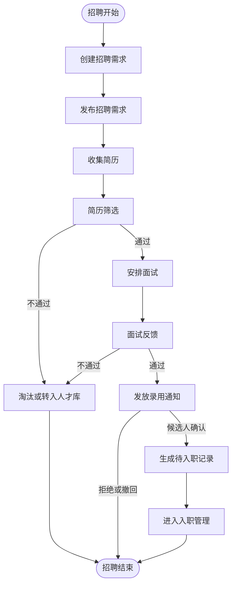

### 入转调离

#### 业务规则

1. 转正、调动、离职统一通过提交表单发起审批流程；入职不走审批流程，通过确认入职、快速入职批量确认或放弃入职完成办理。
2. 审批通过后，按生效日期写回员工主档。
3. 流程驳回、撤回、放弃不写回员工主档。
4. 员工状态为离职的员工不可作为新流程申请人、审批人、面试官、直接上级或考勤对象。
5. 离职记录状态仅包含待离职、已离职、已放弃；审批中、流程已通过未到最后工作日等仅作为流程进度或待办信息展示，不作为状态。
6. 已离职员工再次入职按重新入职/返聘流程处理；如离职误操作需通过员工状态更正权限处理并记录原因，不在离职记录中增加撤销状态。

#### 状态流转

| 对象 | 状态流转 |
| --- | --- |
| 入职记录 | 待入职 -> 已入职/已放弃 |
| 转正记录 | 业务状态：待转正 -> 已转正/已取消；流程状态：未发起 -> 审批中 -> 审批通过/审批驳回/已撤回/已终止；审批通过且到达实际转正日期后触发业务状态进入已转正，驳回、撤回或未到实际转正日期时不改变业务状态。 |
| 调动记录 | 业务状态：待调动 -> 待生效/已调动/已放弃；流程状态：未发起 -> 审批中 -> 审批通过/审批驳回/已撤回/已终止；审批通过后按生效日期触发业务状态进入待生效或已调动，驳回或撤回不改变业务状态。 |
| 离职记录 | 业务状态：待离职 -> 已离职/已放弃；流程状态：未发起 -> 审批中 -> 审批通过/审批驳回/已撤回/已终止；审批通过且到达离职生效条件后触发状态进入已离职，驳回、撤回或未来生效等待期间不改变业务状态。 |

#### 动作-状态-写回矩阵

| 业务 | 动作 | 前置状态 | 操作人 | 结果状态 | 写回对象 | 异常/边界 |
| --- | --- | --- | --- | --- | --- | --- |
| 入职 | 确认入职 | 入职记录为待入职，建档必填信息完整，个人信息确认状态为已确认或已按权限豁免 | HR、人资专员 | 入职记录变为已入职，生效状态为已生效 | 创建员工主档，写入工号、部门、岗位、入职日期、员工状态、用工类型；已确认的个人信息同步写入员工主档和员工档案 | 入职不走审批；工号、手机号、证件号重复时拦截；岗位或部门停用时不可确认。 |
| 入职 | 快速入职批量确认 | 快速入职窗口记录校验通过，姓名、身份证号、手机号、所属部门、岗位、入职日期、用工类型完整 | HR、人资专员 | 直接生成已入职记录，生效状态为已生效 | 创建员工主档，写入工号、部门、岗位、入职日期、员工状态、用工类型、身份证识别信息和银行卡信息 | 快速入职直接入职，不生成待入职详情确认环节；身份证号、手机号重复时拦截；系统生成工号重复时自动重试生成或提示编码规则异常；银行卡格式错误时拦截。 |
| 入职 | 放弃入职 | 入职记录为待入职 | HR、人资专员 | 入职记录变为已放弃，生效状态为已取消 | 不写回员工主档，保留候选人或入职记录 | 已生成员工主档后不可放弃，需走离职或员工状态更正。 |
| 转正 | 提交 | 转正记录为待转正，流程状态为未发起或审批驳回 | HR、部门经理 | 业务状态保持待转正，流程状态变为审批中 | 暂不写回员工主档 | 流程未配置、审批人为空、员工已离职时拦截。 |
| 转正 | 审批通过 | 流程状态为审批中 | 当前审批人 | 流程状态变为审批通过；实际转正日期不晚于当前日期时业务状态变为已转正，未来日期保持待转正并标记待生效 | 到达实际转正日期后更新员工转正日期、任职状态和转正记录 | 重复审批回调按流程实例和节点幂等处理；未来生效记录由定时任务在实际转正日期写回。 |
| 调动 | 提交 | 调动记录为待调动 | HR、部门经理 | 业务状态保持待调动，流程状态变为审批中 | 暂不写回员工主档 | 调入部门或岗位停用、员工已离职、流程未配置时拦截。 |
| 调动 | 审批通过 | 调动记录为待调动，流程通过 | 当前审批人 | 生效日为当天或历史日期时变为已调动；未来日期变为待生效 | 按生效日期更新员工部门、岗位、直接上级，保留调动历史 | 待生效期间再次调动需校验时间冲突；重复回调不得重复写入历史。 |
| 离职 | 提交 | 离职记录为待离职 | HR、部门经理 | 业务状态保持待离职，流程状态变为审批中 | 暂不写回员工主档 | 最后工作日早于入职日期、流程未配置、交接必填缺失时拦截。 |
| 离职 | 审批通过 | 离职记录为待离职，流程通过 | 当前审批人 | 到达最后工作日后变为已离职；未来日期保持待离职并标记待生效 | 更新员工状态为离职，冻结新流程选择资格，保留离职记录 | 已离职员工不可再次执行离职；误操作需走状态更正并留痕。 |

#### 业务流程图

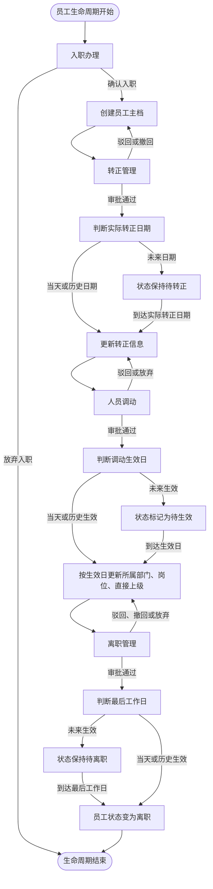

### 考勤管理

#### 业务规则

1. 考勤组是员工考勤规则的承载对象，确定参与考勤人员、无需考勤人员、负责人、考勤时间、考勤类型、考勤方式，并挂载加班、补卡、外出出差、节假日等规则。
2. 考勤类型支持固定班制和排班制。
3. 班次定义上下班时间、休息时间和弹性打卡规则。
4. 排班管理将员工、日期和班次关联。
5. 日考勤结果由系统定时任务按日生成或更新，计算时获取员工当日生效考勤组、排班/班次、打卡记录、已生效审批单据、专项规则和节假日规则。
6. 日考勤结果汇总为月考勤统计。
7. 月考勤统计生成后进入待确认，由 HR 或考勤管理员确认后进入已确认，确认后由有锁定权限的用户执行锁定，锁定后的月统计作为考勤归档结果。
8. 已锁定月报不得被普通重算、排班调整、打卡修正或假勤审批写回覆盖，需先解锁或发起锁定后更正流程。
9. 考勤组人员范围允许按优先级覆盖；同一员工命中多个启用考勤组时，优先级数字较小者生效，同优先级范围重叠时禁止保存。
10. 固定班制按考勤组默认班次和工作日生成应出勤；排班制按排班表生成应出勤，排班制员工无排班日期标记为未排班，不按缺勤计算，需补排后重算。
11. 日考勤定时任务按配置时间执行，可覆盖当天和配置的近期日期范围；系统以工号+日期作为唯一维度创建或更新日考勤结果，计算顺序为：确定生效考勤组 -> 确定班次与日期类型 -> 汇总有效打卡 -> 应用已生效审批单据 -> 应用专项考勤规则 -> 更新日考勤结果。
12. 当天打卡记录写入、打卡修正、审批单据生效/撤销、更正流程生效、排班调整或规则变更生效时，系统触发对应员工日期的未锁定日考勤结果更新，刷新结果状态、异常类型、出勤时长、假勤时长和计算明细。
13. 无需考勤人员不生成应出勤记录、不计迟到、早退、缺卡或旷工；从无需考勤范围移除后，仅对生效日期及之后生成应出勤，历史结果保留。
14. 考勤组负责人接收考勤异常和月报提醒；子负责人仅可在授权范围内维护排班、处理异常或确认统计，不自动获得考勤组配置权限。
15. 地点打卡、Wi-Fi 打卡、电脑端打卡、考勤机打卡和外勤打卡可组合启用；同一打卡时点命中任一启用方式即视为有效打卡，重复记录按去重规则参与计算。
16. 加班规则按工作日、休息日、节假日分别配置计算口径；加班结果仅进入考勤统计或调休余额，不自动进入薪资计算。
17. 补卡规则控制补卡周期、次数、可补日期范围和可补类型；补卡审批通过后生成关联原记录的修正记录，不覆盖原始打卡。
18. 外出、出差规则控制申请期间是否需要打卡；配置为无需打卡时，审批通过后对应时段不再判定缺卡、迟到或早退，配置为仍需打卡时按正常班次校验打卡。
19. 法定节假日和自定义节假日规则按适用范围覆盖考勤组工作日设置，并决定当日日期类型和加班口径；规则变更不覆盖已锁定统计。
20. 日考勤结果保存考勤组、班次、专项规则、节假日规则和触发来源的计算快照，后续规则修改仅影响生效日期及之后的未锁定结果。

#### 考勤申请

| 申请类型 | 关键字段 | 结果写回 |
| --- | --- | --- |
| 补卡申请 | 缺卡日期、补卡时间、补卡原因 | 按补卡规则校验周期、次数、可补日期范围和可补类型；审批通过后补充打卡修正记录并触发未锁定日结果更新。 |
| 请假申请 | 假期类型、开始时间、结束时间、时长、事由 | 提交后占用假期额度；审批驳回或撤回后释放占用额度；审批通过后转为已扣减，后续撤销或更正流程按规则释放或调整额度。 |
| 加班申请 | 加班日期、开始时间、结束时间、补偿方式 | 按当日日期类型和加班计算口径生成加班时长，可用于调休余额或加班统计，不自动进入薪资计算。 |
| 外出申请 | 外出地点、开始时间、结束时间、事由 | 审批通过后按外出规则决定对应时段是否仍需打卡，并触发未锁定日结果更新。 |
| 出差申请 | 出差地点、开始时间、结束时间、事由 | 审批通过后按出差规则决定出差期间是否仍需打卡，并触发未锁定日结果更新。 |

| 状态类型 | 状态流转 |
| --- | --- |
| 考勤申请业务状态 | 草稿 -> 已生效/已撤销；审批通过触发业务状态进入已生效，撤销或更正流程生效后按规则进入已撤销或生成更正记录。 |
| 考勤申请流程状态 | 未发起 -> 审批中 -> 审批通过/审批驳回/已撤回/已终止；审批驳回或撤回不改变业务状态，草稿仍可修改后重新提交。 |

#### 考勤计算优先级与冲突规则

| 优先级 | 规则 | 处理要求 |
| --- | --- | --- |
| 1 | 月考勤统计锁定优先 | 已锁定月份不允许普通重算、排班调整、打卡修正或假勤审批直接覆盖；需先解锁或走锁定后更正流程。 |
| 2 | 生效考勤组和排班优先 | 先确定员工当日唯一生效考勤组、日期类型和班次；无生效考勤组或无需考勤人员不生成应出勤。 |
| 3 | 节假日和休息日规则优先于普通工作日 | 法定节假日、自定义节假日和休息日决定当日应出勤、加班口径和异常判定口径。 |
| 4 | 审批通过的请假、出差、外出优先于打卡异常 | 审批通过且覆盖班次时段的申请，按规则抵扣迟到、早退、缺卡或旷工；配置为仍需打卡的外出/出差除外。 |
| 5 | 补卡和打卡修正触发未锁定日结果重算 | 补卡通过后新增修正记录，不覆盖原始打卡；同一时段多条打卡按去重和有效记录规则计算。 |
| 6 | 加班结果独立统计 | 加班需满足加班申请、班次、日期类型和加班规则；只进入加班统计或调休余额，不自动进入薪资计算。 |

| 冲突场景 | 处理规则 | 验收要点 |
| --- | --- | --- |
| 跨天班或夜班 | 班次需定义归属考勤日，跨天打卡按归属考勤日计算；次日普通班次不得重复引用同一打卡记录。 | 夜班下班卡可计入前一考勤日，日结果明细展示跨天来源。 |
| 请假与加班时间重叠 | 同一员工同一时段不得同时生效请假和加班；提交或审批时校验冲突。 | 存在重叠时提示冲突单据编号和时间段。 |
| 出差/外出与打卡异常重叠 | 若规则配置为无需打卡，审批通过后覆盖时段不再判定缺卡；若配置为仍需打卡，则继续按班次校验。 | 同一申请在不同规则配置下计算结果不同且有计算明细。 |
| 月报锁定后补单 | 补卡、请假、外出、出差审批可完成流程，但不得直接覆盖锁定结果；进入更正队列或提示需解锁。 | 锁定结果保持不变，更正记录可追溯。 |
| 排班制员工无排班 | 无排班日期标记为未排班，不按缺勤计算；补排后触发未锁定日结果重算。 | 月报中未排班和缺勤分开统计。 |

#### 考勤专项测试矩阵

| 测试场景 | 前置数据 | 操作 | 期望结果 |
| --- | --- | --- | --- |
| 固定班制正常打卡 | 员工命中固定班制考勤组，当日为工作日 | 员工完成上下班打卡并生成日结果 | 日结果为正常，出勤时长、班次、考勤组快照正确。 |
| 排班制未排班 | 员工命中排班制考勤组，当日无排班 | 生成日考勤结果 | 标记未排班，不计缺勤；补排后可重算。 |
| 跨天夜班 | 班次跨 00:00，归属前一考勤日 | 员工跨天上下班打卡 | 下班卡计入归属考勤日，不被次日重复引用。 |
| 补卡重算 | 日结果存在缺卡，月报未锁定 | 补卡审批通过 | 生成修正记录并重算日结果，原始打卡不被覆盖。 |
| 请假覆盖异常 | 员工迟到时段存在请假审批通过记录 | 触发日结果重算 | 对应时段不再计迟到或缺勤，假勤时长正确。 |
| 请假与加班重叠 | 同一员工同一时段已有请假单 | 提交加班申请 | 系统拦截并提示冲突单据。 |
| 外出仍需打卡 | 外出规则配置为仍需打卡 | 外出审批通过但员工未打卡 | 仍按班次判定缺卡或异常。 |
| 月报锁定后补单 | 月考勤统计已锁定 | 补卡或请假审批通过 | 锁定月报不被覆盖，进入更正队列或提示解锁。 |
| 数据权限过滤 | 经理仅有本部门权限 | 查看考勤汇总和导出 | 只返回授权部门员工数据，导出一致。 |

#### 业务流程图

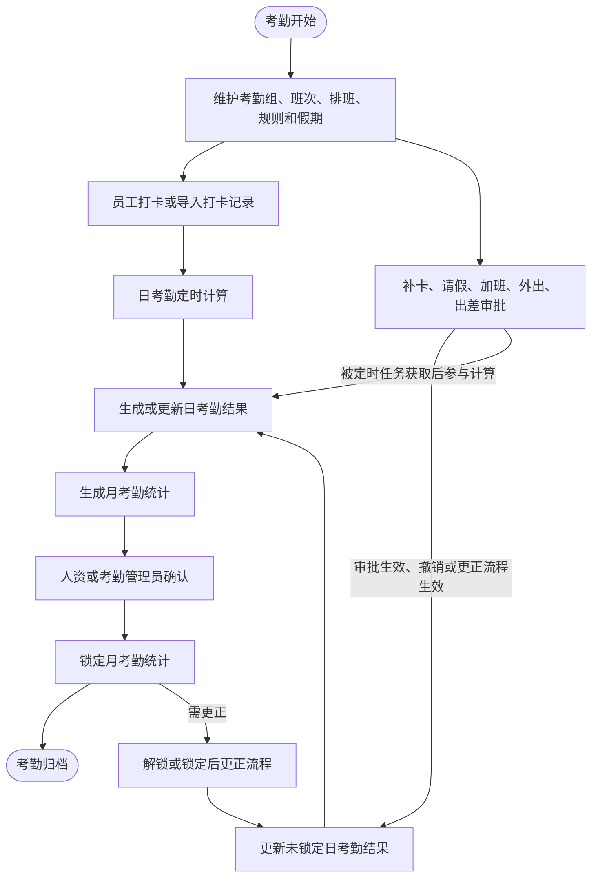

### 绩效管理

#### 业务规则

1. 考核指标维护指标名称、类型、评分规则和状态。
2. 考核模板由多个指标组成，权重合计必须为 100%。
3. 考核计划选择模板、周期、考核范围、考核指标和评分人员。
4. 发起考核后生成员工考核任务。
5. 员工考核详情展示评分、审核、确认、附件和评分明细。
6. 已确认绩效结果作为绩效模块内的归档结果，可供绩效看板和历史查询使用。

#### 状态流转

| 对象 | 状态流转 |
| --- | --- |
| 考核计划 | 草稿 -> 已发布 -> 评分中 -> 审核中 -> 已确认/已终止 |
| 员工考核 | 待评分 -> 评分中 -> 待审核 -> 已退回/待确认 -> 已确认/已终止 |

#### 业务流程图

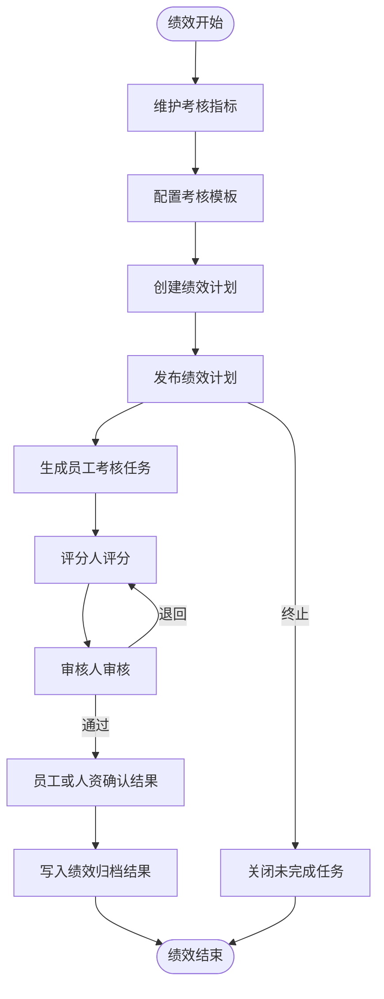

### 薪资审批与工资条

#### 业务规则

1. 薪资审批以薪资月份为批次维度。
2. 薪资模块不从考勤、绩效或其他系统模块自动获取薪资计算数据。
3. 薪资明细以人工导入或模板导入为唯一业务数据来源。
4. 薪资明细支持导入、校验和批量删除。
5. 薪资批次发起审批后，不允许普通编辑明细。
6. 审批通过后可执行归档，归档成功后生成薪资归档快照。
7. 工资条基于归档快照生成和发放。
8. 员工仅能查看本人已发放工资条。
9. 已归档薪资不得直接覆盖，普通工资差异需通过批次类型为补发或更正的薪资批次处理；奖金、离职结算、临时工资、年终奖按独立批次导入和归档。

#### 薪资边界说明

本期薪资模块不提供自动算薪能力。系统仅支持薪资明细导入、校验、审批、归档、工资条生成、工资条发放和员工查看。考勤结果、绩效结果和员工档案可作为人工核对入口、筛选条件或报表参考，不参与系统自动计算薪资金额；薪资金额以导入明细和归档快照为准。

#### 状态流转

| 对象 | 状态流转 |
| --- | --- |
| 薪资批次 | 业务状态：草稿 -> 待归档 -> 已归档/已撤销；流程状态：未发起 -> 审批中 -> 审批通过/审批驳回/已撤回/已终止；审批通过触发业务状态进入待归档，驳回或撤回不改变业务状态。 |
| 工资条 | 薪资批次已归档 -> 生成工资条（待发放） -> 已发放 -> 已查看/已撤回 |

#### 动作-状态-写回矩阵

| 动作 | 前置状态 | 操作人 | 结果状态 | 写回对象 | 异常/边界 |
| --- | --- | --- | --- | --- | --- |
| 创建薪资批次 | 薪资月份、发薪范围、批次类型完整 | 薪酬绩效专员、HR 管理员 | 薪资批次业务状态为草稿，流程状态为未发起 | 生成批次主记录 | 同一薪资月份、同一发薪范围已有普通批次时拦截；补发或更正需关联原批次。 |
| 导入薪资明细 | 批次为草稿，用户有薪资导入权限 | 薪酬绩效专员 | 批次保持草稿，明细校验通过后可提交 | 写入薪资明细临时区和校验结果 | 工号、姓名、金额格式、必填薪资项不通过时生成失败明细，不写入有效明细。 |
| 发起薪资审批 | 批次为草稿，存在有效薪资明细 | 薪酬绩效专员 | 流程状态变为审批中，业务状态保持草稿 | 锁定薪资明细编辑，生成流程实例 | 流程未配置、审批人为空、薪资字段权限不足时拦截。 |
| 审批驳回或撤回 | 流程状态为审批中 | 当前审批人、发起人 | 流程状态变为审批驳回或已撤回，业务状态保持草稿 | 解锁薪资明细编辑，保留审批历史 | 再次提交需重新校验当前明细。 |
| 审批通过 | 流程状态为审批中 | 当前审批人 | 流程状态变为审批通过，业务状态变为待归档 | 保留审批结果，等待归档 | 重复回调按批次编号和流程实例幂等忽略。 |
| 执行归档 | 批次为待归档 | 薪酬绩效专员、HR 管理员 | 业务状态变为已归档，生效状态为已生效 | 写入薪资归档快照，记录归档人和归档时间 | 批次版本不一致时进入异常队列，不覆盖已归档快照。 |
| 生成工资条 | 批次为已归档 | 薪酬绩效专员 | 工资条状态为待发放 | 按归档快照生成员工工资条 | 无归档快照或明细为空时不可生成。 |
| 发放工资条 | 工资条为待发放 | 薪酬绩效专员 | 工资条状态变为已发放 | 生成员工可见工资条和发放消息 | 已撤回工资条不可再次发放，需重新生成。 |

#### 业务流程图

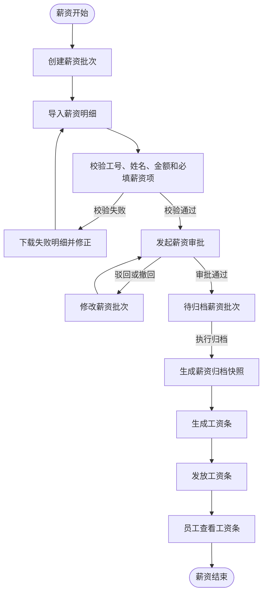

### 费控管理

#### 业务规则

1. 费控管理仅包含预算管理、费用申请、费用报销、发票夹和费用类型 5 个功能。
2. 预算管理按年度、部门控制预算，记录预算金额、已申请金额、已报销金额和剩余金额。
3. 费用申请支持 3 种付款方式：对公付款、对私付款、个人垫款。
4. 当费用申请选择“对公付款”或“对私付款”时，审批通过后直接在当前单据内流转至财务打款，无需再额外发起费用报销。
5. 当费用申请选择“个人垫款”时，审批通过后财务不执行打款动作，申请人后续需自行发起费用报销。
6. 费用报销可关联费用申请，并可从发票夹引用发票数据；系统自动汇总报销金额并校验发票重复。
7. 发票夹支持上传发票、手工录入发票、识别发票和查验发票，可被费用报销直接引用。
8. 费用类型支持分组管理，供预算管理、费用申请、费用报销和发票夹统一引用。
9. 所有费用类单据均需记录申请、审批、审核、付款和操作日志，敏感金额按权限展示。

#### 状态流转

| 对象 | 状态流转 |
| --- | --- |
| 预算记录 | 草稿 -> 启用 -> 调整中 -> 已调整/停用 |
| 费用申请单 | 草稿 -> 审批中 -> 待打款/已通过/已驳回/已撤回 -> 已付款/已关闭 |
| 费用报销单 | 草稿 -> 审批中 -> 待财务审核 -> 待付款 -> 已付款/已驳回/已撤回/已关闭 |
| 发票记录 | 待识别 -> 已识别 -> 已查验/已引用/已作废/风险待处理 |
| 费用类型 | 草稿 -> 启用/停用 |

#### 业务流程图

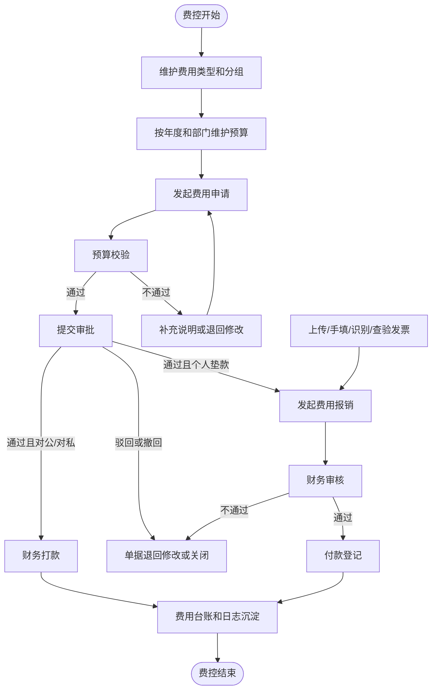

### 固定资产管理

#### 业务规则

1. 固定资产管理覆盖资产台账、资产入库、领用、调拨、借用、维修、盘点、处置和资产分类。
2. 资产入库后生成资产编号和资产台账，台账记录资产分类、规格型号、原值、使用部门、使用人、存放地点和资产状态。
3. 资产领用、调拨、借用、维修和处置均从资产台账选择资产，处理完成后回写资产当前状态和使用信息。
4. 借用资产需登记预计归还日期和实际归还日期，逾期未归还进入提醒。
5. 维修资产在维修中不允许再次领用、借用或处置，维修完成后登记费用和结果。
6. 盘点任务按部门、地点或分类创建，盘点差异需确认处理后写入盘点结果。
7. 资产处置审批通过并登记结果后，资产状态进入已处置，后续不可再参与领用、调拨、借用或维修。

#### 状态流转

| 对象 | 状态流转 |
| --- | --- |
| 资产台账 | 闲置 -> 使用中/借用中/维修中/盘点异常/已处置 |
| 入库单 | 草稿 -> 已入库/已取消 |
| 领用单 | 草稿 -> 审批中 -> 待发放 -> 已发放/已驳回/已撤回 |
| 调拨单 | 草稿 -> 审批中 -> 已调拨/已驳回/已撤回 |
| 借用单 | 草稿 -> 审批中 -> 借用中 -> 已归还/逾期/已驳回 |
| 维修单 | 草稿 -> 审批中 -> 维修中 -> 已完成/已关闭 |
| 盘点任务 | 草稿 -> 盘点中 -> 待确认 -> 已完成 |
| 处置单 | 草稿 -> 审批中 -> 待处置 -> 已处置/已驳回 |

#### 业务流程图

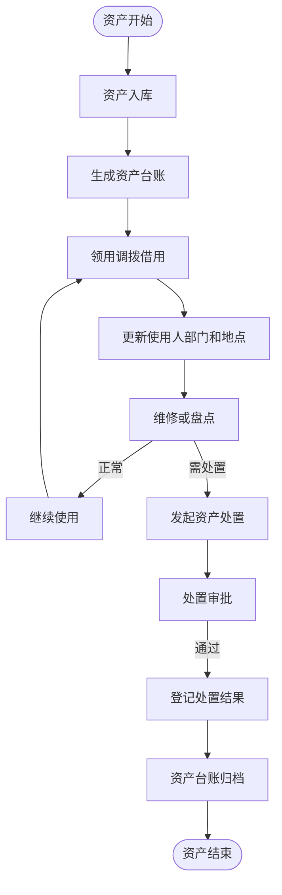

### 会议管理

#### 业务规则

1. 会议管理覆盖会议预约、我的会议、会议签到、会议纪要和会议室管理。
2. 会议室需维护位置、容纳人数、设备、开放时间和状态，停用会议室不可预约。
3. 会议预约需校验会议室、时间段和参会人员冲突；预约成功后通知主持人和参会人。
4. 会议取消需记录取消原因，并释放会议室占用。
5. 会议签到按会议维度记录应到、已到、迟到和缺席情况。
6. 会议纪要可关联会议预约，记录会议内容、决议、责任人和完成期限。

#### 状态流转

| 对象 | 状态流转 |
| --- | --- |
| 会议预约 | 草稿 -> 已预约 -> 进行中 -> 已结束/已取消 |
| 会议签到 | 未开始 -> 签到中 -> 已结束 |
| 会议纪要 | 草稿 -> 已发布 -> 已归档 |
| 会议室 | 启用 -> 停用/维护中 -> 启用 |

#### 业务流程图

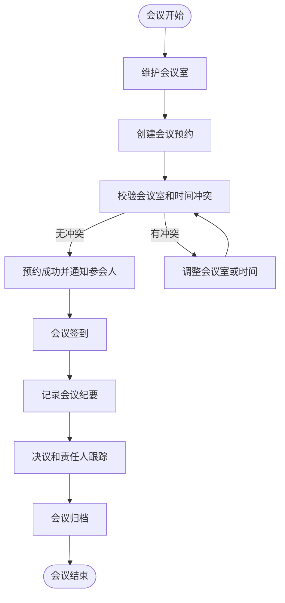

### 用章管理

#### 业务规则

1. 用章管理覆盖用章申请、用章登记、归还登记和印章档案。
2. 印章档案需维护印章编号、类型、保管人、存放位置和使用状态。
3. 用章申请需填写印章、文件名称、用章事由、用章方式和预计用章时间。
4. 印章外带需登记预计归还时间，归还时记录实际归还时间和异常说明。
5. 审批通过后由印章保管人完成用章登记，登记后写入用章记录。
6. 印章停用、外带未归还或状态异常时，不允许发起新的普通用章。

#### 状态流转

| 对象 | 状态流转 |
| --- | --- |
| 用章单 | 草稿 -> 审批中 -> 待用章 -> 已用章 -> 已归还/已关闭 |
| 印章档案 | 正常 -> 外带中/停用/遗失/作废 |

#### 业务流程图

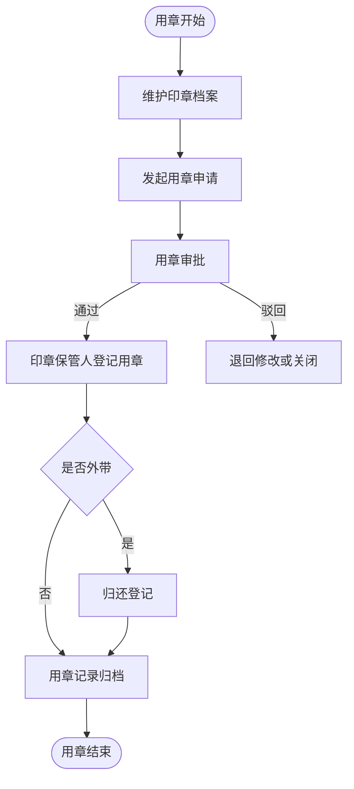

### 办公用品管理

#### 业务规则

1. 办公用品管理覆盖用品基础资料、入库、领用、其他出库、实时库存、库存流水和库存盘点。
2. 用品基础资料维护用品编码、名称、分类、规格型号、计量单位、存放位置和状态。
3. 入库完成后增加库存并生成库存流水。
4. 领用审批通过后由管理员登记实际发放数量，发放后扣减库存。
5. 其他出库用于报损、报废、批量发放和其他库存减少场景。
6. 库存不得扣成负数，低库存时按阈值提醒。
7. 库存盘点差异确认后生成盘盈或盘亏流水。

#### 状态流转

| 对象 | 状态流转 |
| --- | --- |
| 领用单 | 草稿 -> 审批中 -> 待发放 -> 已发放/已驳回/已撤回 |
| 入库单 | 草稿 -> 已入库/已取消 |
| 出库单 | 草稿 -> 已出库/已取消 |
| 盘点任务 | 草稿 -> 盘点中 -> 待确认 -> 已完成 |
| 用品库存 | 正常 -> 低库存/缺货/停用 |

#### 业务流程图

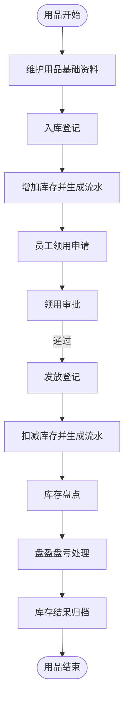

### 知识与内容发布管理

#### 业务规则

1. 知识与内容发布管理覆盖文档中心、文档分类、通知公告、通知分类、新闻中心、新闻分类、制度中心和制度分类。
2. 文档、通知、新闻和制度均需维护分类、标题、发布范围、发布人、发布时间和状态。
3. 制度中心需支持版本管理，修订后形成新版本，废止后历史版本保留可查。
4. 内容发布范围按部门、人员或角色控制，未授权用户不可查看。
5. 发布、修订、废止和删除均需记录操作日志。
6. 通知公告和制度可按企业要求配置阅读确认。

#### 状态流转

| 对象 | 状态流转 |
| --- | --- |
| 知识文档 | 草稿 -> 已发布 -> 已下架/已归档 |
| 通知公告 | 草稿 -> 已发布 -> 已撤回/已归档 |
| 新闻 | 草稿 -> 已发布 -> 已下架 |
| 制度 | 草稿 -> 已发布 -> 修订中 -> 已发布/已废止 |
| 分类 | 启用 -> 停用 |

#### 业务流程图

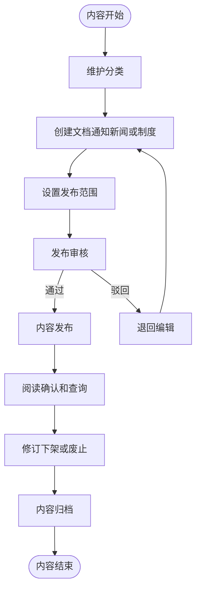

### 公文管理

#### 业务规则

1. 公文管理覆盖发文登记和收文登记。
2. 发文登记维护发文字号、发文标题、公文类型、发文部门、主送单位、正文和附件。
3. 收文登记维护收文编号、收文标题、来文文号、来文单位、收文日期、承办部门和承办人。
4. 收文可指定办理要求和完成期限，承办人登记办理结果。
5. 公文附件和办理记录需可追溯，已归档公文不可普通编辑。

#### 状态流转

| 对象 | 状态流转 |
| --- | --- |
| 发文 | 草稿 -> 审核中 -> 已发文/已驳回/已撤回 -> 已归档 |
| 收文 | 待登记 -> 待办理 -> 办理中 -> 已办结/已归档 |

#### 业务流程图

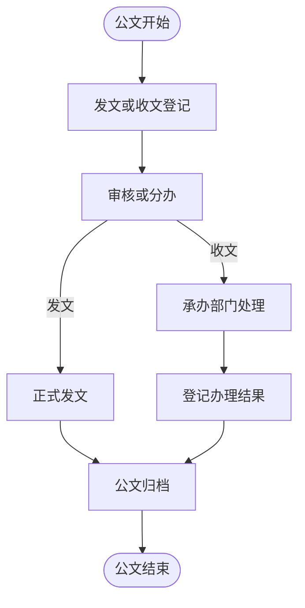

### 证照管理

#### 业务规则

1. 证照管理覆盖证照台账、证照分类、借用登记、归还登记和续期登记。
2. 证照台账维护证照名称、编号、分类、持证主体、生效日期、到期日期、扫描件、保管人和状态。
3. 证照分类可配置是否需要年审、是否允许借用和默认提醒天数。
4. 证照到期、年审和逾期未归还需生成提醒。
5. 借用证照需登记借用人、借用事由、预计归还日期，归还时登记实际归还日期。
6. 续期后更新证照有效期、扫描件和办理费用，保留原证照历史信息。

#### 状态流转

| 对象 | 状态流转 |
| --- | --- |
| 证照 | 有效 -> 即将到期/已到期/借出中/续期中/已作废 |
| 借用记录 | 草稿 -> 已借出 -> 已归还/逾期 |
| 续期记录 | 草稿 -> 办理中 -> 已续期/已关闭 |
| 证照分类 | 启用 -> 停用 |

#### 业务流程图

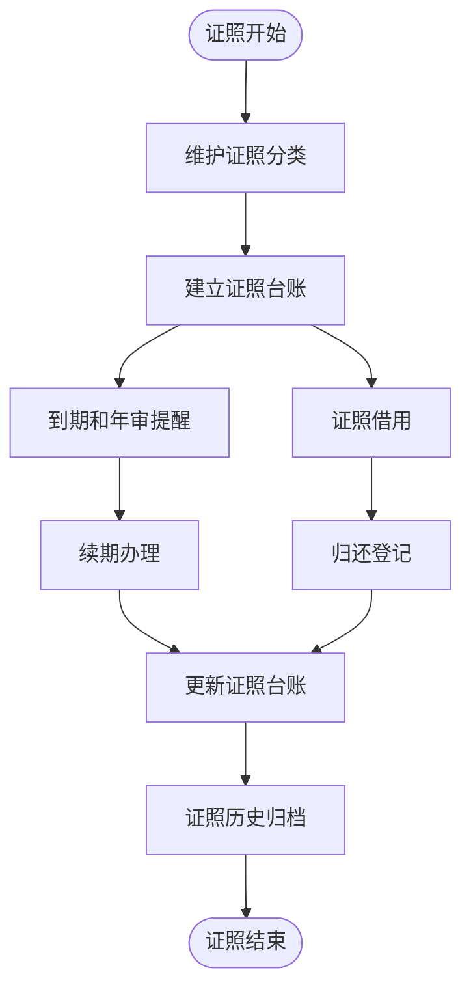

## 模块需求

### 人力资源模块

#### 人资工作台

##### 模块说明

###### 概要说明

- 页面目标：为 HR 提供待办、预警、关键指标和快捷入口。。
- 指标内容：在职人数、待入职人数、待转正人数、待离职人数、招聘中岗位、考勤异常、合同到期、待审批薪资批次。。
- 待办来源：招聘审批、Offer 审批、入转调离审批、考勤审批、绩效任务、薪资审批。。
- 预警来源：合同到期、试用期到期、缺卡、考勤异常、待确认月报、待发工资条。。
- 交互要求：点击指标或待办进入对应业务页面并携带筛选条件。。

##### 人资工作台页面

###### 概要说明

- 页面名称：人资工作台。
- 指标卡：在职人数、待入职人数、待转正人数、待离职人数、招聘中岗位、考勤异常、待审批薪资批次；按当前用户数据权限聚合；点击后跳转对应列表并带入筛选条件。。
- 待办列表：待办类型、单据编号、申请人、当前节点、提交时间、剩余处理时长；展示当前用户可处理任务，按提交时间倒序。。
- 预警列表：预警类型、员工/单据、预警日期、预警等级、状态；合同到期、试用期到期、缺卡、月报待确认等进入预警。。
- 快捷入口：新增员工、招聘需求、入职办理、假勤审批、薪资审批；入口按角色权限展示。。

###### 字段说明清单

| 字段 | 类型/控件 | 必填 | 格式/校验 | 默认值 | 枚举/来源 | 可编辑性 | 备注 |
| --- | --- | --- | --- | --- | --- | --- | --- |
| 统计日期 | 日期 | 是 | - | 当前日期 | 系统日期 | 不可编辑 | 指标卡统一按该日期口径展示。 |
| 数据范围 | 只读文本/筛选器 | 否 | - | 当前用户授权范围 | 数据权限 | 按权限可切换 | HR 管理员可切换授权所属部门，普通角色只展示本人或团队范围。 |
| 指标名称 | 指标卡 | 是 | - | 系统预置 | 人资各模块 | 不可编辑 | 指标卡是否展示由角色权限控制。 |
| 指标数值 | 数字/金额 | 是 | 非负数 | 系统统计 | 人资各模块 | 不可编辑 | 薪资相关指标按薪资字段权限脱敏或隐藏。 |
| 待办类型 | 标签 | 是 | - | 系统生成 | 流程中心/任务中心 | 不可编辑 | 招聘、Offer、入转调离、考勤、绩效、薪资等。 |
| 单据编号 | 链接文本 | 是 | - | 源业务带入 | 源业务单据 | 不可编辑 | 点击打开对应业务单据。 |
| 申请人 | 文本 | 否 | - | 源业务带入 | 员工信息/候选人 | 不可编辑 | 候选人类单据展示候选人姓名。 |
| 当前节点 | 文本 | 否 | - | 流程带入 | 流程管理 | 不可编辑 | 无流程任务时为空。 |
| 剩余处理时长 | 文本/标签 | 否 | - | 系统计算 | 提交时间、SLA 配置 | 不可编辑 | 超时待办使用预警颜色。 |
| 预警等级 | 标签 | 是 | - | 普通 | 普通、重要、紧急 | 系统计算 | 按到期天数、异常类型或金额敏感程度判断。 |
| 状态 | 标签 | 是 | - | 未处理 | 未处理、已处理、已忽略 | 动作驱动 | 已处理预警不再进入未处理列表。 |

###### 交互矩阵

| 操作 | 触发条件 | 结果 | 异常处理 |
| --- | --- | --- | --- |
| 点击指标卡 | 有对应页面权限 | 跳转到目标页面并带入筛选条件 | 无权限时不展示指标或提示无权限。 |
| 处理待办 | 当前用户为审批人或处理人 | 打开对应业务单据处理页 | 待办已处理时提示刷新。 |
| 查看预警 | 有预警对象查看权限 | 打开预警对象详情或列表 | 预警对象已删除或无权限时提示不可查看。 |
| 快捷新建 | 有新增权限 | 打开对应新增页面或弹窗 | 流程未配置时提示联系管理员。 |
| 忽略预警 | 有预警处理权限 | 预警状态变为已忽略并记录原因 | 合同到期、试用期到期等强提醒类型可限制忽略。 |
| 刷新工作台 | 页面加载或手动刷新 | 重新拉取指标、待办和预警 | 单个模块统计失败时展示局部异常，不影响其他区域。 |

#### 组织架构

##### 模块说明

###### 概要说明

- 组织管理：支持组织树、组织列表、组织详情；支持新增、编辑、维护排序号、停用、删除、导入、导出。。
- 组织架构图：支持组织视图、岗位视图和人员视图；支持缩放、展开收起、下载架构图。。
- 岗位管理：支持岗位列表、岗位详情、编制维护、状态管理。。

##### 组织管理页面

###### 概要说明

- 页面名称：组织管理。
- 查询区：组织编码、组织名称、组织类型、状态；支持模糊查询组织名称和组织编码；组织类型包含公司、部门；状态默认选择启用，可切换为停用。。
- 组织树：组织名称、人员数量、展开收起；默认展开一级组织；点击节点刷新右侧列表和详情。。
- 列表字段：组织名称、组织编码、组织类型、上级组织、组织负责人、排序号、状态、更新时间；组织编码和组织名称靠前展示；组织名称按树状表格展示层级；组织类型、状态使用标签。。
- 行内操作：详情、编辑、停用/启用；按权限和状态展示；操作项保持精简，不单独提供调整排序入口；停用前需校验是否存在启用的下级组织、有效岗位和在职员工，命中限制时弹窗提示具体原因。。
- 页面操作：新增组织、导入、导出、删除；删除按钮仅在勾选一条或多条组织后展示；页面操作区不单独提供调整排序按钮，组织顺序由排序号字段控制；导入需校验上级组织是否存在，导出按当前组织树范围和筛选条件导出；删除前只要检测到任意业务数据绑定过该组织，即禁止删除。。

###### 字段说明清单

| 字段 | 类型/控件 | 必填 | 格式/校验 | 默认值 | 枚举/来源 | 可编辑性 | 备注 |
| --- | --- | --- | --- | --- | --- | --- | --- |
| 组织编码 | 只读文本 | 否 | 字母、数字、短横线、下划线，2-30 位；全局唯一 | 系统自动生成 | 编码规则配置 | 不可编辑 | 用于组织唯一识别，用户不手工维护。 |
| 组织名称 | 输入框 | 是 | 2-50 字符；同一上级组织下不可重名 | 空 | 手工录入 | 可编辑 | 修改后历史单据是否同步展示新名称按快照规则处理。 |
| 组织类型 | 下拉选择 | 是 | - | 部门 | 公司、部门 | 新增可编辑；保存后按权限控制 | 公司可作为公司主体或一级组织；部门用于人员、岗位、招聘等业务归属。 |
| 上级组织 | 组织选择器 | 顶级否；非顶级是 | 不得选择自身及其下级组织 | 当前选中树节点 | 启用组织 | 可编辑 | 修改上级组织需校验不能形成循环层级。 |
| 组织负责人 | 员工选择器 | 否 | 只能选择在职员工 | 空 | 员工信息 | 可编辑 | 离职员工不可新选；历史负责人保留展示。 |
| 排序号 | 数字输入 | 否 | 非负整数 | 999 | 手工录入 | 可编辑 | 数字越小越靠前。 |
| 状态 | 单选/标签 | 是 | - | 启用 | 启用、停用 | 通过启用/停用动作变更 | 停用后不可被新业务选择。 |
| 备注 | 多行文本 | 否 | 0-500 字符 | 空 | 手工录入 | 可编辑 | 用于说明组织调整背景。 |

###### 交互矩阵

| 操作 | 触发条件 | 结果 | 异常处理 |
| --- | --- | --- | --- |
| 新增组织 | 有新增权限 | 新增组织并刷新组织树和列表 | 系统生成编码重复、同级重名、上级组织停用时拦截；编码重复时按编码规则重新生成或提示管理员检查规则。 |
| 编辑组织 | 有编辑权限且组织未被锁定 | 更新组织信息 | 修改上级组织不得形成循环层级。 |
| 停用组织 | 有停用权限且组织启用 | 状态变为停用，组织不可再被新员工、岗位、招聘需求、权限范围和流程范围选择 | 若存在启用的下级组织、有效岗位或在职员工，弹窗提示“该组织下仍存在启用的下级组织、有效岗位或在职员工，无法停用”，并列出对应数量和处理建议；仅历史数据绑定时允许停用，并提示“停用后不影响历史数据展示”。 |
| 删除组织 | 有删除权限 | 仅当从未被任何业务数据绑定过时才允许删除 | 只要检测到员工、岗位、招聘、合同、流程、权限、历史单据或其他业务数据曾绑定过该组织，即弹窗提示“该组织已存在业务绑定记录，不允许删除”，并阻止操作。 |
| 导入组织 | 有导入权限 | 批量新增或更新组织 | 返回失败明细，包含行号、字段、失败原因。 |
| 维护排序号 | 有编辑权限且组织未被锁定 | 修改排序号后按数值自动更新同级组织显示顺序并刷新组织树 | 排序号需为非负整数；同级组织按排序号从小到大展示，排序号相同时按组织创建顺序或编码规则稳定排序。 |
| 导出组织 | 有导出权限 | 按当前筛选条件和权限范围导出组织数据 | 导出字段需包含组织类型；导出动作记录审计日志。 |

##### 组织架构图页面

###### 概要说明

- 页面名称：组织架构图。
- 展示维度：支持按组织层级展示；可切换组织视图、岗位视图、人员视图。。
- 节点信息：展示组织名称、负责人、在职人数。。
- 操作：展开、收起、缩放、全屏、下载架构图。。
- 权限：按数据权限展示组织范围，无权限组织不展示。。
- 异常：无组织数据时展示空状态；架构图生成失败时提供重试。。

###### 字段说明清单

| 字段 | 类型/控件 | 必填 | 格式/校验 | 默认值 | 枚举/来源 | 可编辑性 | 备注 |
| --- | --- | --- | --- | --- | --- | --- | --- |
| 视图类型 | 分段控件 | 是 | - | 组织视图 | 组织视图、岗位视图、人员视图 | 可切换 | 人员视图按员工数据权限展示。 |
| 根节点 | 组织选择器 | 否 | 只能选择有权限组织 | 当前权限最高组织 | 组织管理 | 可切换 | 切换后重新绘制架构图。 |
| 展开层级 | 数字选择 | 否 | 1-10 | 2 | 手工选择 | 可编辑 | 控制默认展开深度。 |
| 节点名称 | 文本 | 是 | - | 组织名称/岗位名称/员工姓名 | 组织管理/岗位管理/员工信息 | 不可编辑 | 根据视图类型变化。 |
| 节点统计 | 数字 | 否 | 非负数 | 系统统计 | 员工信息 | 不可编辑 | 组织节点展示在职人数，岗位节点展示在岗人数。 |

###### 交互矩阵

| 操作 | 触发条件 | 页面反馈/状态变化 | 异常/边界 |
| --- | --- | --- | --- |
| 切换视图 | 有对应视图权限 | 重新加载架构图 | 无人员数据权限时隐藏人员视图。 |
| 展开/收起节点 | 节点存在下级 | 展示或隐藏下级节点 | 下级数据加载失败时允许重试。 |
| 缩放/全屏 | 架构图已加载 | 调整画布比例或进入全屏 | 浏览器不支持全屏时提示。 |
| 下载架构图 | 有下载权限 | 导出当前视图图片或 PDF | 大图生成失败时提示缩小范围或重试。 |

##### 岗位管理页面

###### 概要说明

- 页面名称：岗位管理。
- 查询区：岗位编码、岗位名称、所属部门、状态；支持按所属部门过滤岗位；状态默认选择启用，可切换为停用；不单独提供顶部启用/停用标签栏。。
- 列表字段：岗位编码、岗位名称、所属部门、职级、编制人数、在岗人数、状态、更新时间；编制人数和在岗人数用于识别超编。。
- 行内操作：详情、编辑、停用/启用；操作项保持精简；停用前需校验是否存在在职员工，命中限制时弹窗提示具体原因。。
- 页面操作：新增岗位、导入、导出、删除；删除按钮仅在勾选一条或多条岗位后展示；导入需校验所属部门存在且启用；删除前只要检测到任意业务数据绑定过该岗位，即禁止删除。。

###### 字段说明清单

| 字段 | 类型/控件 | 必填 | 格式/校验 | 默认值 | 枚举/来源 | 可编辑性 | 备注 |
| --- | --- | --- | --- | --- | --- | --- | --- |
| 岗位编码 | 只读文本 | 否 | 字母、数字、短横线、下划线，2-30 位；全局唯一 | 系统自动生成 | 编码规则配置 | 不可编辑 | 用于岗位唯一识别，用户不手工维护。 |
| 岗位名称 | 输入框 | 是 | 2-50 字符；同一组织下不可重名 | 空 | 手工录入 | 可编辑 | 用于招聘需求和员工任职引用。 |
| 所属部门 | 组织选择器 | 是 | 只能选择启用且组织类型为部门的组织 | 当前组织树节点 | 组织管理 | 新增可编辑；已有在岗员工时限制修改 | 如需跨部门迁移岗位，建议走岗位调整流程。 |
| 职级 | 下拉选择 | 否 | - | 空 | 数据字典：职级 | 可编辑 | 用于薪酬、绩效或权限扩展，不参与默认计算。 |
| 编制人数 | 数字输入 | 否 | 非负整数 | 空 | 手工录入 | 可编辑 | 为空表示不控制编制。 |
| 在岗人数 | 只读文本 | 否 | 非负整数 | 系统统计 | 员工信息 | 不可编辑 | 由当前岗位在职员工数统计。 |
| 状态 | 单选/标签 | 是 | - | 启用 | 启用、停用 | 通过启用/停用动作变更 | 停用后不可被新员工和招聘需求选择。 |
| 岗位说明 | 多行文本 | 否 | 0-1000 字符 | 空 | 手工录入 | 可编辑 | 可填写岗位职责和任职要求摘要。 |

###### 交互矩阵

| 操作 | 触发条件 | 页面反馈/状态变化 | 异常/边界 |
| --- | --- | --- | --- |
| 新增岗位 | 有新增权限 | 新增岗位并刷新列表 | 所属部门停用、系统生成岗位编码重复、同部门岗位名称重复时拦截；编码重复时按编码规则重新生成或提示管理员检查规则。 |
| 编辑岗位 | 有编辑权限 | 更新岗位信息 | 已有关联员工时修改所属部门需限制或提示走人员调动。 |
| 启用/停用岗位 | 有启停权限 | 状态变更，停用后岗位不可被新员工、招聘需求、待入职记录和人员调动选择 | 若存在在职员工，弹窗提示“该岗位下仍存在在职员工，无法停用”，并列出人数和处理建议；仅历史数据绑定时允许停用，并提示“历史记录保留展示”。 |
| 删除岗位 | 有删除权限 | 仅当从未被任何业务数据绑定过时才允许删除 | 只要检测到员工任职、待入职、招聘需求、Offer、调动记录、权限规则、历史单据或其他业务数据曾绑定过该岗位，即弹窗提示“该岗位已存在业务绑定记录，不允许删除”，并阻止操作。 |
| 导入岗位 | 有导入权限 | 批量新增或更新岗位 | 所属部门不存在或非部门类型时返回行级失败。 |
| 导出岗位 | 有导出权限 | 按筛选条件导出岗位数据 | 导出需受数据权限控制。 |

#### 员工管理

##### 模块说明

###### 概要说明

- 员工信息：支持员工信息表维护，列表展示核心任职和身份字段；基础信息、个人信息、银行卡信息、工作经历、教育经历、家庭成员、附件存档、操作记录在员工详情页维护。。
- 员工档案：支持维护员工信息表中的多条记录，重点编辑工作经历、教育经历、家庭成员、附件存档。。
- 合同与协议：支持签订、解除、终止、编辑、导入、导出和合同到期提醒；列表行支持详情、编辑、解除、终止，合同生命周期动作均按状态校验后通过弹窗处理。。

##### 员工信息页面

###### 概要说明

- 页面名称：员工信息。
- 查询区：员工姓名、工号、所属部门、岗位、员工状态、入职日期；支持按部门树范围查询；员工姓名和工号支持模糊查询。。
- 员工信息表：工号、姓名、手机号码、证件号、所属部门、岗位、直接上级、员工状态、用工类型、入职日期；员工信息页面列表仅展示核心员工字段；基础信息、个人信息、银行卡信息、工作经历、教育经历、家庭成员、附件存档、操作记录在查看或编辑员工详情时维护。。
- 行内操作：查看、编辑；调动和离职统一在人员调动、离职管理页面发起；查看在当前员工信息页面内打开或定位到对应员工记录，详情页内提供编辑入口。。
- 页面操作：新增员工、导入、导出、删除；删除按钮仅在勾选一条或多条员工后展示；入职登记表发送统一在入职管理的待入职记录中处理。。
- 新增员工表单按详情页字段分组展示，首个分组名称为基本信息；展示工号字段并由系统自动编号、只读不可编辑；其余不展示系统生成、流程结果或无需手工选择的字段，包括员工状态、司龄、工龄、转正日期、离职日期、离职原因和年龄；试用期（月）放在试用期结束日期之前，试用期结束日期默认按入职日期加试用期（月）自动计算，同时允许手工改写；证件照正面、证件照反面使用与详情页一致的小上传按钮样式，不使用大面积拖拽上传框；教育经历、工作经历、家庭成员、附件存档在新增员工时以表单块方式维护，默认显示“+ 添加…”入口，点击后展开一条填写表单；底部操作为取消、保存。

###### 字段说明清单

| 字段 | 类型/控件 | 必填 | 格式/校验 | 默认值 | 枚举/来源 | 可编辑性 | 备注 |
| --- | --- | --- | --- | --- | --- | --- | --- |
| 员工头像 | 图片上传 | 否 | JPG/PNG，大小限制按系统配置 | 空 | 本地上传 | 可编辑 | 在员工详情页顶部头像处维护，鼠标悬停头像后可上传；基础信息表格中不重复展示该字段，无头像时展示默认头像。 |
| 姓名 | 输入框 | 是 | 2-50 字符 | 空 | 手工录入 | 可编辑 | 新增员工、入职登记、导入均使用同一字段。 |
| 所属部门 | 组织选择器 | 是 | 只能选择启用且组织类型为部门的组织 | 空 | 组织管理 | 员工调动中限制编辑 | 员工业务归属部门；选择时按部门树展示。 |
| 岗位 | 岗位选择器 | 否 | 只能选择启用岗位 | 空 | 岗位管理 | 员工调动中限制编辑 | 岗位所属部门需与员工所属部门匹配或符合跨部门规则。 |
| 工号 | 只读文本 | 否 | 字母、数字、短横线、下划线，2-30 位；全局唯一 | 系统自动生成 | 编码规则配置 | 不可编辑 | 员工唯一识别字段，用户不手工维护。 |
| 证件类型 | 下拉选择 | 条件必填 | - | 身份证 | 身份证、护照、港澳通行证、台胞证、其他 | 可编辑 | 用工类型为正式员工、返聘、实习时默认必填；外包、临时工可按企业规则配置。 |
| 证件号 | 输入框 | 条件必填 | 按证件类型校验；唯一性按企业规则配置 | 空 | 手工录入 | 可编辑 | 证件类型必填时同步必填；敏感展示时脱敏；身份证可带出出生日期、年龄。 |
| 证件照正面 | 图片上传 | 否 | JPG/PNG/PDF，大小限制按系统配置 | 空 | 本地上传 | 可编辑 | 可作为附件存档的一类材料。 |
| 证件照反面 | 图片上传 | 否 | JPG/PNG/PDF，大小限制按系统配置 | 空 | 本地上传 | 可编辑 | 证件类型不需要反面时可隐藏或非必填。 |
| 手机号码 | 输入框 | 是 | 中国大陆手机号格式；唯一性按企业规则配置 | 空 | 手工录入 | 可编辑 | 敏感展示时脱敏；用于入职登记通知。 |
| 用工类型 | 下拉选择 | 是 | - | 正式员工 | 正式员工、实习、劳务、返聘、外包、临时工、其他 | 可编辑 | 表达劳动/用工关系类型，不表达试用或转正阶段；枚举可由数据字典维护。 |
| 员工状态 | 标签 | 是 | - | 在职 | 在职、试用期、离职 | 流程和日期规则驱动，不可普通编辑；状态更正需单独权限并记录原因 | 试用期结束日期有值且大于当天时为试用期；试用期结束日期小于等于当天或转正日期小于等于当天时转为在职；待入职、待转正、待离职、调动待生效等均为业务单据状态或流程进度。 |
| 入职日期 | 日期选择 | 是 | 不得晚于离职日期 | 空 | 手工录入/入职流程 | 可编辑，已归档数据需权限 | 影响司龄统计。 |
| 司龄 | 只读数字 | 否 | 按入职日期计算，单位年 | 系统计算 | 入职日期、离职日期/当前日期 | 不可编辑 | 可按当前日期或离职日期计算，保留 1 位小数并四舍五入。 |
| 社会工作日期 | 日期选择 | 是 | 不得晚于入职日期；不得晚于当前日期 | 默认等于入职日期 | 手工录入/入职流程 | 可编辑，已归档数据需权限 | 用于计算工龄；首次参加工作的员工可保持与入职日期一致。 |
| 工龄 | 只读数字 | 否 | 按社会工作日期计算，单位年 | 系统计算 | 社会工作日期、离职日期/当前日期 | 不可编辑 | 展示员工累计工作年限，与司龄分别统计；保留 1 位小数并四舍五入。 |
| 直接上级 | 员工选择器 | 否 | 只能选择在职员工；不得选择本人 | 空 | 员工信息 | 可编辑 | 员工管理中统一使用直接上级；下拉统一展示姓名、工号和部门，选中后表单内仅展示姓名。 |
| 性别 | 下拉选择 | 否 | - | 空 | 男、女、未知 | 可编辑 | 可由证件号带出，允许人工修正。 |
| 出生日期 | 日期选择 | 条件必填 | 不得晚于当前日期 | 证件号带出或空 | 手工录入/证件号解析 | 可编辑 | 身份证可自动带出；证件无法解析或特殊用工类型可按企业规则配置是否必填，影响年龄字段；页面展示时年龄字段紧跟出生日期。 |
| 年龄 | 只读数字 | 否 | 按出生日期计算，单位岁 | 系统计算 | 出生日期 | 不可编辑 | 出生日期为空时为空；页面位置紧跟出生日期。 |
| 邮箱 | 输入框 | 否 | 邮箱格式 | 空 | 手工录入 | 可编辑 | 用于通知扩展。 |
| 合同公司 | 下拉选择 | 否 | 只能选择组织管理中启用且组织类型为公司的数据 | 当前有效合同带入 | 组织管理/合同与协议 | 可编辑 | 员工信息页保留现有合同字段，不新增合同类型、签订日期等字段；保存后同步生成或更新合同与协议记录。 |
| 合同开始日期 | 日期选择 | 否 | 不得晚于合同结束日期 | 当前有效合同带入 | 合同与协议 | 可编辑 | 保存后同步生成或更新合同与协议记录。 |
| 合同结束日期 | 日期选择 | 否 | 不得早于合同开始日期 | 当前有效合同带入 | 合同与协议 | 可编辑 | 合同解除或终止后，合同与协议中的实际结束日期回写到此字段；无固定期限合同时可为空。 |
| 试用期（月） | 数字输入 | 否 | 非负整数 | 空 | 手工录入 | 可编辑 | 字段顺序放在试用期结束日期之前，用于自动计算试用期结束日期。 |
| 试用期结束日期 | 日期选择 | 否 | 不得早于入职日期 | 入职日期 + 试用期（月） | 系统计算 + 手工调整 | 可编辑 | 默认按入职日期和试用期（月）自动带出，也允许在新增员工和员工详情页手工修改；有值且大于当天时员工状态为试用期；小于等于当天时员工状态转为在职。 |
| 转正日期 | 日期选择 | 否 | 不得早于入职日期 | 空 | 转正流程 | 不可编辑 | 已转正员工展示实际转正日期，由转正流程写回，员工新增和详情页不可手工编辑。 |
| 离职日期 | 日期选择 | 否 | 不得早于入职日期 | 空 | 离职流程 | 离职流程驱动 | 员工状态为离职时必填。 |
| 离职原因 | 下拉选择 | 离职时必填 | - | 空 | 数据字典：离职原因 | 离职流程驱动 | 非离职员工默认置灰或隐藏。 |
| 民族 | 下拉选择 | 否 | - | 空 | 数据字典：民族 | 可编辑 | 选项包含 56 个民族及其他。 |
| 户口类型 | 下拉选择 | 否 | - | 空 | 农业户口、非农业户口、居民户口、其他 | 可编辑 | 枚举可按企业实际维护。 |
| 户口所在地 | 输入框 | 否 | 0-100 字符 | 空 | 手工录入 | 可编辑 | - |
| 籍贯 | 输入框 | 否 | 0-100 字符 | 空 | 手工录入 | 可编辑 | - |
| 居住地址 | 输入框 | 否 | 0-200 字符 | 空 | 手工录入 | 可编辑 | - |
| 最高学历 | 下拉选择 | 否 | - | 空 | 高中及以下、中专、大专、本科、硕士、博士、其他 | 可编辑 | 可由教育经历最高学历记录同步。 |
| 政治面貌 | 下拉选择 | 否 | - | 空 | 群众、共青团员、中共党员、民主党派、其他 | 可编辑 | - |
| 婚姻状况 | 下拉选择 | 否 | - | 空 | 未婚、已婚、离异、丧偶、其他 | 可编辑 | - |
| 血型 | 下拉选择 | 否 | - | 空 | A 型、B 型、AB 型、O 型、其他、未知 | 可编辑 | - |
| 紧急联系人 | 输入框 | 否 | 2-50 字符 | 空 | 手工录入 | 可编辑 | 与家庭成员中的紧急联系人可同步。 |
| 紧急联系人电话 | 输入框 | 否 | 手机号或固定电话格式 | 空 | 手工录入 | 可编辑 | 紧急联系人非空时建议填写。 |
| 微信 | 输入框 | 否 | 0-50 字符 | 空 | 手工录入 | 可编辑 | - |
| QQ | 输入框 | 否 | 5-12 位数字或空 | 空 | 手工录入 | 可编辑 | - |
| 工资卡开户银行 | 输入框 | 否 | 2-100 字符 | 空 | 手工录入 | 按权限可编辑 | 薪资相关敏感信息。 |
| 工资卡开户支行 | 输入框 | 否 | 0-100 字符 | 空 | 手工录入 | 按权限可编辑 | - |
| 工资卡银行账号 | 输入框 | 否 | 数字或空格，长度按银行卡规则校验 | 空 | 手工录入 | 按权限可编辑 | 默认脱敏展示。 |
| 工资卡开户名 | 输入框 | 否 | 2-50 字符 | 默认员工姓名 | 手工录入/姓名带入 | 按权限可编辑 | 截图占位文案误写为账号时，以字段名开户名为准。 |
| 操作记录 | 只读列表 | 否 | - | 系统记录 | 操作日志 | 不可编辑 | 展示关键变更前后值。 |

###### 交互矩阵

| 操作 | 触发条件 | 结果 | 异常处理 |
| --- | --- | --- | --- |
| 新增员工 | 有新增权限 | 直接创建员工主档，不生成待入职记录；有未来试用期结束日期时员工状态写入试用期，否则写入在职；可同步维护教育经历、工作经历、家庭成员和附件存档 | 新增表单展示工号字段，工号由系统自动编号并只读不可编辑；其余不展示员工状态、司龄、工龄、转正日期、离职日期、离职原因和年龄；系统生成工号重复、证件号、手机号码重复，所属部门停用，岗位停用时拦截；工号重复时按编码规则重新生成或提示管理员检查规则；用于历史补录、线下已完成入职人员建档和实施初始化。 |
| 编辑员工 | 有编辑权限且员工未被锁定 | 更新员工资料；如修改合同公司、合同开始日期或合同结束日期，同步生成或更新合同与协议记录 | 员工存在进行中离职单或调动单时限制关键任职字段编辑。 |
| 删除员工 | 有删除权限且无业务引用 | 删除或逻辑删除员工 | 已有关联合同、考勤、绩效、薪资、审批记录时不允许物理删除。 |
| 调动 | 员工状态为在职或试用期且有调动权限 | 进入人员调动流程或打开调动办理页 | 员工状态为离职或存在进行中离职单时不可调动。 |
| 离职 | 员工状态为在职或试用期且有离职权限 | 进入离职流程或打开离职办理页 | 已存在进行中离职单时不可重复发起。 |
| 导入员工 | 有导入权限 | 批量创建或更新员工 | 返回失败明细；导入新增员工时工号由系统生成，导入更新员工时工号仅用于匹配已有员工且不可改写。 |

##### 员工档案页面

###### 概要说明

- 页面名称：员工档案。
- 工作经历：公司名称、担任职位、入职日期、离职日期、职位描述；在员工详情页通过编辑进入维护状态，编辑状态下可添加一条工作经历，新增表单向下延伸展示。
- 教育经历：学校、学历、专业、开始日期、结束日期、是否最高学历；在员工详情页通过编辑进入维护状态，编辑状态下可添加一条教育经历，新增员工时也以表单块方式添加，新增表单向下延伸展示。
- 家庭成员：姓名、关系、联系电话、是否紧急联系人；在员工详情页通过编辑进入维护状态，编辑状态下可添加一条家庭成员，新增员工时也以表单块方式添加，新增表单向下延伸展示。
- 附件存档：身份证、学历证明、合同附件、其他附件；上传、预览、下载、删除；员工详情页和新增员工时均以表单块方式维护附件记录，附件上传控件与员工详情页保持一致。
- 员工档案页中当前页签的新增按钮应打开对应类型的新增表单，保存成功后新记录出现在当前页签列表中。

###### 字段说明清单

| 档案类型 | 字段 | 类型/控件 | 必填 | 格式/校验 | 默认值 | 枚举/来源 | 可编辑性 | 备注 |
| --- | --- | --- | --- | --- | --- | --- | --- | --- |
| 工作经历 | 公司名称 | 输入框 | 是 | 2-100 字符 | 空 | 手工录入 | 可编辑 | 同一员工可维护多条。 |
| 工作经历 | 担任职位 | 输入框 | 是 | 2-50 字符 | 空 | 手工录入 | 可编辑 | - |
| 工作经历 | 入职日期 | 日期选择 | 是 | 不得晚于离职日期 | 空 | 手工录入 | 可编辑 | - |
| 工作经历 | 离职日期 | 日期选择 | 否 | 不得早于入职日期 | 空 | 手工录入 | 可编辑 | 当前工作经历可为空。 |
| 工作经历 | 职位描述 | 多行文本 | 否 | 0-500 字符 | 空 | 手工录入 | 可编辑 | 可填写岗位职责或工作内容摘要。 |
| 教育经历 | 学校名称 | 输入框 | 是 | 2-100 字符 | 空 | 手工录入 | 可编辑 | - |
| 教育经历 | 学历 | 下拉选择 | 是 | - | 空 | 数据字典：学历 | 可编辑 | 例如高中、大专、本科、硕士、博士。 |
| 教育经历 | 专业 | 输入框 | 否 | 0-100 字符 | 空 | 手工录入 | 可编辑 | - |
| 教育经历 | 开始日期 | 日期选择 | 是 | 不得晚于结束日期 | 空 | 手工录入 | 可编辑 | - |
| 教育经历 | 结束日期 | 日期选择 | 否 | 不得早于开始日期 | 空 | 手工录入 | 可编辑 | 在读可为空。 |
| 教育经历 | 是否最高学历 | 开关 | 否 | 同一员工仅允许一条为是 | 否 | 是、否 | 可编辑 | 设置为是时自动取消其他记录最高学历标记。 |
| 家庭成员 | 姓名 | 输入框 | 是 | 2-50 字符 | 空 | 手工录入 | 可编辑 | - |
| 家庭成员 | 关系 | 下拉选择 | 是 | - | 空 | 数据字典：家庭关系 | 可编辑 | 父亲、母亲、配偶、子女、其他。 |
| 家庭成员 | 联系电话 | 输入框 | 否 | 手机号或固定电话格式 | 空 | 手工录入 | 可编辑 | 敏感展示时脱敏。 |
| 家庭成员 | 是否紧急联系人 | 开关 | 否 | - | 否 | 是、否 | 可编辑 | 可允许多名或限制一名，按企业规则配置。 |
| 附件存档 | 附件类型 | 下拉选择 | 是 | - | 空 | 身份证、学历证明、合同附件、证书、其他 | 可编辑 | 附件上传时必填。 |
| 附件存档 | 附件文件 | 文件上传 | 是 | 类型和大小按系统配置 | 空 | 本地上传 | 可新增/删除 | 支持预览和下载。 |
| 附件存档 | 备注 | 输入框 | 否 | 0-200 字符 | 空 | 手工录入 | 可编辑 | - |

###### 交互矩阵

| 操作 | 触发条件 | 结果 | 异常处理 |
| --- | --- | --- | --- |
| 新增档案记录 | 有员工档案编辑权限 | 打开当前页签对应的新增表单，保存后在当前员工下新增一条工作经历、教育经历、家庭成员或附件存档记录 | 必填项缺失、日期区间不合法时拦截。 |
| 编辑档案记录 | 有员工档案编辑权限 | 更新当前子记录 | 记录已被删除或无权限时提示刷新。 |
| 删除档案记录 | 有员工档案编辑权限 | 删除当前子记录并记录操作日志 | 系统要求保留的记录不允许删除。 |
| 上传附件 | 有附件上传权限 | 附件进入当前员工附件存档 | 文件类型、大小不符合规则时拦截。 |
| 删除附件 | 有附件删除权限 | 附件删除或标记失效 | 已被合同、审批或归档引用的附件不允许删除。 |

##### 合同与协议页面

###### 概要说明

- 页面名称：合同与协议。
- 查询区：员工姓名、工号、合同类型、状态、到期日期；支持查询即将到期合同。。
- 列表字段：合同编号、工号、员工姓名、合同类型、合同开始日期、合同结束日期、实际结束日期、状态、合同签订日期、附件；状态使用标签展示；实际结束日期默认等于合同结束日期，在解除或终止后展示回写结果。。
- 行内操作：详情、编辑、解除、终止；解除和终止均通过独立弹窗办理，用户只需填写实际结束日期和原因，提交后回写到当前合同记录，并同步更新员工信息中的合同结束日期。。
- 页面操作：签订合同、导入、导出；到期提醒进入工作台预警。。
- 同步规则：员工信息页仅保留现有合同公司、合同开始日期、合同结束日期三个合同字段；员工页保存这三个字段时同步生成或更新合同与协议记录。合同与协议新增、编辑、解除或终止时，同步回写员工信息中的合同公司、合同开始日期和合同结束日期，其中解除或终止优先使用实际结束日期作为员工合同结束日期。

###### 字段说明清单

| 字段 | 类型/控件 | 必填 | 格式/校验 | 默认值 | 枚举/来源 | 可编辑性 | 备注 |
| --- | --- | --- | --- | --- | --- | --- | --- |
| 合同编号 | 只读文本 | 否 | 字母、数字、短横线、下划线，2-30 位；全局唯一 | 系统自动生成 | 编码规则配置 | 不可编辑 | 用于合同唯一识别，用户不手工维护。 |
| 员工 | 员工选择器 | 是 | 只能选择在职员工；历史合同补录可按权限选择离职员工 | 空 | 员工信息 | 新增可编辑；保存后不可编辑 | 工号和姓名随选择带出；下拉展示姓名、工号和部门，选中后表单内仅展示姓名。 |
| 合同类型 | 下拉选择 | 是 | - | 劳动合同 | 劳动合同、保密协议、竞业协议、实习协议、其他 | 可编辑，已归档后不可编辑 | 来自数据字典。 |
| 合同期限类型 | 单选 | 是 | - | 固定期限 | 固定期限、无固定期限、以完成一定工作任务为期限 | 可编辑 | 无固定期限时结束日期可为空。 |
| 合同开始日期 | 日期选择 | 是 | 不得晚于合同结束日期 | 空 | 手工录入 | 可编辑，已解除/终止后不可编辑 | - |
| 合同结束日期 | 日期选择 | 条件必填 | 固定期限合同时必填，且不得早于合同开始日期 | 空 | 手工录入 | 可编辑，已解除/终止后不可编辑 | 无固定期限可为空。 |
| 实际结束日期 | 日期选择 | 否 | 不得早于合同开始日期；默认等于合同结束日期 | 合同结束日期 | 系统默认/解除终止回写 | 不可编辑 | 正常状态下默认展示合同结束日期值；解除或终止后展示弹窗回写值，并同步回写员工信息的合同结束日期。 |
| 合同签订日期 | 日期选择 | 是 | 不得晚于当前日期；补录未来签订日期需权限 | 当前日期 | 手工录入 | 可编辑 | - |
| 状态 | 标签/下拉 | 是 | - | 待生效 | 待生效、生效中、已到期、已解除、已终止 | 由业务动作和日期规则驱动 | 开始日期晚于当前日期时为待生效；到达开始日期后转为生效中；普通编辑不可直接改终态。 |
| 附件 | 文件上传 | 否 | 支持 PDF、图片、Office 文件，大小限制按系统配置 | 空 | 本地上传 | 可上传/删除，归档后按权限控制 | 合同扫描件或电子文件。 |
| 原因 | 多行文本 | 否 | 解除或终止状态下展示，0-500 字符 | 空 | 解除终止弹窗回写 | 不可编辑 | 仅在状态为已解除或已终止时显示。 |

###### 交互矩阵

| 操作 | 触发条件 | 结果 | 异常处理 |
| --- | --- | --- | --- |
| 签订合同 | 有新增权限 | 新增合同记录；合同开始日期晚于当前日期时状态为待生效，否则状态为生效中；同步更新员工信息合同字段 | 同员工生效中合同时间重叠时提示确认或拦截，按企业规则配置。 |
| 编辑合同 | 有编辑权限且合同未进入终态 | 更新合同记录；同步更新员工信息合同字段 | 已解除、已终止合同不可普通编辑关键日期。 |
| 解除合同 | 合同状态为生效中 | 打开解除弹窗，确认后原合同状态变为已解除，实际结束日期和原因回写到合同记录，并将实际结束日期同步为员工信息合同结束日期 | 已解除、已终止、已到期、待生效合同不可再次解除；实际结束日期早于合同开始日期或晚于当前日期时拦截并提示。 |
| 终止合同 | 合同状态为生效中 | 打开终止弹窗，确认后原合同状态变为已终止，实际结束日期和原因回写到合同记录，并将实际结束日期同步为员工信息合同结束日期 | 已终止、已解除、已到期、待生效合同不可再次终止；实际结束日期早于合同开始日期或晚于当前日期时拦截并提示。 |
| 到期提醒 | 合同结束日期前 30 天 | 进入工作台预警和消息提醒 | 无接收人时记录异常日志。 |

##### 解除弹窗

###### 概要说明

- 页面名称：解除弹窗。
- 解除弹窗用于登记合同提前解除信息，并把合同状态更新为已解除。
- 用户只需要填写实际结束日期和原因，提交后回写到合同表单。
- 解除成功后合同不再参与终止和到期提醒，历史记录继续保留。

###### 字段说明清单

| 所属区域 | 字段名 | 字段ID | 类型/控件 | 必填校验 | 格式校验 | 默认/初始 | 枚举值说明 | 可编辑性 | 来源/备注 |
| --- | --- | --- | --- | --- | --- | --- | --- | --- | --- |
| 基本字段 | 实际结束日期 | 合同解除-实际结束日期 | 日期/日期选择 | 是 | 不得早于合同开始日期，不得晚于当前日期 | 结束日期 | - | 可编辑 | 默认带出当前合同结束日期 |
| 基本字段 | 原因 | 合同解除-原因 | 文本/多行文本 | 是 | 2-500 字符 | - | - | 可编辑 | 提交后回写到合同表单 |

###### 交互矩阵

| 交互点 | 可点击条件 | 行为约束 | 页面反馈/状态变化 | 异常/边界 |
| --- | --- | --- | --- | --- |
| 打开弹窗 | 当前合同状态为生效中且用户有解除权限 | 仅允许对生效中的合同发起 | 弹窗展示实际结束日期默认值和原因输入框 | 待生效、已到期、已解除、已终止合同不展示入口 |
| 确认解除 | 必填字段和日期校验通过 | 只允许填写实际结束日期和原因 | 合同状态更新为已解除，实际结束日期和原因回写到合同表单并刷新列表 | 若合同已被其他人处理，提示“合同状态已变化，请刷新后重试” |
| 取消 | 弹窗已打开 | 不保存当前修改 | 关闭弹窗并返回列表 | 存在未保存内容时提示确认 |

##### 终止弹窗

###### 概要说明

- 页面名称：终止弹窗。
- 终止弹窗用于登记合同提前终止信息，并把合同状态更新为已终止。
- 用户只需要填写实际结束日期和原因，提交后回写到合同表单。
- 终止成功后合同不再参与解除和到期提醒，历史记录继续保留。

###### 字段说明清单

| 所属区域 | 字段名 | 字段ID | 类型/控件 | 必填校验 | 格式校验 | 默认/初始 | 枚举值说明 | 可编辑性 | 来源/备注 |
| --- | --- | --- | --- | --- | --- | --- | --- | --- | --- |
| 基本字段 | 实际结束日期 | 合同终止-实际结束日期 | 日期/日期选择 | 是 | 不得早于合同开始日期，不得晚于当前日期 | 结束日期 | - | 可编辑 | 默认带出当前合同结束日期 |
| 基本字段 | 原因 | 合同终止-原因 | 文本/多行文本 | 是 | 2-500 字符 | - | - | 可编辑 | 提交后回写到合同表单 |

###### 交互矩阵

| 交互点 | 可点击条件 | 行为约束 | 页面反馈/状态变化 | 异常/边界 |
| --- | --- | --- | --- | --- |
| 打开弹窗 | 当前合同状态为生效中且用户有终止权限 | 仅允许对生效中的合同发起 | 弹窗展示实际结束日期默认值和原因输入框 | 待生效、已到期、已解除、已终止合同不展示入口 |
| 确认终止 | 必填字段和日期校验通过 | 只允许填写实际结束日期和原因 | 合同状态更新为已终止，实际结束日期和原因回写到合同表单并刷新列表 | 若合同已被其他人处理，提示“合同状态已变化，请刷新后重试” |
| 取消 | 弹窗已打开 | 不保存当前修改 | 关闭弹窗并返回列表 | 存在未保存内容时提示确认 |

#### 招聘管理

##### 模块说明

###### 概要说明

- 招聘需求：支持新增、发布、招聘进度跟进、关闭、删除；列表行保留查看、编辑、发布、关闭、删除，进度跟进进入详情页。。
- 简历筛选：支持新增、编辑、选中后删除、筛选结论、转入人才库和发起面试；列表行保留查看、编辑，筛选结论和后续动作进入详情页。。
- 人才库：支持新增、详情、编辑、删除、发起面试和添加跟进；列表行保留详情、编辑、删除，面试和跟进进入详情页。。
- 发起面试：支持新增、编辑、选中后删除面试安排。。
- Offer 发放：支持新增、编辑、选中后删除、发送、确认、撤回和转入职；列表行保留查看、编辑，Offer 状态动作进入详情页。。

##### 招聘需求页面

###### 概要说明

- 页面名称：招聘需求。
- 查询区：需求编号、招聘岗位、所属部门、状态、期望到岗日期；支持按所属部门和状态筛选。。
- 列表字段：需求编号、招聘岗位、所属部门、招聘人数、已入职人数、负责人、状态、期望到岗日期；已入职人数来自入职确认结果。。
- 行内操作：查看、编辑、发布、关闭；进度跟进在招聘需求详情页展示候选人、面试、Offer 和入职转化数据；删除按钮在勾选数据后展示于列表上方批量操作区。。
- 新增/编辑字段：招聘岗位、所属部门、招聘人数、岗位职责、任职要求、期望到岗日期、招聘负责人；招聘人数必须为正整数。。

###### 字段说明清单

| 字段 | 类型/控件 | 必填 | 格式/校验 | 默认值 | 枚举/来源 | 可编辑性 | 备注 |
| --- | --- | --- | --- | --- | --- | --- | --- |
| 需求编号 | 只读文本 | 否 | 全局唯一 | 系统自动生成 | 编码规则配置 | 不可编辑 | 招聘需求唯一标识，用户不手工维护。 |
| 招聘岗位 | 岗位选择器 | 是 | 只能选择启用岗位 | 空 | 岗位管理 | 草稿可编辑 | 带出所属部门，可按权限调整。 |
| 所属部门 | 组织选择器 | 是 | 只能选择启用且组织类型为部门的组织 | 岗位带出 | 组织管理 | 草稿可编辑 | 招聘需求归属部门。 |
| 招聘人数 | 数字输入 | 是 | 正整数 | 1 | 手工录入 | 草稿可编辑 | 已入职人数不得超过招聘人数，超额需权限确认。 |
| 已入职人数 | 只读数字 | 是 | 非负整数 | 系统统计 | 入职管理 | 不可编辑 | Offer 转入职并确认入职后累计。 |
| 期望到岗日期 | 日期选择 | 否 | 不得早于创建日期 | 空 | 手工录入 | 草稿/招聘中可编辑 | 用于招聘预警。 |
| 招聘负责人 | 员工选择器 | 是 | 只能选择在职员工 | 当前用户 | 员工信息 | 可编辑 | 负责需求跟进和预警接收。 |
| 岗位职责 | 多行文本 | 否 | 0-2000 字符 | 空 | 手工录入 | 草稿可编辑 | 可用于生成招聘说明。 |
| 任职要求 | 多行文本 | 否 | 0-2000 字符 | 空 | 手工录入 | 草稿可编辑 | - |
| 状态 | 标签 | 是 | - | 草稿 | 草稿、已发布、招聘中、已关闭、已取消 | 由动作驱动 | 普通编辑不可直接修改。 |

###### 交互矩阵

| 操作 | 触发条件 | 结果 | 异常处理 |
| --- | --- | --- | --- |
| 新增需求 | 有新增权限 | 生成草稿需求 | 岗位停用或部门停用时不可保存。 |
| 发布需求 | 草稿状态且必填完整 | 状态变为已发布或招聘中 | 招聘人数小于 1 时拦截。 |
| 关闭需求 | 招聘中或已发布 | 状态变为已关闭 | 已关闭需求不可再新增候选人。 |
| 删除需求 | 草稿状态且无下游简历 | 删除需求 | 已产生简历、面试或 Offer 时不可删除。 |
| 进度跟进 | 需求已发布或招聘中 | 展示候选人、面试、Offer、入职转化数据 | 无下游数据时展示空状态。 |
| 取消需求 | 草稿或已发布且有取消权限 | 状态变为已取消 | 已存在审批中 Offer 或待入职记录时不可直接取消。 |

##### 简历筛选页面

###### 概要说明

- 页面名称：简历筛选。
- 查询区：候选人姓名、手机号、意向岗位、状态、来源；手机号按权限脱敏。。
- 列表字段：候选人姓名、手机号、意向岗位、来源、状态、最近跟进时间、负责人；支持查看简历附件。。
- 行内操作：查看、编辑；通过、淘汰、转入人才库和发起面试在候选人详情页按状态处理；删除按钮在勾选数据后展示于列表上方批量操作区。。
- 新增/编辑字段：姓名、手机号、邮箱、来源、意向岗位、简历附件、备注；手机号或邮箱至少填写一项。。

###### 字段说明清单

| 字段 | 类型/控件 | 必填 | 格式/校验 | 默认值 | 枚举/来源 | 可编辑性 | 备注 |
| --- | --- | --- | --- | --- | --- | --- | --- |
| 候选人编号 | 只读文本 | 否 | 全局唯一 | 系统自动生成 | 编码规则配置 | 不可编辑 | 候选人唯一标识，用户不手工维护。 |
| 候选人姓名 | 输入框 | 是 | 2-50 字符 | 空 | 手工录入/导入 | 可编辑 | - |
| 手机号 | 输入框 | 条件必填 | 中国大陆手机号格式；与邮箱至少填一项 | 空 | 手工录入/导入 | 可编辑 | 按字段权限脱敏；可用于重复候选人识别。 |
| 邮箱 | 输入框 | 条件必填 | 邮箱格式；与手机号至少填一项 | 空 | 手工录入/导入 | 可编辑 | - |
| 来源 | 下拉选择 | 否 | - | 手工添加 | 线上投递、内部推荐、猎头、校园招聘、手工添加、其他 | 可编辑 | 外部平台同步不在本期明确实现。 |
| 意向岗位 | 岗位选择器 | 否 | 只能选择启用岗位 | 空 | 岗位管理/招聘需求 | 可编辑 | 可关联招聘需求。 |
| 关联需求 | 招聘需求选择器 | 否 | 只能选择已发布或招聘中需求 | 空 | 招聘需求 | 可编辑 | 关闭需求不可新增关联候选人。 |
| 简历附件 | 文件上传 | 否 | PDF、Word、图片，大小按系统配置 | 空 | 本地上传 | 可上传/删除 | 支持预览和下载。 |
| 状态 | 标签/下拉 | 是 | - | 待筛选 | 待筛选、已通过、已淘汰、已转人才库、已发起面试 | 由动作驱动 | 普通编辑不可直接改终态。 |
| 负责人 | 员工选择器 | 否 | 只能选择在职员工 | 当前用户 | 员工信息 | 可编辑 | 负责候选人跟进。 |
| 最近跟进时间 | 只读时间 | 否 | - | 系统记录 | 跟进记录 | 不可编辑 | 新增跟进、状态变化时更新。 |
| 备注 | 多行文本 | 否 | 0-1000 字符 | 空 | 手工录入 | 可编辑 | - |

###### 交互矩阵

| 操作 | 触发条件 | 页面反馈/状态变化 | 异常/边界 |
| --- | --- | --- | --- |
| 新增简历 | 有新增权限 | 生成待筛选候选人 | 手机号和邮箱均为空时不可保存；重复候选人提示合并或继续创建。 |
| 编辑简历 | 待筛选、已通过或已淘汰且有编辑权限 | 更新候选人信息 | 已生成 Offer 或已转入职记录时限制关键字段编辑。 |
| 通过筛选 | 待筛选或已淘汰可重新筛选 | 状态变为已通过 | 关联需求已关闭时不可通过到该需求。 |
| 淘汰候选人 | 待筛选或已通过 | 填写淘汰原因后状态变为已淘汰 | 已发起面试且未取消时需先取消面试或保留面试历史。 |
| 转入人才库 | 候选人未在人才库或允许重复 | 状态变为已转人才库，并生成/更新人才库记录 | 重复手机号或邮箱时提示合并。 |
| 发起面试 | 已通过或已转人才库 | 进入面试管理新增面试 | 面试官为空、面试时间冲突时拦截。 |

##### 人才库页面

###### 概要说明

- 页面名称：人才库。
- 查询区：候选人姓名、手机号、标签、意向岗位、最近跟进时间；支持按标签筛选。。
- 列表字段：候选人姓名、手机号、意向岗位、来源、标签、状态、最近跟进人；候选人可重复用于新招聘需求。。
- 行内操作：详情、编辑；发起面试和添加跟进在人才详情页处理；删除按钮在勾选数据后展示于列表上方批量操作区，删除仅删除人才库记录，不影响已有关联招聘记录。。

###### 字段说明清单

| 字段 | 类型/控件 | 必填 | 格式/校验 | 默认值 | 枚举/来源 | 可编辑性 | 备注 |
| --- | --- | --- | --- | --- | --- | --- | --- |
| 人才编号 | 只读文本 | 否 | 全局唯一 | 系统自动生成 | 候选人/人才库 | 不可编辑 | 可与候选人编号关联，用户不手工维护。 |
| 候选人姓名 | 输入框 | 是 | 2-50 字符 | 候选人带入 | 简历筛选 | 可编辑 | - |
| 手机号 | 输入框 | 条件必填 | 与邮箱至少填一项 | 候选人带入 | 简历筛选 | 可编辑 | 默认脱敏展示。 |
| 意向岗位 | 岗位选择器 | 否 | 只能选择启用岗位 | 候选人带入 | 岗位管理 | 可编辑 | - |
| 标签 | 多选标签 | 否 | 单个标签 1-20 字符 | 空 | 数据字典/手工标签 | 可编辑 | 用于人才分组。 |
| 状态 | 标签/下拉 | 是 | - | 待跟进 | 待跟进、跟进中、暂不考虑、已录用、已淘汰 | 由跟进或业务动作更新 | - |
| 最近跟进人 | 只读文本 | 否 | - | 系统记录 | 员工信息 | 不可编辑 | 添加跟进后更新。 |
| 跟进记录 | 明细列表 | 否 | 0-1000 字符/条 | 空 | 手工录入 | 可新增 | 记录沟通内容和下次跟进时间。 |

###### 交互矩阵

| 操作 | 触发条件 | 页面反馈/状态变化 | 异常/边界 |
| --- | --- | --- | --- |
| 编辑人才 | 有编辑权限 | 更新人才资料 | 已录用人才关键身份字段修改需权限。 |
| 添加跟进 | 有跟进权限 | 新增跟进记录并更新最近跟进时间 | 跟进内容为空时不可保存。 |
| 发起面试 | 有面试新增权限 | 跳转面试新增并带入候选人 | 候选人缺少联系方式时提示补充。 |
| 删除人才 | 有删除权限 | 删除或逻辑删除人才库记录 | 不删除简历、面试、Offer 历史。 |

##### 面试管理页面

###### 概要说明

- 页面名称：面试管理。
- 查询区：候选人姓名、面试岗位、面试官、面试时间、状态；支持按时间范围查询。。
- 列表字段：面试编号、候选人、面试岗位、面试官、面试时间、面试方式、状态、结果；面试方式包含现场、电话、视频。。
- 行内操作：查看、编辑、取消；录入结果和生成 Offer 在面试详情页处理；仅面试通过可生成 Offer。。
- 新增/编辑字段：候选人、面试岗位、面试官、面试时间、面试方式、面试地点/链接、备注；面试官只能选择在职员工。。

###### 字段说明清单

| 字段 | 类型/控件 | 必填 | 格式/校验 | 默认值 | 枚举/来源 | 可编辑性 | 备注 |
| --- | --- | --- | --- | --- | --- | --- | --- |
| 面试编号 | 只读文本 | 否 | 全局唯一 | 系统自动生成 | 编码规则配置 | 不可编辑 | 用户不手工维护。 |
| 候选人 | 候选人选择器 | 是 | 候选人未被删除 | 上游带入 | 简历筛选/人才库 | 待安排可编辑 | 带出联系方式和简历。 |
| 面试岗位 | 岗位选择器 | 是 | 只能选择启用岗位 | 候选人意向岗位带入 | 岗位管理/招聘需求 | 待安排可编辑 | - |
| 所属部门 | 只读/组织选择器 | 是 | 只能选择启用部门 | 岗位带出 | 组织管理 | 待安排可编辑 | 招聘归属部门。 |
| 面试官 | 员工选择器 | 是 | 只能选择员工状态为在职的员工 | 空 | 员工信息 | 待安排可编辑 | 员工状态为离职的员工不可新选。 |
| 面试时间 | 日期时间 | 是 | 不得早于系统允许最小时间 | 空 | 手工录入 | 待安排可编辑 | 可校验面试官时间冲突。 |
| 面试方式 | 单选 | 是 | - | 现场 | 现场、电话、视频 | 待安排可编辑 | 视频面试需填写链接。 |
| 面试地点/链接 | 输入框 | 条件必填 | 0-200 字符 | 空 | 手工录入 | 待安排可编辑 | 现场填写地点，视频填写链接。 |
| 状态 | 标签 | 是 | - | 待安排 | 待安排、待面试、已完成、已取消 | 由动作驱动 | 普通编辑不可直接修改。 |
| 面试结果 | 标签/下拉 | 否 | - | 空 | 通过、未通过、待定 | 录入结果时填写 | 仅已完成面试有结果。 |
| 评价意见 | 多行文本 | 否 | 0-1000 字符 | 空 | 面试官录入 | 录入结果时填写 | - |

###### 交互矩阵

| 操作 | 触发条件 | 页面反馈/状态变化 | 异常/边界 |
| --- | --- | --- | --- |
| 新增面试 | 有新增权限 | 生成待面试记录并通知面试官 | 面试官离职、时间冲突、候选人缺少联系方式时拦截或提示。 |
| 编辑面试 | 待安排或待面试 | 更新面试安排 | 已完成、已取消不可普通编辑。 |
| 取消面试 | 待安排或待面试 | 状态变为已取消 | 取消原因必填；已生成 Offer 的面试不可取消。 |
| 录入结果 | 当前面试官或有代录权限 | 状态变为已完成并记录结果 | 面试结果为空时不可提交。 |
| 生成 Offer | 面试结果为通过 | 跳转 Offer 新增并带入候选人、岗位、所属部门 | 已存在未撤回 Offer 时不可重复生成。 |

##### Offer 管理页面

###### 概要说明

- 页面名称：Offer 管理。
- 查询区：候选人姓名、岗位、状态、预计入职日期；支持按状态筛选。。
- 列表字段：Offer 编号、候选人、岗位、所属部门、薪资约定、预计入职日期、状态；薪资约定按薪资字段权限控制。。
- 行内操作：查看、编辑；发送、确认、撤回和转入职在 Offer 详情页按状态处理；已确认后可转入待入职。。
- 新增/编辑字段：候选人、岗位、所属部门、薪资约定、预计入职日期、报到材料、备注；候选人和岗位必填。。

###### 字段说明清单

| 字段 | 类型/控件 | 必填 | 格式/校验 | 默认值 | 枚举/来源 | 可编辑性 | 备注 |
| --- | --- | --- | --- | --- | --- | --- | --- |
| Offer 编号 | 只读文本 | 否 | 全局唯一 | 系统自动生成 | 编码规则配置 | 不可编辑 | 用户不手工维护。 |
| 候选人 | 候选人选择器 | 是 | 候选人未被删除 | 面试带入 | 简历筛选/人才库/面试 | 草稿可编辑 | 带出姓名、手机号、邮箱。 |
| 岗位 | 岗位选择器 | 是 | 只能选择启用岗位 | 面试带入 | 岗位管理 | 草稿可编辑 | - |
| 所属部门 | 组织选择器 | 是 | 只能选择启用且组织类型为部门的组织 | 岗位带出 | 组织管理 | 草稿可编辑 | 确认 Offer 后带入入职管理。 |
| 薪资约定 | 金额/文本 | 否 | 0-200 字符或金额格式 | 空 | 手工录入 | 按权限可编辑 | 仅作为 Offer 约定展示，不进入薪资自动计算。 |
| 预计入职日期 | 日期选择 | 是 | 不得早于当前日期之前的系统允许范围 | 空 | 手工录入 | 草稿/已发放可编辑 | 转入职后带入入职管理。 |
| 报到材料 | 多选/文本 | 否 | 0-1000 字符 | 空 | 手工录入/模板 | 可编辑 | 用于通知候选人准备材料。 |
| 状态 | 标签 | 是 | - | 草稿 | 草稿、已发放、已确认、已拒绝、已撤回、已转入职 | 由动作驱动 | 普通编辑不可直接修改。 |
| 发送方式 | 多选 | 否 | 至少一种有效联系方式 | 空 | 短信、邮件、系统链接 | 发送时选择 | 发送失败记录日志。 |
| 确认时间 | 只读时间 | 否 | - | 系统记录 | 候选人确认/HR 确认 | 不可编辑 | - |

###### 交互矩阵

| 操作 | 触发条件 | 页面反馈/状态变化 | 异常/边界 |
| --- | --- | --- | --- |
| 新增 Offer | 有新增权限 | 生成草稿 Offer | 候选人、岗位、所属部门缺失时不可保存。 |
| 编辑 Offer | 草稿或已发放且未确认 | 更新 Offer 内容 | 已确认、已撤回、已转入职不可普通编辑。 |
| 发送 Offer | 草稿或已发放，联系方式有效 | 状态变为已发放并记录发送时间 | 邮箱/手机号缺失、发送失败时提示重试。 |
| 确认 Offer | 候选人确认或 HR 有确认权限 | 状态变为已确认 | 已撤回或已拒绝不可确认。 |
| 拒绝 Offer | 已发放 | 状态变为已拒绝并记录拒绝原因 | 已转入职不可拒绝。 |
| 撤回 Offer | 已发放或已确认且未转入职 | 状态变为已撤回 | 撤回原因必填。 |
| 转入职 | Offer 已确认 | 在入职管理生成待入职记录 | 已存在同候选人待入职或在职记录时提示重复并拦截或标记。 |

###### 补充说明

| 对象 | 状态流转 |
| --- | --- |
| 招聘需求 | 草稿 -> 已发布/招聘中 -> 已关闭/已取消 |
| 候选人筛选 | 待筛选 -> 已通过/已淘汰 -> 已转人才库/已发起面试 |
| 面试 | 待安排 -> 待面试 -> 已完成/已取消 |
| Offer | 草稿 -> 已发放 -> 已确认/已拒绝/已撤回 -> 已转入职 |

#### 入转调离

##### 模块说明

###### 概要说明

- 入职管理：待入职、已入职、已放弃三类列表；列表行保留查看、编辑、确认入职、放弃入职、删除；发送登记表、下载个人登记二维码、修改预计入职日期和重新入职在详情页按状态处理。。
- 转正管理：待转正、已转正两类列表；审批中记录归类展示在待转正列表，已取消记录不在列表体现；支持新增、编辑、选中后删除、提交。。
- 人员调动：待调动、已调动、已放弃三类列表；待生效记录归类展示在待调动列表；支持新增、编辑、选中后删除、提交。。
- 离职管理：待离职、已离职、已放弃三类状态；支持新增、编辑、选中后删除、提交。。

##### 入职管理页面

###### 概要说明

- 页面名称：入职管理。
- 页签：待入职、已入职、已放弃；三个页签共享查询条件。。
- 查询区：姓名、手机号码、所属部门、岗位、预计入职日期；支持按预计入职日期筛选；状态由页签区分。。
- 列表字段：入职编号、姓名、手机号码、所属部门、岗位、预计入职日期、状态、来源；来源包含 Offer 转入、手动添加、导入、快速入职窗口。。
- 行内操作：查看、编辑、确认入职、放弃入职；按页签和状态展示；发送登记表、下载个人登记二维码、修改预计入职日期、重新入职和删除在详情页或批量操作区按状态处理，个人登记二维码仅面向当前入职记录。。
- 页面操作：手动添加、快速入职、导入、导出、删除；删除按钮仅在勾选一条或多条入职记录后展示；快速入职用于通过身份证 OCR、窗口列表补录和批量确认入职完成现场批量建档。。
- 待入职员工详情：入职基础信息、个人信息、附件存档、登记二维码、确认记录；查看待入职员工详情页作为入职信息确认入口；员工扫码填写的个人信息回传到详情页，由 HR 核对确认后再用于确认入职。。
- 新增/编辑字段：姓名、证件类型、证件号、手机号码、所属部门、岗位、直接上级、预计入职日期、入职类型、用工类型、备注；新增待入职记录只填写建档和通知所需的最小字段；个人信息由员工扫码填写后回传到详情页确认。。

###### 字段说明清单

| 字段 | 类型/控件 | 必填 | 格式/校验 | 默认值 | 枚举/来源 | 可编辑性 | 备注 |
| --- | --- | --- | --- | --- | --- | --- | --- |
| 入职编号 | 只读文本 | 否 | 全局唯一 | 系统自动生成 | 编码规则配置 | 不可编辑 | 用于入职单唯一识别，用户不手工维护。 |
| 姓名 | 输入框 | 是 | 2-50 字符 | Offer 转入时带入 | Offer/手工录入/导入/扫码填写 | 待入职可编辑；已入职不可普通编辑 | 确认入职后写入员工信息页面。 |
| 证件类型 | 下拉选择 | 是 | - | 居民身份证 | 身份证、护照、港澳台证件、其他 | 待入职可编辑 | 用于唯一性校验和入职资料核对。 |
| 证件号 | 输入框 | 是 | 按证件类型校验；唯一性按企业规则配置 | 空 | 手工录入/导入/扫码填写 | 待入职可编辑 | 命中已有待入职、在职或离职记录时进入重复数据处理。 |
| 手机号码 | 输入框 | 是 | 中国大陆手机号格式 | Offer 转入时带入 | Offer/手工录入/导入/扫码填写 | 待入职可编辑 | 用于发送登记表和通知；敏感展示时脱敏。 |
| 邮箱 | 输入框 | 否 | 邮箱格式 | Offer 转入时带入 | Offer/手工录入/导入/扫码填写 | 待入职可编辑 | 可作为登记通知补充渠道。 |
| 所属部门 | 组织选择器 | 是 | 只能选择启用且组织类型为部门的组织 | Offer 转入时带入 | 组织管理 | 待入职可编辑 | 确认入职后写入员工所属部门。 |
| 岗位 | 岗位选择器 | 是 | 只能选择启用岗位，需匹配组织规则 | Offer 转入时带入 | 岗位管理 | 待入职可编辑 | 确认入职后写入员工岗位。 |
| 直接上级 | 员工选择器 | 否 | 只能选择在职员工 | 空 | 员工信息 | 待入职可编辑 | 确认入职后写入员工直接上级。 |
| 预计入职日期 | 日期选择 | 是 | 不得早于企业允许的最小日期 | Offer 转入时带入 | Offer/手工录入/导入 | 待入职可编辑 | 用于待入职提醒。 |
| 实际入职日期 | 日期选择 | 确认入职时必填 | 不得晚于当前日期之后的系统允许范围 | 当前日期 | 手工录入 | 确认入职动作中填写 | 写入员工信息页面的入职日期。 |
| 入职类型 | 下拉选择 | 是 | - | 社招 | 社招、校招、返聘、实习、其他 | 待入职可编辑 | 影响统计口径，不影响薪资计算。 |
| 用工类型 | 下拉选择 | 是 | - | 正式员工 | 正式员工、实习、劳务、返聘、外包、临时工、其他 | 待入职可编辑 | 表达劳动或用工关系类型；确认入职后写入员工信息页面同名字段。 |
| 状态 | 标签/下拉 | 是 | - | 待入职 | 待入职、已入职、已放弃 | 由动作驱动 | 普通编辑不可直接改终态。 |
| 来源 | 标签 | 是 | - | 手工添加 | Offer 转入、手工添加、导入、快速入职窗口 | 不可编辑 | Offer 转入需保留来源 Offer 编号；快速入职窗口需记录批次号。 |
| 个人信息完善状态 | 标签 | 是 | - | 未完善 | 未完善、部分完善、已完善 | 系统判断 | 根据个人信息完善页面提交结果更新。 |
| 个人信息确认状态 | 标签 | 是 | - | 待确认 | 待确认、已确认、需补充 | 由 HR 确认动作驱动 | 员工扫码提交后进入待确认；HR 核对通过后变为已确认。 |
| 个人登记二维码 | 二维码/下载按钮 | 否 | 有效期、访问次数按系统配置 | 系统生成 | 当前入职记录 | 待入职可下载 | 扫码后进入当前入职记录对应的个人信息完善页面。 |
| 放弃原因 | 多行文本 | 放弃时必填 | 0-500 字符 | 空 | 手工录入 | 放弃动作中填写 | 进入已放弃页签后展示。 |
| 备注 | 多行文本 | 否 | 0-500 字符 | 空 | 手工录入 | 待入职可编辑 | 记录报到注意事项。 |

###### 交互矩阵

| 操作 | 触发条件 | 页面反馈/状态变化 | 异常/边界 |
| --- | --- | --- | --- |
| 手动添加 | 有新增权限 | 仅填写姓名、证件类型、证件号、手机号码、所属部门、岗位、直接上级、预计入职日期、入职类型、用工类型和备注，生成待入职记录 | 所属部门或岗位停用、证件号或手机号码格式错误时不可保存。 |
| 快速入职 | 有新增权限 | 打开快速入职窗口，支持默认配置、身份证 OCR、列表补录、手动新增和批量确认入职；校验通过后直接生成已入职员工主档 | OCR 服务不可用时提示使用手动新增或导入；批量确认前必须完成校验。 |
| 发送登记表 | 状态为待入职，且手机号码或邮箱有效 | 发送登记链接并记录发送时间 | 接收方式缺失、发送失败时提示重试并保留失败日志。 |
| 下载个人登记二维码 | 状态为待入职，且有查看或办理权限 | 下载当前入职记录专属二维码；扫码进入个人信息完善页面 | 二维码过期、记录已入职或已放弃时，扫码页面提示链接失效。 |
| 提交个人信息完善页 | 扫码链接有效，必填项完整 | 回传个人信息到当前待入职详情页，个人信息完善状态变为已完善，个人信息确认状态变为待确认 | 证件号、手机号码等唯一性冲突时标记重复风险并提示 HR 处理，不直接覆盖已有记录。 |
| 确认个人信息 | 状态为待入职，个人信息完善状态为部分完善或已完善，且当前用户有办理权限 | HR 在待入职详情页核对扫码回传信息，确认状态变为已确认；若选择需补充则记录说明并允许再次发送登记表 | 存在唯一性冲突、必填材料缺失、字段权限不足时不可确认为已确认。 |
| 修改预计入职日期 | 状态为待入职 | 更新预计入职日期并刷新列表 | 已入职、已放弃记录不可修改。 |
| 确认入职 | 状态为待入职，建档必填信息完整，个人信息确认状态为已确认或已按权限豁免 | 创建员工信息页面记录，员工状态写入在职，状态变为已入职；已确认的个人信息写入员工主档及员工档案，附件存档作为入职材料同步归档 | 工号、证件号、手机号码命中已有员工时进入重复数据处理，不直接覆盖已有员工主档；命中已离职员工且确认为返聘时，按重新入职处理并保留历史员工记录；所属部门或岗位停用时拦截。 |
| 放弃入职 | 状态为待入职 | 填写放弃原因后进入已放弃页签 | 已入职记录不可放弃。 |
| 重新入职 | 状态为已放弃 | 复制原记录生成新的待入职记录 | 原组织或岗位已停用时需重新选择。 |
| 删除 | 待入职或已放弃，且无下游员工档案 | 删除入职记录或逻辑删除 | Offer 转入记录删除时不删除原 Offer。 |

###### 补充说明

| 待入职详情信息区 | 包含字段 | 规则 |
| --- | --- | --- |
| 入职基础信息 | 姓名、证件类型、证件号、手机号码、所属部门、岗位、直接上级、预计入职日期、入职类型、用工类型、来源、备注 | 新增、Offer 转入或导入生成待入职记录时写入；HR 可在待入职状态下编辑。 |
| 个人信息 | 个人信息、银行卡信息、家庭成员、工作经历、教育经历 | 员工通过个人登记二维码填写后回传到待入职详情页；HR 确认前不写入员工主档。 |
| 个人信息-个人信息 | 性别、出生日期、年龄、邮箱、民族、户口类型、户口所在地、籍贯、居住地址、最高学历、政治面貌、婚姻状况、血型、紧急联系人、紧急联系人电话、微信、QQ | 复用员工信息页面同名字段定义；员工头像在详情页顶部头像处维护，不在基础信息或个人信息表格中重复展示；敏感字段按字段权限脱敏或隐藏。 |
| 个人信息-银行卡信息 | 工资卡开户银行、工资卡开户支行、工资卡银行账号、工资卡开户名 | 字段按薪资或银行卡字段权限脱敏展示；确认入职后写入员工信息。 |
| 个人信息-家庭成员 | 姓名、关系、联系电话、是否紧急联系人 | 允许维护多条；确认入职后写入员工档案。 |
| 个人信息-工作经历 | 公司名称、职位、开始日期、结束日期、离职原因 | 允许维护多条；确认入职后写入员工档案。 |
| 个人信息-教育经历 | 学校名称、学历、专业、开始日期、结束日期、是否最高学历 | 允许维护多条；确认入职后写入员工档案。 |
| 附件存档 | 附件类型、附件文件、备注 | 作为入职材料单独回传和核对，用于身份证、学历证明、证书等材料上传；不纳入个人信息范围。 |
| 确认记录 | 个人信息完善状态、个人信息确认状态、确认人、确认时间、需补充说明 | 用于记录 HR 对回传个人信息的确认结果；需补充时可再次发送登记表。 |

| 重复数据场景 | 处理规则 | 页面反馈 |
| --- | --- | --- |
| 证件号或手机号命中待入职记录 | 阻止直接新增；允许 HR 跳转原待入职详情或按权限创建重复线索并标记风险。 | 提示已存在待入职记录、来源和预计入职日期。 |
| 证件号或手机号命中在职员工 | 阻止新增待入职和确认入职；需 HR 核实是否录入错误或人员重复。 | 提示命中在职员工，敏感信息按权限脱敏。 |
| 证件号或手机号命中离职员工 | 标记为返聘风险；允许 HR 选择返聘处理并保留历史员工记录。 | 提示历史离职员工、离职日期和是否允许复用工号。 |
| 工号重复 | 确认入职时拦截；由系统按编码规则重新生成或提示管理员检查编码规则，不提供人工修改入口。 | 提示重复工号和规则检查入口。 |
| 扫码提交与 HR 已编辑字段冲突 | 保留两份值，详情页标记冲突字段，由 HR 选择采用扫码值或 HR 维护值。 | 冲突字段高亮，确认个人信息前必须处理。 |

| 状态 | 进入条件 | 可操作动作 | 退出条件 | 写回对象 |
| --- | --- | --- | --- | --- |
| 待入职 | 手工添加、导入、Offer 确认转入 | 确认入职、放弃入职、修改预计入职日期、发送登记表、下载个人登记二维码 | 确认入职或放弃入职 | 暂不写入员工主档状态，最多生成待入职员工草稿。 |
| 已入职 | 确认入职成功或快速入职窗口批量确认成功 | 查看、导出 | 不再回退，需通过员工信息或离职流程处理 | 员工信息页面新增员工，员工状态写入在职；普通确认入职同步已确认的个人信息和附件存档，快速入职同步窗口内采集的身份证识别信息和银行卡信息。 |
| 已放弃 | 放弃入职成功 | 重新入职、删除、查看 | 重新入职生成新待入职记录 | 不写入员工信息页面。 |

##### 快速入职窗口

###### 概要说明

- 页面名称：快速入职。
- 快速入职窗口面向制造业、物流、零售等一线员工高频入职场景。HR 可先设置本批员工默认属性，再连续识别身份证，并在窗口列表中补录手机号和银行卡字段，最后批量确认入职。
- 默认信息配置区：所属部门、岗位、入职日期、用工类型；位于弹窗顶部，设置后自动带入后续识别或手动新增的员工记录。。
- 识别操作区：身份证识别、手动新增；身份证识别用于新增员工记录；手动新增用于 OCR 不可用时补录。。
- 快速入职员工列表：姓名、身份证号、手机号、性别、部门、岗位、入职日期、用工类型、工资卡开户银行、工资卡开户支行、工资卡银行账号、工资卡开户名、出生日期、民族、户口所在地、校验状态、操作；展示本次窗口内已识别或手动新增的员工；部门、岗位、入职日期、用工类型默认继承顶部配置，但允许逐条调整。。
- 底部操作：批量确认入职、保存草稿、取消；批量确认入职前执行校验；关闭弹窗时若存在未确认记录，提示保存草稿或放弃录入。。
- 访问方式：个人登记二维码绑定单个待入职记录，用于员工补充当前待入职记录的个人信息。。
- 有效期：二维码有效期、最大访问次数、最大提交次数按系统配置；过期、停用、终态记录均不可继续提交。。
- 身份校验：个人登记二维码打开后展示待入职人员姓名、手机号后四位、预计入职部门用于本人确认。。
- 分步保存：扫码端支持分步保存个人信息、银行卡信息、家庭成员、工作经历、教育经历和附件存档；未最终提交时详情页显示部分完善。。
- 回传规则：员工提交后仅写入待入职记录的回传信息区，HR 确认前不写入员工主档。。
- 版本记录：每次扫码提交保留提交时间、提交来源、提交版本和字段快照；HR 确认时绑定确认版本。。
- 安全限制：扫码端不展示薪资、绩效、内部审批、角色权限等后台信息；上传附件按类型、大小和病毒扫描结果校验。。

###### 字段说明清单

| 字段 | 类型/控件 | 必填 | 格式/校验 | 默认值 | 枚举/来源 | 可编辑性 | 备注 |
| --- | --- | --- | --- | --- | --- | --- | --- |
| 所属部门 | 组织选择器 | 是 | 只能选择启用且组织类型为部门的组织 | 空 | 组织管理 | 可编辑 | 作为本批员工默认部门，列表中可逐条调整。 |
| 岗位 | 岗位选择器 | 是 | 只能选择启用岗位，需匹配所属部门规则 | 空 | 岗位管理 | 可编辑 | 作为本批员工默认岗位，列表中可逐条调整。 |
| 入职日期 | 日期选择 | 是 | 不得早于企业允许的最小日期 | 当前日期 | 手工选择 | 可编辑 | 作为本批员工默认入职日期，列表中可逐条调整。 |
| 用工类型 | 下拉选择 | 是 | - | 正式员工 | 正式员工、实习、劳务、返聘、外包、临时工、其他 | 可编辑 | 作为本批员工默认用工类型；与员工信息页面用工类型字段保持一致。 |
| 姓名 | 输入框 | 是 | 2-50 字符 | 身份证 OCR 识别 | 身份证 OCR/手工录入 | 可编辑 | 识别失败或识别错误时允许修改。 |
| 身份证号 | 输入框 | 是 | 身份证格式合法；不得与在职员工重复 | 身份证 OCR 识别 | 身份证 OCR/手工录入 | 可编辑 | 批量确认入职时校验唯一性。 |
| 手机号 | 输入框 | 是 | 中国大陆手机号格式；不得与在职员工重复 | 空 | 手工录入 | 可编辑 | 快速入职场景必填，用于员工主档联系方式和重复数据校验。 |
| 性别 | 标签/下拉 | 否 | - | 身份证 OCR 识别 | 身份证 OCR | 可编辑 | 可由身份证号或 OCR 结果带出。 |
| 出生日期 | 日期 | 否 | 不得晚于当前日期 | 身份证 OCR 识别 | 身份证 OCR | 可编辑 | 可由身份证号或 OCR 结果带出。 |
| 民族 | 输入框/下拉 | 否 | 0-50 字符 | 身份证 OCR 识别 | 身份证 OCR/字典 | 可编辑 | 识别失败时可为空。 |
| 户口所在地 | 输入框 | 否 | 0-200 字符 | 身份证 OCR 识别 | 身份证 OCR | 可编辑 | 取身份证住址或户籍地址识别结果。 |
| 工资卡开户银行 | 输入框/下拉 | 否 | 2-100 字符 | 空 | 银行字典/手工录入 | 可编辑 | 作为快速入职窗口列表可输入项；与员工信息页面银行卡字段保持一致。 |
| 工资卡开户支行 | 输入框/下拉 | 否 | 0-100 字符 | 空 | 银行字典/手工录入 | 可编辑 | 作为快速入职窗口列表可输入项。 |
| 工资卡银行账号 | 输入框 | 否 | 数字或空格，长度按银行卡规则校验 | 空 | 手工录入 | 可编辑 | 作为快速入职窗口列表可输入项；写入员工信息页面同名字段。 |
| 工资卡开户名 | 输入框 | 否 | 2-50 字符 | 默认员工姓名 | 姓名带入/手工录入 | 可编辑 | 与员工信息页面银行卡字段保持一致。 |
| 校验状态 | 标签 | 是 | - | 待校验 | 待校验、通过、失败 | 系统计算 | 根据必填、身份证、手机号、银行卡、重复数据校验生成；存在任一不通过项时状态为失败。 |

###### 交互矩阵

| 操作 | 触发条件 | 页面反馈/状态变化 | 异常/边界 |
| --- | --- | --- | --- |
| 打开快速入职 | 有入职管理新增权限 | 打开快速入职窗口，默认信息配置区为空或带入上次草稿配置 | 无新增权限时不展示入口。 |
| 身份证识别 | 默认所属部门、岗位、入职日期、用工类型已填写 | 支持拍照上传或本地上传身份证图片；识别成功后新增一条员工记录并继承默认配置 | OCR 失败时提示重新上传或手动新增；身份证号重复时记录仍可暂存但校验状态为失败。 |
| 连续身份证识别 | 快速入职窗口已打开 | 每识别一张身份证自动追加一条员工记录，无需关闭弹窗 | 同一窗口内身份证号重复时标记失败并提示重复行。 |
| 手动新增 | 默认配置完整且有新增权限 | 新增一条空白员工记录，自动带入默认部门、岗位、入职日期、用工类型 | 必填字段缺失时校验状态为失败，不允许批量确认。 |
| 编辑列表行 | 记录未确认入职 | 支持编辑姓名、身份证号、手机号、部门、岗位、入职日期、用工类型、工资卡开户银行、工资卡开户支行、工资卡银行账号、工资卡开户名等字段 | 修改身份证号、手机号、部门、岗位、入职日期、用工类型后重新计算校验状态。 |
| 删除列表行 | 记录未确认入职 | 从当前快速入职窗口列表中移除 | 已确认成功的记录不可删除。 |
| 批量确认入职 | 列表存在记录且用户有确认入职权限 | 系统执行必填、身份证、手机号、银行卡和重复数据校验；校验通过的记录直接生成已入职记录、员工主档、工号、组织关系、在职状态和银行卡信息 | 快速入职直接入职，不进入待入职详情确认；校验失败记录保留在列表中并展示失败原因，允许修改后再次提交。 |
| 保存草稿 | 当前存在未确认入职员工 | 保存默认配置和列表记录，关闭窗口 | 草稿再次打开时可继续编辑；草稿不写入员工主档。 |
| 关闭窗口 | 当前存在未确认入职员工 | 弹窗提示“当前存在未确认入职员工，是否保存草稿？” | 选择放弃录入则清空本次未确认数据；选择返回继续编辑则留在窗口。 |

###### 补充说明

| 校验类型 | 校验规则 | 失败处理 |
| --- | --- | --- |
| 必填校验 | 姓名、身份证号、手机号、所属部门、岗位、入职日期、用工类型不能为空。 | 记录校验状态为失败，展示缺失字段。 |
| 身份证校验 | 身份证格式合法；身份证号不能与本次列表、待入职记录、在职员工重复。 | 与在职员工重复时阻断确认；与待入职记录重复时提示跳转原记录或删除当前行。 |
| 手机号校验 | 手机号格式正确；手机号不能与本次列表、待入职记录、在职员工重复。 | 格式错误或重复时阻断确认；与待入职记录重复时提示跳转原记录或删除当前行。 |
| 银行卡校验 | 工资卡银行账号格式正确；工资卡开户银行匹配成功或由 HR 人工确认。 | 格式错误阻断确认；银行信息未匹配时允许人工确认后继续。 |

##### 转正管理页面

###### 概要说明

- 页面名称：转正管理。
- 页签：待转正、已转正；审批中记录、审批通过但未到实际转正日期的记录均归类展示在待转正页签；已取消记录不在列表体现；待转正默认按预计转正日期升序。。
- 查询区：员工姓名、工号、所属部门、岗位、预计转正日期、流程状态；支持筛选即将转正员工和审批中记录；状态由页签区分。。
- 列表字段：工号、姓名、所属部门、岗位、试用期开始、预计转正日期、实际转正日期、状态、流程状态；已转正展示实际转正日期；审批中、审批通过待实际转正日期生效的记录归类在待转正页签并通过流程状态展示。。
- 行内操作：编辑、提交；按状态、流程状态和用户权限控制可见性；审批中、审批通过待生效和已转正记录不可编辑或删除，删除按钮在勾选数据后展示于列表上方批量操作区。。

###### 字段说明清单

| 字段 | 类型/控件 | 必填 | 格式/校验 | 默认值 | 枚举/来源 | 可编辑性 | 备注 |
| --- | --- | --- | --- | --- | --- | --- | --- |
| 转正编号 | 只读文本 | 否 | 全局唯一 | 系统自动生成 | 编码规则配置 | 不可编辑 | 用于转正单唯一识别，用户不手工维护。 |
| 工号 | 只读文本 | 是 | - | 员工信息带入 | 员工信息 | 不可编辑 | 员工状态为试用期且预计转正日期有效的员工进入待转正。 |
| 员工姓名 | 只读文本 | 是 | - | 员工信息带入 | 员工信息 | 不可编辑 | 按数据权限展示。 |
| 所属部门 | 只读文本 | 是 | - | 员工信息带入 | 员工信息 | 不可编辑 | 员工当前所属部门。 |
| 岗位 | 只读文本 | 是 | - | 员工信息带入 | 员工信息 | 不可编辑 | 员工当前岗位。 |
| 试用期开始 | 日期 | 是 | 不得晚于预计转正日期 | 员工入职日期 | 员工信息/合同 | 不可编辑 | 默认取员工入职日期，可按企业规则取合同试用开始日。 |
| 预计转正日期 | 日期选择 | 是 | 不得早于试用期开始 | 员工信息带入 | 员工信息/合同 | 待转正可编辑 | 修改后同步员工信息页面的预计转正日期。 |
| 实际转正日期 | 日期选择 | 提交时必填 | 不得早于试用期开始 | 当前日期 | 手工录入 | 提交前可编辑 | 审批通过且到达实际转正日期后写入员工信息页面。 |
| 状态 | 标签 | 是 | - | 待转正 | 待转正、已转正、已取消 | 由业务动作驱动 | 普通编辑不可直接改状态；审批中不作为状态。 |
| 流程状态 | 标签 | 否 | - | 未发起 | 未发起、审批中、审批通过、审批驳回、已撤回、已终止 | 审批流程驱动 | 提交转正后更新。 |
| 转正评价 | 多行文本 | 否 | 0-1000 字符 | 空 | 手工录入 | 提交前可编辑 | 可作为审批表单字段。 |
| 取消原因 | 多行文本 | 取消转正时必填 | 0-500 字符 | 空 | 手工录入 | 取消动作中填写 | 取消后撤回转正日期和转正记录结果，员工状态仍保持在职。 |

###### 交互矩阵

| 操作 | 触发条件 | 页面反馈/状态变化 | 异常/边界 |
| --- | --- | --- | --- |
| 生成待转正记录 | 确认入职、快速入职批量确认或直接新增员工成功，员工状态为试用期，且预计转正日期或试用期结束日期有效 | 创建待转正记录并进入待转正页签 | 用工类型为外包、劳务、临时工等非转正规则范围时默认不生成；缺少预计转正日期时提示 HR 补全，不生成待转正记录。 |
| 新增转正 | 有新增权限，员工状态为试用期 | 生成待转正记录 | 员工已离职、已转正或已有进行中转正单时拦截。 |
| 编辑转正 | 状态为待转正，流程状态为未发起或审批驳回 | 更新预计转正日期、实际转正日期、转正评价等字段 | 日期早于入职日期、员工状态为离职时拦截。 |
| 删除转正 | 状态为待转正，流程状态为未发起或审批驳回，且无下游引用 | 删除或逻辑删除转正记录 | 审批中、已转正或已取消记录不可普通删除。 |
| 提交转正 | 状态为待转正，流程已配置，必填字段完整 | 状态保持待转正，流程状态变为审批中，生成审批待办 | 流程未配置、审批人为空、已有进行中转正单时拦截。 |
| 审批通过 | 当前审批节点通过且到达结束节点 | 流程状态变为审批通过；实际转正日期不晚于当前日期时状态变为已转正，未来日期保持待转正并展示待生效提示 | 重复回调需幂等处理；未来生效记录由定时任务在实际转正日期写回。 |
| 审批驳回 | 审批节点驳回 | 流程状态变为审批驳回，状态保持待转正并记录驳回日志 | 已被取消的转正单不再接收审批结果。 |

###### 补充说明

| 状态 | 进入条件 | 可操作动作 | 退出条件 | 写回对象 |
| --- | --- | --- | --- | --- |
| 待转正 | 入职确认或定时任务生成，员工状态为试用期且预计转正日期有效 | 编辑、删除、提交 | 提交审批 | 员工信息页面保留试用期状态和试用期信息。 |
| 待转正（审批中） | 提交转正成功，流程状态为审批中 | 查看、撤回、审批 | 审批通过、驳回或撤回 | 归类展示在待转正页签；不提前写回转正日期，不改变员工状态。 |
| 待转正（待生效） | 审批通过但未到实际转正日期 | 查看 | 到达实际转正日期 | 归类展示在待转正页签；员工信息页面保留在职状态和试用期信息。 |
| 已转正 | 审批通过且到达实际转正日期 | 查看 | 终态 | 员工信息页面写入实际转正日期，员工状态更新为在职。 |
| 已取消 | 取消转正或流程终止 | 查看 | 终态 | 不在转正列表体现；员工信息页面按取消前状态处理，并记录操作日志。 |

##### 人员调动页面

###### 概要说明

- 页面名称：人员调动。
- 页签：待调动、已调动、已放弃；待生效记录归类展示在待调动页签；已放弃记录可删除。。
- 查询区：员工姓名、工号、调出部门、调入部门、生效日期、流程状态；支持按生效日期和流程状态筛选；状态由页签区分。。
- 列表字段：调动编号、工号、姓名、调出部门/岗位、调入部门/岗位、生效日期、状态、流程状态；展示调动前后信息；审批中记录归类在待调动页签并通过流程状态展示。。
- 行内操作：编辑、提交；按状态、流程状态和用户权限控制可见性；审批中、待生效和已调动记录不可编辑或删除，删除按钮在勾选数据后展示于列表上方批量操作区。。
- 新增/编辑字段：员工、调入部门、调入岗位、调入直接上级、生效日期、调动原因；调入部门和岗位必须启用。。

###### 字段说明清单

| 字段 | 类型/控件 | 必填 | 格式/校验 | 默认值 | 枚举/来源 | 可编辑性 | 备注 |
| --- | --- | --- | --- | --- | --- | --- | --- |
| 调动编号 | 只读文本 | 否 | 全局唯一 | 系统自动生成 | 编码规则配置 | 不可编辑 | 用于调动单唯一识别，用户不手工维护。 |
| 员工 | 员工选择器 | 是 | 只能选择员工状态为在职的员工 | 空 | 员工信息 | 新增可编辑；保存后不可编辑 | 员工状态为离职或已有进行中离职单时不可发起调动。 |
| 工号 | 只读文本 | 是 | - | 选择员工后带入 | 员工信息 | 不可编辑 | 列表核心识别字段。 |
| 调出部门 | 只读文本 | 是 | - | 选择员工后带入 | 员工信息 | 不可编辑 | 记录调动前所属部门快照。 |
| 调出岗位 | 只读文本 | 是 | - | 选择员工后带入 | 员工信息 | 不可编辑 | 记录调动前岗位快照。 |
| 调出直接上级 | 只读文本 | 否 | - | 选择员工后带入 | 员工信息 | 不可编辑 | 记录调动前上级快照。 |
| 调入部门 | 组织选择器 | 是 | 只能选择启用且组织类型为部门的组织 | 空 | 组织管理 | 待调动可编辑 | 生效后写入员工信息页面。 |
| 调入岗位 | 岗位选择器 | 是 | 只能选择启用岗位 | 空 | 岗位管理 | 待调动可编辑 | 岗位所属部门需匹配调入部门。 |
| 调入直接上级 | 员工选择器 | 否 | 只能选择在职员工；不得选择本人 | 空 | 员工信息 | 待调动可编辑 | 生效后写入员工信息页面。 |
| 生效日期 | 日期选择 | 是 | 不得早于系统允许的最小日期 | 当前日期 | 手工录入 | 待调动可编辑 | 到达生效条件后写回员工主档。 |
| 状态 | 标签 | 是 | - | 待调动 | 待调动、待生效、已调动、已放弃 | 由业务动作驱动 | 普通编辑不可直接改状态；审批中不作为状态。 |
| 流程状态 | 标签 | 否 | - | 未发起 | 未发起、审批中、审批通过、审批驳回、已撤回、已终止 | 审批流程驱动 | 提交调动后更新。 |
| 调动原因 | 多行文本 | 是 | 2-500 字符 | 空 | 手工录入 | 待调动可编辑 | 审批表单和操作记录均展示。 |
| 放弃原因 | 多行文本 | 放弃时必填 | 0-500 字符 | 空 | 手工录入 | 放弃动作中填写 | 已放弃页签展示。 |

###### 交互矩阵

| 操作 | 触发条件 | 页面反馈/状态变化 | 异常/边界 |
| --- | --- | --- | --- |
| 新增调动 | 有新增权限，员工状态为在职 | 生成待调动记录 | 员工已有进行中调动或离职单时拦截。 |
| 编辑调动 | 状态为待调动，流程状态为未发起或审批驳回 | 更新调入部门、调入岗位、调入直接上级、生效日期和调动原因 | 调入部门或岗位已停用、员工已离职时不可保存。 |
| 删除调动 | 状态为待调动，流程状态为未发起或审批驳回，且无下游引用 | 删除或逻辑删除调动记录 | 审批中、待生效、已调动记录不可普通删除。 |
| 提交调动 | 状态为待调动，流程已配置，必填字段完整 | 状态保持待调动，流程状态变为审批中，生成审批待办 | 审批人为空、流程未启用时拦截。 |
| 审批通过 | 审批流程结束 | 流程状态变为审批通过；生效日期不晚于当前日期时状态变为已调动并写回员工信息，生效日期晚于当前日期时状态变为待生效 | 待生效记录由定时任务在生效日写回员工信息后进入已调动。 |
| 审批驳回 | 审批节点驳回 | 流程状态变为审批驳回，状态保持待调动并记录驳回日志 | 可编辑后重新提交。 |
| 删除已放弃记录 | 已放弃且无下游引用 | 删除或逻辑删除记录 | 已产生审批日志的记录仅允许逻辑删除或隐藏。 |

###### 补充说明

| 状态 | 进入条件 | 可操作动作 | 退出条件 | 写回对象 |
| --- | --- | --- | --- | --- |
| 待调动 | 新增调动保存成功 | 编辑、删除、提交 | 提交审批 | 员工信息页面暂不变更。 |
| 待调动（审批中） | 提交调动成功，流程状态为审批中 | 查看、撤回、审批 | 审批通过、驳回、撤回或终止 | 归类展示在待调动页签；员工信息页面暂不变更。 |
| 待生效 | 审批通过且生效日期晚于当前日期 | 查看 | 到达生效日自动写回 | 归类展示在待调动页签；员工信息页面暂不变更，保留调动待生效标记。 |
| 已调动 | 审批通过且生效 | 查看 | 终态 | 员工信息页面更新所属部门、岗位、直接上级。 |
| 已放弃 | 放弃调动成功 | 查看、删除 | 终态 | 不写回员工信息页面。 |

##### 离职管理页面

###### 概要说明

- 页面名称：离职管理。
- 页签：待离职、已离职、已放弃；三个页签共享查询条件。。
- 查询区：员工姓名、工号、所属部门、岗位、最后工作日、流程状态；支持按最后工作日和流程状态筛选；状态由页签区分。。
- 列表字段：离职编号、工号、姓名、所属部门、岗位、离职原因、最后工作日、交接状态、状态、流程状态；离职原因来自字典；审批中、流程已通过未到最后工作日等通过流程状态或进度提示展示。。
- 行内操作：编辑、提交；按状态、流程状态和用户权限控制可见性；审批中和已离职记录不可编辑或删除，删除按钮在勾选数据后展示于列表上方批量操作区。。
- 新增/编辑字段：员工、离职类型、离职原因、最后工作日、交接人、交接说明；最后工作日必填。。

###### 字段说明清单

| 字段 | 类型/控件 | 必填 | 格式/校验 | 默认值 | 枚举/来源 | 可编辑性 | 备注 |
| --- | --- | --- | --- | --- | --- | --- | --- |
| 离职编号 | 只读文本 | 否 | 全局唯一 | 系统自动生成 | 编码规则配置 | 不可编辑 | 用于离职单唯一识别，用户不手工维护。 |
| 员工 | 员工选择器 | 是 | 只能选择员工状态为在职的员工 | 空 | 员工信息 | 新增可编辑；保存后不可编辑 | 员工状态为离职或已有进行中离职单时不可重复发起。 |
| 工号 | 只读文本 | 是 | - | 选择员工后带入 | 员工信息 | 不可编辑 | 列表核心识别字段。 |
| 所属部门 | 只读文本 | 是 | - | 选择员工后带入 | 员工信息 | 不可编辑 | 离职时所属部门快照。 |
| 岗位 | 只读文本 | 是 | - | 选择员工后带入 | 员工信息 | 不可编辑 | 离职时岗位快照。 |
| 离职类型 | 下拉选择 | 是 | - | 主动离职 | 主动离职、协商解除、辞退、合同到期不续签、退休、其他 | 待离职可编辑 | 来自数据字典。 |
| 离职原因 | 下拉/文本 | 是 | 选择其他时需填写原因说明 | 空 | 数据字典/手工录入 | 待离职可编辑 | 用于离职统计。 |
| 最后工作日 | 日期选择 | 是 | 不得早于入职日期 | 当前日期 | 手工录入 | 待离职可编辑 | 审批通过且到达最后工作日后写入员工信息页面离职日期。 |
| 交接人 | 员工选择器 | 否 | 只能选择在职员工；不得选择本人 | 空 | 员工信息 | 待离职可编辑 | 用于工作交接提醒。 |
| 交接状态 | 标签/下拉 | 是 | - | 未交接 | 未交接、交接中、已交接、不需要 | 按交接动作或手动维护 | 可作为办理离职前置条件。 |
| 状态 | 标签 | 是 | - | 待离职 | 待离职、已离职、已放弃 | 由动作驱动 | 普通编辑不可直接改状态；审批中、流程已通过未到最后工作日等仅作为流程进度或待办信息展示。 |
| 流程状态 | 标签 | 否 | - | 未发起 | 未发起、审批中、审批通过、审批驳回、已撤回、已终止 | 审批流程驱动 | 提交离职后更新。 |
| 交接说明 | 多行文本 | 否 | 0-1000 字符 | 空 | 手工录入 | 待离职可编辑 | 记录交接事项。 |
| 放弃原因 | 多行文本 | 放弃时必填 | 0-500 字符 | 空 | 手工录入 | 放弃动作中填写 | 已放弃页签展示。 |

###### 交互矩阵

| 操作 | 触发条件 | 页面反馈/状态变化 | 异常/边界 |
| --- | --- | --- | --- |
| 新增离职 | 有新增权限，员工状态为在职 | 生成待离职记录，员工主档状态保持在职 | 员工已有进行中离职单、调动单时拦截或提示处理。 |
| 编辑离职 | 状态为待离职，流程状态为未发起或审批驳回 | 更新离职类型、离职原因、最后工作日、交接人和交接说明 | 最后工作日早于入职日期、员工已离职时不可保存。 |
| 删除离职 | 状态为待离职，流程状态为未发起或审批驳回，且无下游引用 | 删除或逻辑删除离职记录 | 审批中、已离职记录不可普通删除。 |
| 提交离职 | 状态为待离职，流程已配置，必填字段完整 | 状态保持待离职，流程状态变为审批中，生成审批待办并展示流程进度 | 流程未配置、审批人为空时拦截；审批驳回或撤回后仍为待离职并记录日志。 |
| 审批通过 | 审批流程结束 | 流程状态变为审批通过；最后工作日不晚于当前日期时状态变为已离职并写回员工信息，最后工作日晚于当前日期时状态保持待离职，并由定时任务在最后工作日写回后进入已离职 | 审批通过后未到最后工作日前，列表仍在待离职页签展示，可显示流程已通过、未到最后工作日的进度提示，但不改变状态。 |
| 审批驳回 | 审批节点驳回 | 流程状态变为审批驳回，状态保持待离职并记录驳回日志 | 可编辑后重新提交。 |

###### 补充说明

| 状态 | 进入条件 | 可操作动作 | 退出条件 | 写回对象 |
| --- | --- | --- | --- | --- |
| 待离职 | 新增离职保存成功；审批中；审批通过但未到最后工作日 | 编辑、删除、提交、查看 | 到达最后工作日并完成写回 | 员工信息页面状态保持在职；可显示审批进度和未到最后工作日提示，但状态仍为待离职。 |
| 已离职 | 审批通过且到达最后工作日，系统写回员工信息成功 | 查看 | 终态 | 员工信息页面状态更新为离职，人员选择器默认排除；重新入职不改变历史离职记录。 |
| 已放弃 | 放弃离职成功 | 查看、删除 | 终态 | 员工信息页面状态保持在职。 |

#### 考勤管理

##### 模块说明

###### 概要说明

- 考勤打卡：移动端入口，支持上班、下班、外勤打卡，记录时间、地点、设备、打卡方式。。
- 补卡申请：独立菜单，支持缺卡补录、新增、提交、撤回和审批。。
- 请假申请：独立菜单，支持假期类型、请假时长、余额占用/扣减、新增、提交、撤回和审批。。
- 加班申请：独立菜单，支持加班时长、补偿方式、新增、提交、撤回和审批。。
- 外出申请：独立菜单，支持短时外出地点、外出时长、新增、提交、撤回和审批。。
- 出差申请：独立菜单，支持出差地点、出差天数、交通方式、新增、提交、撤回和审批。。
- 考勤组管理：支持参与考勤人员、无需考勤人员、负责人、子负责人及权限、考勤时间、考勤类型、工作日、组合打卡方式和专项规则挂载。。
- 班次管理：支持新增班次、编辑、删除、班次负责人、上下班时间、弹性打卡。。
- 排班管理：独立菜单，支持按周期维护排班表、配置班次外观、选择可排班班次、设置排班周期、预置休息日、Excel 批量排班、导出记录和班次人数统计。。
- 考勤规则管理：支持加班规则、外出出差规则、补卡规则、节假日规则和其他考勤规则，并按适用范围、生效日期确定唯一生效规则。。
- 假期管理：独立菜单，包含假期规则和员工假期余额，支持假期规则维护、额度生成、余额查询、余额调整和调整日志。。
- 打卡记录：独立菜单，支持原始打卡流水查询、修正、查看详情和导出。。
- 日考勤统计：独立菜单，支持自动计算后的日维度结果查询、触发补算任务、触发重算任务、查看明细和导出；不支持人工录入日结果。。
- 月考勤统计：独立菜单，支持月度结果生成、HR 或考勤管理员确认、锁定、解锁、查看明细和导出。。

##### 补卡申请页面

###### 概要说明

- 页面名称：补卡申请。
- 查询区：员工姓名、工号、所属部门、缺卡日期、状态、流程状态；支持按员工、缺卡日期、状态和流程状态查询补卡申请。。
- 列表字段：申请编号、工号、员工姓名、所属部门、缺卡日期、补卡时间、补卡原因、状态、流程状态、提交时间；缺卡日期和补卡时间为补卡申请核心字段。。
- 行内操作：查看、编辑、提交、撤回；审批统一在审批待办处理；删除按钮在勾选数据后展示于列表上方批量操作区；列表行按状态、流程状态和用户权限控制可见性。。
- 新增/编辑字段：员工、缺卡日期、补卡时间、补卡类型、补卡原因、附件；HR 代申请可选择员工，本人申请默认当前登录员工；可选补卡类型由员工当日生效补卡规则决定。。

###### 字段说明清单

| 字段 | 类型/控件 | 必填 | 格式/校验 | 默认值 | 枚举/来源 | 可编辑性 | 备注 |
| --- | --- | --- | --- | --- | --- | --- | --- |
| 申请编号 | 只读文本 | 否 | 全局唯一 | 系统自动生成 | 编码规则配置 | 不可编辑 | 补卡申请唯一标识，用户不手工维护。 |
| 员工 | 员工选择器 | 是 | 只能选择在职员工 | 当前登录员工 | 员工信息 | 本人申请不可编辑；HR 代申请可编辑 | 带出工号、员工姓名、所属部门、岗位、直接上级。 |
| 缺卡日期 | 日期选择 | 是 | 不得晚于当前日期之后的系统允许范围 | 空 | 手工录入 | 草稿可编辑 | 需存在缺卡或可补卡考勤记录。 |
| 补卡时间 | 时间选择 | 是 | 需落在缺卡日期内 | 空 | 手工录入 | 草稿可编辑 | 审批通过后生成补卡修正记录并触发未锁定日结果更新。 |
| 补卡类型 | 下拉选择 | 是 | 只能选择生效补卡规则允许的类型 | 系统识别异常类型 | 缺卡、迟到、早退、正常 | 草稿可编辑 | 正常补卡用于更正有效打卡时间，是否允许由补卡规则控制。 |
| 补卡原因 | 多行文本 | 是 | 2-500 字符 | 空 | 手工录入 | 草稿可编辑 | 审批流和详情页展示。 |
| 附件 | 文件上传 | 否 | 类型和大小按系统配置 | 空 | 本地上传 | 草稿可上传/删除 | 可上传证明材料。 |
| 状态 | 标签 | 是 | - | 草稿 | 草稿、已生效、已撤销 | 由业务动作驱动 | 审批中不作为状态；已生效后生成补卡修正记录。 |
| 流程状态 | 标签 | 否 | - | 未发起 | 未发起、审批中、审批通过、审批驳回、已撤回、已终止 | 审批流程驱动 | 审批驳回或撤回后状态保持草稿，可修改后重新提交。 |

###### 交互矩阵

| 操作 | 触发条件 | 页面反馈/状态变化 | 异常/边界 |
| --- | --- | --- | --- |
| 新增补卡 | 有新增权限 | 保存草稿或直接提交审批 | 未命中生效补卡规则、超出补卡次数、超过可补日期范围或补卡类型不允许时拦截。 |
| 编辑补卡 | 状态为草稿且为申请人或有代办权限 | 更新申请内容 | 流程状态为审批中或状态为已生效、已撤销时不可普通编辑；审批驳回后仍为草稿并可修改。 |
| 提交审批 | 状态为草稿且必填完整 | 状态保持草稿，流程状态变为审批中，生成审批待办 | 审批人为空或流程停用时拦截。 |
| 审批通过 | 当前审批人处理且到达结束节点 | 流程状态变为审批通过，触发状态变为已生效，生成补卡修正记录并触发未锁定日结果更新 | 申请时间落在已锁定月份时，不直接写回结果，需先解锁或发起锁定后更正流程。 |
| 撤回申请 | 流程状态为审批中且流程允许撤回 | 流程状态变为已撤回，状态保持草稿，待办关闭 | 当前节点已处理时提示刷新。 |
| 删除草稿 | 状态为草稿且无审批日志约束 | 逻辑删除申请 | 已生效申请不可删除，只能撤销或走更正流程。 |

##### 请假申请页面

###### 概要说明

- 页面名称：请假申请。
- 查询区：员工姓名、工号、所属部门、假期类型、开始时间、状态、流程状态；支持按假期类型、员工、状态和流程状态查询请假申请。。
- 列表字段：申请编号、工号、员工姓名、所属部门、假期类型、开始时间、结束时间、请假时长、状态、流程状态、提交时间；请假时长按考勤规则和假期单位折算。。
- 行内操作：查看、编辑、提交、撤回；审批统一在审批待办处理；删除按钮在勾选数据后展示于列表上方批量操作区；已生效申请不可普通编辑，撤销/更正请假在详情页按状态发起。。
- 新增/编辑字段：员工、假期类型、开始时间、结束时间、请假时长、事由、附件；带薪假校验假期余额。。

###### 字段说明清单

| 字段 | 类型/控件 | 必填 | 格式/校验 | 默认值 | 枚举/来源 | 可编辑性 | 备注 |
| --- | --- | --- | --- | --- | --- | --- | --- |
| 申请编号 | 只读文本 | 否 | 全局唯一 | 系统自动生成 | 编码规则配置 | 不可编辑 | 请假申请唯一标识，用户不手工维护。 |
| 员工 | 员工选择器 | 是 | 只能选择在职员工 | 当前登录员工 | 员工信息 | 本人申请不可编辑；HR 代申请可编辑 | 带出工号、员工姓名、所属部门、岗位、直接上级。 |
| 假期类型 | 下拉选择 | 是 | 只能选择启用假期 | 空 | 假期管理 | 草稿可编辑 | 带薪假需校验余额。 |
| 开始时间 | 日期时间选择 | 是 | 不得晚于结束时间 | 空 | 手工录入 | 草稿可编辑 | 用于计算请假时长。 |
| 结束时间 | 日期时间选择 | 是 | 不得早于开始时间 | 空 | 手工录入 | 草稿可编辑 | 跨天按考勤规则折算。 |
| 请假时长 | 只读/数字输入 | 是 | 大于 0，精度按假期单位配置 | 系统计算 | 考勤规则/假期管理 | 可按权限手工调整 | 提交后占用余额，审批通过后转为已扣减。 |
| 事由 | 多行文本 | 是 | 2-500 字符 | 空 | 手工录入 | 草稿可编辑 | 审批流和详情页展示。 |
| 附件 | 文件上传 | 否 | 类型和大小按系统配置 | 空 | 本地上传 | 草稿可上传/删除 | 病假、婚假等可按规则要求附件。 |
| 状态 | 标签 | 是 | - | 草稿 | 草稿、已生效、已撤销 | 由业务动作驱动 | 审批中不作为状态；已生效后占用余额转为已扣减。 |
| 流程状态 | 标签 | 否 | - | 未发起 | 未发起、审批中、审批通过、审批驳回、已撤回、已终止 | 审批流程驱动 | 审批驳回或撤回后状态保持草稿，并释放已占用额度。 |

###### 交互矩阵

| 操作 | 触发条件 | 页面反馈/状态变化 | 异常/边界 |
| --- | --- | --- | --- |
| 新增请假 | 有新增权限 | 保存草稿或直接提交审批 | 假期停用、时间重叠、余额不足时提示或拦截。 |
| 编辑请假 | 状态为草稿且为申请人或有代办权限 | 更新申请内容并重算请假时长 | 流程状态为审批中或状态为已生效、已撤销时不可普通编辑；审批驳回后仍为草稿并可修改。 |
| 提交审批 | 状态为草稿且必填完整 | 状态保持草稿，流程状态变为审批中，并占用假期余额 | 审批人为空、流程停用、时长为 0、余额不足时拦截。 |
| 审批通过 | 当前审批人处理且到达结束节点 | 流程状态变为审批通过，触发状态变为已生效，占用余额转为已扣减，并触发未锁定日结果更新 | 申请时间落在已锁定月份时，不直接写回结果，需先解锁或发起锁定后更正流程。 |
| 撤销/更正请假 | 状态为已生效且有撤销或更正权限 | 发起撤销/更正流程；生效后释放或调整假期余额，并触发对应未锁定日结果重算 | 涉及已锁定月份时需先解锁或发起锁定后更正流程；更正记录需保留原申请、变更原因和审批日志。 |
| 审批驳回/撤回 | 流程允许驳回或撤回 | 驳回时流程状态变为审批驳回，状态保持草稿并释放占用余额、记录驳回日志；撤回时流程状态变为已撤回，状态保持草稿并释放占用余额 | 当前节点已处理时提示刷新。 |
| 删除草稿 | 状态为草稿且无审批日志约束 | 逻辑删除申请 | 已生效申请不可删除，只能撤销或走更正流程。 |

##### 加班申请页面

###### 概要说明

- 页面名称：加班申请。
- 查询区：员工姓名、工号、所属部门、加班日期、状态、流程状态；支持按员工、日期、状态和流程状态查询加班申请。。
- 列表字段：申请编号、工号、员工姓名、所属部门、加班日期、日期类型、开始时间、结束时间、加班时长、补偿方式、状态、流程状态、提交时间；加班时长按日期类型和生效加班规则折算。。
- 行内操作：查看、编辑、提交、撤回；审批统一在审批待办处理；删除按钮在勾选数据后展示于列表上方批量操作区；已生效申请进入加班统计或调休余额。。
- 新增/编辑字段：员工、加班日期、开始时间、结束时间、加班时长、补偿方式、事由；加班费仅作为补偿方式记录，不自动进入薪资。。

###### 字段说明清单

| 字段 | 类型/控件 | 必填 | 格式/校验 | 默认值 | 枚举/来源 | 可编辑性 | 备注 |
| --- | --- | --- | --- | --- | --- | --- | --- |
| 申请编号 | 只读文本 | 否 | 全局唯一 | 系统自动生成 | 编码规则配置 | 不可编辑 | 加班申请唯一标识，用户不手工维护。 |
| 员工 | 员工选择器 | 是 | 只能选择在职员工 | 当前登录员工 | 员工信息 | 本人申请不可编辑；HR 代申请可编辑 | 带出工号、员工姓名、所属部门、岗位、直接上级。 |
| 加班日期 | 日期选择 | 是 | 不得落在已锁定月报日期 | 当前日期 | 手工录入 | 草稿可编辑 | 用于归属加班统计月份。 |
| 日期类型 | 只读标签 | 是 | - | 系统识别 | 工作日、休息日、节假日 | 节假日规则和排班确定 | 决定加班计算口径。 |
| 开始时间 | 日期时间选择 | 是 | 不得晚于结束时间 | 空 | 手工录入 | 草稿可编辑 | 用于计算加班时长。 |
| 结束时间 | 日期时间选择 | 是 | 不得早于开始时间 | 空 | 手工录入 | 草稿可编辑 | 支持跨天加班。 |
| 加班时长 | 只读/数字输入 | 是 | 大于 0，且不低于加班最小时长 | 系统计算 | 考勤规则 | 可按权限手工调整 | 按审批时长、审批后按打卡时长且不超过审批时长、无需审批按打卡时长三种口径之一计算。 |
| 补偿方式 | 单选 | 是 | - | 调休 | 调休、加班费、无补偿 | 草稿可编辑 | 本 PRD 不将加班费自动带入薪资。 |
| 事由 | 多行文本 | 是 | 2-500 字符 | 空 | 手工录入 | 草稿可编辑 | 审批流和详情页展示。 |
| 状态 | 标签 | 是 | - | 草稿 | 草稿、已生效、已撤销 | 由业务动作驱动 | 审批中不作为状态；已生效后写入加班记录。 |
| 流程状态 | 标签 | 否 | - | 未发起 | 未发起、审批中、审批通过、审批驳回、已撤回、已终止 | 审批流程驱动 | 审批驳回或撤回后状态保持草稿，可修改后重新提交。 |

###### 交互矩阵

| 操作 | 触发条件 | 页面反馈/状态变化 | 异常/边界 |
| --- | --- | --- | --- |
| 新增加班 | 有新增权限 | 保存草稿或直接提交审批 | 不满足加班最小时长、时间重叠时提示或拦截。 |
| 编辑加班 | 状态为草稿且为申请人或有代办权限 | 更新申请内容并重算加班时长 | 流程状态为审批中或状态为已生效、已撤销时不可普通编辑；审批驳回后仍为草稿并可修改。 |
| 提交审批 | 状态为草稿且必填完整 | 状态保持草稿，流程状态变为审批中，生成审批待办 | 审批人为空、流程停用、时长为 0 时拦截。 |
| 审批通过 | 当前审批人处理且到达结束节点 | 流程状态变为审批通过，触发状态变为已生效，按日期类型和加班计算口径写入加班记录并触发未锁定日结果更新 | 申请时间落在已锁定月份时，不直接写回结果，需先解锁或发起锁定后更正流程。 |
| 撤回申请 | 流程状态为审批中且流程允许撤回 | 流程状态变为已撤回，状态保持草稿，待办关闭 | 当前节点已处理时提示刷新。 |
| 删除草稿 | 状态为草稿且无审批日志约束 | 逻辑删除申请 | 已生效申请不可删除，只能撤销或走更正流程。 |

##### 外出申请页面

###### 概要说明

- 页面名称：外出申请。
- 查询区：员工姓名、工号、所属部门、外出时间、状态、流程状态；支持按员工、外出时间、状态和流程状态查询外出申请。。
- 列表字段：申请编号、工号、员工姓名、所属部门、外出地点、开始时间、结束时间、外出时长、状态、流程状态、提交时间；外出时长按考勤规则折算。。
- 行内操作：查看、编辑、提交、撤回；审批统一在审批待办处理；删除按钮在勾选数据后展示于列表上方批量操作区；已生效申请影响对应时段考勤结果。。
- 新增/编辑字段：员工、外出地点、开始时间、结束时间、外出时长、事由；用于短时外出场景；是否仍需打卡由外出规则决定。。

###### 字段说明清单

| 字段 | 类型/控件 | 必填 | 格式/校验 | 默认值 | 枚举/来源 | 可编辑性 | 备注 |
| --- | --- | --- | --- | --- | --- | --- | --- |
| 申请编号 | 只读文本 | 否 | 全局唯一 | 系统自动生成 | 编码规则配置 | 不可编辑 | 外出申请唯一标识，用户不手工维护。 |
| 员工 | 员工选择器 | 是 | 只能选择在职员工 | 当前登录员工 | 员工信息 | 本人申请不可编辑；HR 代申请可编辑 | 带出工号、员工姓名、所属部门、岗位、直接上级。 |
| 外出地点 | 输入框 | 是 | 2-100 字符 | 空 | 手工录入 | 草稿可编辑 | 可填写客户、供应商或办事地点。 |
| 开始时间 | 日期时间选择 | 是 | 不得晚于结束时间 | 空 | 手工录入 | 草稿可编辑 | 用于计算外出时长。 |
| 结束时间 | 日期时间选择 | 是 | 不得早于开始时间 | 空 | 手工录入 | 草稿可编辑 | 跨天按考勤规则折算。 |
| 外出时长 | 只读/数字输入 | 是 | 大于 0，精度按规则配置 | 系统计算 | 考勤规则 | 可按权限手工调整 | 审批通过后按外出规则决定对应时段是否免打卡。 |
| 事由 | 多行文本 | 是 | 2-500 字符 | 空 | 手工录入 | 草稿可编辑 | 审批流和详情页展示。 |
| 状态 | 标签 | 是 | - | 草稿 | 草稿、已生效、已撤销 | 由业务动作驱动 | 审批中不作为状态；已生效后写入外出记录。 |
| 流程状态 | 标签 | 否 | - | 未发起 | 未发起、审批中、审批通过、审批驳回、已撤回、已终止 | 审批流程驱动 | 审批驳回或撤回后状态保持草稿，可修改后重新提交。 |

###### 交互矩阵

| 操作 | 触发条件 | 页面反馈/状态变化 | 异常/边界 |
| --- | --- | --- | --- |
| 新增外出 | 有新增权限 | 保存草稿或直接提交审批 | 时间重叠、时长为 0 时提示或拦截。 |
| 编辑外出 | 状态为草稿且为申请人或有代办权限 | 更新申请内容并重算外出时长 | 流程状态为审批中或状态为已生效、已撤销时不可普通编辑；审批驳回后仍为草稿并可修改。 |
| 提交审批 | 状态为草稿且必填完整 | 状态保持草稿，流程状态变为审批中，生成审批待办 | 审批人为空或流程停用时拦截。 |
| 审批通过 | 当前审批人处理且到达结束节点 | 流程状态变为审批通过，触发状态变为已生效，写入外出记录并按外出期间打卡要求触发未锁定日结果更新 | 规则要求仍需打卡时，缺少有效打卡仍按规则判定异常；已锁定月份需先解锁或发起锁定后更正流程。 |
| 撤回申请 | 流程状态为审批中且流程允许撤回 | 流程状态变为已撤回，状态保持草稿，待办关闭 | 当前节点已处理时提示刷新。 |
| 删除草稿 | 状态为草稿且无审批日志约束 | 逻辑删除申请 | 已生效申请不可删除，只能撤销或走更正流程。 |

##### 出差申请页面

###### 概要说明

- 页面名称：出差申请。
- 查询区：员工姓名、工号、所属部门、出差时间、状态、流程状态；支持按员工、出差时间、状态和流程状态查询出差申请。。
- 列表字段：申请编号、工号、员工姓名、所属部门、出差地点、开始时间、结束时间、出差天数、交通方式、状态、流程状态、提交时间；出差天数按考勤规则折算。。
- 行内操作：查看、编辑、提交、撤回；审批统一在审批待办处理；删除按钮在勾选数据后展示于列表上方批量操作区；已生效申请影响出差期间考勤结果。。
- 新增/编辑字段：员工、出差地点、开始时间、结束时间、出差天数、交通方式、事由；用于整天或跨天出差场景；是否仍需打卡由出差规则决定。。

###### 字段说明清单

| 字段 | 类型/控件 | 必填 | 格式/校验 | 默认值 | 枚举/来源 | 可编辑性 | 备注 |
| --- | --- | --- | --- | --- | --- | --- | --- |
| 申请编号 | 只读文本 | 否 | 全局唯一 | 系统自动生成 | 编码规则配置 | 不可编辑 | 出差申请唯一标识，用户不手工维护。 |
| 员工 | 员工选择器 | 是 | 只能选择在职员工 | 当前登录员工 | 员工信息 | 本人申请不可编辑；HR 代申请可编辑 | 带出工号、员工姓名、所属部门、岗位、直接上级。 |
| 出差地点 | 输入框 | 是 | 2-100 字符 | 空 | 手工录入 | 草稿可编辑 | 可填写城市或具体地点。 |
| 开始时间 | 日期时间选择 | 是 | 不得晚于结束时间 | 空 | 手工录入 | 草稿可编辑 | 用于计算出差天数。 |
| 结束时间 | 日期时间选择 | 是 | 不得早于开始时间 | 空 | 手工录入 | 草稿可编辑 | 跨天按考勤规则折算。 |
| 出差天数 | 只读/数字输入 | 是 | 大于 0，支持半天精度 | 系统计算 | 考勤规则 | 可按权限手工调整 | 审批通过后按出差规则决定出差期间是否免打卡。 |
| 交通方式 | 下拉选择 | 否 | - | 空 | 飞机、高铁、火车、汽车、自驾、其他 | 草稿可编辑 | 出差统计字段。 |
| 事由 | 多行文本 | 是 | 2-500 字符 | 空 | 手工录入 | 草稿可编辑 | 审批流和详情页展示。 |
| 状态 | 标签 | 是 | - | 草稿 | 草稿、已生效、已撤销 | 由业务动作驱动 | 审批中不作为状态；已生效后写入出差记录。 |
| 流程状态 | 标签 | 否 | - | 未发起 | 未发起、审批中、审批通过、审批驳回、已撤回、已终止 | 审批流程驱动 | 审批驳回或撤回后状态保持草稿，可修改后重新提交。 |

###### 交互矩阵

| 操作 | 触发条件 | 页面反馈/状态变化 | 异常/边界 |
| --- | --- | --- | --- |
| 新增出差 | 有新增权限 | 保存草稿或直接提交审批 | 时间重叠、天数为 0 时提示或拦截。 |
| 编辑出差 | 状态为草稿且为申请人或有代办权限 | 更新申请内容并重算出差天数 | 流程状态为审批中或状态为已生效、已撤销时不可普通编辑；审批驳回后仍为草稿并可修改。 |
| 提交审批 | 状态为草稿且必填完整 | 状态保持草稿，流程状态变为审批中，生成审批待办 | 审批人为空或流程停用时拦截。 |
| 审批通过 | 当前审批人处理且到达结束节点 | 流程状态变为审批通过，触发状态变为已生效，写入出差记录并按出差期间打卡要求触发未锁定日结果更新 | 规则要求仍需打卡时，缺少有效打卡仍按规则判定异常；已锁定月份需先解锁或发起锁定后更正流程。 |
| 撤回申请 | 流程状态为审批中且流程允许撤回 | 流程状态变为已撤回，状态保持草稿，待办关闭 | 当前节点已处理时提示刷新。 |
| 删除草稿 | 状态为草稿且无审批日志约束 | 逻辑删除申请 | 已生效申请不可删除，只能撤销或走更正流程。 |

##### 考勤组管理页面

###### 概要说明

- 页面名称：考勤组管理。
- 查询区：考勤组名称、负责人、考勤类型、状态；考勤类型包含固定班制、排班制。。
- 列表字段：考勤组编码、考勤组名称、负责人、参与考勤人数、无需考勤人数、考勤类型、考勤方式、优先级、状态、更新时间；参与考勤人数扣除无需考勤人员；无需考勤人员不生成应出勤。。
- 行内操作：查看、编辑、启用/停用、维护人员；删除按钮在勾选数据后展示于列表上方批量操作区；已被考勤结果引用的考勤组不可物理删除。。
- 新增/编辑字段：考勤组名称、参与考勤所属部门/人员、无需考勤人员、负责人、子负责人及权限、考勤类型、工作日设置、考勤方式、地点/Wi-Fi/设备规则、专项规则；人员范围不得与同优先级考勤组冲突；专项规则按考勤组挂载。。

###### 字段说明清单

| 字段 | 类型/控件 | 必填 | 格式/校验 | 默认值 | 枚举/来源 | 可编辑性 | 备注 |
| --- | --- | --- | --- | --- | --- | --- | --- |
| 考勤组编码 | 只读文本 | 否 | 全局唯一 | 系统自动生成 | 编码规则配置 | 不可编辑 | 用于导入排班和统计引用，用户不手工维护。 |
| 考勤组名称 | 输入框 | 是 | 2-50 字符；启用组不可重名 | 空 | 手工录入 | 可编辑 | - |
| 负责人 | 员工选择器 | 是 | 只能选择在职员工 | 空 | 员工信息 | 可编辑 | 接收考勤异常和月报提醒，并管理本考勤组。 |
| 子负责人 | 员工多选 | 否 | 只能选择在职员工 | 空 | 员工信息 | 可编辑 | 按子负责人权限处理指定考勤事务。 |
| 子负责人权限 | 多选 | 子负责人存在时必填 | 至少选择 1 项 | 异常处理 | 排班管理、异常处理、统计确认、查看报表 | 可编辑 | 不包含考勤组配置和规则配置权限。 |
| 参与考勤所属部门 | 组织选择器 | 否 | 只能选择启用且组织类型为部门的组织 | 空 | 组织管理 | 可编辑 | 与参与考勤人员至少维护一项。 |
| 参与考勤人员 | 员工多选 | 否 | 只能选择在职员工 | 空 | 员工信息 | 可编辑 | 与参与考勤所属部门至少维护一项。 |
| 无需考勤人员 | 员工多选 | 否 | 只能选择参与考勤范围内员工 | 空 | 员工信息 | 可编辑 | 不生成应出勤、不计考勤异常，历史结果保留。 |
| 考勤类型 | 单选 | 是 | - | 固定班制 | 固定班制、排班制 | 已生成统计后限制修改 | 固定班制使用默认班次，排班制按排班表。 |
| 默认班次 | 班次选择器 | 固定班制必填 | 只能选择启用班次 | 空 | 班次管理 | 可编辑 | 排班制可为空。 |
| 工作日设置 | 周期选择 | 是 | 至少选择 1 天 | 周一至周五 | 手工配置 | 可编辑 | 法定或自定义节假日规则可覆盖工作日日期类型。 |
| 考勤方式 | 多选 | 是 | 至少选择 1 项 | 地点打卡 | 地点打卡、Wi-Fi 打卡、电脑端打卡、考勤机打卡、外勤打卡 | 可编辑 | 可组合启用；同一打卡时点命中任一方式即为有效。 |
| 地点规则 | 地点/范围配置 | 条件必填 | 地点打卡时至少维护 1 个地点 | 空 | 手工配置 | 可编辑 | 每个地点包含地址、经纬度和有效半径，支持多个地点。 |
| Wi-Fi 规则 | Wi-Fi 配置 | 条件必填 | Wi-Fi 打卡时至少维护 1 个网络 | 空 | 手工配置 | 可编辑 | 按 Wi-Fi 名称和设备标识校验。 |
| 电脑端打卡规则 | 开关/规则配置 | 否 | 启用后需配置允许范围 | 关闭 | 手工配置 | 可编辑 | 可限制办公网络或指定设备。 |
| 考勤机规则 | 设备选择器 | 条件必填 | 考勤机打卡时至少选择 1 台启用设备 | 空 | 考勤设备 | 可编辑 | 设备停用后不再接收新打卡，历史记录保留。 |
| 加班规则 | 规则选择器 | 是 | 只能选择启用且适用范围覆盖本组的规则 | 默认加班规则 | 考勤规则管理 | 可编辑 | 按工作日、休息日、节假日分别计算。 |
| 补卡规则 | 规则选择器 | 是 | 只能选择启用且适用范围覆盖本组的规则 | 默认补卡规则 | 考勤规则管理 | 可编辑 | 控制补卡次数、周期、日期范围和类型。 |
| 外出出差规则 | 规则选择器 | 是 | 只能选择启用且适用范围覆盖本组的规则 | 默认外出出差规则 | 考勤规则管理 | 可编辑 | 控制申请期间是否仍需打卡。 |
| 节假日规则 | 规则选择器 | 是 | 只能选择启用且适用范围覆盖本组的规则 | 法定节假日规则 | 考勤规则管理 | 可编辑 | 覆盖工作日设置并确定日期类型。 |
| 优先级 | 数字输入 | 是 | 正整数 | 100 | 手工录入 | 可编辑 | 人员命中多个考勤组时按数字较小者生效；同优先级命中多个启用组时禁止保存。 |
| 状态 | 标签/单选 | 是 | - | 启用 | 启用、停用 | 通过启停动作变更 | 停用后不再生成新考勤结果。 |

###### 交互矩阵

| 操作 | 触发条件 | 页面反馈/状态变化 | 异常/边界 |
| --- | --- | --- | --- |
| 新增考勤组 | 有新增权限 | 创建考勤组并刷新列表 | 适用范围为空、同优先级人员范围冲突时拦截。 |
| 编辑考勤组 | 有编辑权限 | 更新考勤组配置 | 已锁定月份的历史结果不随配置变更重算。 |
| 维护人员 | 有维护权限 | 更新参与考勤所属部门、参与考勤人员和无需考勤人员 | 员工状态为离职时自动从新统计范围排除；无需考勤人员不生成新应出勤，历史结果保留。 |
| 配置子负责人 | 当前用户为负责人或有考勤组配置权限 | 更新子负责人及权限范围 | 子负责人离职或移出可管理范围时自动失效并提醒负责人。 |
| 配置考勤方式 | 有考勤组配置权限 | 更新组合打卡方式及对应校验规则 | 启用某种方式但未完成必需配置时禁止保存；已锁定历史结果不重算。 |
| 挂载专项规则 | 有考勤组配置权限 | 更新本组加班、补卡、外出出差和节假日规则 | 规则停用、失效或适用范围不覆盖本组时禁止保存。 |
| 启用/停用 | 有启停权限 | 状态变更 | 停用后当日及未来未生成结果不再使用该组。 |
| 删除考勤组 | 未被排班、打卡、统计引用 | 删除或逻辑删除 | 已被引用时禁止物理删除，建议停用。 |

##### 班次管理页面

###### 概要说明

- 页面名称：班次管理。
- 查询区：班次名称、班次类型、状态；支持按班次基础属性查询。。
- 列表字段：班次编码、班次名称、班次类型、上下班时间、休息时间、弹性规则、状态；班次用于考勤组默认班次和排班管理。。
- 页面操作：查询、重置、新增、导出；新增和导出按权限控制。。
- 行内操作：查看、编辑、复制、启用/停用；删除按钮在勾选数据后展示于列表上方批量操作区；已被排班或考勤结果引用的班次不可物理删除。。

###### 字段说明清单

| 字段 | 类型/控件 | 必填 | 格式/校验 | 默认值 | 枚举/来源 | 可编辑性 | 备注 |
| --- | --- | --- | --- | --- | --- | --- | --- |
| 班次编码 | 只读文本 | 否 | 全局唯一 | 系统自动生成 | 编码规则配置 | 不可编辑 | 用于排班导入，用户不手工维护。 |
| 班次名称 | 输入框 | 是 | 2-50 字符 | 空 | 手工录入 | 可编辑 | 如白班、夜班、长白班。 |
| 班次类型 | 下拉选择 | 是 | - | 固定上下班 | 固定上下班、弹性班、休息班 | 可编辑 | 休息班不要求上下班时间。 |
| 上班时间 | 时间选择 | 条件必填 | 固定和弹性班必填 | 空 | 手工录入 | 可编辑 | 支持跨天班次。 |
| 下班时间 | 时间选择 | 条件必填 | 固定和弹性班必填；不得等于上班时间 | 空 | 手工录入 | 可编辑 | 跨天需明确次日。 |
| 休息时间 | 时间段 | 否 | 需落在班次时段内 | 空 | 手工录入 | 可编辑 | 用于扣除出勤时长。 |
| 允许迟到分钟 | 数字输入 | 否 | 非负整数 | 0 | 手工录入 | 可编辑 | 超过后计迟到。 |
| 允许早退分钟 | 数字输入 | 否 | 非负整数 | 0 | 手工录入 | 可编辑 | 超过后计早退。 |
| 弹性打卡范围 | 数字输入 | 否 | 非负整数，单位分钟 | 0 | 手工录入 | 可编辑 | 弹性班使用。 |
| 状态 | 标签/单选 | 是 | - | 启用 | 启用、停用 | 通过启停动作变更 | 停用后不可被新排班选择，历史排班保留班次名称。 |

###### 交互矩阵

| 操作 | 触发条件 | 页面反馈/状态变化 | 异常/边界 |
| --- | --- | --- | --- |
| 新增班次 | 有新增权限 | 新增启用或停用班次 | 时间缺失、跨天未标记、名称重复时拦截。 |
| 编辑班次 | 有编辑权限 | 更新班次配置 | 已被锁定统计引用时只影响未来未锁定日期。 |
| 复制班次 | 有新增权限 | 复制生成停用状态新班次 | 系统重新生成班次编码，复制后需确认或修改班次名称再保存。 |
| 启用/停用班次 | 有启停权限 | 状态变更并刷新列表 | 停用班次已用于未来排班时提示先替换排班。 |
| 删除班次 | 有删除权限且未被引用 | 删除或逻辑删除班次 | 已被排班、考勤组或考勤结果引用时禁止物理删除。 |

##### 排班管理页面

###### 概要说明

- 页面名称：排班管理。
- 配置区：班次外观、考勤班次、排班周期、排班设置、预置休息日；参考排班表形态维护当月或指定周期的排班基础配置。。
- 操作区：Excel 批量排班、导出记录、日期范围、员工名称；支持批量导入、导出和按员工快速定位。。
- 排班表：姓名、日期、星期、每日班次格；按员工行、日期列展示排班，可在日期格中设置班次、休息或清空。。
- 班次人数统计：班次名称、每日人数；按日期统计各班次、休息、清空的人数，辅助检查排班覆盖。。

###### 字段说明清单

| 字段 | 类型/控件 | 必填 | 格式/校验 | 默认值 | 枚举/来源 | 可编辑性 | 备注 |
| --- | --- | --- | --- | --- | --- | --- | --- |
| 班次外观 | 单选/设置 | 否 | - | 浅色 | 浅色、深色 | 可编辑 | 控制排班格中的班次标签展示样式。 |
| 考勤班次 | 班次多选 | 是 | 至少选择 1 个启用班次 | 空 | 班次管理 | 可编辑 | 选择后作为当前排班表可用班次，支持更改班次集合。 |
| 排班周期 | 日期范围/周期配置 | 否 | 开始日期不得晚于结束日期 | 当前月份 | 手工选择 | 可编辑 | 未设置时按当前查询月份展示。 |
| 未排班时员工可打卡 | 复选框 | 否 | - | 勾选 | 系统配置 | 可编辑 | 勾选后员工未排班日期允许打卡，但日统计仍标记未排班。 |
| 员工可选择班次打卡 | 复选框 | 否 | - | 勾选 | 系统配置 | 可编辑 | 用于允许员工在可用班次中自行选择打卡班次。 |
| 预置休息日 | 多选 | 否 | - | 法定节假日、每周休息日 | 法定节假日、自定义日期、每周休息日 | 可编辑 | 可选择法定节假日或按周六、周日等规则预置休息。 |
| 排班日期 | 日期 | 是 | 不得落在已锁定月报日期 | 当前选择日期 | 排班表 | 可编辑 | 排班表日期列。 |
| 排班员工 | 员工选择/只读 | 是 | 只能选择在职员工 | 空 | 员工信息 | 可编辑 | 支持按员工姓名、工号、所属部门定位。 |
| 排班班次 | 班次选择器 | 条件必填 | 只能选择当前排班表可用班次 | 空 | 考勤班次 | 可编辑 | 一名员工同一天只能存在一条有效排班。 |
| 排班结果 | 标签 | 是 | - | 清空 | 第一班、第二班、休息、清空、自定义班次 | 可编辑 | 清空表示无排班；休息表示明确休息日。 |
| 排班状态 | 标签 | 是 | - | 已排班 | 已排班、已调整、已锁定 | 由动作驱动 | 月报锁定后变为已锁定。 |

###### 交互矩阵

| 操作 | 触发条件 | 页面反馈/状态变化 | 异常/边界 |
| --- | --- | --- | --- |
| 查询排班 | 有查看权限 | 展示权限范围内员工排班表和班次人数统计 | 日期范围过大时提示缩小范围。 |
| 设置排班配置 | 有排班配置权限 | 更新班次外观、考勤班次、排班周期、排班设置和预置休息日 | 移除已使用班次时需先替换或清空对应排班。 |
| 单格排班 | 有排班权限且日期未锁定 | 更新员工当日排班结果并刷新班次人数统计 | 已锁定日期不可调整；过去日期调整需填写原因。 |
| Excel 批量排班 | 有导入权限 | 按模板批量生成或覆盖排班记录 | 工号不存在、班次不存在、日期已锁定时返回行级失败明细。 |
| 导出记录 | 有导出权限 | 导出当前日期范围和筛选条件下的排班记录 | 大数据量转异步任务。 |
| 清空排班 | 未锁定日期且有删除权限 | 日期格变为清空并刷新统计 | 已产生锁定月报的排班不可清空。 |

##### 考勤规则管理页面

###### 概要说明

- 页面名称：考勤规则管理。
- 查询区：规则名称、规则类型、适用范围、状态；支持按规则类型和状态查询。。
- 列表字段：规则名称、规则类型、适用范围、规则优先级、生效日期、失效日期、状态、更新时间；规则按适用范围、优先级和生效日期确定唯一生效项。。
- 页面操作：查询、重置、新增、导出；新增规则按权限控制。。
- 行内操作：查看、编辑、复制、启用/停用；规则变更只影响未锁定考勤结果。。

###### 字段说明清单

| 字段 | 类型/控件 | 必填 | 格式/校验 | 默认值 | 枚举/来源 | 可编辑性 | 备注 |
| --- | --- | --- | --- | --- | --- | --- | --- |
| 规则名称 | 输入框 | 是 | 2-50 字符 | 空 | 手工录入 | 可编辑 | 同一规则类型下不可重名。 |
| 规则类型 | 下拉选择 | 是 | - | 加班规则 | 加班规则、外出出差规则、补卡规则、节假日规则、其他规则 | 新增后不可修改 | 其他规则包含迟到早退、缺卡和打卡去重等通用计算规则。 |
| 适用范围 | 所属部门/人员选择 | 是 | 至少选择一个范围 | 全公司 | 组织管理/员工信息 | 可编辑 | 按数据权限限制可选范围。 |
| 规则优先级 | 数字输入 | 是 | 正整数 | 100 | 手工录入 | 可编辑 | 同类型规则范围重叠时数字较小者优先；同优先级范围重叠禁止启用。 |
| 生效日期 | 日期选择 | 是 | 不得早于系统允许最小日期 | 当前日期 | 手工录入 | 可编辑 | 历史已锁定结果不受影响。 |
| 失效日期 | 日期选择 | 否 | 不得早于生效日期 | 空 | 手工录入 | 可编辑 | 为空表示长期有效。 |
| 补卡周期 | 单选/周期配置 | 补卡规则必填 | - | 自然月 | 自然月、考勤周期 | 可编辑 | 用于统计补卡次数。 |
| 补卡周期起算日 | 数字输入 | 补卡规则且周期为自然月时必填 | 1-28 | 1 | 手工录入 | 可编辑 | 从每月指定日期起计算一个补卡周期。 |
| 补卡次数限制 | 数字输入 | 补卡规则必填 | 非负整数 | 5 | 手工录入 | 可编辑 | 达到限制后不可提交新补卡申请。 |
| 可补最近天数 | 数字输入 | 补卡规则必填 | 正整数 | 31 | 手工录入 | 可编辑 | 超过范围的历史日期不可发起普通补卡。 |
| 允许补卡类型 | 多选 | 补卡规则必填 | 至少选择 1 项 | 缺卡、迟到、早退 | 缺卡、迟到、早退、正常 | 可编辑 | 正常补卡用于更正有效打卡时间。 |
| 加班计算口径 | 分日期类型规则配置 | 加班规则必填 | 工作日、休息日、节假日均需配置 | 以审批时长为准 | 以审批时长为准、审批后按打卡时长且不超过审批时长、无需审批按打卡时长 | 可编辑 | 三类日期可配置不同口径。 |
| 加班最小时长 | 数字输入 | 加班规则必填 | 大于等于 0 | 0 | 手工录入 | 可编辑 | 低于最小时长不计入加班。 |
| 加班取整规则 | 规则配置 | 加班规则必填 | 取整单位大于 0 | 按 0.5 小时向下取整 | 手工配置 | 可编辑 | 可配置取整单位和向上、向下或四舍五入。 |
| 外出期间打卡要求 | 单选 | 外出出差规则必填 | - | 无需打卡 | 无需打卡、仍需打卡 | 可编辑 | 无需打卡时审批通过后覆盖对应时段打卡异常。 |
| 出差期间打卡要求 | 单选 | 外出出差规则必填 | - | 无需打卡 | 无需打卡、仍需打卡 | 可编辑 | 可与外出期间打卡要求分别配置。 |
| 节假日来源 | 单选/日期配置 | 节假日规则必填 | 自定义日期不得重复 | 法定节假日 | 法定节假日、自定义节假日 | 可编辑 | 自定义节假日可用于企业厂休日、调休工作日等场景。 |
| 节假日覆盖方式 | 单选 | 节假日规则必填 | - | 覆盖工作日设置 | 覆盖工作日设置、仅标记日期类型 | 可编辑 | 覆盖后按节假日规则生成应出勤或休息状态。 |
| 打卡去重间隔 | 数字输入 | 其他规则必填 | 非负整数，单位分钟 | 1 | 手工录入 | 可编辑 | 同员工在间隔内的重复打卡仅保留有效计算记录，原始流水均保留。 |
| 状态 | 标签/单选 | 是 | - | 启用 | 启用、停用 | 通过启停动作变更 | 停用后不参与新日期考勤计算。 |

###### 交互矩阵

| 操作 | 触发条件 | 页面反馈/状态变化 | 异常/边界 |
| --- | --- | --- | --- |
| 新增规则 | 有规则新增权限 | 生成规则并按生效日期生效 | 同类型、同优先级、同生效时段的适用范围冲突时禁止启用。 |
| 编辑规则 | 有规则编辑权限 | 更新未锁定结果适用规则，并生成新规则版本 | 已锁定考勤结果不自动重算；已被考勤组挂载的历史版本保留。 |
| 复制规则 | 有规则新增权限 | 基于现有规则生成停用状态副本 | 复制后需修改规则名称、适用范围和生效日期再启用。 |
| 停用规则 | 有停用权限 | 规则状态变为停用 | 停用后不参与新日期考勤计算，历史记录保留规则名称和版本快照。 |
| 校验规则挂载 | 保存或启用规则时 | 校验引用考勤组和适用范围 | 规则失效后导致考勤组无可用专项规则时禁止停用，并提示先替换。 |

##### 假期管理页面

###### 概要说明

- 页面名称：假期管理。
- 假期规则区：假期名称、假期单位、额度规则、适用范围、状态；维护可被请假申请选择的假期规则。。
- 员工假期余额区：员工姓名、工号、所属部门、假期名称、总额度、已占用、已使用、可用余额；查询和维护员工假期余额。。
- 页面操作：查询、重置、新增假期、批量生成余额、导出余额；假期规则和余额操作按权限控制。。
- 行内操作：查看、编辑、启用/停用、调整余额、查看余额日志；历史请假记录保留停用假期名称。。

###### 字段说明清单

| 字段 | 类型/控件 | 必填 | 格式/校验 | 默认值 | 枚举/来源 | 可编辑性 | 备注 |
| --- | --- | --- | --- | --- | --- | --- | --- |
| 假期名称 | 输入框 | 是 | 2-50 字符 | 空 | 手工录入 | 可编辑 | 如年假、病假、调休假。 |
| 假期单位 | 单选 | 是 | - | 天 | 天、小时 | 已产生余额后限制修改 | 决定请假时长和余额精度。 |
| 额度规则 | 规则配置 | 否 | 按入职日期、司龄、固定额度配置 | 手工维护 | 固定额度、按司龄、按入职日期折算、手工维护 | 可编辑 | 用于批量生成员工假期余额。 |
| 适用范围 | 所属部门/人员选择 | 是 | 至少选择一个范围 | 全公司 | 组织管理/员工信息 | 可编辑 | 请假申请仅可选择适用范围内假期。 |
| 余额有效期 | 日期范围/规则 | 否 | 开始日期不得晚于结束日期 | 当年自然年 | 自然年、入职周年、自定义日期 | 可编辑 | 过期余额不可被新申请占用。 |
| 员工假期余额 | 数字输入/只读 | 否 | 非负数 | 系统计算 | 假期规则/手工调整 | 按权限可调整 | 调整需填写原因并记录日志。 |
| 已占用额度 | 只读数字 | 否 | 非负数 | 0 | 审批中请假申请 | 不可编辑 | 审批中申请撤回或驳回后释放。 |
| 已使用额度 | 只读数字 | 否 | 非负数 | 0 | 已生效请假申请 | 不可编辑 | 审批通过后从占用转为已使用。 |
| 可用余额 | 只读数字 | 否 | 非负数 | 系统计算 | 总余额-已占用-已使用 | 不可编辑 | 请假提交时校验。 |
| 调整原因 | 多行文本 | 调整余额时必填 | 2-500 字符 | 空 | 手工录入 | 调整时可编辑 | 写入余额日志。 |
| 状态 | 标签/单选 | 是 | - | 启用 | 启用、停用 | 通过启停动作变更 | 停用后不可被新申请选择。 |

###### 交互矩阵

| 操作 | 触发条件 | 页面反馈/状态变化 | 异常/边界 |
| --- | --- | --- | --- |
| 新增假期规则 | 有新增权限 | 生成启用或停用假期规则 | 名称重复、适用范围为空时拦截。 |
| 编辑假期规则 | 有编辑权限 | 更新规则配置 | 已产生余额后，假期单位和历史额度口径限制修改。 |
| 启用/停用假期 | 有启停权限 | 状态变更并刷新列表 | 停用后历史请假和余额流水保留假期名称。 |
| 批量生成余额 | 有余额生成权限 | 按额度规则生成员工假期余额 | 已存在余额时需选择覆盖、补差或跳过。 |
| 调整假期余额 | 有余额调整权限 | 更新员工假期余额并写入余额日志 | 余额调整必须填写原因；可用余额低于 0 时拦截。 |
| 查看余额日志 | 有查看权限 | 展示生成、占用、扣减、释放、调整记录 | 无日志时展示空状态。 |

##### 打卡记录页面

###### 概要说明

- 页面名称：打卡记录。
- 查询区：员工姓名、工号、所属部门、打卡日期、打卡状态；支持查询原始打卡、设备导入、外勤打卡和补卡修正记录。。
- 列表字段：打卡记录编号、工号、员工姓名、所属部门、打卡时间、打卡地点、设备、打卡方式、打卡状态、来源；原始记录不可直接覆盖。。
- 页面操作：查询、重置、导出；导出受权限控制，定位和设备信息可按权限脱敏。。
- 行内操作：查看、修正；修正生成新记录并关联原记录。。

###### 字段说明清单

| 字段 | 类型/控件 | 必填 | 格式/校验 | 默认值 | 枚举/来源 | 可编辑性 | 备注 |
| --- | --- | --- | --- | --- | --- | --- | --- |
| 打卡记录编号 | 只读文本 | 否 | 全局唯一 | 系统自动生成 | 打卡入口/设备导入 | 不可编辑 | 原始打卡流水唯一标识，用户不手工维护。 |
| 员工 | 员工选择器/只读文本 | 是 | 只能关联在职或历史在职员工 | 当前打卡员工 | 员工信息 | 原始记录不可编辑 | 带出工号、员工姓名、所属部门。 |
| 打卡时间 | 日期时间 | 是 | - | 打卡时刻 | 打卡入口/设备导入/修正 | 原始不可编辑；修正生成新记录 | 原始记录不覆盖，修正记录关联原记录。 |
| 打卡地点 | 文本/定位 | 否 | 0-200 字符 | 打卡定位 | 打卡入口/设备导入 | 不可编辑 | 定位失败时允许空并标记异常。 |
| 设备 | 文本 | 否 | 0-100 字符 | 设备回传 | 设备导入/打卡入口 | 不可编辑 | 第三方设备集成范围待实施确认。 |
| 打卡方式 | 标签 | 是 | - | 地点打卡 | 地点打卡、Wi-Fi 打卡、电脑端打卡、考勤机打卡、外勤打卡、补卡修正 | 不可编辑 | 用于统计来源。 |
| 打卡状态 | 标签 | 是 | - | 正常 | 正常、迟到、早退、缺卡、外勤、无效 | 系统计算 | 根据班次和规则计算。 |
| 来源 | 标签 | 是 | - | 打卡入口 | 移动端、设备导入、补卡修正、后台修正 | 不可编辑 | 用于追溯记录来源。 |
| 修正原因 | 多行文本 | 修正时必填 | 2-500 字符 | 空 | 手工录入 | 修正动作中填写 | 记录到操作日志。 |

###### 交互矩阵

| 操作 | 触发条件 | 页面反馈/状态变化 | 异常/边界 |
| --- | --- | --- | --- |
| 查询打卡记录 | 有查看权限 | 展示权限范围内记录 | 无权限员工不展示；敏感定位按权限控制。 |
| 修正打卡 | 有修正权限，日期未锁定 | 生成修正记录并触发对应未锁定日结果更新 | 已锁定月报需先解锁或走锁定后更正流程。 |
| 查看详情 | 有查看权限 | 展示原始记录、修正记录和操作日志 | 无权限时不展示入口。 |
| 导出 | 有导出权限 | 导出当前筛选结果 | 大数据量转异步任务；敏感字段按权限脱敏。 |

##### 日考勤统计页面

###### 概要说明

- 页面名称：日考勤统计。
- 查询区：员工姓名、工号、所属部门、日期、异常类型；支持按日期查看员工日维度考勤结果。。
- 列表字段：工号、员工姓名、所属部门、日期、考勤组、班次、日期类型、出勤时长、异常类型、假勤时长、结果状态、最后计算时间、计算触发来源；结果由定时任务获取打卡记录、假勤申请、排班和考勤规则后计算，并由后续业务事件触发更新。。
- 页面操作：查询、重置、触发补算任务、触发重算任务、导出；自动生成只由定时任务创建；管理员只能触发补算或重算任务，不允许人工录入日结果。。
- 行内操作：查看明细、触发重算任务；查看明细展示打卡、排班、假勤和计算依据。。

###### 字段说明清单

| 字段 | 类型/控件 | 必填 | 格式/校验 | 默认值 | 枚举/来源 | 可编辑性 | 备注 |
| --- | --- | --- | --- | --- | --- | --- | --- |
| 工号 | 只读文本 | 是 | - | 员工带入 | 员工信息 | 不可编辑 | 员工身份标识。 |
| 员工姓名 | 只读文本 | 是 | - | 员工带入 | 员工信息 | 不可编辑 | - |
| 所属部门 | 只读文本 | 否 | - | 员工带入 | 员工信息 | 不可编辑 | 按统计日期保留部门快照。 |
| 日期 | 日期 | 是 | YYYY-MM-DD | 统计日期 | 系统生成 | 不可编辑 | 日考勤统计维度。 |
| 考勤组 | 只读文本 | 是 | - | 当日生效考勤组 | 考勤组管理 | 不可编辑 | 保存计算时使用的考勤组快照。 |
| 班次 | 只读文本 | 否 | - | 排班或默认班次 | 班次管理/排班管理 | 不可编辑 | 排班制无排班时标记未排班。 |
| 日期类型 | 只读标签 | 是 | - | 系统识别 | 工作日、休息日、节假日 | 不可编辑 | 由排班、工作日设置和节假日规则确定。 |
| 出勤时长 | 数字 | 否 | 非负数 | 系统计算 | 打卡记录/考勤规则 | 不可编辑 | 扣除休息时间后计算。 |
| 异常类型 | 标签/多选展示 | 否 | - | 系统计算 | 考勤规则 | 不可编辑 | 正常、迟到、早退、缺卡、未排班、旷工等。 |
| 假勤时长 | 数字 | 否 | 非负数 | 系统计算 | 假勤申请 | 不可编辑 | 请假、外出、出差、加班等时长分项可在明细查看。 |
| 日结果状态 | 标签 | 是 | - | 待计算 | 待计算、已计算、已更新、计算异常、已锁定 | 由定时任务或触发事件驱动 | 月统计锁定后同步锁定对应日结果，不支持日结果单独锁定。 |
| 首次计算时间 | 日期时间 | 否 | YYYY-MM-DD HH:mm:ss | 空 | 系统生成 | 不可编辑 | 首次由定时任务创建日结果时写入；补算任务仅触发系统按同一规则补建缺失结果。 |
| 最后计算时间 | 日期时间 | 否 | YYYY-MM-DD HH:mm:ss | 空 | 系统生成 | 不可编辑 | 每次定时计算、事件触发更新、补算任务或重算任务执行后刷新。 |
| 计算触发来源 | 标签 | 否 | - | 定时任务 | 定时任务、打卡写入、打卡修正、审批生效、审批撤销、排班调整、规则变更、补算任务、重算任务 | 不可编辑 | 用于追溯本次结果变化来源。 |

###### 交互矩阵

| 操作 | 触发条件 | 页面反馈/状态变化 | 异常/边界 |
| --- | --- | --- | --- |
| 自动计算日统计 | 系统定时任务到达配置时间 | 按工号+日期创建或更新日考勤结果，刷新结果状态、异常类型、出勤时长、假勤时长、最后计算时间和计算触发来源 | 固定班制无默认班次、排班制无排班时标记异常原因；排班制未排班不计缺勤；任务失败时结果状态为计算异常并记录原因。 |
| 事件触发更新 | 当天打卡写入/修正、审批生效/撤销、更正流程生效、排班调整或规则变更生效 | 更新对应员工日期的未锁定日结果，并保留本次触发来源和计算明细 | 已锁定月报不直接覆盖，需先解锁或走锁定后更正流程；触发事件重复到达时按工号+日期幂等更新。 |
| 触发补算任务 | 缺失日结果且有补算权限 | 由系统按定时任务同一计算规则补建日结果，计算触发来源记为补算任务 | 补算不允许人工录入结果；已锁定月份需先解锁或走锁定后更正流程。 |
| 触发重算任务 | 日结果未锁定且有重算权限 | 由系统按当前生效规则重新计算日结果，计算触发来源记为重算任务 | 重算需填写原因并记录触发人、触发时间和前后结果差异。 |
| 查看明细 | 有查看权限 | 展示当日考勤组、班次、日期类型、有效/无效打卡、假勤申请、规则版本和计算过程 | 无明细数据时展示空状态；敏感定位按权限控制。 |
| 导出 | 有导出权限 | 导出当前筛选下的日统计 | 大数据量转异步任务。 |

##### 月考勤统计页面

###### 概要说明

- 页面名称：月考勤统计。
- 查询区：员工姓名、工号、所属部门、月份、确认状态、锁定状态；支持按月份查看员工月度考勤汇总。。
- 列表字段：工号、员工姓名、所属部门、月份、出勤天数、异常次数、请假时长、加班时长、确认状态、锁定状态；结果来源为当月日考勤统计汇总。。
- 页面操作：查询、重置、生成、确认、锁定、解锁、导出；锁定后不得被普通变更覆盖。。
- 行内操作：查看明细、确认、锁定、解锁；按权限和状态控制可见性。。

###### 字段说明清单

| 字段 | 类型/控件 | 必填 | 格式/校验 | 默认值 | 枚举/来源 | 可编辑性 | 备注 |
| --- | --- | --- | --- | --- | --- | --- | --- |
| 工号 | 只读文本 | 是 | - | 员工带入 | 员工信息 | 不可编辑 | 员工身份标识。 |
| 员工姓名 | 只读文本 | 是 | - | 员工带入 | 员工信息 | 不可编辑 | - |
| 所属部门 | 只读文本 | 否 | - | 员工带入 | 员工信息 | 不可编辑 | 按统计月份保留部门快照。 |
| 月份 | 月份 | 是 | YYYY-MM | 当前月份 | 手工选择/系统生成 | 可查询 | 月考勤统计维度。 |
| 出勤天数 | 数字 | 否 | 非负数 | 系统汇总 | 日考勤统计 | 不可编辑 | 按企业考勤规则汇总。 |
| 异常次数 | 数字 | 否 | 非负整数 | 系统汇总 | 日考勤统计 | 不可编辑 | 迟到、早退、缺卡等异常汇总。 |
| 请假时长 | 数字 | 否 | 非负数 | 系统汇总 | 请假申请/日考勤统计 | 不可编辑 | 已撤回、审批驳回退回草稿的申请不计入。 |
| 加班时长 | 数字 | 否 | 非负数 | 系统汇总 | 加班申请/日考勤统计 | 不可编辑 | 不自动进入薪资计算。 |
| 确认状态 | 标签 | 是 | - | 待生成 | 待生成、待确认、已确认 | 由 HR 或考勤管理员确认动作驱动 | 当前版本不需要员工确认。 |
| 锁定状态 | 标签 | 是 | - | 未锁定 | 未锁定、已锁定 | 由锁定/解锁动作驱动 | 锁定后对应日结果同步锁定。 |

###### 交互矩阵

| 操作 | 触发条件 | 页面反馈/状态变化 | 异常/边界 |
| --- | --- | --- | --- |
| 生成月统计 | 当月日结果已计算或已更新 | 生成月考勤统计，确认状态为待确认 | 存在未处理异常时允许生成但标记异常数；存在缺失日结果时提示等待定时任务自动计算，或由管理员触发补算任务；已有结果需要刷新时由管理员触发重算任务。 |
| 确认月统计 | 待确认且有确认权限 | 确认状态变为已确认 | 存在未处理异常时提示先查看明细；当前版本不向员工发起确认。 |
| 锁定月统计 | 已确认且有锁定权限 | 锁定状态变为已锁定，对应日结果同步锁定 | 锁定后排班、假勤、打卡修正不可普通覆盖。 |
| 解锁月统计 | 已锁定且有解锁权限 | 锁定状态变为未锁定，确认状态回到待确认 | 必须填写解锁原因并记录日志。 |
| 查看明细 | 有查看权限 | 展示月汇总和每日明细 | 无日统计时提示等待自动计算或由管理员触发补算任务。 |
| 导出 | 有导出权限 | 导出当前筛选下的月统计 | 大数据量转异步任务。 |

#### 绩效管理

##### 模块说明

###### 概要说明

- 考核计划：支持基础信息、选择模板、考核周期、考核范围、指标配置、评分人员配置、发起考核。。
- 考核进度：支持员工考核列表、员工考核详情、终止考核、指标评分明细、附件。。
- 考核模板：支持模板列表、新增、编辑、选中后删除、模板类型、配置考核指标。。
- 考核指标：支持指标列表、新增、编辑、选中后删除、指标类型。。

##### 考核计划页面

###### 概要说明

- 页面名称：考核计划。
- 查询区：计划名称、考核周期、状态、创建人；支持按周期筛选。。
- 列表字段：计划编号、计划名称、考核周期、考核范围、模板、状态、创建时间；状态使用标签。。
- 行内操作：查看、编辑、发起考核、查看进度；删除按钮在勾选数据后展示于列表上方批量操作区；终止计划在详情页按状态发起；草稿可编辑，已发布后不可普通删除。。
- 新增/编辑字段：计划名称、模板、周期、考核范围、指标、评分人员、审核人；发起前校验模板和评分人员完整。。

###### 字段说明清单

| 字段 | 类型/控件 | 必填 | 格式/校验 | 默认值 | 枚举/来源 | 可编辑性 | 备注 |
| --- | --- | --- | --- | --- | --- | --- | --- |
| 计划编号 | 只读文本 | 否 | 全局唯一 | 系统自动生成 | 编码规则配置 | 不可编辑 | 用于考核计划唯一识别，用户不手工维护。 |
| 计划名称 | 输入框 | 是 | 2-50 字符 | 空 | 手工录入 | 草稿可编辑 | 同一考核周期内建议不可重名。 |
| 考核周期 | 日期范围/月度/季度选择 | 是 | 开始日期不得晚于结束日期 | 当前周期 | 手工录入 | 草稿可编辑 | 决定考核任务覆盖时间。 |
| 考核范围 | 所属部门/人员选择 | 是 | 至少选择一个在职员工 | 空 | 组织管理/员工信息 | 草稿可编辑 | 支持按所属部门、岗位、人员选择。 |
| 考核模板 | 模板选择器 | 是 | 只能选择启用模板 | 空 | 考核模板 | 草稿可编辑 | 带出指标和权重。 |
| 指标配置 | 明细表 | 是 | 权重合计必须为 100% | 模板带入 | 考核模板/手工调整 | 草稿可编辑 | 可按权限允许在计划内调整。 |
| 评分人员 | 员工选择器/规则 | 是 | 必须能解析到在职员工 | 直接上级或指定人员 | 员工信息/规则配置 | 草稿可编辑 | 支持直接上级、部门负责人、指定人员。 |
| 审核人 | 员工选择器/规则 | 否 | 配置后必须能解析到在职员工 | 空 | 员工信息/规则配置 | 草稿可编辑 | 为空时可跳过审核节点。 |
| 确认人 | 员工选择器/规则 | 否 | 配置后必须能解析到在职员工 | 被考核人本人 | 员工信息/规则配置 | 草稿可编辑 | 用于结果确认。 |
| 状态 | 标签 | 是 | - | 草稿 | 草稿、已发布、评分中、审核中、已确认、已关闭、已终止 | 由动作驱动 | 普通编辑不可直接修改。 |

###### 交互矩阵

| 操作 | 触发条件 | 页面反馈/状态变化 | 异常/边界 |
| --- | --- | --- | --- |
| 新增计划 | 有新增权限 | 生成草稿计划 | 考核范围为空、模板停用时不可保存。 |
| 编辑计划 | 草稿且有编辑权限 | 更新计划配置 | 已发布后不可普通修改考核范围和模板。 |
| 发起考核 | 草稿，必填完整，模板启用 | 状态变为已发布或评分中，并为范围内员工生成考核任务 | 权重不等于 100%、评分人解析为空、范围内无在职员工时拦截。 |
| 查看进度 | 计划已发布 | 跳转考核进度页面并带入计划筛选 | 无进度权限时提示无权查看。 |
| 终止计划 | 已发布、评分中或审核中，且有终止权限 | 状态变为已终止，未完成任务关闭 | 已确认结果不删除，需保留已完成记录。 |
| 删除计划 | 草稿且无下游任务 | 删除或逻辑删除计划 | 已发布计划不可物理删除。 |

##### 考核进度页面

###### 概要说明

- 页面名称：考核进度。
- 查询区：员工姓名、工号、所属部门、计划名称、状态；支持按所属部门和状态统计进度。。
- 列表字段：员工、所属部门、岗位、计划名称、评分人、得分、状态、更新时间；得分按绩效字段权限控制。。
- 行内操作：查看详情、评分、审核、退回、确认；终止任务为高风险操作，在详情页二次确认后处理；其他动作按当前任务节点展示。。
- 详情内容：指标评分明细、评分意见、附件、操作记录；附件可上传、预览、下载。。

###### 字段说明清单

| 字段 | 类型/控件 | 必填 | 格式/校验 | 默认值 | 枚举/来源 | 可编辑性 | 备注 |
| --- | --- | --- | --- | --- | --- | --- | --- |
| 考核任务编号 | 只读文本 | 否 | 全局唯一 | 系统自动生成 | 考核计划 | 不可编辑 | 一个被考核人对应一条任务，用户不手工维护。 |
| 计划名称 | 只读文本 | 是 | - | 计划带入 | 考核计划 | 不可编辑 | - |
| 工号 | 只读文本 | 是 | - | 员工信息带入 | 员工信息 | 不可编辑 | 被考核人识别字段。 |
| 员工姓名 | 只读文本 | 是 | - | 员工信息带入 | 员工信息 | 不可编辑 | 按数据权限展示。 |
| 所属部门 | 只读文本 | 是 | - | 员工信息带入 | 员工信息 | 不可编辑 | 任务生成时保存快照。 |
| 岗位 | 只读文本 | 否 | - | 员工信息带入 | 员工信息 | 不可编辑 | 任务生成时保存快照。 |
| 指标名称 | 明细文本 | 是 | - | 模板带入 | 考核模板 | 不可编辑 | 详情中逐项展示。 |
| 指标权重 | 明细数字 | 是 | 合计 100% | 模板带入 | 考核模板 | 不可编辑 | 用于计算总分。 |
| 评分值 | 数字输入 | 评分时必填 | 0-100 或按评分规则 | 空 | 评分人录入 | 当前评分节点可编辑 | 支持按指标逐项评分。 |
| 评分意见 | 多行文本 | 否 | 0-1000 字符 | 空 | 评分人录入 | 当前评分节点可编辑 | - |
| 审核意见 | 多行文本 | 审核退回时必填 | 0-1000 字符 | 空 | 审核人录入 | 审核节点可编辑 | - |
| 确认意见 | 多行文本 | 否 | 0-1000 字符 | 空 | 确认人录入 | 确认节点可编辑 | 员工确认或 HR 代确认。 |
| 总分 | 只读数字 | 否 | 按权重计算 | 系统计算 | 指标评分 | 不可编辑 | 按绩效字段权限脱敏或隐藏。 |
| 考核等级 | 标签/下拉 | 否 | 按等级规则生成或手工选择 | 系统计算 | 等级规则/手工录入 | 按权限可调整 | 调整需记录原因。 |
| 状态 | 标签 | 是 | - | 待评分 | 待评分、评分中、待审核、已退回、待确认、已确认、已终止 | 由动作驱动 | 普通编辑不可直接修改。 |
| 附件 | 文件上传 | 否 | 类型和大小按系统配置 | 空 | 本地上传 | 当前节点可上传 | 支撑评分证明材料。 |

###### 交互矩阵

| 操作 | 触发条件 | 页面反馈/状态变化 | 异常/边界 |
| --- | --- | --- | --- |
| 评分 | 当前用户为评分人且任务待评分或评分中 | 保存评分明细，完成后进入待审核或待确认 | 指标未全量评分、分值超范围时不可提交。 |
| 审核通过 | 当前用户为审核人且任务待审核 | 状态进入待确认或已确认 | 任务已退回或已终止时提示刷新。 |
| 审核退回 | 当前用户为审核人且任务待审核 | 状态回到评分中并通知评分人 | 退回原因必填。 |
| 确认结果 | 当前用户为确认人或 HR 代确认 | 状态变为已确认，写入绩效归档 | 已确认后普通用户不可修改评分。 |
| 终止任务 | 有终止权限且任务未确认 | 状态变为已终止 | 需填写终止原因，已确认任务不可终止。 |
| 上传附件 | 当前节点允许编辑 | 附件进入任务详情 | 文件不符合规则时拦截。 |

##### 考核模板与指标页面

###### 概要说明

- 页面名称：考核模板与指标。

###### 字段说明清单

| 字段 | 类型/控件 | 必填 | 格式/校验 | 默认值 | 枚举/来源 | 可编辑性 | 备注 |
| --- | --- | --- | --- | --- | --- | --- | --- |
| 模板编号 | 只读文本 | 否 | 全局唯一 | 系统自动生成 | 编码规则配置 | 不可编辑 | 用户不手工维护。 |
| 模板名称 | 输入框 | 是 | 2-50 字符 | 空 | 手工录入 | 可编辑 | 同类型下不可重名。 |
| 模板类型 | 下拉选择 | 是 | - | 月度考核 | 月度考核、季度考核、年度考核、试用期考核、其他 | 可编辑 | 可由数据字典维护。 |
| 指标明细 | 明细表 | 是 | 至少一条，权重合计 100% | 空 | 指标库/手工录入 | 草稿可编辑 | 包含指标、权重、评分规则。 |
| 权重合计 | 只读数字 | 是 | 必须等于 100% 才可启用 | 系统计算 | 指标明细 | 不可编辑 | 列表展示。 |
| 状态 | 标签/单选 | 是 | - | 停用 | 启用、停用 | 通过启停动作变更 | 停用后不可被新计划选择。 |
| 指标编号 | 只读文本 | 否 | 全局唯一 | 系统自动生成 | 编码规则配置 | 不可编辑 | 指标库唯一标识，用户不手工维护。 |
| 指标名称 | 输入框 | 是 | 2-100 字符 | 空 | 手工录入 | 可编辑 | - |
| 指标类型 | 下拉选择 | 是 | - | 定量 | 定量、定性、扣分项、加分项 | 可编辑 | 影响评分控件。 |
| 评分规则 | 多行文本/规则配置 | 是 | 2-1000 字符 | 空 | 手工配置 | 可编辑 | 说明评分标准或分值区间。 |
| 状态 | 标签/单选 | 是 | - | 启用 | 启用、停用 | 通过启停动作变更 | 停用后不影响已引用模板快照。 |

###### 交互矩阵

| 操作 | 触发条件 | 页面反馈/状态变化 | 异常/边界 |
| --- | --- | --- | --- |
| 新增模板 | 有模板新增权限 | 生成模板 | 指标为空或权重合计不为 100% 时不可启用。 |
| 编辑模板 | 有编辑权限且模板未被锁定 | 更新模板 | 已被计划引用的模板修改需生成新版本或仅影响未来计划。 |
| 复制模板 | 有新增权限 | 复制生成停用模板 | 复制后模板名称需重新确认。 |
| 启用模板 | 权重合计为 100% | 状态变为启用 | 存在停用指标时需提示并阻止或生成快照。 |
| 删除模板 | 未被计划引用 | 删除或逻辑删除 | 已被引用不可物理删除。 |
| 新增指标 | 有指标新增权限 | 生成指标 | 指标名称重复时拦截。 |
| 停用指标 | 有停用权限 | 状态变为停用 | 已被模板引用时历史模板保留快照，新模板不可选择。 |

###### 补充说明

| 页面 | 查询区 | 列表字段 | 操作 | 关键规则 |
| --- | --- | --- | --- | --- |
| 考核模板 | 模板名称、模板类型、状态 | 模板编号、模板名称、模板类型、指标数、权重合计、状态 | 新增、编辑、复制、启用/停用、选中后删除 | 权重合计必须为 100% 才可启用；删除按钮仅在勾选模板后展示。 |
| 考核指标 | 指标名称、指标类型、状态 | 指标编号、指标名称、指标类型、评分规则、状态 | 新增、编辑、启用/停用、选中后删除 | 已被模板引用的指标不可物理删除；删除按钮仅在勾选指标后展示。 |

#### 薪酬管理

##### 模块说明

###### 概要说明

- 薪资审批：支持薪资月份、员工薪资明细、导入、批量删除、发起审批。。
- 工资条：支持生成、发放、撤回、员工查看。。

##### 薪资审批页面

###### 概要说明

- 页面名称：薪资审批。
- 查询区：薪资月份、批次编号、批次类型、状态、流程状态、创建人；支持按薪资月份、批次类型、状态和流程状态筛选。。
- 列表字段：批次编号、薪资月份、批次类型、发薪范围、总人数、总金额、状态、流程状态、创建时间；总金额按薪资权限展示。。
- 行内操作：查看、编辑、导入明细、发起审批、撤回、归档；批量删除不作为行操作，放在批次详情或明细列表批量操作区；审批中不可普通编辑明细。。
- 导入字段：工号、员工姓名、所属部门、岗位、应发金额、扣款项、实发金额、备注；薪资明细以导入文件为准，不从考勤和绩效自动取数。。

###### 字段说明清单

| 字段 | 类型/控件 | 必填 | 格式/校验 | 默认值 | 枚举/来源 | 可编辑性 | 备注 |
| --- | --- | --- | --- | --- | --- | --- | --- |
| 批次编号 | 只读文本 | 否 | 全局唯一 | 系统自动生成 | 编码规则配置 | 不可编辑 | 薪资批次唯一标识，用户不手工维护。 |
| 薪资月份 | 月份选择 | 是 | YYYY-MM | 当前月份 | 手工录入 | 草稿可编辑 | 普通批次同一薪资月份和发薪范围不可重复。 |
| 批次类型 | 单选 | 是 | - | 普通 | 普通、补发、更正、奖金、离职结算、临时工资、年终奖 | 草稿可编辑 | 普通批次同一薪资月份和发薪范围不可重复；补发、更正批次必须选择关联原批次，其他批次按导入明细独立归档。 |
| 关联原批次 | 薪资批次选择器 | 补发、更正必填 | 只能选择已归档批次 | 空 | 薪资审批 | 草稿可编辑 | 用于追溯补发或更正来源；普通、奖金、离职结算、临时工资、年终奖批次为空。 |
| 批次名称 | 输入框 | 否 | 0-50 字符 | 薪资月份+批次类型+发薪范围 | 手工录入 | 草稿可编辑 | 用于区分不同薪资批次。 |
| 发薪范围 | 所属部门/人员选择 | 是 | 至少选择一个员工 | 空 | 组织管理/员工信息 | 草稿可编辑 | 仅作为批次范围标识，不从系统自动生成金额。 |
| 总人数 | 只读数字 | 是 | 非负整数 | 导入后统计 | 导入明细 | 不可编辑 | 以导入成功明细条数统计。 |
| 总金额 | 只读金额 | 是 | 两位小数 | 导入后统计 | 导入明细 | 不可编辑 | 按金额字段权限展示。 |
| 状态 | 标签 | 是 | - | 草稿 | 草稿、待归档、已归档、已撤销 | 由业务动作驱动 | 审批中不作为状态；审批通过后进入待归档，归档后进入已归档。 |
| 流程状态 | 标签 | 否 | - | 未发起 | 未发起、审批中、审批通过、审批驳回、已撤回、已终止 | 审批流程驱动 | 审批驳回或撤回后状态保持草稿，可修改后重新提交。 |
| 导入文件 | 文件上传 | 导入时必填 | XLS/XLSX，大小按系统配置 | 空 | 本地上传 | 草稿可导入 | 系统提供模板下载；审批驳回后回到草稿并可重新导入。 |
| 导入方式 | 单选 | 是 | - | 覆盖导入 | 覆盖导入、追加导入 | 导入时选择 | 覆盖导入清空原草稿明细后写入。 |
| 归档时间 | 只读时间 | 否 | - | 归档成功后生成 | 系统记录 | 不可编辑 | 归档后生成不可普通编辑快照。 |

| 薪资明细导入字段 | 类型/控件 | 必填 | 格式/校验 | 来源/备注 |
| --- | --- | --- | --- | --- |
| 工号 | 文本 | 是 | 必须匹配员工信息页面已有员工 | 用于识别员工，不按姓名匹配。 |
| 员工姓名 | 文本 | 是 | 需与工号对应员工姓名一致或给出不一致提示 | 用于人工核对。 |
| 所属部门 | 文本 | 否 | 可与员工当前所属部门不一致时提示确认 | 以导入文件为准保存快照。 |
| 岗位 | 文本 | 否 | 可与员工当前岗位不一致时提示确认 | 以导入文件为准保存快照。 |
| 应发金额 | 金额 | 是 | 数字，两位小数，可为 0，不允许空 | 导入金额字段。 |
| 扣款项 | 金额 | 否 | 数字，两位小数，空按 0 | 可按模板扩展多个扣款项列。 |
| 实发金额 | 金额 | 是 | 数字，两位小数；可校验应发金额-扣款项是否一致 | 最终工资条展示核心金额。 |
| 备注 | 文本 | 否 | 0-200 字符 | 导入备注。 |

###### 交互矩阵

| 操作 | 触发条件 | 结果 | 异常处理 |
| --- | --- | --- | --- |
| 新建批次 | 有新增权限 | 生成草稿批次 | 普通批次同月份同范围重复时拦截；补发或更正批次未选择关联原批次时拦截；奖金、离职结算、临时工资、年终奖批次不要求关联原批次。 |
| 下载模板 | 有导入权限 | 下载当前薪资模板 | 模板未配置薪资项时提示管理员维护。 |
| 导入明细 | 状态为草稿 | 写入薪资明细，并刷新总人数、总金额 | 员工不存在、工号重复、金额格式错误、必填缺失时返回行级失败明细；审批驳回后仍为草稿并可重新导入。 |
| 删除明细 | 状态为草稿且有删除权限 | 删除选中明细并重算汇总 | 流程状态为审批中或状态为待归档、已归档时不可删除。 |
| 发起审批 | 批次有明细且流程已配置 | 状态保持草稿，流程状态变为审批中 | 无明细、流程未配置、审批人为空时拦截。 |
| 撤回审批 | 流程状态为审批中且流程允许撤回 | 流程状态变为已撤回，状态保持草稿，允许复制生成新的草稿批次 | 当前节点已处理时提示刷新。 |
| 审批通过 | 审批流程结束 | 流程状态变为审批通过，触发状态变为待归档 | 审批通过后明细不可普通编辑。 |
| 归档 | 状态为待归档且有归档权限 | 生成薪资归档快照，状态变为已归档 | 重复归档需按批次编号幂等处理。 |

##### 工资条页面

###### 概要说明

- 页面名称：工资条。
- 查询区：薪资月份、员工、所属部门、发放状态、查看状态；员工仅能查看本人。。
- 列表字段：工资条编号、薪资月份、工号、员工姓名、实发金额、发放状态、查看状态；金额按权限脱敏。。
- 行内操作：查看、发放、撤回；已查看工资条撤回需权限控制。。

###### 字段说明清单

| 字段 | 类型/控件 | 必填 | 格式/校验 | 默认值 | 枚举/来源 | 可编辑性 | 备注 |
| --- | --- | --- | --- | --- | --- | --- | --- |
| 工资条编号 | 只读文本 | 否 | 全局唯一 | 系统自动生成 | 归档薪资批次 | 不可编辑 | 一个薪资批次明细生成一条工资条，用户不手工维护。 |
| 批次编号 | 只读文本 | 是 | - | 薪资批次带入 | 薪资审批 | 不可编辑 | 用于追溯批次。 |
| 薪资月份 | 只读月份 | 是 | YYYY-MM | 薪资批次带入 | 薪资审批 | 不可编辑 | - |
| 工号 | 只读文本 | 是 | - | 导入明细带入 | 薪资归档快照 | 不可编辑 | - |
| 员工姓名 | 只读文本 | 是 | - | 导入明细带入 | 薪资归档快照 | 不可编辑 | - |
| 所属部门 | 只读文本 | 否 | - | 导入明细带入 | 薪资归档快照 | 不可编辑 | 以导入快照为准。 |
| 应发金额 | 只读金额 | 是 | 两位小数 | 导入明细带入 | 薪资归档快照 | 不可编辑 | 按薪资字段权限脱敏。 |
| 扣款项 | 只读金额 | 否 | 两位小数 | 导入明细带入 | 薪资归档快照 | 不可编辑 | 可展示明细项。 |
| 实发金额 | 只读金额 | 是 | 两位小数 | 导入明细带入 | 薪资归档快照 | 不可编辑 | 员工工资条核心展示金额。 |
| 发放状态 | 标签 | 是 | - | 待发放 | 待发放、已发放、已撤回 | 由动作驱动 | 普通编辑不可直接修改。 |
| 查看状态 | 标签 | 是 | - | 未查看 | 未查看、已查看 | 员工打开工资条后更新 | 用于 HR 跟踪。 |
| 发放时间 | 只读时间 | 否 | - | 发放动作生成 | 系统记录 | 不可编辑 | - |
| 撤回原因 | 多行文本 | 撤回时必填 | 2-500 字符 | 空 | 手工录入 | 撤回动作中填写 | 记录操作日志。 |

###### 交互矩阵

| 操作 | 触发条件 | 页面反馈/状态变化 | 异常/边界 |
| --- | --- | --- | --- |
| 生成工资条 | 薪资批次已归档且未生成工资条 | 按归档明细生成待发放工资条 | 未归档批次不可生成；重复生成按批次编号幂等处理。 |
| 发放工资条 | 待发放且有发放权限 | 发放状态变为已发放，员工可查看 | 员工账号不可用时提示失败并允许重试。 |
| 批量发放 | 选中待发放工资条 | 批量发放并返回成功失败数 | 部分失败需下载失败明细。 |
| 查看工资条 | HR 有薪资查看权限或员工本人 | 打开工资条详情 | 非本人且无权限时拦截；金额字段按权限脱敏。 |
| 员工确认查看 | 员工首次打开已发放工资条 | 查看状态变为已查看 | 已撤回工资条不可查看。 |
| 撤回工资条 | 已发放且有撤回权限 | 发放状态变为已撤回，员工不可继续查看 | 已查看工资条撤回需更高权限并填写原因。 |

#### 数据分析

##### 模块说明

###### 概要说明

- 员工花名册：支持员工基础、任职、个人信息、合同等字段查询、字段配置和导出。。
- 入离职统计报表：支持按时间、所属部门、岗位统计入职、离职和净增人数。。
- 考勤汇总看板：支持出勤、异常、请假、加班等指标统计和钻取。。
- 薪资统计看板：支持薪资总额、部门分布、薪资项构成和趋势分析。。
- HR 看板：支持员工、招聘、考勤、绩效、薪资综合指标。。
- 经理看板：部门经理按数据权限查看团队员工、假勤、绩效和待办。。

##### 员工花名册页面

###### 概要说明

- 页面名称：员工花名册。
- 查询区：员工姓名、工号、所属部门、岗位、员工状态、入职日期；支持按员工身份、任职和入职时间查询。。
- 列表字段：工号、姓名、所属部门、岗位、直接上级、员工状态、用工类型、入职日期、民族、户口类型、籍贯、居住地址、最高学历、政治面貌、婚姻状况、紧急联系人、紧急联系人电话、合同公司、合同结束日期；默认展示核心员工台账字段，可通过字段配置调整。。
- 页面操作：字段配置、导出；导出受数据权限和字段权限控制。。
- 钻取入口：员工信息、合同与协议；点击员工进入员工信息页面，点击合同摘要进入合同与协议页面。。

###### 字段说明清单

| 字段 | 类型/控件 | 必填 | 格式/校验 | 默认值 | 枚举/来源 | 可编辑性 | 备注 |
| --- | --- | --- | --- | --- | --- | --- | --- |
| 员工姓名 | 输入框 | 否 | 0-50 字符 | 空 | 员工信息 | 可编辑 | 支持模糊查询。 |
| 工号 | 输入框 | 否 | 0-30 字符 | 空 | 员工信息 | 可编辑 | 支持精确或模糊查询。 |
| 所属部门 | 组织选择器 | 否 | 只能选择有数据权限的部门 | 当前权限范围 | 组织管理 | 可编辑 | 可选择是否包含下级部门。 |
| 员工状态 | 下拉选择 | 否 | - | 全部 | 员工信息 | 可编辑 | 枚举与员工信息页面一致：在职、试用期、离职。 |
| 个人信息字段 | 多选字段 | 否 | - | 默认展示常用个人信息字段 | 员工信息页面 | 可编辑 | 可选民族、户口类型、户口所在地、籍贯、居住地址、最高学历、政治面貌、婚姻状况、血型、紧急联系人、紧急联系人电话、微信、QQ。 |
| 字段配置 | 多选字段 | 否 | 至少保留工号、姓名、所属部门 | 系统默认字段 | 员工信息、合同与协议 | 可编辑 | 配置结果按用户保存；个人信息字段复用员工信息页面同名字段定义。 |

###### 交互矩阵

| 操作 | 触发条件 | 页面反馈/状态变化 | 异常/边界 |
| --- | --- | --- | --- |
| 查询 | 有页面权限 | 刷新员工花名册列表 | 无数据时展示空状态。 |
| 字段配置 | 有字段配置权限 | 更新当前用户展示字段，支持选择基础信息、任职信息、个人信息、合同摘要字段 | 敏感字段无权限时不可选择。 |
| 导出 | 有导出权限 | 按当前筛选和字段配置导出台账 | 证件号、手机号码、工资卡银行账号等敏感字段按字段权限脱敏或剔除。 |
| 钻取员工 | 有员工信息查看权限 | 跳转员工信息页面并定位员工 | 无权限时不展示链接或提示无权访问。 |

###### 补充说明

| 统计/展示项 | 口径 | 来源 | 边界规则 |
| --- | --- | --- | --- |
| 员工台账 | 当前权限范围内员工主档 | 员工信息页面 | 员工状态为离职的员工是否展示由员工状态筛选决定。 |
| 个人信息 | 员工信息页面中已维护的个人信息字段 | 员工信息页面 | 证件号、手机号码、紧急联系人电话、微信、QQ 等敏感或隐私字段按字段权限脱敏或隐藏。 |
| 合同摘要 | 当前员工最新有效合同或最近一条合同 | 合同与协议页面 | 无合同时展示为空。 |

##### 入离职统计报表页面

###### 概要说明

- 页面名称：入离职统计报表。
- 查询区：时间范围、所属部门、岗位；支持按入职日期、离职日期所在时间范围统计。。
- 指标区：入职人数、离职人数、净增人数；按当前筛选条件聚合。。
- 图表区：入离职趋势图、部门分布图；可按月、所属部门展示趋势和分布。。
- 明细区：工号、姓名、所属部门、岗位、变动类型、变动日期、来源单据；支持钻取到入职管理或离职管理。。
- 页面操作：查询、重置、钻取、导出；导出结果与当前筛选一致。。

###### 字段说明清单

| 字段 | 类型/控件 | 必填 | 格式/校验 | 默认值 | 枚举/来源 | 可编辑性 | 备注 |
| --- | --- | --- | --- | --- | --- | --- | --- |
| 时间范围 | 日期范围 | 是 | 开始日期不得晚于结束日期 | 当前月 | 手工选择 | 可编辑 | 查询范围过大时提示缩小范围或转异步。 |
| 所属部门 | 组织选择器 | 否 | 只能选择有数据权限的部门 | 当前权限范围 | 组织管理 | 可编辑 | 可选择是否包含下级部门。 |
| 岗位 | 岗位选择器 | 否 | 只能选择有权限岗位 | 空 | 岗位管理 | 可编辑 | - |
| 变动类型 | 下拉选择 | 否 | - | 全部 | 入职、离职 | 可编辑 | 明细区使用。 |

###### 交互矩阵

| 操作 | 触发条件 | 页面反馈/状态变化 | 异常/边界 |
| --- | --- | --- | --- |
| 查询 | 有页面权限 | 刷新指标、图表和明细 | 时间范围为空时提示必填。 |
| 钻取入职明细 | 有入职管理查看权限 | 跳转入职管理并带入筛选条件 | 无权限时不展示钻取入口。 |
| 钻取离职明细 | 有离职管理查看权限 | 跳转离职管理并带入筛选条件 | 无权限时不展示钻取入口。 |
| 导出 | 有导出权限 | 导出当前筛选下的入离职明细 | 大数据量转异步任务。 |

###### 补充说明

| 指标/报表 | 统计口径 | 明细来源 | 边界规则 |
| --- | --- | --- | --- |
| 入职人数 | 入职日期落在筛选时间范围内，且来源于确认入职、快速入职批量确认或员工信息页面直接新增 | 入职管理、员工信息 | 已放弃入职不计入；历史补录数据可按统计配置选择是否纳入当期入职人数。 |
| 离职人数 | 离职日期落在筛选时间范围内且状态为已离职 | 离职管理、员工信息 | 已放弃离职不计入。 |
| 净增人数 | 入职人数 - 离职人数 | 入职管理、离职管理 | 调动不作为入离职。 |

##### 考勤汇总看板页面

###### 概要说明

- 页面名称：考勤汇总看板。
- 查询区：月份、所属部门、员工姓名、工号；支持按月查看考勤统计结果。。
- 指标区：出勤天数、异常次数、请假时长、加班时长、缺卡次数；来源为考勤统计结果。。
- 图表区：异常类型分布、部门异常排名、月度趋势；图表可钻取到考勤明细。。
- 明细区：工号、姓名、所属部门、出勤天数、异常次数、请假时长、加班时长、HR确认状态；展示月考勤统计明细。。
- 页面操作：查询、重置、钻取、导出；仅统计考勤模块结果，不影响薪资。。

###### 字段说明清单

| 字段 | 类型/控件 | 必填 | 格式/校验 | 默认值 | 枚举/来源 | 可编辑性 | 备注 |
| --- | --- | --- | --- | --- | --- | --- | --- |
| 月份 | 月份选择 | 是 | YYYY-MM | 当前月 | 手工选择 | 可编辑 | 统计月考勤结果。 |
| 所属部门 | 组织选择器 | 否 | 只能选择有数据权限的部门 | 当前权限范围 | 组织管理 | 可编辑 | 可选择是否包含下级部门。 |
| 员工姓名 | 输入框 | 否 | 0-50 字符 | 空 | 员工信息 | 可编辑 | 支持模糊查询。 |
| 工号 | 输入框 | 否 | 0-30 字符 | 空 | 员工信息 | 可编辑 | 支持精确或模糊查询。 |

###### 交互矩阵

| 操作 | 触发条件 | 页面反馈/状态变化 | 异常/边界 |
| --- | --- | --- | --- |
| 查询 | 有页面权限 | 刷新指标、图表和明细 | 月份必填。 |
| 钻取异常 | 有考勤统计查看权限 | 跳转日考勤统计或打卡记录并带入筛选条件 | 月统计未生成时提示先生成统计。 |
| 导出 | 有导出权限 | 导出当前筛选下的考勤汇总 | 定位、设备等敏感字段不在本页面导出。 |

###### 补充说明

| 指标/报表 | 统计口径 | 明细来源 | 边界规则 |
| --- | --- | --- | --- |
| 出勤天数 | 月考勤统计中的出勤天数汇总 | 月考勤统计 | 未生成月统计的员工不计入，并在异常提示中展示。 |
| 考勤异常 | 日/月考勤统计中的迟到、早退、缺卡等异常 | 打卡记录、日考勤统计、月考勤统计 | 只统计考勤模块内结果。 |
| 请假时长 | 审批通过并写入考勤统计的请假时长 | 假勤申请、月考勤统计 | 已撤回、审批驳回退回草稿的申请不计入。 |
| 加班时长 | 审批通过并写入考勤统计的加班时长 | 加班申请、月考勤统计 | 不自动进入薪资计算。 |

##### 薪资统计看板页面

###### 概要说明

- 页面名称：薪资统计看板。
- 查询区：薪资月份、所属部门、批次类型；支持按已归档薪资批次统计。。
- 指标区：薪资总额、发薪人数、平均实发金额、补发/更正金额；金额按薪资字段权限展示。。
- 图表区：部门分布、薪资项构成、月份趋势；来源为导入并归档的薪资明细。。
- 明细区：批次编号、薪资月份、批次类型、所属部门、人数、总金额、归档时间；可钻取到薪资审批批次。。
- 页面操作：查询、重置、钻取、导出；不从考勤、绩效取数。。

###### 字段说明清单

| 字段 | 类型/控件 | 必填 | 格式/校验 | 默认值 | 枚举/来源 | 可编辑性 | 备注 |
| --- | --- | --- | --- | --- | --- | --- | --- |
| 薪资月份 | 月份选择 | 是 | YYYY-MM | 当前月 | 手工选择 | 可编辑 | 统计已归档批次。 |
| 所属部门 | 组织选择器 | 否 | 只能选择有数据权限的部门 | 当前权限范围 | 组织管理 | 可编辑 | 按薪资明细导入快照统计。 |
| 批次类型 | 下拉选择 | 否 | - | 全部 | 普通、补发、更正、奖金、离职结算、临时工资、年终奖 | 可编辑 | 与薪资审批页面批次类型一致。 |

###### 交互矩阵

| 操作 | 触发条件 | 页面反馈/状态变化 | 异常/边界 |
| --- | --- | --- | --- |
| 查询 | 有薪资统计查看权限 | 刷新薪资指标和图表 | 无薪资字段权限时隐藏金额指标。 |
| 钻取批次 | 有薪资审批查看权限 | 跳转薪资审批页面并定位批次 | 无权限时不展示钻取入口。 |
| 导出 | 有薪资导出权限 | 导出当前筛选下的薪资统计 | 金额字段按薪资字段权限脱敏或剔除。 |

###### 补充说明

| 指标/报表 | 统计口径 | 明细来源 | 边界规则 |
| --- | --- | --- | --- |
| 薪资总额 | 已归档薪资批次中的实发金额汇总 | 薪资审批归档、工资条 | 未归档批次不计入。 |
| 发薪人数 | 已归档薪资明细中的员工数量 | 薪资审批归档 | 同一员工多批次按明细行统计。 |
| 补发/更正金额 | 批次类型为补发、更正的实发金额汇总 | 薪资审批归档 | 补发、更正批次必须关联原批次；奖金、离职结算、临时工资、年终奖按独立批次统计到薪资总额。 |

##### HR 看板页面

###### 概要说明

- 页面名称：HR 看板。
- 查询区：时间范围、所属部门；支持 HR 按权限范围查看综合指标。。
- 指标区：在职人数、待入职人数、待转正人数、待离职人数、招聘中岗位、考勤异常、绩效完成率、待审批薪资批次；综合展示人资运营状态。。
- 图表区：人员趋势、招聘转化、考勤异常、绩效分布、薪资趋势；每个图表按来源模块钻取。。
- 预警区：合同到期、试用期到期、考勤异常、待确认月报、待发工资条；与人资工作台预警口径一致。。
- 页面操作：查询、钻取；不提供跨模块批量导出。。

###### 字段说明清单

| 字段 | 类型/控件 | 必填 | 格式/校验 | 默认值 | 枚举/来源 | 可编辑性 | 备注 |
| --- | --- | --- | --- | --- | --- | --- | --- |
| 时间范围 | 日期范围 | 是 | 开始不得晚于结束 | 当前月 | 手工选择 | 可编辑 | 部分指标按当前时点统计，趋势按时间范围统计。 |
| 所属部门 | 组织选择器 | 否 | 只能选择有数据权限的部门 | 当前权限范围 | 组织管理 | 可编辑 | 可选择是否包含下级部门。 |
| 指标值 | 数字/金额 | 是 | 非负数或金额 | 系统统计 | 各业务模块 | 不可编辑 | 薪资金额按字段权限脱敏。 |

###### 交互矩阵

| 操作 | 触发条件 | 页面反馈/状态变化 | 异常/边界 |
| --- | --- | --- | --- |
| 查询 | 有 HR 看板权限 | 刷新综合指标和图表 | 部分模块加载失败时展示局部异常。 |
| 钻取指标 | 有来源页面权限 | 跳转对应模块并带入筛选条件 | 无权限时隐藏钻取入口。 |
| 查看预警 | 有预警对象查看权限 | 打开预警对象详情或列表 | 预警对象已处理时提示刷新。 |

###### 补充说明

| 指标/报表 | 统计口径 | 明细来源 | 边界规则 |
| --- | --- | --- | --- |
| 人员指标 | 当前权限范围内员工状态聚合 | 员工信息、入转调离 | 员工状态按在职、试用期、离职聚合；待入职、待转正、待离职等从对应业务单据统计。 |
| 招聘指标 | 招聘中需求、候选人、面试、Offer 转化 | 招聘管理、入职管理 | 已关闭、已取消需求不计入招聘中。 |
| 考勤指标 | 当前时间范围内考勤异常和月报状态 | 考勤统计 | 不影响薪资。 |
| 绩效指标 | 已发布计划和员工考核任务进度 | 绩效管理 | 已终止任务不计入完成率。 |
| 薪资指标 | 待审批薪资批次、已归档薪资趋势 | 薪资审批 | 金额按权限控制。 |

##### 经理看板页面

###### 概要说明

- 页面名称：经理看板。
- 查询区：月份、团队范围；团队范围由数据权限决定。。
- 指标区：团队人数、待审批假勤、考勤异常、绩效待评分、待办数量；面向部门经理展示团队管理事项。。
- 明细区：团队员工、假勤申请、考勤异常、绩效任务、审批待办；仅展示经理授权团队。。
- 页面操作：查询、钻取处理；不展示薪资金额类指标。。

###### 字段说明清单

| 字段 | 类型/控件 | 必填 | 格式/校验 | 默认值 | 枚举/来源 | 可编辑性 | 备注 |
| --- | --- | --- | --- | --- | --- | --- | --- |
| 月份 | 月份选择 | 是 | YYYY-MM | 当前月 | 手工选择 | 可编辑 | 用于团队考勤和绩效任务统计。 |
| 团队范围 | 组织/团队选择器 | 否 | 只能选择授权团队 | 当前用户团队 | 数据权限 | 可编辑 | 普通部门经理不可越权选择。 |
| 指标值 | 数字 | 是 | 非负数 | 系统统计 | 员工、考勤、绩效、审批 | 不可编辑 | 不包含薪资金额。 |

###### 交互矩阵

| 操作 | 触发条件 | 页面反馈/状态变化 | 异常/边界 |
| --- | --- | --- | --- |
| 查询 | 有经理看板权限 | 刷新团队指标和明细 | 无团队授权时展示空状态。 |
| 钻取团队员工 | 有员工信息查看权限 | 跳转员工信息页面并带入团队筛选 | 无权限时隐藏入口。 |
| 处理待办 | 当前用户为待办处理人 | 打开对应审批单据 | 待办已处理时提示刷新。 |

###### 补充说明

| 指标/报表 | 统计口径 | 明细来源 | 边界规则 |
| --- | --- | --- | --- |
| 团队人数 | 当前团队范围内员工状态为在职的员工 | 员工信息 | 员工状态为离职的员工默认不计入团队人数。 |
| 待审批假勤 | 当前经理为审批人的假勤申请 | 假勤申请、流程管理 | 已处理待办不计入。 |
| 考勤异常 | 团队员工月度考勤异常 | 考勤统计 | 未生成月统计时展示待生成提示。 |
| 绩效待评分 | 当前经理作为评分人的绩效任务 | 考核进度 | 已终止任务不计入。 |

##### 数据指标口径

| 指标 | 分子/统计值 | 分母/对比基准 | 时间口径 | 过滤条件 | 明细来源 |
| --- | --- | --- | --- | --- | --- |
| 在职人数 | 员工状态为在职的员工数 | - | 查询时点 | 数据权限范围内组织，可选择是否包含下级 | 员工信息。 |
| 本期入职人数 | 入职日期落入查询期间且入职记录为已入职的员工数 | - | 入职日期 | 数据权限范围内组织 | 入职管理、员工信息。 |
| 本期离职人数 | 最后工作日落入查询期间且离职记录为已离职的员工数 | - | 最后工作日 | 数据权限范围内组织 | 离职管理、员工信息。 |
| 招聘中岗位 | 状态为招聘中或已发布未关闭的招聘需求岗位数 | 全部有效招聘需求 | 查询时点 | 已关闭、已取消需求不计入 | 招聘需求。 |
| 招聘转化率 | 已确认 Offer 或已入职候选人数 | 进入面试或发放 Offer 的候选人数，按所选转化阶段配置 | 查询期间内关键动作时间 | 已撤回、已取消记录不计入 | 简历、面试、Offer、入职管理。 |
| 考勤异常数 | 迟到、早退、缺卡、旷工、未排班等异常结果数量 | 查询期间内应出勤日结果数量 | 考勤日期 | 已锁定和未锁定结果均可查询，需展示结果状态 | 日考勤统计、月考勤统计。 |
| 月报确认率 | 已确认或已锁定月报人数 | 应生成月报人数 | 月份 | 无需考勤人员不计入分母 | 月考勤统计。 |
| 绩效完成率 | 已完成评分并确认的员工考核任务数 | 已发布计划下应完成员工考核任务数 | 考核周期 | 已终止任务不计入分母 | 考核计划、考核进度。 |
| 待审批薪资批次 | 流程状态为审批中的薪资批次数 | - | 查询时点 | 按薪资字段权限和数据权限过滤 | 薪资审批。 |
| 薪资总额 | 已归档薪资明细实发金额汇总 | - | 薪资月份 | 未归档批次不计入；无薪资字段权限时隐藏 | 薪资归档快照、工资条。 |

### 费控模块

#### 费用申请

##### 基本信息

- 页面名称：费用申请
- 菜单路径：费控管理 / 费用申请
- 页面定位：提交费用发生前的申请，并确定付款方式。
- 数据流向：用户录入或系统带出基础信息，提交后进入审批、审核、登记或台账沉淀，列表和详情页负责查询追溯。
- 权限范围：普通员工查看本人相关数据，管理角色查看职责范围内数据，财务和行政角色按业务权限处理。

##### 字段定义

| 字段名 | 字段ID | 类型 | 控件 | 格式校验 | 枚举值说明 | 备注 |
| --- | --- | --- | --- | --- | --- | --- |
| 申请单编号 | 费用申请-申请单编号 | 文本 | 文本输入 | 编号唯一 | - | - |
| 申请人 | 费用申请-申请人 | 文本 | 文本输入 | 长度不超过200字 | - | - |
| 申请部门 | 费用申请-申请部门 | 枚举 | 下拉/选择 | 长度不超过200字 | - | - |
| 费用类型 | 费用申请-费用类型 | 枚举 | 下拉/选择 | 长度不超过200字 | 按基础资料配置 | - |
| 付款方式 | 费用申请-付款方式 | 枚举 | 下拉/选择 | 长度不超过200字 | 对公付款 对私付款 个人垫款 | 必填 |
| 申请日期 | 费用申请-申请日期 | 日期 | 日期选择 | 日期不能为空；结束日期不得早于开始日期 | - | - |
| 单据状态 | 费用申请-单据状态 | 枚举 | 下拉/选择 | 长度不超过200字 | 草稿 审批中 待打款 已通过 已付款 已驳回 已撤回 已关闭 | - |
| 申请标题 | 费用申请-申请标题 | 文本 | 文本输入 | 长度不超过200字 | - | - |
| 申请金额 | 费用申请-申请金额 | 数值 | 数字输入 | 金额或数量需大于等于0，保留2位小数 | - | - |
| 已报销金额 | 费用申请-已报销金额 | 数值 | 数字输入 | 金额或数量需大于等于0，保留2位小数 | - | 个人垫款后续报销时累计 |
| 预算占用金额 | 费用申请-预算占用金额 | 数值 | 数字输入 | 金额或数量需大于等于0，保留2位小数 | - | 系统计算 |
| 预计发生日期 | 费用申请-预计发生日期 | 日期 | 日期选择 | 日期不能为空；结束日期不得早于开始日期 | - | - |
| 操作 | 费用申请-操作 | 文本 | 文本输入 | 长度不超过200字 | - | - |
| 收款对象 | 费用申请-收款对象 | 文本 | 文本输入 | 长度不超过200字 | - | 付款方式为对公付款或对私付款时显示 |
| 收款账户 | 费用申请-收款账户 | 文本 | 文本输入 | 账号格式校验 | - | 付款方式为对公付款或对私付款时显示 |
| 申请事由 | 费用申请-申请事由 | 文本 | 多行文本 | 长度不超过200字 | - | - |
| 关联项目 | 费用申请-关联项目 | 枚举 | 下拉/选择 | 长度不超过200字 | - | - |
| 附件 | 费用申请-附件 | 附件 | 上传控件 | 支持常用办公文件，单个文件大小按系统配置限制 | - | - |
| 备注 | 费用申请-备注 | 文本 | 多行文本 | 长度不超过200字 | - | - |
| 费用项目 | 费用申请-费用项目 | 数值 | 数字输入 | 金额或数量需大于等于0，保留2位小数 | - | - |
| 费用说明 | 费用申请-费用说明 | 数值 | 数字输入 | 金额或数量需大于等于0，保留2位小数 | - | - |
| 预计金额 | 费用申请-预计金额 | 数值 | 数字输入 | 金额或数量需大于等于0，保留2位小数 | - | - |
| 出差人员 | 费用申请-出差人员 | 枚举 | 下拉/选择 | 长度不超过200字 | - | - |
| 出发地 | 费用申请-出发地 | 文本 | 文本输入 | 长度不超过200字 | - | - |
| 目的地 | 费用申请-目的地 | 文本 | 文本输入 | 长度不超过200字 | - | - |
| 出差开始日期 | 费用申请-出差开始日期 | 日期 | 日期选择 | 日期不能为空；结束日期不得早于开始日期 | - | - |
| 出差结束日期 | 费用申请-出差结束日期 | 日期 | 日期选择 | 日期不能为空；结束日期不得早于开始日期 | - | - |
| 预计交通费 | 费用申请-预计交通费 | 文本 | 文本输入 | 长度不超过200字 | - | - |
| 预计住宿费 | 费用申请-预计住宿费 | 文本 | 文本输入 | 长度不超过200字 | - | - |
| 预计其他费用 | 费用申请-预计其他费用 | 数值 | 数字输入 | 金额或数量需大于等于0，保留2位小数 | - | - |

##### 主页面

###### 概要说明

- 提交费用发生前的申请。
- 支持一般费用、差旅、招待、培训和维修等场景。
- 支持对公付款、对私付款、个人垫款 3 种付款方式。
- 对公付款和对私付款审批通过后，直接进入当前单据的财务打款节点，无需再发起费用报销。
- 个人垫款审批通过后，由申请人后续自行发起费用报销。
- 自动校验预算。

###### 交互矩阵

| 交互点 | 可点击条件 | 页面反馈/状态变化 | 异常/边界 |
| --- | --- | --- | --- |
| 搜索 | 输入任一查询条件 | 刷新列表并保留当前筛选条件 | 无匹配数据时展示空状态 |
| 重置 | 存在已输入查询条件 | 清空筛选条件并恢复默认列表 | 重置后仍无数据时展示空状态 |
| 分页 | 列表数据超过一页 | 切换页码并保留筛选条件 | 加载失败时提示重试 |
| 发起/维护 | 用户具备发起、登记或维护权限 | 打开当前页面的业务弹窗 | 无权限时入口不可见或置灰 |
| 详情 | 当前行数据可查看 | 打开详情并展示审批、附件和操作记录 | 数据已删除或无权限时提示不可查看 |
| 行内处理 | 当前记录状态允许处理 | 打开审核、付款、发放、归还、结果登记等节点弹窗 | 状态已变化时提示刷新后重试 |

###### 字段说明清单

| 所属区域 | 字段名 | 字段ID | 类型/控件 | 必填校验 | 格式校验 | 默认/初始 | 枚举值说明 | 来源/备注 |
| --- | --- | --- | --- | --- | --- | --- | --- | --- |
| 主页面 | 申请单编号 | 费用申请-申请单编号 | 文本/文本输入 | 否 | 编号唯一 | - | - | - |
| 主页面 | 申请人 | 费用申请-申请人 | 文本/文本输入 | 否 | 长度不超过200字 | - | - | - |
| 主页面 | 申请部门 | 费用申请-申请部门 | 枚举/下拉/选择 | 否 | 长度不超过200字 | - | - | - |
| 主页面 | 费用类型 | 费用申请-费用类型 | 枚举/下拉选择 | 否 | 长度不超过200字 | - | 按基础资料配置 | - |
| 主页面 | 付款方式 | 费用申请-付款方式 | 枚举/下拉选择 | 否 | 长度不超过200字 | - | 对公付款 对私付款 个人垫款 | - |
| 主页面 | 申请日期 | 费用申请-申请日期 | 日期/日期选择 | 否 | 日期不能为空；结束日期不得早于开始日期 | - | - | - |
| 主页面 | 单据状态 | 费用申请-单据状态 | 枚举/下拉/选择 | 否 | 长度不超过200字 | - | 草稿 审批中 待打款 已通过 已付款 已驳回 已撤回 已关闭 | - |
| 主页面 | 申请标题 | 费用申请-申请标题 | 文本/文本输入 | 否 | 长度不超过200字 | - | - | - |
| 主页面 | 申请金额 | 费用申请-申请金额 | 数值/数字输入 | 否 | 金额或数量需大于等于0，保留2位小数 | - | - | - |
| 主页面 | 已报销金额 | 费用申请-已报销金额 | 数值/数字输入 | 否 | 金额或数量需大于等于0，保留2位小数 | - | - | 个人垫款后续报销时累计 |
| 主页面 | 预算占用金额 | 费用申请-预算占用金额 | 数值/数字输入 | 否 | 金额或数量需大于等于0，保留2位小数 | - | - | 系统计算 |
| 主页面 | 预计发生日期 | 费用申请-预计发生日期 | 日期/日期选择 | 否 | 日期不能为空；结束日期不得早于开始日期 | - | - | - |
| 主页面 | 操作 | 费用申请-操作 | 文本/文本输入 | 否 | 长度不超过200字 | - | - | - |

##### 费用申请弹窗

###### 概要说明

- 费用申请弹窗用于发起“费用申请”业务申请。
- 用户从主页面入口进入，录入申请所需的基础信息和业务明细。
- 提交后进入审批；不同付款方式进入不同后续节点。
- 后续节点只补充本节点结果，不重新维护完整申请表单。
- 必填字段、附件和条件显示字段校验通过后才允许提交。

###### 字段说明清单

| 所属区域 | 字段名 | 字段ID | 类型/控件 | 必填校验 | 格式校验 | 默认/初始 | 枚举值说明 | 可编辑性 | 来源/备注 |
| --- | --- | --- | --- | --- | --- | --- | --- | --- | --- |
| 基本字段 | 申请单编号 | 费用申请-申请单编号 | 文本/文本输入 | 否 | 由系统生成或带出，不允许手工改写 | 系统生成 | - | 只读 | 系统生成 |
| 基本字段 | 申请标题 | 费用申请-申请标题 | 文本/文本输入 | 是 | 长度不超过200字 | - | - | 可编辑 | - |
| 基本字段 | 申请人 | 费用申请-申请人 | 文本/文本输入 | 否 | 由系统生成或带出，不允许手工改写 | 系统带出 | - | 只读 | 系统带出 |
| 基本字段 | 申请部门 | 费用申请-申请部门 | 枚举/下拉/选择 | 否 | 由系统生成或带出，不允许手工改写 | 系统带出 | - | 只读 | 系统带出 |
| 基本字段 | 费用类型 | 费用申请-费用类型 | 枚举/下拉选择 | 是 | 长度不超过200字 | - | 按基础资料配置 | 可编辑 | - |
| 基本字段 | 付款方式 | 费用申请-付款方式 | 枚举/下拉选择 | 是 | 长度不超过200字 | - | 对公付款 对私付款 个人垫款 | 可编辑 | - |
| 基本字段 | 预计发生日期 | 费用申请-预计发生日期 | 日期/日期选择 | 是 | 日期不能为空；结束日期不得早于开始日期 | - | - | 可编辑 | - |
| 基本字段 | 申请事由 | 费用申请-申请事由 | 文本/多行文本 | 是 | 长度不超过200字 | - | - | 可编辑 | - |
| 基本字段 | 申请金额 | 费用申请-申请金额 | 数值/数字输入 | 是 | 金额或数量需大于等于0，保留2位小数 | - | - | 可编辑 | - |
| 基本字段 | 收款对象 | 费用申请-收款对象 | 文本/文本输入 | 否 | 长度不超过200字 | - | - | 可编辑 | 付款方式为对公付款或对私付款时显示 |
| 基本字段 | 收款账户 | 费用申请-收款账户 | 文本/文本输入 | 否 | 账号格式校验 | - | - | 可编辑 | 付款方式为对公付款或对私付款时显示 |
| 基本字段 | 关联项目 | 费用申请-关联项目 | 枚举/下拉/选择 | 否 | 长度不超过200字 | - | - | 可编辑 | - |
| 基本字段 | 附件 | 费用申请-附件 | 附件/上传控件 | 否 | 支持常用办公文件，单个文件大小按系统配置限制 | - | - | 可编辑 | - |
| 基本字段 | 备注 | 费用申请-备注 | 文本/多行文本 | 否 | 长度不超过200字 | - | - | 可编辑 | - |
| 费用明细 | 费用项目 | 费用申请-费用项目 | 数值/数字输入 | 是 | 金额或数量需大于等于0，保留2位小数 | - | - | 可编辑 | - |
| 费用明细 | 费用说明 | 费用申请-费用说明 | 数值/数字输入 | 是 | 金额或数量需大于等于0，保留2位小数 | - | - | 可编辑 | - |
| 费用明细 | 预计金额 | 费用申请-预计金额 | 数值/数字输入 | 是 | 金额或数量需大于等于0，保留2位小数 | - | - | 可编辑 | - |
| 差旅类条件字段 | 出差人员 | 费用申请-出差人员 | 枚举/下拉/选择 | 是 | 长度不超过200字 | - | - | 可编辑 | - |
| 差旅类条件字段 | 出发地 | 费用申请-出发地 | 文本/文本输入 | 是 | 长度不超过200字 | - | - | 可编辑 | - |
| 差旅类条件字段 | 目的地 | 费用申请-目的地 | 文本/文本输入 | 是 | 长度不超过200字 | - | - | 可编辑 | - |
| 差旅类条件字段 | 出差开始日期 | 费用申请-出差开始日期 | 日期/日期选择 | 是 | 日期不能为空；结束日期不得早于开始日期 | - | - | 可编辑 | - |
| 差旅类条件字段 | 出差结束日期 | 费用申请-出差结束日期 | 日期/日期选择 | 是 | 日期不能为空；结束日期不得早于开始日期 | - | - | 可编辑 | - |
| 差旅类条件字段 | 预计交通费 | 费用申请-预计交通费 | 文本/文本输入 | 否 | 长度不超过200字 | - | - | 可编辑 | - |
| 差旅类条件字段 | 预计住宿费 | 费用申请-预计住宿费 | 文本/文本输入 | 否 | 长度不超过200字 | - | - | 可编辑 | - |
| 差旅类条件字段 | 预计其他费用 | 费用申请-预计其他费用 | 数值/数字输入 | 否 | 金额或数量需大于等于0，保留2位小数 | - | - | 可编辑 | - |

###### 交互矩阵

| 交互点 | 可点击条件 | 行为约束 | 页面反馈/状态变化 | 异常/边界 |
| --- | --- | --- | --- | --- |
| 打开弹窗 | 用户具备新增、维护或发布权限 | 从主页面入口进入，不新增左侧菜单 | 弹窗展示默认值和可编辑字段 | 无权限时入口不可用 |
| 保存/提交 | 必填和格式校验通过 | 系统生成、系统带出字段不可手工改写 | 保存成功后刷新列表并提示成功 | 校验失败时定位到具体字段 |
| 取消 | 弹窗已打开 | 不保存当前改动 | 关闭弹窗并回到主页面 | 存在未保存内容时提示确认 |
| 附件上传 | 字段要求上传附件或用户主动上传 | 校验文件类型和大小 | 上传成功后展示文件名 | 上传失败时允许重新上传 |
| 并发处理 | 同一记录被他人修改后再次保存 | 保存前校验最新状态 | 提示数据已变化并要求刷新 | 避免覆盖他人处理结果 |

#### 费用报销

##### 基本信息

- 页面名称：费用报销
- 菜单路径：费控管理 / 费用报销
- 页面定位：对个人垫款或已发生费用提交报销，可直接引用发票夹数据。
- 数据流向：用户录入或系统带出基础信息，提交后进入审批、审核、登记或台账沉淀，列表和详情页负责查询追溯。
- 权限范围：普通员工查看本人相关数据，管理角色查看职责范围内数据，财务和行政角色按业务权限处理。

##### 字段定义

| 字段名 | 字段ID | 类型 | 控件 | 格式校验 | 枚举值说明 | 备注 |
| --- | --- | --- | --- | --- | --- | --- |
| 报销单编号 | 费用报销-报销单编号 | 文本 | 文本输入 | 编号唯一 | - | - |
| 报销人 | 费用报销-报销人 | 文本 | 文本输入 | 长度不超过200字 | - | - |
| 所属部门 | 费用报销-所属部门 | 枚举 | 下拉/选择 | 长度不超过200字 | - | - |
| 费用类型 | 费用报销-费用类型 | 枚举 | 下拉/选择 | 长度不超过200字 | 按基础资料配置 | - |
| 报销日期 | 费用报销-报销日期 | 日期 | 日期选择 | 日期不能为空；结束日期不得早于开始日期 | - | - |
| 财务审核状态 | 费用报销-财务审核状态 | 枚举 | 下拉/选择 | 长度不超过200字 | 草稿 处理中 已完成 已关闭 | - |
| 付款状态 | 费用报销-付款状态 | 枚举 | 下拉/选择 | 长度不超过200字 | 草稿 处理中 已完成 已关闭 | - |
| 单据状态 | 费用报销-单据状态 | 枚举 | 下拉/选择 | 长度不超过200字 | 草稿 处理中 已完成 已关闭 | - |
| 报销标题 | 费用报销-报销标题 | 文本 | 文本输入 | 长度不超过200字 | - | - |
| 报销金额 | 费用报销-报销金额 | 数值 | 数字输入 | 金额或数量需大于等于0，保留2位小数 | - | - |
| 发票金额 | 费用报销-发票金额 | 数值 | 数字输入 | 金额或数量需大于等于0，保留2位小数 | - | - |
| 应付金额 | 费用报销-应付金额 | 数值 | 数字输入 | 金额或数量需大于等于0，保留2位小数 | - | - |
| 操作 | 费用报销-操作 | 文本 | 文本输入 | 长度不超过200字 | - | - |
| 关联费用申请 | 费用报销-关联费用申请 | 关联对象 | 选择器 | 需选择有效关联记录 | - | 重点支持个人垫款申请回填 |
| 收款账户 | 费用报销-收款账户 | 文本 | 文本输入 | 账号格式校验 | - | - |
| 报销事由 | 费用报销-报销事由 | 文本 | 多行文本 | 长度不超过200字 | - | - |
| 附件 | 费用报销-附件 | 附件 | 上传控件 | 支持常用办公文件，单个文件大小按系统配置限制 | - | - |
| 备注 | 费用报销-备注 | 文本 | 多行文本 | 长度不超过200字 | - | - |
| 费用发生日期 | 费用报销-费用发生日期 | 日期 | 日期选择 | 日期不能为空；结束日期不得早于开始日期 | - | - |
| 费用说明 | 费用报销-费用说明 | 文本 | 多行文本 | 长度不超过200字 | - | - |
| 是否有发票 | 费用报销-是否有发票 | 布尔 | 单选/开关 | 长度不超过200字 | 是 否 | - |
| 关联发票 | 费用报销-关联发票 | 关联对象 | 选择器 | 需选择有效关联记录 | 发票夹可用发票 | 从发票夹引用 |
| 超标原因 | 费用报销-超标原因 | 文本 | 多行文本 | 长度不超过200字 | - | 条件显示 |
| 报销总金额 | 费用报销-报销总金额 | 数值 | 数字输入 | 由系统生成或带出，不允许手工改写 | - | 系统计算 |
| 发票总金额 | 费用报销-发票总金额 | 数值 | 数字输入 | 由系统生成或带出，不允许手工改写 | - | 系统计算 |
| 企业应付金额 | 费用报销-企业应付金额 | 数值 | 数字输入 | 由系统生成或带出，不允许手工改写 | - | 系统计算 |
| 审核结果 | 费用报销-审核结果 | 枚举 | 下拉/选择 | 长度不超过200字 | 通过 驳回 | - |
| 核定报销金额 | 费用报销-核定报销金额 | 数值 | 数字输入 | 金额或数量需大于等于0，保留2位小数 | - | - |
| 核减原因 | 费用报销-核减原因 | 文本 | 多行文本 | 长度不超过200字 | - | 条件显示 |
| 财务审核意见 | 费用报销-财务审核意见 | 文本 | 多行文本 | 长度不超过200字 | - | - |
| 本次付款金额 | 费用报销-本次付款金额 | 数值 | 数字输入 | 金额或数量需大于等于0，保留2位小数 | - | - |
| 付款日期 | 费用报销-付款日期 | 日期 | 日期选择 | 日期不能为空；结束日期不得早于开始日期 | - | - |
| 付款方式 | 费用报销-付款方式 | 枚举 | 下拉/选择 | 长度不超过200字 | 系统配置项 | - |
| 银行流水号 | 费用报销-银行流水号 | 文本 | 文本输入 | 长度不超过100字 | - | - |
| 付款凭证 | 费用报销-付款凭证 | 附件 | 上传控件 | 支持常用办公文件，单个文件大小按系统配置限制 | - | - |

##### 主页面

###### 概要说明

- 提交日常费用和差旅费用报销。
- 可关联费用申请，重点支持个人垫款场景的后续报销。
- 直接引用发票夹中的发票数据，由系统统计发票金额和报销金额。
- 校验发票重复、发票可用状态和预算占用情况。
- 支持财务审核和付款登记。
- 财务审核弹窗、付款登记弹窗属于当前页面记录的流程处理动作，从行内操作进入，不作为独立菜单页面。
- 流程处理动作只补充当前节点的结果字段，原申请或档案信息通过详情只读追溯。

###### 交互矩阵

| 交互点 | 可点击条件 | 页面反馈/状态变化 | 异常/边界 |
| --- | --- | --- | --- |
| 搜索 | 输入任一查询条件 | 刷新列表并保留当前筛选条件 | 无匹配数据时展示空状态 |
| 重置 | 存在已输入查询条件 | 清空筛选条件并恢复默认列表 | 重置后仍无数据时展示空状态 |
| 分页 | 列表数据超过一页 | 切换页码并保留筛选条件 | 加载失败时提示重试 |
| 发起/维护 | 用户具备发起、登记或维护权限 | 打开当前页面的业务弹窗 | 无权限时入口不可见或置灰 |
| 详情 | 当前行数据可查看 | 打开详情并展示审批、附件和操作记录 | 数据已删除或无权限时提示不可查看 |
| 行内处理 | 当前记录状态允许处理 | 打开审核、付款、发放、归还、结果登记等节点弹窗 | 状态已变化时提示刷新后重试 |

###### 字段说明清单

| 所属区域 | 字段名 | 字段ID | 类型/控件 | 必填校验 | 格式校验 | 默认/初始 | 枚举值说明 | 来源/备注 |
| --- | --- | --- | --- | --- | --- | --- | --- | --- |
| 主页面 | 报销单编号 | 费用报销-报销单编号 | 文本/文本输入 | 否 | 编号唯一 | - | - | - |
| 主页面 | 报销人 | 费用报销-报销人 | 文本/文本输入 | 否 | 长度不超过200字 | - | - | - |
| 主页面 | 所属部门 | 费用报销-所属部门 | 枚举/下拉/选择 | 否 | 长度不超过200字 | - | - | - |
| 主页面 | 费用类型 | 费用报销-费用类型 | 枚举/下拉选择 | 否 | 长度不超过200字 | - | 按基础资料配置 | - |
| 主页面 | 报销日期 | 费用报销-报销日期 | 日期/日期选择 | 否 | 日期不能为空；结束日期不得早于开始日期 | - | - | - |
| 主页面 | 财务审核状态 | 费用报销-财务审核状态 | 枚举/下拉/选择 | 否 | 长度不超过200字 | - | 草稿 处理中 已完成 已关闭 | - |
| 主页面 | 付款状态 | 费用报销-付款状态 | 枚举/下拉/选择 | 否 | 长度不超过200字 | - | 草稿 处理中 已完成 已关闭 | - |
| 主页面 | 单据状态 | 费用报销-单据状态 | 枚举/下拉/选择 | 否 | 长度不超过200字 | - | 草稿 处理中 已完成 已关闭 | - |
| 主页面 | 报销标题 | 费用报销-报销标题 | 文本/文本输入 | 否 | 长度不超过200字 | - | - | - |
| 主页面 | 报销金额 | 费用报销-报销金额 | 数值/数字输入 | 否 | 金额或数量需大于等于0，保留2位小数 | - | - | - |
| 主页面 | 发票金额 | 费用报销-发票金额 | 数值/数字输入 | 否 | 金额或数量需大于等于0，保留2位小数 | - | - | - |
| 主页面 | 应付金额 | 费用报销-应付金额 | 数值/数字输入 | 否 | 金额或数量需大于等于0，保留2位小数 | - | - | - |
| 主页面 | 操作 | 费用报销-操作 | 文本/文本输入 | 否 | 长度不超过200字 | - | - | - |

##### 报销申请弹窗

###### 概要说明

- 报销申请弹窗用于发起“费用报销”业务申请。
- 用户从主页面入口进入，录入申请所需的基础信息和业务明细。
- 提交后进入后续审批、审核、执行或登记节点。
- 后续节点只补充本节点结果，不重新维护完整申请表单。
- 必填字段、附件和条件显示字段校验通过后才允许提交。

###### 字段说明清单

| 所属区域 | 字段名 | 字段ID | 类型/控件 | 必填校验 | 格式校验 | 默认/初始 | 枚举值说明 | 可编辑性 | 来源/备注 |
| --- | --- | --- | --- | --- | --- | --- | --- | --- | --- |
| 基本字段 | 报销单编号 | 费用报销-报销单编号 | 文本/文本输入 | 否 | 由系统生成或带出，不允许手工改写 | 系统生成 | - | 只读 | 系统生成 |
| 基本字段 | 报销标题 | 费用报销-报销标题 | 文本/文本输入 | 是 | 长度不超过200字 | - | - | 可编辑 | - |
| 基本字段 | 报销人 | 费用报销-报销人 | 文本/文本输入 | 否 | 由系统生成或带出，不允许手工改写 | 系统带出 | - | 只读 | 系统带出 |
| 基本字段 | 所属部门 | 费用报销-所属部门 | 枚举/下拉/选择 | 否 | 由系统生成或带出，不允许手工改写 | 系统带出 | - | 只读 | 系统带出 |
| 基本字段 | 关联费用申请 | 费用报销-关联费用申请 | 关联对象/选择器 | 否 | 需选择有效关联记录 | - | - | 可编辑 | 重点支持个人垫款申请回填 |
| 基本字段 | 收款账户 | 费用报销-收款账户 | 文本/文本输入 | 是 | 账号格式校验 | - | - | 可编辑 | - |
| 基本字段 | 报销事由 | 费用报销-报销事由 | 文本/多行文本 | 是 | 长度不超过200字 | - | - | 可编辑 | - |
| 基本字段 | 附件 | 费用报销-附件 | 附件/上传控件 | 否 | 支持常用办公文件，单个文件大小按系统配置限制 | - | - | 可编辑 | - |
| 基本字段 | 备注 | 费用报销-备注 | 文本/多行文本 | 否 | 长度不超过200字 | - | - | 可编辑 | - |
| 费用明细 | 费用类型 | 费用报销-费用类型 | 枚举/下拉选择 | 是 | 长度不超过200字 | - | 按基础资料配置 | 可编辑 | - |
| 费用明细 | 费用发生日期 | 费用报销-费用发生日期 | 日期/日期选择 | 是 | 日期不能为空；结束日期不得早于开始日期 | - | - | 可编辑 | - |
| 费用明细 | 费用说明 | 费用报销-费用说明 | 文本/多行文本 | 是 | 长度不超过200字 | - | - | 可编辑 | - |
| 费用明细 | 报销金额 | 费用报销-报销金额 | 数值/数字输入 | 是 | 金额或数量需大于等于0，保留2位小数 | - | - | 可编辑 | - |
| 费用明细 | 是否有发票 | 费用报销-是否有发票 | 布尔/单选/开关 | 是 | 长度不超过200字 | - | 是 否 | 可编辑 | - |
| 费用明细 | 关联发票 | 费用报销-关联发票 | 关联对象/选择器 | 条件必填 | 需选择有效关联记录 | - | 发票夹可用发票 | 可编辑 | 从发票夹引用，可多选 |
| 费用明细 | 超标原因 | 费用报销-超标原因 | 文本/多行文本 | 条件必填 | 长度不超过200字 | - | - | 条件可编辑 | 条件显示 |
| 费用明细 | 备注 | 费用报销-备注 | 文本/多行文本 | 否 | 长度不超过200字 | - | - | 可编辑 | - |
| 金额汇总 | 报销总金额 | 费用报销-报销总金额 | 数值/数字输入 | 否 | 由系统生成或带出，不允许手工改写 | 系统计算 | - | 只读 | 系统计算 |
| 金额汇总 | 发票总金额 | 费用报销-发票总金额 | 数值/数字输入 | 否 | 由系统生成或带出，不允许手工改写 | 系统计算 | - | 只读 | 系统计算 |
| 金额汇总 | 企业应付金额 | 费用报销-企业应付金额 | 数值/数字输入 | 否 | 由系统生成或带出，不允许手工改写 | 系统计算 | - | 只读 | 系统计算 |

###### 交互矩阵

| 交互点 | 可点击条件 | 行为约束 | 页面反馈/状态变化 | 异常/边界 |
| --- | --- | --- | --- | --- |
| 打开弹窗 | 用户具备新增、维护或发布权限 | 从主页面入口进入，不新增左侧菜单 | 弹窗展示默认值和可编辑字段 | 无权限时入口不可用 |
| 引用发票 | 用户具备当前报销单编辑权限 | 从发票夹选择可用发票 | 选中后回填发票信息并刷新发票总金额 | 发票已作废、已被占用或无权限时不可选 |
| 取消引用发票 | 报销单未提交或被驳回，且用户具备编辑权限 | 删除后重新计算发票总金额 | 发票从当前报销单移除 | 已进入付款节点的单据不可随意取消引用 |
| 保存/提交 | 必填和格式校验通过 | 系统生成、系统带出字段不可手工改写 | 保存成功后刷新列表并提示成功 | 校验失败时定位到具体字段 |
| 取消 | 弹窗已打开 | 不保存当前改动 | 关闭弹窗并回到主页面 | 存在未保存内容时提示确认 |
| 附件上传 | 字段要求上传附件或用户主动上传 | 校验文件类型和大小 | 上传成功后展示文件名 | 上传失败时允许重新上传 |
| 并发处理 | 同一记录被他人修改后再次保存 | 保存前校验最新状态 | 提示数据已变化并要求刷新 | 避免覆盖他人处理结果 |

##### 财务审核弹窗

###### 概要说明

- 财务审核弹窗是“费用报销”审批通过后的财务处理节点，不作为独立业务单据入口。
- 用户从主页面待审核记录的行内操作进入，补充审核结果、核定金额和审核意见。
- 审核通过后单据进入后续付款、登记或完成状态；审核不通过时回到申请人修改或结束。
- 弹窗只展示当前审核节点需要补充的字段，原申请信息通过详情只读查看。
- 保存前校验单据最新状态，避免多人同时处理造成覆盖。

###### 字段说明清单

| 所属区域 | 字段名 | 字段ID | 类型/控件 | 必填校验 | 格式校验 | 默认/初始 | 枚举值说明 | 可编辑性 | 来源/备注 |
| --- | --- | --- | --- | --- | --- | --- | --- | --- | --- |
| 基本信息 | 审核结果 | 费用报销-审核结果 | 枚举/下拉/选择 | 是 | 长度不超过200字 | - | 通过 驳回 | 可编辑 | - |
| 基本信息 | 核定报销金额 | 费用报销-核定报销金额 | 数值/数字输入 | 是 | 金额或数量需大于等于0，保留2位小数 | - | - | 可编辑 | - |
| 基本信息 | 核减原因 | 费用报销-核减原因 | 文本/多行文本 | 条件必填 | 长度不超过200字 | - | - | 条件可编辑 | 条件显示 |
| 基本信息 | 财务审核意见 | 费用报销-财务审核意见 | 文本/多行文本 | 否 | 长度不超过200字 | - | - | 可编辑 | - |

###### 交互矩阵

| 交互点 | 可点击条件 | 行为约束 | 页面反馈/状态变化 | 异常/边界 |
| --- | --- | --- | --- | --- |
| 打开弹窗 | 当前记录状态允许处理且用户具备处理权限 | 只能从行内处理入口进入，不提供独立新增入口 | 弹窗展示原单据信息和本节点待填写字段 | 记录已处理、已关闭或无权限时入口不可用 |
| 确认 | 本节点必填和格式校验通过 | 只提交本节点新增或变更字段，不覆盖原申请内容 | 更新记录状态、处理结果和操作记录后刷新列表 | 状态被他人改变时提示刷新后重试 |
| 取消 | 弹窗已打开 | 不保存当前节点录入内容 | 关闭弹窗并回到主页面 | 存在未保存内容时提示确认 |
| 附件上传 | 当前节点需要上传凭证或说明材料 | 校验文件类型和大小 | 上传成功后展示文件名 | 上传失败时允许重新上传 |
| 并发处理 | 保存前发现记录状态变化 | 阻止覆盖他人处理结果 | 提示数据已变化并要求刷新 | 重复提交按最新状态拦截 |

##### 付款登记弹窗

###### 概要说明

- 付款登记弹窗是“费用报销”流程中的付款补充节点，不作为独立业务入口。
- 用户从主页面符合条件的记录进入，只补充本次付款所需信息。
- 确认后更新当前记录的执行状态、金额/数量结果或关联附件。
- 弹窗保留原业务单据信息的只读追溯，当前表格只定义本节点新增字段。
- 保存前校验当前状态和处理权限，已被处理的记录需刷新后再操作。

###### 字段说明清单

| 所属区域 | 字段名 | 字段ID | 类型/控件 | 必填校验 | 格式校验 | 默认/初始 | 枚举值说明 | 可编辑性 | 来源/备注 |
| --- | --- | --- | --- | --- | --- | --- | --- | --- | --- |
| 基本信息 | 本次付款金额 | 费用报销-本次付款金额 | 数值/数字输入 | 是 | 金额或数量需大于等于0，保留2位小数 | - | - | 可编辑 | - |
| 基本信息 | 付款日期 | 费用报销-付款日期 | 日期/日期选择 | 是 | 日期不能为空；结束日期不得早于开始日期 | - | - | 可编辑 | - |
| 基本信息 | 付款方式 | 费用报销-付款方式 | 枚举/下拉/选择 | 是 | 长度不超过200字 | - | 系统配置项 | 可编辑 | - |
| 基本信息 | 银行流水号 | 费用报销-银行流水号 | 文本/文本输入 | 否 | 长度不超过100字 | - | - | 可编辑 | - |
| 基本信息 | 付款凭证 | 费用报销-付款凭证 | 附件/上传控件 | 否 | 支持常用办公文件，单个文件大小按系统配置限制 | - | - | 可编辑 | - |
| 基本信息 | 备注 | 费用报销-备注 | 文本/多行文本 | 否 | 长度不超过200字 | - | - | 可编辑 | - |

###### 交互矩阵

| 交互点 | 可点击条件 | 行为约束 | 页面反馈/状态变化 | 异常/边界 |
| --- | --- | --- | --- | --- |
| 打开弹窗 | 当前记录状态允许处理且用户具备处理权限 | 只能从行内处理入口进入，不提供独立新增入口 | 弹窗展示原单据信息和本节点待填写字段 | 记录已处理、已关闭或无权限时入口不可用 |
| 确认 | 本节点必填和格式校验通过 | 只提交本节点新增或变更字段，不覆盖原申请内容 | 更新记录状态、处理结果和操作记录后刷新列表 | 状态被他人改变时提示刷新后重试 |
| 取消 | 弹窗已打开 | 不保存当前节点录入内容 | 关闭弹窗并回到主页面 | 存在未保存内容时提示确认 |
| 附件上传 | 当前节点需要上传凭证或说明材料 | 校验文件类型和大小 | 上传成功后展示文件名 | 上传失败时允许重新上传 |
| 并发处理 | 保存前发现记录状态变化 | 阻止覆盖他人处理结果 | 提示数据已变化并要求刷新 | 重复提交按最新状态拦截 |

#### 发票夹

##### 基本信息

- 页面名称：发票夹
- 菜单路径：费控管理 / 发票夹
- 页面定位：统一沉淀费用相关发票，支持后续被费用报销引用。
- 数据流向：用户录入或系统带出基础信息，提交后进入审批、审核、登记或台账沉淀，列表和详情页负责查询追溯。
- 权限范围：普通员工查看本人相关数据，管理角色查看职责范围内数据，财务和行政角色按业务权限处理。

##### 字段定义

| 字段名 | 字段ID | 类型 | 控件 | 格式校验 | 枚举值说明 | 备注 |
| --- | --- | --- | --- | --- | --- | --- |
| 发票号码 | 发票夹-发票号码 | 文本 | 文本输入 | 长度不超过200字 | - | - |
| 发票类型 | 发票夹-发票类型 | 枚举 | 下拉/选择 | 长度不超过200字 | - | - |
| 开票日期 | 发票夹-开票日期 | 日期 | 日期选择 | 日期不能为空；结束日期不得早于开始日期 | - | - |
| 销售方名称 | 发票夹-销售方名称 | 文本 | 文本输入 | 长度不超过200字 | - | - |
| 上传人 | 发票夹-上传人 | 文本 | 文本输入 | 长度不超过200字 | - | - |
| 使用状态 | 发票夹-使用状态 | 枚举 | 下拉/选择 | 长度不超过200字 | 草稿 处理中 已完成 已关闭 | - |
| 重复状态 | 发票夹-重复状态 | 枚举 | 下拉/选择 | 长度不超过200字 | 草稿 处理中 已完成 已关闭 | - |
| 发票金额 | 发票夹-发票金额 | 数值 | 数字输入 | 金额或数量需大于等于0，保留2位小数 | - | - |
| 关联单据 | 发票夹-关联单据 | 文本 | 文本输入 | 长度不超过200字 | - | - |
| 来源类型 | 发票夹-来源类型 | 枚举 | 下拉/选择 | 长度不超过200字 | 费用报销 手工上传 手工录入 | 被费用报销引用后回写 |
| 来源单据编号 | 发票夹-来源单据编号 | 文本 | 文本输入 | 长度不超过200字 | - | 被费用报销引用后回写报销单编号 |
| 同步时间 | 发票夹-同步时间 | 日期时间 | 日期时间选择 | 由系统生成或带出，不允许手工改写 | - | 被费用报销引用后回写 |
| 操作 | 发票夹-操作 | 文本 | 文本输入 | 长度不超过200字 | - | - |
| 发票文件 | 发票夹-发票文件 | 附件 | 上传控件 | 支持常用办公文件，单个文件大小按系统配置限制 | - | - |
| 备注 | 发票夹-备注 | 文本 | 多行文本 | 长度不超过200字 | - | - |
| 发票代码 | 发票夹-发票代码 | 文本 | 文本输入 | 长度不超过200字 | - | - |
| 数电发票号码 | 发票夹-数电发票号码 | 文本 | 文本输入 | 长度不超过200字 | - | - |
| 购买方名称 | 发票夹-购买方名称 | 文本 | 文本输入 | 长度不超过200字 | - | - |
| 不含税金额 | 发票夹-不含税金额 | 数值 | 数字输入 | 金额或数量需大于等于0，保留2位小数 | - | - |
| 税额 | 发票夹-税额 | 数值 | 数字输入 | 金额或数量需大于等于0，保留2位小数 | - | - |
| 价税合计 | 发票夹-价税合计 | 数值 | 数字输入 | 金额或数量需大于等于0，保留2位小数 | - | - |

##### 主页面

###### 概要说明

- 支持上传图片、PDF、OFD 发票，也支持手工录入发票。
- 自动识别发票信息。
- 支持查验发票真伪与重复情况。
- 支持被费用报销引用并回写关联关系。
- 自动检查重复发票。
- 查看发票使用和关联单据。
- 标记风险发票。
- 规则：发票上传后立即检查重复。
- 规则：重复发票禁止再次提交。
- 规则：发票被退回时继续保持占用。
- 规则：单据撤销或作废后释放发票。
- 规则：发票信息修改后重新检查重复。

###### 交互矩阵

| 交互点 | 可点击条件 | 页面反馈/状态变化 | 异常/边界 |
| --- | --- | --- | --- |
| 搜索 | 输入任一查询条件 | 刷新列表并保留当前筛选条件 | 无匹配数据时展示空状态 |
| 重置 | 存在已输入查询条件 | 清空筛选条件并恢复默认列表 | 重置后仍无数据时展示空状态 |
| 分页 | 列表数据超过一页 | 切换页码并保留筛选条件 | 加载失败时提示重试 |
| 发起/维护 | 用户具备发起、登记或维护权限 | 打开当前页面的业务弹窗 | 无权限时入口不可见或置灰 |
| 详情 | 当前行数据可查看 | 打开详情并展示审批、附件和操作记录 | 数据已删除或无权限时提示不可查看 |
| 行内处理 | 当前记录状态允许处理 | 打开审核、付款、发放、归还、结果登记等节点弹窗 | 状态已变化时提示刷新后重试 |

###### 字段说明清单

| 所属区域 | 字段名 | 字段ID | 类型/控件 | 必填校验 | 格式校验 | 默认/初始 | 枚举值说明 | 来源/备注 |
| --- | --- | --- | --- | --- | --- | --- | --- | --- |
| 主页面 | 发票号码 | 发票夹-发票号码 | 文本/文本输入 | 否 | 长度不超过200字 | - | - | - |
| 主页面 | 发票类型 | 发票夹-发票类型 | 枚举/下拉/选择 | 否 | 长度不超过200字 | - | - | - |
| 主页面 | 开票日期 | 发票夹-开票日期 | 日期/日期选择 | 否 | 日期不能为空；结束日期不得早于开始日期 | - | - | - |
| 主页面 | 销售方名称 | 发票夹-销售方名称 | 文本/文本输入 | 否 | 长度不超过200字 | - | - | - |
| 主页面 | 上传人 | 发票夹-上传人 | 文本/文本输入 | 否 | 长度不超过200字 | - | - | - |
| 主页面 | 使用状态 | 发票夹-使用状态 | 枚举/下拉/选择 | 否 | 长度不超过200字 | - | 草稿 处理中 已完成 已关闭 | - |
| 主页面 | 重复状态 | 发票夹-重复状态 | 枚举/下拉/选择 | 否 | 长度不超过200字 | - | 草稿 处理中 已完成 已关闭 | - |
| 主页面 | 发票金额 | 发票夹-发票金额 | 数值/数字输入 | 否 | 金额或数量需大于等于0，保留2位小数 | - | - | - |
| 主页面 | 关联单据 | 发票夹-关联单据 | 文本/文本输入 | 否 | 长度不超过200字 | - | - | - |
| 主页面 | 来源类型 | 发票夹-来源类型 | 枚举/下拉/选择 | 否 | 长度不超过200字 | - | 费用报销 手工上传 手工录入 | 被费用报销引用后回写 |
| 主页面 | 来源单据编号 | 发票夹-来源单据编号 | 文本/文本输入 | 否 | 长度不超过200字 | - | - | 被费用报销引用后回写报销单编号 |
| 主页面 | 同步时间 | 发票夹-同步时间 | 日期时间/日期时间选择 | 否 | 由系统生成或带出，不允许手工改写 | 系统生成 | - | 被费用报销引用后回写 |
| 主页面 | 操作 | 发票夹-操作 | 文本/文本输入 | 否 | 长度不超过200字 | - | - | - |

##### 发票维护弹窗

###### 概要说明

- 发票维护弹窗用于登记“发票夹”业务的初始信息。
- 用户从主页面入口进入，录入本次业务发生所需字段。
- 涉及明细的内容在同一弹窗内分组填写，不拆成独立页面。
- 保存成功后生成或更新当前业务记录，并刷新主页面列表。
- 系统带出字段不要求重复填写，必填和格式校验通过后才允许保存。

###### 字段说明清单

| 所属区域 | 字段名 | 字段ID | 类型/控件 | 必填校验 | 格式校验 | 默认/初始 | 枚举值说明 | 可编辑性 | 来源/备注 |
| --- | --- | --- | --- | --- | --- | --- | --- | --- | --- |
| 基本信息 | 发票文件 | 发票夹-发票文件 | 附件/上传控件 | 是 | 支持常用办公文件，单个文件大小按系统配置限制 | - | - | 可编辑 | - |
| 基本信息 | 关联单据 | 发票夹-关联单据 | 文本/文本输入 | 否 | 长度不超过200字 | - | - | 可编辑 | - |
| 基本信息 | 备注 | 发票夹-备注 | 文本/多行文本 | 否 | 长度不超过200字 | - | - | 可编辑 | - |
| 自动识别字段 | 发票类型 | 发票夹-发票类型 | 枚举/下拉/选择 | 否 | 长度不超过200字 | - | - | 可编辑 | - |
| 自动识别字段 | 发票代码 | 发票夹-发票代码 | 文本/文本输入 | 否 | 长度不超过200字 | - | - | 可编辑 | - |
| 自动识别字段 | 发票号码 | 发票夹-发票号码 | 文本/文本输入 | 否 | 长度不超过200字 | - | - | 可编辑 | - |
| 自动识别字段 | 数电发票号码 | 发票夹-数电发票号码 | 文本/文本输入 | 否 | 长度不超过200字 | - | - | 可编辑 | - |
| 自动识别字段 | 开票日期 | 发票夹-开票日期 | 日期/日期选择 | 否 | 日期不能为空；结束日期不得早于开始日期 | - | - | 可编辑 | - |
| 自动识别字段 | 购买方名称 | 发票夹-购买方名称 | 文本/文本输入 | 否 | 长度不超过200字 | - | - | 可编辑 | - |
| 自动识别字段 | 销售方名称 | 发票夹-销售方名称 | 文本/文本输入 | 否 | 长度不超过200字 | - | - | 可编辑 | - |
| 自动识别字段 | 不含税金额 | 发票夹-不含税金额 | 数值/数字输入 | 否 | 金额或数量需大于等于0，保留2位小数 | - | - | 可编辑 | - |
| 自动识别字段 | 税额 | 发票夹-税额 | 数值/数字输入 | 否 | 金额或数量需大于等于0，保留2位小数 | - | - | 可编辑 | - |
| 自动识别字段 | 价税合计 | 发票夹-价税合计 | 数值/数字输入 | 否 | 金额或数量需大于等于0，保留2位小数 | - | - | 可编辑 | - |

###### 交互矩阵

| 交互点 | 可点击条件 | 行为约束 | 页面反馈/状态变化 | 异常/边界 |
| --- | --- | --- | --- | --- |
| 打开弹窗 | 用户具备新增、维护或发布权限 | 从主页面入口进入，不新增左侧菜单 | 弹窗展示默认值和可编辑字段 | 无权限时入口不可用 |
| 保存/提交 | 必填和格式校验通过 | 系统生成、系统带出字段不可手工改写 | 保存成功后刷新列表并提示成功 | 校验失败时定位到具体字段 |
| 取消 | 弹窗已打开 | 不保存当前改动 | 关闭弹窗并回到主页面 | 存在未保存内容时提示确认 |
| 附件上传 | 字段要求上传附件或用户主动上传 | 校验文件类型和大小 | 上传成功后展示文件名 | 上传失败时允许重新上传 |
| 并发处理 | 同一记录被他人修改后再次保存 | 保存前校验最新状态 | 提示数据已变化并要求刷新 | 避免覆盖他人处理结果 |

#### 预算管理

##### 基本信息

- 页面名称：预算管理
- 菜单路径：费控管理 / 预算管理
- 页面定位：按年度、部门控制预算，可按费用类型细分。
- 数据流向：用户录入或系统带出基础信息，提交后进入审批、审核、登记或台账沉淀，列表和详情页负责查询追溯。
- 权限范围：普通员工查看本人相关数据，管理角色查看职责范围内数据，财务和行政角色按业务权限处理。

##### 字段定义

| 字段名 | 字段ID | 类型 | 控件 | 格式校验 | 枚举值说明 | 备注 |
| --- | --- | --- | --- | --- | --- | --- |
| 预算年度 | 预算管理-预算年度 | 数值 | 数字输入 | 金额或数量需大于等于0，保留2位小数 | - | - |
| 部门 | 预算管理-部门 | 枚举 | 下拉/选择 | 长度不超过200字 | - | - |
| 费用类型 | 预算管理-费用类型 | 枚举 | 下拉/选择 | 长度不超过200字 | 按基础资料配置 | - |
| 预算状态 | 预算管理-预算状态 | 枚举 | 下拉/选择 | 长度不超过200字 | 启用 停用 | - |
| 预算金额 | 预算管理-预算金额 | 数值 | 数字输入 | 金额或数量需大于等于0，保留2位小数 | - | - |
| 已占用金额 | 预算管理-已占用金额 | 数值 | 数字输入 | 金额或数量需大于等于0，保留2位小数 | - | - |
| 已发生金额 | 预算管理-已发生金额 | 数值 | 数字输入 | 金额或数量需大于等于0，保留2位小数 | - | - |
| 剩余金额 | 预算管理-剩余金额 | 数值 | 数字输入 | 金额或数量需大于等于0，保留2位小数 | - | - |
| 执行率 | 预算管理-执行率 | 数值 | 数字输入 | 金额或数量需大于等于0，保留2位小数 | - | - |
| 状态 | 预算管理-状态 | 枚举 | 下拉/选择 | 长度不超过200字 | 草稿 处理中 已完成 已关闭 | - |
| 操作 | 预算管理-操作 | 文本 | 文本输入 | 长度不超过200字 | - | - |
| 预警比例 | 预算管理-预警比例 | 数值 | 数字输入 | 金额或数量需大于等于0，保留2位小数 | - | - |
| 超预算处理方式 | 预算管理-超预算处理方式 | 枚举 | 下拉/选择 | 长度不超过200字 | 提醒 增加审批 禁止提交 | - |
| 备注 | 预算管理-备注 | 文本 | 多行文本 | 长度不超过200字 | - | - |
| 原预算金额 | 预算管理-原预算金额 | 数值 | 数字输入 | 由系统生成或带出，不允许手工改写 | - | 系统带出 |
| 调整金额 | 预算管理-调整金额 | 数值 | 数字输入 | 金额或数量需大于等于0，保留2位小数 | - | - |
| 调整后金额 | 预算管理-调整后金额 | 数值 | 数字输入 | 由系统生成或带出，不允许手工改写 | - | 系统计算 |
| 调整原因 | 预算管理-调整原因 | 文本 | 多行文本 | 长度不超过200字 | - | - |
| 附件 | 预算管理-附件 | 附件 | 上传控件 | 支持常用办公文件，单个文件大小按系统配置限制 | - | - |

##### 主页面

###### 概要说明

- 按年度、部门控制预算，可按费用类型细分。
- 查看已申请、已报销和剩余金额。
- 支持预算调整。
- 支持超预算提醒或禁止提交。
- 预算调整弹窗属于当前页面记录的流程处理动作，从行内操作进入，不作为独立菜单页面。
- 流程处理动作只补充当前节点的结果字段，原申请或档案信息通过详情只读追溯。

###### 交互矩阵

| 交互点 | 可点击条件 | 页面反馈/状态变化 | 异常/边界 |
| --- | --- | --- | --- |
| 搜索 | 输入任一查询条件 | 刷新列表并保留当前筛选条件 | 无匹配数据时展示空状态 |
| 重置 | 存在已输入查询条件 | 清空筛选条件并恢复默认列表 | 重置后仍无数据时展示空状态 |
| 分页 | 列表数据超过一页 | 切换页码并保留筛选条件 | 加载失败时提示重试 |
| 发起/维护 | 用户具备发起、登记或维护权限 | 打开当前页面的业务弹窗 | 无权限时入口不可见或置灰 |
| 详情 | 当前行数据可查看 | 打开详情并展示审批、附件和操作记录 | 数据已删除或无权限时提示不可查看 |
| 行内处理 | 当前记录状态允许处理 | 打开审核、付款、发放、归还、结果登记等节点弹窗 | 状态已变化时提示刷新后重试 |

###### 字段说明清单

| 所属区域 | 字段名 | 字段ID | 类型/控件 | 必填校验 | 格式校验 | 默认/初始 | 枚举值说明 | 来源/备注 |
| --- | --- | --- | --- | --- | --- | --- | --- | --- |
| 主页面 | 预算年度 | 预算管理-预算年度 | 数值/数字输入 | 否 | 金额或数量需大于等于0，保留2位小数 | - | - | - |
| 主页面 | 部门 | 预算管理-部门 | 枚举/下拉/选择 | 否 | 长度不超过200字 | - | - | - |
| 主页面 | 费用类型 | 预算管理-费用类型 | 枚举/下拉选择 | 否 | 长度不超过200字 | - | 按基础资料配置 | - |
| 主页面 | 预算状态 | 预算管理-预算状态 | 枚举/下拉选择 | 否 | 长度不超过200字 | - | 启用 停用 | - |
| 主页面 | 预算金额 | 预算管理-预算金额 | 数值/数字输入 | 否 | 金额或数量需大于等于0，保留2位小数 | - | - | - |
| 主页面 | 已占用金额 | 预算管理-已占用金额 | 数值/数字输入 | 否 | 金额或数量需大于等于0，保留2位小数 | - | - | - |
| 主页面 | 已发生金额 | 预算管理-已发生金额 | 数值/数字输入 | 否 | 金额或数量需大于等于0，保留2位小数 | - | - | - |
| 主页面 | 剩余金额 | 预算管理-剩余金额 | 数值/数字输入 | 否 | 金额或数量需大于等于0，保留2位小数 | - | - | - |
| 主页面 | 执行率 | 预算管理-执行率 | 数值/数字输入 | 否 | 金额或数量需大于等于0，保留2位小数 | - | - | - |
| 主页面 | 状态 | 预算管理-状态 | 枚举/下拉/选择 | 否 | 长度不超过200字 | - | 草稿 处理中 已完成 已关闭 | - |
| 主页面 | 操作 | 预算管理-操作 | 文本/文本输入 | 否 | 长度不超过200字 | - | - | - |

##### 预算设置弹窗

###### 概要说明

- 预算设置弹窗用于登记“预算管理”业务的初始信息。
- 用户从主页面入口进入，录入本次业务发生所需字段。
- 涉及明细的内容在同一弹窗内分组填写，不拆成独立页面。
- 保存成功后生成或更新当前业务记录，并刷新主页面列表。
- 系统带出字段不要求重复填写，必填和格式校验通过后才允许保存。

###### 字段说明清单

| 所属区域 | 字段名 | 字段ID | 类型/控件 | 必填校验 | 格式校验 | 默认/初始 | 枚举值说明 | 可编辑性 | 来源/备注 |
| --- | --- | --- | --- | --- | --- | --- | --- | --- | --- |
| 基本信息 | 预算年度 | 预算管理-预算年度 | 数值/数字输入 | 是 | 金额或数量需大于等于0，保留2位小数 | - | - | 可编辑 | - |
| 基本信息 | 部门 | 预算管理-部门 | 枚举/下拉/选择 | 是 | 长度不超过200字 | - | - | 可编辑 | - |
| 基本信息 | 费用类型 | 预算管理-费用类型 | 枚举/下拉选择 | 是 | 长度不超过200字 | - | 按基础资料配置 | 可编辑 | - |
| 基本信息 | 预算金额 | 预算管理-预算金额 | 数值/数字输入 | 是 | 金额或数量需大于等于0，保留2位小数 | - | - | 可编辑 | - |
| 基本信息 | 预警比例 | 预算管理-预警比例 | 数值/数字输入 | 否 | 金额或数量需大于等于0，保留2位小数 | - | - | 可编辑 | - |
| 基本信息 | 超预算处理方式 | 预算管理-超预算处理方式 | 枚举/下拉选择 | 是 | 长度不超过200字 | - | 提醒 增加审批 禁止提交 | 可编辑 | - |
| 基本信息 | 备注 | 预算管理-备注 | 文本/多行文本 | 否 | 长度不超过200字 | - | - | 可编辑 | - |

###### 交互矩阵

| 交互点 | 可点击条件 | 行为约束 | 页面反馈/状态变化 | 异常/边界 |
| --- | --- | --- | --- | --- |
| 打开弹窗 | 用户具备新增、维护或发布权限 | 从主页面入口进入，不新增左侧菜单 | 弹窗展示默认值和可编辑字段 | 无权限时入口不可用 |
| 保存/提交 | 必填和格式校验通过 | 系统生成、系统带出字段不可手工改写 | 保存成功后刷新列表并提示成功 | 校验失败时定位到具体字段 |
| 取消 | 弹窗已打开 | 不保存当前改动 | 关闭弹窗并回到主页面 | 存在未保存内容时提示确认 |
| 附件上传 | 字段要求上传附件或用户主动上传 | 校验文件类型和大小 | 上传成功后展示文件名 | 上传失败时允许重新上传 |
| 并发处理 | 同一记录被他人修改后再次保存 | 保存前校验最新状态 | 提示数据已变化并要求刷新 | 避免覆盖他人处理结果 |

##### 预算调整弹窗

###### 概要说明

- 预算调整弹窗是“预算管理”已有记录的状态流转动作，不作为新的基础资料入口。
- 用户从主页面指定记录进入，补充本次变更原因、变更内容和生效信息。
- 确认后保留原记录追溯，并生成新的状态、版本或调整结果。
- 弹窗只定义本次变更需要填写的字段，原记录字段通过详情只读查看。
- 保存前校验记录状态，已停用、已废止或无权限记录不可继续处理。

###### 字段说明清单

| 所属区域 | 字段名 | 字段ID | 类型/控件 | 必填校验 | 格式校验 | 默认/初始 | 枚举值说明 | 可编辑性 | 来源/备注 |
| --- | --- | --- | --- | --- | --- | --- | --- | --- | --- |
| 基本信息 | 原预算金额 | 预算管理-原预算金额 | 数值/数字输入 | 否 | 由系统生成或带出，不允许手工改写 | 系统带出 | - | 只读 | 系统带出 |
| 基本信息 | 调整金额 | 预算管理-调整金额 | 数值/数字输入 | 是 | 金额或数量需大于等于0，保留2位小数 | - | - | 可编辑 | - |
| 基本信息 | 调整后金额 | 预算管理-调整后金额 | 数值/数字输入 | 否 | 由系统生成或带出，不允许手工改写 | 系统计算 | - | 只读 | 系统计算 |
| 基本信息 | 调整原因 | 预算管理-调整原因 | 文本/多行文本 | 是 | 长度不超过200字 | - | - | 可编辑 | - |
| 基本信息 | 附件 | 预算管理-附件 | 附件/上传控件 | 否 | 支持常用办公文件，单个文件大小按系统配置限制 | - | - | 可编辑 | - |

###### 交互矩阵

| 交互点 | 可点击条件 | 行为约束 | 页面反馈/状态变化 | 异常/边界 |
| --- | --- | --- | --- | --- |
| 打开弹窗 | 当前记录状态允许处理且用户具备处理权限 | 只能从行内处理入口进入，不提供独立新增入口 | 弹窗展示原单据信息和本节点待填写字段 | 记录已处理、已关闭或无权限时入口不可用 |
| 确认 | 本节点必填和格式校验通过 | 只提交本节点新增或变更字段，不覆盖原申请内容 | 更新记录状态、处理结果和操作记录后刷新列表 | 状态被他人改变时提示刷新后重试 |
| 取消 | 弹窗已打开 | 不保存当前节点录入内容 | 关闭弹窗并回到主页面 | 存在未保存内容时提示确认 |
| 附件上传 | 当前节点需要上传凭证或说明材料 | 校验文件类型和大小 | 上传成功后展示文件名 | 上传失败时允许重新上传 |
| 并发处理 | 保存前发现记录状态变化 | 阻止覆盖他人处理结果 | 提示数据已变化并要求刷新 | 重复提交按最新状态拦截 |

#### 费用类型

##### 基本信息

- 页面名称：费用类型
- 菜单路径：费控管理 / 费用类型
- 页面定位：维护费用分类与分组关系。
- 数据流向：用户录入或系统带出基础信息，提交后进入审批、审核、登记或台账沉淀，列表和详情页负责查询追溯。
- 权限范围：普通员工查看本人相关数据，管理角色查看职责范围内数据，财务和行政角色按业务权限处理。

##### 字段定义

| 字段名 | 字段ID | 类型 | 控件 | 格式校验 | 枚举值说明 | 备注 |
| --- | --- | --- | --- | --- | --- | --- |
| 类型名称 | 费用类型-类型名称 | 枚举 | 下拉/选择 | 长度不超过200字 | - | - |
| 上级分类 | 费用类型-上级分类 | 枚举 | 下拉/选择 | 长度不超过200字 | - | - |
| 状态 | 费用类型-状态 | 枚举 | 下拉/选择 | 长度不超过200字 | 草稿 处理中 已完成 已关闭 | - |
| 类型编码 | 费用类型-类型编码 | 枚举 | 下拉/选择 | 长度不超过200字 | - | - |
| 是否需要申请 | 费用类型-是否需要申请 | 布尔 | 单选/开关 | 长度不超过200字 | 是 否 | - |
| 是否必须有票 | 费用类型-是否必须有票 | 布尔 | 单选/开关 | 长度不超过200字 | 是 否 | - |
| 是否启用预算 | 费用类型-是否启用预算 | 布尔 | 单选/开关 | 长度不超过200字 | 是 否 | - |
| 操作 | 费用类型-操作 | 文本 | 文本输入 | 长度不超过200字 | - | - |
| 是否需要事前申请 | 费用类型-是否需要事前申请 | 布尔 | 单选/开关 | 长度不超过200字 | 是 否 | - |
| 是否必须上传发票 | 费用类型-是否必须上传发票 | 布尔 | 单选/开关 | 长度不超过200字 | 是 否 | - |
| 是否允许无票 | 费用类型-是否允许无票 | 布尔 | 单选/开关 | 长度不超过200字 | 是 否 | - |
| 备注 | 费用类型-备注 | 文本 | 多行文本 | 长度不超过200字 | - | - |

##### 主页面

###### 概要说明

- 维护费用分类和分组关系。
- 配置是否需要事前申请、发票和预算控制。
- 配置是否允许无票报销。

###### 交互矩阵

| 交互点 | 可点击条件 | 页面反馈/状态变化 | 异常/边界 |
| --- | --- | --- | --- |
| 搜索 | 输入任一查询条件 | 刷新列表并保留当前筛选条件 | 无匹配数据时展示空状态 |
| 重置 | 存在已输入查询条件 | 清空筛选条件并恢复默认列表 | 重置后仍无数据时展示空状态 |
| 分页 | 列表数据超过一页 | 切换页码并保留筛选条件 | 加载失败时提示重试 |
| 发起/维护 | 用户具备发起、登记或维护权限 | 打开当前页面的业务弹窗 | 无权限时入口不可见或置灰 |
| 详情 | 当前行数据可查看 | 打开详情并展示审批、附件和操作记录 | 数据已删除或无权限时提示不可查看 |
| 行内处理 | 当前记录状态允许处理 | 打开审核、付款、发放、归还、结果登记等节点弹窗 | 状态已变化时提示刷新后重试 |

###### 字段说明清单

| 所属区域 | 字段名 | 字段ID | 类型/控件 | 必填校验 | 格式校验 | 默认/初始 | 枚举值说明 | 来源/备注 |
| --- | --- | --- | --- | --- | --- | --- | --- | --- |
| 主页面 | 类型名称 | 费用类型-类型名称 | 枚举/下拉/选择 | 否 | 长度不超过200字 | - | - | - |
| 主页面 | 上级分类 | 费用类型-上级分类 | 枚举/下拉/选择 | 否 | 长度不超过200字 | - | - | - |
| 主页面 | 状态 | 费用类型-状态 | 枚举/下拉/选择 | 否 | 长度不超过200字 | - | 草稿 处理中 已完成 已关闭 | - |
| 主页面 | 类型编码 | 费用类型-类型编码 | 枚举/下拉/选择 | 否 | 长度不超过200字 | - | - | - |
| 主页面 | 是否需要申请 | 费用类型-是否需要申请 | 布尔/单选/开关 | 否 | 长度不超过200字 | - | 是 否 | - |
| 主页面 | 是否必须有票 | 费用类型-是否必须有票 | 布尔/单选/开关 | 否 | 长度不超过200字 | - | 是 否 | - |
| 主页面 | 是否启用预算 | 费用类型-是否启用预算 | 布尔/单选/开关 | 否 | 长度不超过200字 | - | 是 否 | - |
| 主页面 | 操作 | 费用类型-操作 | 文本/文本输入 | 否 | 长度不超过200字 | - | - | - |

##### 费用类型维护弹窗

###### 概要说明

- 费用类型维护弹窗用于维护“费用类型”的基础资料或档案信息。
- 新增时录入完整基础信息，编辑时带出已有内容后按权限修改。
- 系统生成、系统带出和系统计算字段只展示结果，不要求用户录入。
- 保存成功后刷新主页面列表，并保留操作记录。
- 必填字段、唯一性和状态规则校验通过后才允许保存。

###### 字段说明清单

| 所属区域 | 字段名 | 字段ID | 类型/控件 | 必填校验 | 格式校验 | 默认/初始 | 枚举值说明 | 可编辑性 | 来源/备注 |
| --- | --- | --- | --- | --- | --- | --- | --- | --- | --- |
| 基本信息 | 类型编码 | 费用类型-类型编码 | 枚举/下拉/选择 | 是 | 长度不超过200字 | - | - | 可编辑 | - |
| 基本信息 | 类型名称 | 费用类型-类型名称 | 枚举/下拉/选择 | 是 | 长度不超过200字 | - | - | 可编辑 | - |
| 基本信息 | 上级分类 | 费用类型-上级分类 | 枚举/下拉/选择 | 否 | 长度不超过200字 | - | - | 可编辑 | - |
| 基本信息 | 是否需要事前申请 | 费用类型-是否需要事前申请 | 布尔/单选/开关 | 是 | 长度不超过200字 | - | 是 否 | 可编辑 | - |
| 基本信息 | 是否必须上传发票 | 费用类型-是否必须上传发票 | 布尔/单选/开关 | 是 | 长度不超过200字 | - | 是 否 | 可编辑 | - |
| 基本信息 | 是否允许无票 | 费用类型-是否允许无票 | 布尔/单选/开关 | 是 | 长度不超过200字 | - | 是 否 | 可编辑 | - |
| 基本信息 | 是否启用预算 | 费用类型-是否启用预算 | 布尔/单选/开关 | 是 | 长度不超过200字 | - | 是 否 | 可编辑 | - |
| 基本信息 | 状态 | 费用类型-状态 | 枚举/下拉/选择 | 是 | 长度不超过200字 | - | 草稿 处理中 已完成 已关闭 | 可编辑 | - |
| 基本信息 | 备注 | 费用类型-备注 | 文本/多行文本 | 否 | 长度不超过200字 | - | - | 可编辑 | - |

###### 交互矩阵

| 交互点 | 可点击条件 | 行为约束 | 页面反馈/状态变化 | 异常/边界 |
| --- | --- | --- | --- | --- |
| 打开弹窗 | 用户具备新增、维护或发布权限 | 从主页面入口进入，不新增左侧菜单 | 弹窗展示默认值和可编辑字段 | 无权限时入口不可用 |
| 保存/提交 | 必填和格式校验通过 | 系统生成、系统带出字段不可手工改写 | 保存成功后刷新列表并提示成功 | 校验失败时定位到具体字段 |
| 取消 | 弹窗已打开 | 不保存当前改动 | 关闭弹窗并回到主页面 | 存在未保存内容时提示确认 |
| 附件上传 | 字段要求上传附件或用户主动上传 | 校验文件类型和大小 | 上传成功后展示文件名 | 上传失败时允许重新上传 |
| 并发处理 | 同一记录被他人修改后再次保存 | 保存前校验最新状态 | 提示数据已变化并要求刷新 | 避免覆盖他人处理结果 |

### 综合模块

#### 资产台账

##### 基本信息

- 页面名称：资产台账
- 菜单路径：固定资产管理 / 资产台账
- 页面定位：查看企业全部固定资产。
- 数据流向：用户录入或系统带出基础信息，提交后进入审批、审核、登记或台账沉淀，列表和详情页负责查询追溯。
- 权限范围：普通员工查看本人相关数据，管理角色查看职责范围内数据，财务和行政角色按业务权限处理。

##### 字段定义

| 字段名 | 字段ID | 类型 | 控件 | 格式校验 | 枚举值说明 | 备注 |
| --- | --- | --- | --- | --- | --- | --- |
| 资产编号 | 资产台账-资产编号 | 文本 | 文本输入 | 编号唯一 | - | - |
| 资产名称 | 资产台账-资产名称 | 枚举 | 下拉/选择 | 长度不超过200字 | - | - |
| 资产分类 | 资产台账-资产分类 | 枚举 | 下拉/选择 | 长度不超过200字 | - | - |
| 使用部门 | 资产台账-使用部门 | 枚举 | 下拉/选择 | 长度不超过200字 | - | - |
| 使用人 | 资产台账-使用人 | 文本 | 文本输入 | 长度不超过200字 | - | - |
| 资产状态 | 资产台账-资产状态 | 枚举 | 下拉/选择 | 长度不超过200字 | 草稿 处理中 已完成 已关闭 | - |
| 规格型号 | 资产台账-规格型号 | 文本 | 文本输入 | 长度不超过200字 | - | - |
| 资产原值 | 资产台账-资产原值 | 数值 | 数字输入 | 金额或数量需大于等于0，保留2位小数 | - | - |
| 存放地点 | 资产台账-存放地点 | 枚举 | 下拉/选择 | 长度不超过200字 | - | - |
| 操作 | 资产台账-操作 | 文本 | 文本输入 | 长度不超过200字 | - | - |
| 品牌 | 资产台账-品牌 | 文本 | 文本输入 | 长度不超过200字 | - | - |
| 购置日期 | 资产台账-购置日期 | 日期 | 日期选择 | 日期不能为空；结束日期不得早于开始日期 | - | - |
| 供应商 | 资产台账-供应商 | 枚举 | 下拉/选择 | 长度不超过200字 | - | - |
| 保修到期日期 | 资产台账-保修到期日期 | 日期 | 日期选择 | 日期不能为空；结束日期不得早于开始日期 | - | - |
| 资产图片 | 资产台账-资产图片 | 附件 | 上传控件 | 支持常用办公文件，单个文件大小按系统配置限制 | - | - |
| 附件 | 资产台账-附件 | 附件 | 上传控件 | 支持常用办公文件，单个文件大小按系统配置限制 | - | - |

##### 主页面

###### 概要说明

- 查看企业全部固定资产。
- 查看资产当前使用人、部门和状态。
- 查看资产完整变更记录。

###### 交互矩阵

| 交互点 | 可点击条件 | 页面反馈/状态变化 | 异常/边界 |
| --- | --- | --- | --- |
| 搜索 | 输入任一查询条件 | 刷新列表并保留当前筛选条件 | 无匹配数据时展示空状态 |
| 重置 | 存在已输入查询条件 | 清空筛选条件并恢复默认列表 | 重置后仍无数据时展示空状态 |
| 分页 | 列表数据超过一页 | 切换页码并保留筛选条件 | 加载失败时提示重试 |
| 发起/维护 | 用户具备发起、登记或维护权限 | 打开当前页面的业务弹窗 | 无权限时入口不可见或置灰 |
| 详情 | 当前行数据可查看 | 打开详情并展示审批、附件和操作记录 | 数据已删除或无权限时提示不可查看 |
| 行内处理 | 当前记录状态允许处理 | 打开审核、付款、发放、归还、结果登记等节点弹窗 | 状态已变化时提示刷新后重试 |

###### 字段说明清单

| 所属区域 | 字段名 | 字段ID | 类型/控件 | 必填校验 | 格式校验 | 默认/初始 | 枚举值说明 | 来源/备注 |
| --- | --- | --- | --- | --- | --- | --- | --- | --- |
| 主页面 | 资产编号 | 资产台账-资产编号 | 文本/文本输入 | 否 | 编号唯一 | - | - | - |
| 主页面 | 资产名称 | 资产台账-资产名称 | 枚举/下拉/选择 | 否 | 长度不超过200字 | - | - | - |
| 主页面 | 资产分类 | 资产台账-资产分类 | 枚举/下拉/选择 | 否 | 长度不超过200字 | - | - | - |
| 主页面 | 使用部门 | 资产台账-使用部门 | 枚举/下拉/选择 | 否 | 长度不超过200字 | - | - | - |
| 主页面 | 使用人 | 资产台账-使用人 | 文本/文本输入 | 否 | 长度不超过200字 | - | - | - |
| 主页面 | 资产状态 | 资产台账-资产状态 | 枚举/下拉/选择 | 否 | 长度不超过200字 | - | 草稿 处理中 已完成 已关闭 | - |
| 主页面 | 规格型号 | 资产台账-规格型号 | 文本/文本输入 | 否 | 长度不超过200字 | - | - | - |
| 主页面 | 资产原值 | 资产台账-资产原值 | 数值/数字输入 | 否 | 金额或数量需大于等于0，保留2位小数 | - | - | - |
| 主页面 | 存放地点 | 资产台账-存放地点 | 枚举/下拉/选择 | 否 | 长度不超过200字 | - | - | - |
| 主页面 | 操作 | 资产台账-操作 | 文本/文本输入 | 否 | 长度不超过200字 | - | - | - |

##### 资产档案维护弹窗

###### 概要说明

- 资产档案维护弹窗用于维护“资产台账”的基础资料或档案信息。
- 新增时录入完整基础信息，编辑时带出已有内容后按权限修改。
- 系统生成、系统带出和系统计算字段只展示结果，不要求用户录入。
- 保存成功后刷新主页面列表，并保留操作记录。
- 必填字段、唯一性和状态规则校验通过后才允许保存。

###### 字段说明清单

| 所属区域 | 字段名 | 字段ID | 类型/控件 | 必填校验 | 格式校验 | 默认/初始 | 枚举值说明 | 可编辑性 | 来源/备注 |
| --- | --- | --- | --- | --- | --- | --- | --- | --- | --- |
| 基本信息 | 资产编号 | 资产台账-资产编号 | 文本/文本输入 | 否 | 编号唯一 | 系统生成 | - | 只读 | 系统生成 |
| 基本信息 | 资产名称 | 资产台账-资产名称 | 枚举/下拉/选择 | 是 | 长度不超过200字 | - | - | 可编辑 | - |
| 基本信息 | 资产分类 | 资产台账-资产分类 | 枚举/下拉/选择 | 是 | 长度不超过200字 | - | - | 可编辑 | - |
| 基本信息 | 品牌 | 资产台账-品牌 | 文本/文本输入 | 否 | 长度不超过200字 | - | - | 可编辑 | - |
| 基本信息 | 规格型号 | 资产台账-规格型号 | 文本/文本输入 | 否 | 长度不超过200字 | - | - | 可编辑 | - |
| 基本信息 | 资产原值 | 资产台账-资产原值 | 数值/数字输入 | 是 | 金额或数量需大于等于0，保留2位小数 | - | - | 可编辑 | - |
| 基本信息 | 购置日期 | 资产台账-购置日期 | 日期/日期选择 | 是 | 日期不能为空；结束日期不得早于开始日期 | - | - | 可编辑 | - |
| 基本信息 | 供应商 | 资产台账-供应商 | 枚举/下拉/选择 | 否 | 长度不超过200字 | - | - | 可编辑 | - |
| 基本信息 | 使用部门 | 资产台账-使用部门 | 枚举/下拉/选择 | 否 | 长度不超过200字 | - | - | 可编辑 | - |
| 基本信息 | 使用人 | 资产台账-使用人 | 文本/文本输入 | 否 | 长度不超过200字 | - | - | 可编辑 | - |
| 基本信息 | 存放地点 | 资产台账-存放地点 | 枚举/下拉/选择 | 是 | 长度不超过200字 | - | - | 可编辑 | - |
| 基本信息 | 保修到期日期 | 资产台账-保修到期日期 | 日期/日期选择 | 否 | 日期不能为空；结束日期不得早于开始日期 | - | - | 可编辑 | - |
| 基本信息 | 资产图片 | 资产台账-资产图片 | 附件/上传控件 | 否 | 支持常用办公文件，单个文件大小按系统配置限制 | - | - | 可编辑 | - |
| 基本信息 | 附件 | 资产台账-附件 | 附件/上传控件 | 否 | 支持常用办公文件，单个文件大小按系统配置限制 | - | - | 可编辑 | - |
| 基本信息 | 资产状态 | 资产台账-资产状态 | 枚举/下拉/选择 | 是 | 长度不超过200字 | - | 草稿 处理中 已完成 已关闭 | 可编辑 | - |

###### 交互矩阵

| 交互点 | 可点击条件 | 行为约束 | 页面反馈/状态变化 | 异常/边界 |
| --- | --- | --- | --- | --- |
| 打开弹窗 | 用户具备新增、维护或发布权限 | 从主页面入口进入，不新增左侧菜单 | 弹窗展示默认值和可编辑字段 | 无权限时入口不可用 |
| 保存/提交 | 必填和格式校验通过 | 系统生成、系统带出字段不可手工改写 | 保存成功后刷新列表并提示成功 | 校验失败时定位到具体字段 |
| 取消 | 弹窗已打开 | 不保存当前改动 | 关闭弹窗并回到主页面 | 存在未保存内容时提示确认 |
| 附件上传 | 字段要求上传附件或用户主动上传 | 校验文件类型和大小 | 上传成功后展示文件名 | 上传失败时允许重新上传 |
| 并发处理 | 同一记录被他人修改后再次保存 | 保存前校验最新状态 | 提示数据已变化并要求刷新 | 避免覆盖他人处理结果 |

#### 资产入库

##### 基本信息

- 页面名称：资产入库
- 菜单路径：固定资产管理 / 资产入库
- 页面定位：登记资产采购或其他入库。
- 数据流向：用户录入或系统带出基础信息，提交后进入审批、审核、登记或台账沉淀，列表和详情页负责查询追溯。
- 权限范围：普通员工查看本人相关数据，管理角色查看职责范围内数据，财务和行政角色按业务权限处理。

##### 字段定义

| 字段名 | 字段ID | 类型 | 控件 | 格式校验 | 枚举值说明 | 备注 |
| --- | --- | --- | --- | --- | --- | --- |
| 入库单编号 | 资产入库-入库单编号 | 文本 | 文本输入 | 编号唯一 | - | - |
| 入库日期 | 资产入库-入库日期 | 日期 | 日期选择 | 日期不能为空；结束日期不得早于开始日期 | - | - |
| 供应商 | 资产入库-供应商 | 枚举 | 下拉/选择 | 长度不超过200字 | - | - |
| 经办人 | 资产入库-经办人 | 文本 | 文本输入 | 长度不超过200字 | - | - |
| 入库状态 | 资产入库-入库状态 | 枚举 | 下拉/选择 | 长度不超过200字 | 草稿 处理中 已完成 已关闭 | - |
| 资产数量 | 资产入库-资产数量 | 数值 | 数字输入 | 金额或数量需大于等于0，保留2位小数 | - | - |
| 入库金额 | 资产入库-入库金额 | 数值 | 数字输入 | 金额或数量需大于等于0，保留2位小数 | - | - |
| 操作 | 资产入库-操作 | 文本 | 文本输入 | 长度不超过200字 | - | - |
| 关联费用申请单 | 资产入库-关联费用申请单 | 文本 | 文本输入 | 长度不超过200字 | - | - |
| 附件 | 资产入库-附件 | 附件 | 上传控件 | 支持常用办公文件，单个文件大小按系统配置限制 | - | - |
| 备注 | 资产入库-备注 | 文本 | 多行文本 | 长度不超过200字 | - | - |
| 资产名称 | 资产入库-资产名称 | 枚举 | 下拉/选择 | 长度不超过200字 | - | - |
| 资产分类 | 资产入库-资产分类 | 枚举 | 下拉/选择 | 长度不超过200字 | - | - |
| 规格型号 | 资产入库-规格型号 | 文本 | 文本输入 | 长度不超过200字 | - | - |
| 数量 | 资产入库-数量 | 数值 | 数字输入 | 金额或数量需大于等于0，保留2位小数 | - | - |
| 单价 | 资产入库-单价 | 数值 | 数字输入 | 金额或数量需大于等于0，保留2位小数 | - | - |
| 存放地点 | 资产入库-存放地点 | 枚举 | 下拉/选择 | 长度不超过200字 | - | - |

##### 主页面

###### 概要说明

- 登记资产采购或其他入库。
- 批量生成资产编号和二维码。
- 关联付款单或采购附件。

###### 交互矩阵

| 交互点 | 可点击条件 | 页面反馈/状态变化 | 异常/边界 |
| --- | --- | --- | --- |
| 搜索 | 输入任一查询条件 | 刷新列表并保留当前筛选条件 | 无匹配数据时展示空状态 |
| 重置 | 存在已输入查询条件 | 清空筛选条件并恢复默认列表 | 重置后仍无数据时展示空状态 |
| 分页 | 列表数据超过一页 | 切换页码并保留筛选条件 | 加载失败时提示重试 |
| 发起/维护 | 用户具备发起、登记或维护权限 | 打开当前页面的业务弹窗 | 无权限时入口不可见或置灰 |
| 详情 | 当前行数据可查看 | 打开详情并展示审批、附件和操作记录 | 数据已删除或无权限时提示不可查看 |
| 行内处理 | 当前记录状态允许处理 | 打开审核、付款、发放、归还、结果登记等节点弹窗 | 状态已变化时提示刷新后重试 |

###### 字段说明清单

| 所属区域 | 字段名 | 字段ID | 类型/控件 | 必填校验 | 格式校验 | 默认/初始 | 枚举值说明 | 来源/备注 |
| --- | --- | --- | --- | --- | --- | --- | --- | --- |
| 主页面 | 入库单编号 | 资产入库-入库单编号 | 文本/文本输入 | 否 | 编号唯一 | - | - | - |
| 主页面 | 入库日期 | 资产入库-入库日期 | 日期/日期选择 | 否 | 日期不能为空；结束日期不得早于开始日期 | - | - | - |
| 主页面 | 供应商 | 资产入库-供应商 | 枚举/下拉/选择 | 否 | 长度不超过200字 | - | - | - |
| 主页面 | 经办人 | 资产入库-经办人 | 文本/文本输入 | 否 | 长度不超过200字 | - | - | - |
| 主页面 | 入库状态 | 资产入库-入库状态 | 枚举/下拉/选择 | 否 | 长度不超过200字 | - | 草稿 处理中 已完成 已关闭 | - |
| 主页面 | 资产数量 | 资产入库-资产数量 | 数值/数字输入 | 否 | 金额或数量需大于等于0，保留2位小数 | - | - | - |
| 主页面 | 入库金额 | 资产入库-入库金额 | 数值/数字输入 | 否 | 金额或数量需大于等于0，保留2位小数 | - | - | - |
| 主页面 | 操作 | 资产入库-操作 | 文本/文本输入 | 否 | 长度不超过200字 | - | - | - |

##### 入库登记弹窗

###### 概要说明

- 入库登记弹窗用于登记“资产入库”业务的初始信息。
- 用户从主页面入口进入，录入本次业务发生所需字段。
- 涉及明细的内容在同一弹窗内分组填写，不拆成独立页面。
- 保存成功后生成或更新当前业务记录，并刷新主页面列表。
- 系统带出字段不要求重复填写，必填和格式校验通过后才允许保存。

###### 字段说明清单

| 所属区域 | 字段名 | 字段ID | 类型/控件 | 必填校验 | 格式校验 | 默认/初始 | 枚举值说明 | 可编辑性 | 来源/备注 |
| --- | --- | --- | --- | --- | --- | --- | --- | --- | --- |
| 基本字段 | 入库单编号 | 资产入库-入库单编号 | 文本/文本输入 | 否 | 由系统生成或带出，不允许手工改写 | 系统生成 | - | 只读 | 系统生成 |
| 基本字段 | 入库日期 | 资产入库-入库日期 | 日期/日期选择 | 是 | 日期不能为空；结束日期不得早于开始日期 | - | - | 可编辑 | - |
| 基本字段 | 供应商 | 资产入库-供应商 | 枚举/下拉/选择 | 否 | 长度不超过200字 | - | - | 可编辑 | - |
| 基本字段 | 经办人 | 资产入库-经办人 | 文本/文本输入 | 否 | 由系统生成或带出，不允许手工改写 | 系统带出 | - | 只读 | 系统带出 |
| 基本字段 | 关联费用申请单 | 资产入库-关联费用申请单 | 文本/文本输入 | 否 | 长度不超过200字 | - | - | 可编辑 | - |
| 基本字段 | 附件 | 资产入库-附件 | 附件/上传控件 | 否 | 支持常用办公文件，单个文件大小按系统配置限制 | - | - | 可编辑 | - |
| 基本字段 | 备注 | 资产入库-备注 | 文本/多行文本 | 否 | 长度不超过200字 | - | - | 可编辑 | - |
| 入库明细 | 资产名称 | 资产入库-资产名称 | 枚举/下拉/选择 | 是 | 长度不超过200字 | - | - | 可编辑 | - |
| 入库明细 | 资产分类 | 资产入库-资产分类 | 枚举/下拉/选择 | 是 | 长度不超过200字 | - | - | 可编辑 | - |
| 入库明细 | 规格型号 | 资产入库-规格型号 | 文本/文本输入 | 否 | 长度不超过200字 | - | - | 可编辑 | - |
| 入库明细 | 数量 | 资产入库-数量 | 数值/数字输入 | 是 | 金额或数量需大于等于0，保留2位小数 | - | - | 可编辑 | - |
| 入库明细 | 单价 | 资产入库-单价 | 数值/数字输入 | 是 | 金额或数量需大于等于0，保留2位小数 | - | - | 可编辑 | - |
| 入库明细 | 存放地点 | 资产入库-存放地点 | 枚举/下拉/选择 | 是 | 长度不超过200字 | - | - | 可编辑 | - |

###### 交互矩阵

| 交互点 | 可点击条件 | 行为约束 | 页面反馈/状态变化 | 异常/边界 |
| --- | --- | --- | --- | --- |
| 打开弹窗 | 用户具备新增、维护或发布权限 | 从主页面入口进入，不新增左侧菜单 | 弹窗展示默认值和可编辑字段 | 无权限时入口不可用 |
| 保存/提交 | 必填和格式校验通过 | 系统生成、系统带出字段不可手工改写 | 保存成功后刷新列表并提示成功 | 校验失败时定位到具体字段 |
| 取消 | 弹窗已打开 | 不保存当前改动 | 关闭弹窗并回到主页面 | 存在未保存内容时提示确认 |
| 附件上传 | 字段要求上传附件或用户主动上传 | 校验文件类型和大小 | 上传成功后展示文件名 | 上传失败时允许重新上传 |
| 并发处理 | 同一记录被他人修改后再次保存 | 保存前校验最新状态 | 提示数据已变化并要求刷新 | 避免覆盖他人处理结果 |

#### 资产领用

##### 基本信息

- 页面名称：资产领用
- 菜单路径：固定资产管理 / 资产领用
- 页面定位：员工申请领用闲置资产。
- 数据流向：用户录入或系统带出基础信息，提交后进入审批、审核、登记或台账沉淀，列表和详情页负责查询追溯。
- 权限范围：普通员工查看本人相关数据，管理角色查看职责范围内数据，财务和行政角色按业务权限处理。

##### 字段定义

| 字段名 | 字段ID | 类型 | 控件 | 格式校验 | 枚举值说明 | 备注 |
| --- | --- | --- | --- | --- | --- | --- |
| 领用单编号 | 资产领用-领用单编号 | 文本 | 文本输入 | 编号唯一 | - | - |
| 申请人 | 资产领用-申请人 | 文本 | 文本输入 | 长度不超过200字 | - | - |
| 申请部门 | 资产领用-申请部门 | 枚举 | 下拉/选择 | 长度不超过200字 | - | - |
| 资产名称 | 资产领用-资产名称 | 枚举 | 下拉/选择 | 长度不超过200字 | - | - |
| 单据状态 | 资产领用-单据状态 | 枚举 | 下拉/选择 | 长度不超过200字 | 草稿 处理中 已完成 已关闭 | - |
| 发放状态 | 资产领用-发放状态 | 枚举 | 下拉/选择 | 长度不超过200字 | 草稿 处理中 已完成 已关闭 | - |
| 领用资产 | 资产领用-领用资产 | 枚举 | 下拉/选择 | 长度不超过200字 | - | - |
| 申请日期 | 资产领用-申请日期 | 日期 | 日期选择 | 日期不能为空；结束日期不得早于开始日期 | - | - |
| 操作 | 资产领用-操作 | 文本 | 文本输入 | 长度不超过200字 | - | - |
| 领用原因 | 资产领用-领用原因 | 文本 | 多行文本 | 长度不超过200字 | - | - |
| 预计领用日期 | 资产领用-预计领用日期 | 日期 | 日期选择 | 日期不能为空；结束日期不得早于开始日期 | - | - |
| 使用地点 | 资产领用-使用地点 | 枚举 | 下拉/选择 | 长度不超过200字 | - | - |
| 备注 | 资产领用-备注 | 文本 | 多行文本 | 长度不超过200字 | - | - |
| 实际领用人 | 资产领用-实际领用人 | 文本 | 文本输入 | 长度不超过200字 | - | - |
| 实际发放日期 | 资产领用-实际发放日期 | 日期 | 日期选择 | 日期不能为空；结束日期不得早于开始日期 | - | - |
| 使用部门 | 资产领用-使用部门 | 枚举 | 下拉/选择 | 长度不超过200字 | - | - |
| 发放说明 | 资产领用-发放说明 | 文本 | 多行文本 | 长度不超过200字 | - | - |

##### 主页面

###### 概要说明

- 员工申请领用闲置资产。
- 管理员确认发放。
- 发放后更新资产使用信息。
- 发放登记弹窗属于当前页面记录的流程处理动作，从行内操作进入，不作为独立菜单页面。
- 流程处理动作只补充当前节点的结果字段，原申请或档案信息通过详情只读追溯。

###### 交互矩阵

| 交互点 | 可点击条件 | 页面反馈/状态变化 | 异常/边界 |
| --- | --- | --- | --- |
| 搜索 | 输入任一查询条件 | 刷新列表并保留当前筛选条件 | 无匹配数据时展示空状态 |
| 重置 | 存在已输入查询条件 | 清空筛选条件并恢复默认列表 | 重置后仍无数据时展示空状态 |
| 分页 | 列表数据超过一页 | 切换页码并保留筛选条件 | 加载失败时提示重试 |
| 发起/维护 | 用户具备发起、登记或维护权限 | 打开当前页面的业务弹窗 | 无权限时入口不可见或置灰 |
| 详情 | 当前行数据可查看 | 打开详情并展示审批、附件和操作记录 | 数据已删除或无权限时提示不可查看 |
| 行内处理 | 当前记录状态允许处理 | 打开审核、付款、发放、归还、结果登记等节点弹窗 | 状态已变化时提示刷新后重试 |

###### 字段说明清单

| 所属区域 | 字段名 | 字段ID | 类型/控件 | 必填校验 | 格式校验 | 默认/初始 | 枚举值说明 | 来源/备注 |
| --- | --- | --- | --- | --- | --- | --- | --- | --- |
| 主页面 | 领用单编号 | 资产领用-领用单编号 | 文本/文本输入 | 否 | 编号唯一 | - | - | - |
| 主页面 | 申请人 | 资产领用-申请人 | 文本/文本输入 | 否 | 长度不超过200字 | - | - | - |
| 主页面 | 申请部门 | 资产领用-申请部门 | 枚举/下拉/选择 | 否 | 长度不超过200字 | - | - | - |
| 主页面 | 资产名称 | 资产领用-资产名称 | 枚举/下拉/选择 | 否 | 长度不超过200字 | - | - | - |
| 主页面 | 单据状态 | 资产领用-单据状态 | 枚举/下拉/选择 | 否 | 长度不超过200字 | - | 草稿 处理中 已完成 已关闭 | - |
| 主页面 | 发放状态 | 资产领用-发放状态 | 枚举/下拉/选择 | 否 | 长度不超过200字 | - | 草稿 处理中 已完成 已关闭 | - |
| 主页面 | 领用资产 | 资产领用-领用资产 | 枚举/下拉/选择 | 否 | 长度不超过200字 | - | - | - |
| 主页面 | 申请日期 | 资产领用-申请日期 | 日期/日期选择 | 否 | 日期不能为空；结束日期不得早于开始日期 | - | - | - |
| 主页面 | 操作 | 资产领用-操作 | 文本/文本输入 | 否 | 长度不超过200字 | - | - | - |

##### 领用申请弹窗

###### 概要说明

- 领用申请弹窗用于发起“资产领用”业务申请。
- 用户从主页面入口进入，录入申请所需的基础信息和业务明细。
- 提交后进入后续审批、审核、执行或登记节点。
- 后续节点只补充本节点结果，不重新维护完整申请表单。
- 必填字段、附件和条件显示字段校验通过后才允许提交。

###### 字段说明清单

| 所属区域 | 字段名 | 字段ID | 类型/控件 | 必填校验 | 格式校验 | 默认/初始 | 枚举值说明 | 可编辑性 | 来源/备注 |
| --- | --- | --- | --- | --- | --- | --- | --- | --- | --- |
| 基本信息 | 申请人 | 资产领用-申请人 | 文本/文本输入 | 否 | 由系统生成或带出，不允许手工改写 | 系统带出 | - | 只读 | 系统带出 |
| 基本信息 | 申请部门 | 资产领用-申请部门 | 枚举/下拉/选择 | 否 | 由系统生成或带出，不允许手工改写 | 系统带出 | - | 只读 | 系统带出 |
| 基本信息 | 领用资产 | 资产领用-领用资产 | 枚举/下拉/选择 | 是 | 长度不超过200字 | - | - | 可编辑 | - |
| 基本信息 | 领用原因 | 资产领用-领用原因 | 文本/多行文本 | 是 | 长度不超过200字 | - | - | 可编辑 | - |
| 基本信息 | 预计领用日期 | 资产领用-预计领用日期 | 日期/日期选择 | 是 | 日期不能为空；结束日期不得早于开始日期 | - | - | 可编辑 | - |
| 基本信息 | 使用地点 | 资产领用-使用地点 | 枚举/下拉/选择 | 是 | 长度不超过200字 | - | - | 可编辑 | - |
| 基本信息 | 备注 | 资产领用-备注 | 文本/多行文本 | 否 | 长度不超过200字 | - | - | 可编辑 | - |

###### 交互矩阵

| 交互点 | 可点击条件 | 行为约束 | 页面反馈/状态变化 | 异常/边界 |
| --- | --- | --- | --- | --- |
| 打开弹窗 | 用户具备新增、维护或发布权限 | 从主页面入口进入，不新增左侧菜单 | 弹窗展示默认值和可编辑字段 | 无权限时入口不可用 |
| 保存/提交 | 必填和格式校验通过 | 系统生成、系统带出字段不可手工改写 | 保存成功后刷新列表并提示成功 | 校验失败时定位到具体字段 |
| 取消 | 弹窗已打开 | 不保存当前改动 | 关闭弹窗并回到主页面 | 存在未保存内容时提示确认 |
| 附件上传 | 字段要求上传附件或用户主动上传 | 校验文件类型和大小 | 上传成功后展示文件名 | 上传失败时允许重新上传 |
| 并发处理 | 同一记录被他人修改后再次保存 | 保存前校验最新状态 | 提示数据已变化并要求刷新 | 避免覆盖他人处理结果 |

##### 发放登记弹窗

###### 概要说明

- 发放登记弹窗是“资产领用”流程中的发放补充节点，不作为独立业务入口。
- 用户从主页面符合条件的记录进入，只补充本次发放所需信息。
- 确认后更新当前记录的执行状态、金额/数量结果或关联附件。
- 弹窗保留原业务单据信息的只读追溯，当前表格只定义本节点新增字段。
- 保存前校验当前状态和处理权限，已被处理的记录需刷新后再操作。

###### 字段说明清单

| 所属区域 | 字段名 | 字段ID | 类型/控件 | 必填校验 | 格式校验 | 默认/初始 | 枚举值说明 | 可编辑性 | 来源/备注 |
| --- | --- | --- | --- | --- | --- | --- | --- | --- | --- |
| 基本信息 | 实际领用人 | 资产领用-实际领用人 | 文本/文本输入 | 是 | 长度不超过200字 | - | - | 可编辑 | - |
| 基本信息 | 实际发放日期 | 资产领用-实际发放日期 | 日期/日期选择 | 是 | 日期不能为空；结束日期不得早于开始日期 | - | - | 可编辑 | - |
| 基本信息 | 使用部门 | 资产领用-使用部门 | 枚举/下拉/选择 | 是 | 长度不超过200字 | - | - | 可编辑 | - |
| 基本信息 | 使用地点 | 资产领用-使用地点 | 枚举/下拉/选择 | 是 | 长度不超过200字 | - | - | 可编辑 | - |
| 基本信息 | 发放说明 | 资产领用-发放说明 | 文本/多行文本 | 否 | 长度不超过200字 | - | - | 可编辑 | - |

###### 交互矩阵

| 交互点 | 可点击条件 | 行为约束 | 页面反馈/状态变化 | 异常/边界 |
| --- | --- | --- | --- | --- |
| 打开弹窗 | 当前记录状态允许处理且用户具备处理权限 | 只能从行内处理入口进入，不提供独立新增入口 | 弹窗展示原单据信息和本节点待填写字段 | 记录已处理、已关闭或无权限时入口不可用 |
| 确认 | 本节点必填和格式校验通过 | 只提交本节点新增或变更字段，不覆盖原申请内容 | 更新记录状态、处理结果和操作记录后刷新列表 | 状态被他人改变时提示刷新后重试 |
| 取消 | 弹窗已打开 | 不保存当前节点录入内容 | 关闭弹窗并回到主页面 | 存在未保存内容时提示确认 |
| 附件上传 | 当前节点需要上传凭证或说明材料 | 校验文件类型和大小 | 上传成功后展示文件名 | 上传失败时允许重新上传 |
| 并发处理 | 保存前发现记录状态变化 | 阻止覆盖他人处理结果 | 提示数据已变化并要求刷新 | 重复提交按最新状态拦截 |

#### 资产调拨

##### 基本信息

- 页面名称：资产调拨
- 菜单路径：固定资产管理 / 资产调拨
- 页面定位：调整资产使用部门、使用人或存放地点。
- 数据流向：用户录入或系统带出基础信息，提交后进入审批、审核、登记或台账沉淀，列表和详情页负责查询追溯。
- 权限范围：普通员工查看本人相关数据，管理角色查看职责范围内数据，财务和行政角色按业务权限处理。

##### 字段定义

| 字段名 | 字段ID | 类型 | 控件 | 格式校验 | 枚举值说明 | 备注 |
| --- | --- | --- | --- | --- | --- | --- |
| 调拨单编号 | 资产调拨-调拨单编号 | 文本 | 文本输入 | 编号唯一 | - | - |
| 资产名称 | 资产调拨-资产名称 | 枚举 | 下拉/选择 | 长度不超过200字 | - | - |
| 原部门 | 资产调拨-原部门 | 枚举 | 下拉/选择 | 长度不超过200字 | - | - |
| 新部门 | 资产调拨-新部门 | 枚举 | 下拉/选择 | 长度不超过200字 | - | - |
| 单据状态 | 资产调拨-单据状态 | 枚举 | 下拉/选择 | 长度不超过200字 | 草稿 处理中 已完成 已关闭 | - |
| 原使用部门 | 资产调拨-原使用部门 | 枚举 | 下拉/选择 | 长度不超过200字 | - | - |
| 新使用部门 | 资产调拨-新使用部门 | 枚举 | 下拉/选择 | 长度不超过200字 | - | - |
| 原使用人 | 资产调拨-原使用人 | 文本 | 文本输入 | 长度不超过200字 | - | - |
| 新使用人 | 资产调拨-新使用人 | 文本 | 文本输入 | 长度不超过200字 | - | - |
| 调拨日期 | 资产调拨-调拨日期 | 日期 | 日期选择 | 日期不能为空；结束日期不得早于开始日期 | - | - |
| 操作 | 资产调拨-操作 | 文本 | 文本输入 | 长度不超过200字 | - | - |
| 调拨资产 | 资产调拨-调拨资产 | 枚举 | 下拉/选择 | 长度不超过200字 | - | - |
| 新存放地点 | 资产调拨-新存放地点 | 枚举 | 下拉/选择 | 长度不超过200字 | - | - |
| 调拨原因 | 资产调拨-调拨原因 | 文本 | 多行文本 | 长度不超过200字 | - | - |
| 预计调拨日期 | 资产调拨-预计调拨日期 | 日期 | 日期选择 | 日期不能为空；结束日期不得早于开始日期 | - | - |
| 备注 | 资产调拨-备注 | 文本 | 多行文本 | 长度不超过200字 | - | - |

##### 主页面

###### 概要说明

- 调整资产使用部门、使用人或存放地点。
- 保留调拨前后记录。

###### 交互矩阵

| 交互点 | 可点击条件 | 页面反馈/状态变化 | 异常/边界 |
| --- | --- | --- | --- |
| 搜索 | 输入任一查询条件 | 刷新列表并保留当前筛选条件 | 无匹配数据时展示空状态 |
| 重置 | 存在已输入查询条件 | 清空筛选条件并恢复默认列表 | 重置后仍无数据时展示空状态 |
| 分页 | 列表数据超过一页 | 切换页码并保留筛选条件 | 加载失败时提示重试 |
| 发起/维护 | 用户具备发起、登记或维护权限 | 打开当前页面的业务弹窗 | 无权限时入口不可见或置灰 |
| 详情 | 当前行数据可查看 | 打开详情并展示审批、附件和操作记录 | 数据已删除或无权限时提示不可查看 |
| 行内处理 | 当前记录状态允许处理 | 打开审核、付款、发放、归还、结果登记等节点弹窗 | 状态已变化时提示刷新后重试 |

###### 字段说明清单

| 所属区域 | 字段名 | 字段ID | 类型/控件 | 必填校验 | 格式校验 | 默认/初始 | 枚举值说明 | 来源/备注 |
| --- | --- | --- | --- | --- | --- | --- | --- | --- |
| 主页面 | 调拨单编号 | 资产调拨-调拨单编号 | 文本/文本输入 | 否 | 编号唯一 | - | - | - |
| 主页面 | 资产名称 | 资产调拨-资产名称 | 枚举/下拉/选择 | 否 | 长度不超过200字 | - | - | - |
| 主页面 | 原部门 | 资产调拨-原部门 | 枚举/下拉/选择 | 否 | 长度不超过200字 | - | - | - |
| 主页面 | 新部门 | 资产调拨-新部门 | 枚举/下拉/选择 | 否 | 长度不超过200字 | - | - | - |
| 主页面 | 单据状态 | 资产调拨-单据状态 | 枚举/下拉/选择 | 否 | 长度不超过200字 | - | 草稿 处理中 已完成 已关闭 | - |
| 主页面 | 原使用部门 | 资产调拨-原使用部门 | 枚举/下拉/选择 | 否 | 长度不超过200字 | - | - | - |
| 主页面 | 新使用部门 | 资产调拨-新使用部门 | 枚举/下拉/选择 | 否 | 长度不超过200字 | - | - | - |
| 主页面 | 原使用人 | 资产调拨-原使用人 | 文本/文本输入 | 否 | 长度不超过200字 | - | - | - |
| 主页面 | 新使用人 | 资产调拨-新使用人 | 文本/文本输入 | 否 | 长度不超过200字 | - | - | - |
| 主页面 | 调拨日期 | 资产调拨-调拨日期 | 日期/日期选择 | 否 | 日期不能为空；结束日期不得早于开始日期 | - | - | - |
| 主页面 | 操作 | 资产调拨-操作 | 文本/文本输入 | 否 | 长度不超过200字 | - | - | - |

##### 调拨申请弹窗

###### 概要说明

- 调拨申请弹窗用于发起“资产调拨”业务申请。
- 用户从主页面入口进入，录入申请所需的基础信息和业务明细。
- 提交后进入后续审批、审核、执行或登记节点。
- 后续节点只补充本节点结果，不重新维护完整申请表单。
- 必填字段、附件和条件显示字段校验通过后才允许提交。

###### 字段说明清单

| 所属区域 | 字段名 | 字段ID | 类型/控件 | 必填校验 | 格式校验 | 默认/初始 | 枚举值说明 | 可编辑性 | 来源/备注 |
| --- | --- | --- | --- | --- | --- | --- | --- | --- | --- |
| 基本信息 | 调拨资产 | 资产调拨-调拨资产 | 枚举/下拉/选择 | 是 | 长度不超过200字 | - | - | 可编辑 | - |
| 基本信息 | 新使用部门 | 资产调拨-新使用部门 | 枚举/下拉/选择 | 是 | 长度不超过200字 | - | - | 可编辑 | - |
| 基本信息 | 新使用人 | 资产调拨-新使用人 | 文本/文本输入 | 否 | 长度不超过200字 | - | - | 可编辑 | - |
| 基本信息 | 新存放地点 | 资产调拨-新存放地点 | 枚举/下拉/选择 | 是 | 长度不超过200字 | - | - | 可编辑 | - |
| 基本信息 | 调拨原因 | 资产调拨-调拨原因 | 文本/多行文本 | 是 | 长度不超过200字 | - | - | 可编辑 | - |
| 基本信息 | 预计调拨日期 | 资产调拨-预计调拨日期 | 日期/日期选择 | 是 | 日期不能为空；结束日期不得早于开始日期 | - | - | 可编辑 | - |
| 基本信息 | 备注 | 资产调拨-备注 | 文本/多行文本 | 否 | 长度不超过200字 | - | - | 可编辑 | - |

###### 交互矩阵

| 交互点 | 可点击条件 | 行为约束 | 页面反馈/状态变化 | 异常/边界 |
| --- | --- | --- | --- | --- |
| 打开弹窗 | 用户具备新增、维护或发布权限 | 从主页面入口进入，不新增左侧菜单 | 弹窗展示默认值和可编辑字段 | 无权限时入口不可用 |
| 保存/提交 | 必填和格式校验通过 | 系统生成、系统带出字段不可手工改写 | 保存成功后刷新列表并提示成功 | 校验失败时定位到具体字段 |
| 取消 | 弹窗已打开 | 不保存当前改动 | 关闭弹窗并回到主页面 | 存在未保存内容时提示确认 |
| 附件上传 | 字段要求上传附件或用户主动上传 | 校验文件类型和大小 | 上传成功后展示文件名 | 上传失败时允许重新上传 |
| 并发处理 | 同一记录被他人修改后再次保存 | 保存前校验最新状态 | 提示数据已变化并要求刷新 | 避免覆盖他人处理结果 |

#### 资产借用

##### 基本信息

- 页面名称：资产借用
- 菜单路径：固定资产管理 / 资产借用
- 页面定位：员工临时借用资产。
- 数据流向：用户录入或系统带出基础信息，提交后进入审批、审核、登记或台账沉淀，列表和详情页负责查询追溯。
- 权限范围：普通员工查看本人相关数据，管理角色查看职责范围内数据，财务和行政角色按业务权限处理。

##### 字段定义

| 字段名 | 字段ID | 类型 | 控件 | 格式校验 | 枚举值说明 | 备注 |
| --- | --- | --- | --- | --- | --- | --- |
| 借用单编号 | 资产借用-借用单编号 | 文本 | 文本输入 | 编号唯一 | - | - |
| 借用人 | 资产借用-借用人 | 文本 | 文本输入 | 长度不超过200字 | - | - |
| 资产名称 | 资产借用-资产名称 | 枚举 | 下拉/选择 | 长度不超过200字 | - | - |
| 归还状态 | 资产借用-归还状态 | 枚举 | 下拉/选择 | 长度不超过200字 | 草稿 处理中 已完成 已关闭 | - |
| 是否逾期 | 资产借用-是否逾期 | 布尔 | 单选/开关 | 长度不超过200字 | 是 否 | - |
| 借用资产 | 资产借用-借用资产 | 枚举 | 下拉/选择 | 长度不超过200字 | - | - |
| 借用日期 | 资产借用-借用日期 | 日期 | 日期选择 | 日期不能为空；结束日期不得早于开始日期 | - | - |
| 预计归还日期 | 资产借用-预计归还日期 | 日期 | 日期选择 | 日期不能为空；结束日期不得早于开始日期 | - | - |
| 实际归还日期 | 资产借用-实际归还日期 | 日期 | 日期选择 | 日期不能为空；结束日期不得早于开始日期 | - | - |
| 操作 | 资产借用-操作 | 文本 | 文本输入 | 长度不超过200字 | - | - |
| 借用原因 | 资产借用-借用原因 | 文本 | 多行文本 | 长度不超过200字 | - | - |
| 使用地点 | 资产借用-使用地点 | 枚举 | 下拉/选择 | 长度不超过200字 | - | - |
| 备注 | 资产借用-备注 | 文本 | 多行文本 | 长度不超过200字 | - | - |
| 资产状态 | 资产借用-资产状态 | 枚举 | 下拉/选择 | 长度不超过200字 | 正常 损坏 遗失 | - |
| 异常说明 | 资产借用-异常说明 | 文本 | 多行文本 | 长度不超过200字 | - | - |
| 附件 | 资产借用-附件 | 附件 | 上传控件 | 支持常用办公文件，单个文件大小按系统配置限制 | - | - |

##### 主页面

###### 概要说明

- 员工临时借用资产。
- 管理预计归还和实际归还。
- 记录损坏或遗失情况。
- 归还登记弹窗属于当前页面记录的流程处理动作，从行内操作进入，不作为独立菜单页面。
- 流程处理动作只补充当前节点的结果字段，原申请或档案信息通过详情只读追溯。

###### 交互矩阵

| 交互点 | 可点击条件 | 页面反馈/状态变化 | 异常/边界 |
| --- | --- | --- | --- |
| 搜索 | 输入任一查询条件 | 刷新列表并保留当前筛选条件 | 无匹配数据时展示空状态 |
| 重置 | 存在已输入查询条件 | 清空筛选条件并恢复默认列表 | 重置后仍无数据时展示空状态 |
| 分页 | 列表数据超过一页 | 切换页码并保留筛选条件 | 加载失败时提示重试 |
| 发起/维护 | 用户具备发起、登记或维护权限 | 打开当前页面的业务弹窗 | 无权限时入口不可见或置灰 |
| 详情 | 当前行数据可查看 | 打开详情并展示审批、附件和操作记录 | 数据已删除或无权限时提示不可查看 |
| 行内处理 | 当前记录状态允许处理 | 打开审核、付款、发放、归还、结果登记等节点弹窗 | 状态已变化时提示刷新后重试 |

###### 字段说明清单

| 所属区域 | 字段名 | 字段ID | 类型/控件 | 必填校验 | 格式校验 | 默认/初始 | 枚举值说明 | 来源/备注 |
| --- | --- | --- | --- | --- | --- | --- | --- | --- |
| 主页面 | 借用单编号 | 资产借用-借用单编号 | 文本/文本输入 | 否 | 编号唯一 | - | - | - |
| 主页面 | 借用人 | 资产借用-借用人 | 文本/文本输入 | 否 | 长度不超过200字 | - | - | - |
| 主页面 | 资产名称 | 资产借用-资产名称 | 枚举/下拉/选择 | 否 | 长度不超过200字 | - | - | - |
| 主页面 | 归还状态 | 资产借用-归还状态 | 枚举/下拉/选择 | 否 | 长度不超过200字 | - | 草稿 处理中 已完成 已关闭 | - |
| 主页面 | 是否逾期 | 资产借用-是否逾期 | 布尔/单选/开关 | 否 | 长度不超过200字 | - | 是 否 | - |
| 主页面 | 借用资产 | 资产借用-借用资产 | 枚举/下拉/选择 | 否 | 长度不超过200字 | - | - | - |
| 主页面 | 借用日期 | 资产借用-借用日期 | 日期/日期选择 | 否 | 日期不能为空；结束日期不得早于开始日期 | - | - | - |
| 主页面 | 预计归还日期 | 资产借用-预计归还日期 | 日期/日期选择 | 否 | 日期不能为空；结束日期不得早于开始日期 | - | - | - |
| 主页面 | 实际归还日期 | 资产借用-实际归还日期 | 日期/日期选择 | 否 | 日期不能为空；结束日期不得早于开始日期 | - | - | - |
| 主页面 | 操作 | 资产借用-操作 | 文本/文本输入 | 否 | 长度不超过200字 | - | - | - |

##### 借用申请弹窗

###### 概要说明

- 借用申请弹窗用于发起“资产借用”业务申请。
- 用户从主页面入口进入，录入申请所需的基础信息和业务明细。
- 提交后进入后续审批、审核、执行或登记节点。
- 后续节点只补充本节点结果，不重新维护完整申请表单。
- 必填字段、附件和条件显示字段校验通过后才允许提交。

###### 字段说明清单

| 所属区域 | 字段名 | 字段ID | 类型/控件 | 必填校验 | 格式校验 | 默认/初始 | 枚举值说明 | 可编辑性 | 来源/备注 |
| --- | --- | --- | --- | --- | --- | --- | --- | --- | --- |
| 基本信息 | 借用人 | 资产借用-借用人 | 文本/文本输入 | 否 | 由系统生成或带出，不允许手工改写 | 系统带出 | - | 只读 | 系统带出 |
| 基本信息 | 借用资产 | 资产借用-借用资产 | 枚举/下拉/选择 | 是 | 长度不超过200字 | - | - | 可编辑 | - |
| 基本信息 | 借用原因 | 资产借用-借用原因 | 文本/多行文本 | 是 | 长度不超过200字 | - | - | 可编辑 | - |
| 基本信息 | 借用日期 | 资产借用-借用日期 | 日期/日期选择 | 是 | 日期不能为空；结束日期不得早于开始日期 | - | - | 可编辑 | - |
| 基本信息 | 预计归还日期 | 资产借用-预计归还日期 | 日期/日期选择 | 是 | 日期不能为空；结束日期不得早于开始日期 | - | - | 可编辑 | - |
| 基本信息 | 使用地点 | 资产借用-使用地点 | 枚举/下拉/选择 | 否 | 长度不超过200字 | - | - | 可编辑 | - |
| 基本信息 | 备注 | 资产借用-备注 | 文本/多行文本 | 否 | 长度不超过200字 | - | - | 可编辑 | - |

###### 交互矩阵

| 交互点 | 可点击条件 | 行为约束 | 页面反馈/状态变化 | 异常/边界 |
| --- | --- | --- | --- | --- |
| 打开弹窗 | 用户具备新增、维护或发布权限 | 从主页面入口进入，不新增左侧菜单 | 弹窗展示默认值和可编辑字段 | 无权限时入口不可用 |
| 保存/提交 | 必填和格式校验通过 | 系统生成、系统带出字段不可手工改写 | 保存成功后刷新列表并提示成功 | 校验失败时定位到具体字段 |
| 取消 | 弹窗已打开 | 不保存当前改动 | 关闭弹窗并回到主页面 | 存在未保存内容时提示确认 |
| 附件上传 | 字段要求上传附件或用户主动上传 | 校验文件类型和大小 | 上传成功后展示文件名 | 上传失败时允许重新上传 |
| 并发处理 | 同一记录被他人修改后再次保存 | 保存前校验最新状态 | 提示数据已变化并要求刷新 | 避免覆盖他人处理结果 |

##### 归还登记弹窗

###### 概要说明

- 归还登记弹窗是“资产借用”流程中的归还补充节点，不作为独立业务入口。
- 用户从主页面符合条件的记录进入，只补充本次归还所需信息。
- 确认后更新当前记录的执行状态、金额/数量结果或关联附件。
- 弹窗保留原业务单据信息的只读追溯，当前表格只定义本节点新增字段。
- 保存前校验当前状态和处理权限，已被处理的记录需刷新后再操作。

###### 字段说明清单

| 所属区域 | 字段名 | 字段ID | 类型/控件 | 必填校验 | 格式校验 | 默认/初始 | 枚举值说明 | 可编辑性 | 来源/备注 |
| --- | --- | --- | --- | --- | --- | --- | --- | --- | --- |
| 基本信息 | 实际归还日期 | 资产借用-实际归还日期 | 日期/日期选择 | 是 | 日期不能为空；结束日期不得早于开始日期 | - | - | 可编辑 | - |
| 基本信息 | 资产状态 | 资产借用-资产状态 | 枚举/下拉/选择 | 是 | 长度不超过200字 | - | 正常 损坏 遗失 | 可编辑 | - |
| 基本信息 | 异常说明 | 资产借用-异常说明 | 文本/多行文本 | 否 | 长度不超过200字 | - | - | 可编辑 | - |
| 基本信息 | 附件 | 资产借用-附件 | 附件/上传控件 | 否 | 支持常用办公文件，单个文件大小按系统配置限制 | - | - | 可编辑 | - |

###### 交互矩阵

| 交互点 | 可点击条件 | 行为约束 | 页面反馈/状态变化 | 异常/边界 |
| --- | --- | --- | --- | --- |
| 打开弹窗 | 当前记录状态允许处理且用户具备处理权限 | 只能从行内处理入口进入，不提供独立新增入口 | 弹窗展示原单据信息和本节点待填写字段 | 记录已处理、已关闭或无权限时入口不可用 |
| 确认 | 本节点必填和格式校验通过 | 只提交本节点新增或变更字段，不覆盖原申请内容 | 更新记录状态、处理结果和操作记录后刷新列表 | 状态被他人改变时提示刷新后重试 |
| 取消 | 弹窗已打开 | 不保存当前节点录入内容 | 关闭弹窗并回到主页面 | 存在未保存内容时提示确认 |
| 附件上传 | 当前节点需要上传凭证或说明材料 | 校验文件类型和大小 | 上传成功后展示文件名 | 上传失败时允许重新上传 |
| 并发处理 | 保存前发现记录状态变化 | 阻止覆盖他人处理结果 | 提示数据已变化并要求刷新 | 重复提交按最新状态拦截 |

#### 资产维修

##### 基本信息

- 页面名称：资产维修
- 菜单路径：固定资产管理 / 资产维修
- 页面定位：提交资产故障维修申请。
- 数据流向：用户录入或系统带出基础信息，提交后进入审批、审核、登记或台账沉淀，列表和详情页负责查询追溯。
- 权限范围：普通员工查看本人相关数据，管理角色查看职责范围内数据，财务和行政角色按业务权限处理。

##### 字段定义

| 字段名 | 字段ID | 类型 | 控件 | 格式校验 | 枚举值说明 | 备注 |
| --- | --- | --- | --- | --- | --- | --- |
| 维修单编号 | 资产维修-维修单编号 | 文本 | 文本输入 | 编号唯一 | - | - |
| 资产名称 | 资产维修-资产名称 | 枚举 | 下拉/选择 | 长度不超过200字 | - | - |
| 申请人 | 资产维修-申请人 | 文本 | 文本输入 | 长度不超过200字 | - | - |
| 维修状态 | 资产维修-维修状态 | 枚举 | 下拉/选择 | 长度不超过200字 | 草稿 处理中 已完成 已关闭 | - |
| 故障日期 | 资产维修-故障日期 | 日期 | 日期选择 | 日期不能为空；结束日期不得早于开始日期 | - | - |
| 故障说明 | 资产维修-故障说明 | 文本 | 多行文本 | 长度不超过200字 | - | - |
| 维修费用 | 资产维修-维修费用 | 数值 | 数字输入 | 金额或数量需大于等于0，保留2位小数 | - | - |
| 操作 | 资产维修-操作 | 文本 | 文本输入 | 长度不超过200字 | - | - |
| 维修资产 | 资产维修-维修资产 | 枚举 | 下拉/选择 | 长度不超过200字 | - | - |
| 故障图片 | 资产维修-故障图片 | 附件 | 上传控件 | 支持常用办公文件，单个文件大小按系统配置限制 | - | - |
| 是否影响使用 | 资产维修-是否影响使用 | 布尔 | 单选/开关 | 长度不超过200字 | 是 否 | - |
| 备注 | 资产维修-备注 | 文本 | 多行文本 | 长度不超过200字 | - | - |
| 维修方式 | 资产维修-维修方式 | 枚举 | 下拉/选择 | 长度不超过200字 | 系统配置项 | - |
| 维修单位 | 资产维修-维修单位 | 枚举 | 下拉/选择 | 长度不超过200字 | - | - |
| 完成日期 | 资产维修-完成日期 | 日期 | 日期选择 | 日期不能为空；结束日期不得早于开始日期 | - | - |
| 维修结果 | 资产维修-维修结果 | 枚举 | 下拉/选择 | 长度不超过200字 | 通过 驳回 | - |
| 关联报销或付款单 | 资产维修-关联报销或付款单 | 文本 | 文本输入 | 长度不超过200字 | - | - |
| 维修凭证 | 资产维修-维修凭证 | 附件 | 上传控件 | 支持常用办公文件，单个文件大小按系统配置限制 | - | - |

##### 主页面

###### 概要说明

- 提交资产故障维修申请。
- 登记维修结果和维修费用。
- 关联费用报销或费用申请。
- 维修结果弹窗属于当前页面记录的流程处理动作，从行内操作进入，不作为独立菜单页面。
- 流程处理动作只补充当前节点的结果字段，原申请或档案信息通过详情只读追溯。

###### 交互矩阵

| 交互点 | 可点击条件 | 页面反馈/状态变化 | 异常/边界 |
| --- | --- | --- | --- |
| 搜索 | 输入任一查询条件 | 刷新列表并保留当前筛选条件 | 无匹配数据时展示空状态 |
| 重置 | 存在已输入查询条件 | 清空筛选条件并恢复默认列表 | 重置后仍无数据时展示空状态 |
| 分页 | 列表数据超过一页 | 切换页码并保留筛选条件 | 加载失败时提示重试 |
| 发起/维护 | 用户具备发起、登记或维护权限 | 打开当前页面的业务弹窗 | 无权限时入口不可见或置灰 |
| 详情 | 当前行数据可查看 | 打开详情并展示审批、附件和操作记录 | 数据已删除或无权限时提示不可查看 |
| 行内处理 | 当前记录状态允许处理 | 打开审核、付款、发放、归还、结果登记等节点弹窗 | 状态已变化时提示刷新后重试 |

###### 字段说明清单

| 所属区域 | 字段名 | 字段ID | 类型/控件 | 必填校验 | 格式校验 | 默认/初始 | 枚举值说明 | 来源/备注 |
| --- | --- | --- | --- | --- | --- | --- | --- | --- |
| 主页面 | 维修单编号 | 资产维修-维修单编号 | 文本/文本输入 | 否 | 编号唯一 | - | - | - |
| 主页面 | 资产名称 | 资产维修-资产名称 | 枚举/下拉/选择 | 否 | 长度不超过200字 | - | - | - |
| 主页面 | 申请人 | 资产维修-申请人 | 文本/文本输入 | 否 | 长度不超过200字 | - | - | - |
| 主页面 | 维修状态 | 资产维修-维修状态 | 枚举/下拉/选择 | 否 | 长度不超过200字 | - | 草稿 处理中 已完成 已关闭 | - |
| 主页面 | 故障日期 | 资产维修-故障日期 | 日期/日期选择 | 否 | 日期不能为空；结束日期不得早于开始日期 | - | - | - |
| 主页面 | 故障说明 | 资产维修-故障说明 | 文本/多行文本 | 否 | 长度不超过200字 | - | - | - |
| 主页面 | 维修费用 | 资产维修-维修费用 | 数值/数字输入 | 否 | 金额或数量需大于等于0，保留2位小数 | - | - | - |
| 主页面 | 操作 | 资产维修-操作 | 文本/文本输入 | 否 | 长度不超过200字 | - | - | - |

##### 维修申请弹窗

###### 概要说明

- 维修申请弹窗用于发起“资产维修”业务申请。
- 用户从主页面入口进入，录入申请所需的基础信息和业务明细。
- 提交后进入后续审批、审核、执行或登记节点。
- 后续节点只补充本节点结果，不重新维护完整申请表单。
- 必填字段、附件和条件显示字段校验通过后才允许提交。

###### 字段说明清单

| 所属区域 | 字段名 | 字段ID | 类型/控件 | 必填校验 | 格式校验 | 默认/初始 | 枚举值说明 | 可编辑性 | 来源/备注 |
| --- | --- | --- | --- | --- | --- | --- | --- | --- | --- |
| 基本信息 | 维修资产 | 资产维修-维修资产 | 枚举/下拉/选择 | 是 | 长度不超过200字 | - | - | 可编辑 | - |
| 基本信息 | 故障日期 | 资产维修-故障日期 | 日期/日期选择 | 是 | 日期不能为空；结束日期不得早于开始日期 | - | - | 可编辑 | - |
| 基本信息 | 故障说明 | 资产维修-故障说明 | 文本/多行文本 | 是 | 长度不超过200字 | - | - | 可编辑 | - |
| 基本信息 | 故障图片 | 资产维修-故障图片 | 附件/上传控件 | 否 | 支持常用办公文件，单个文件大小按系统配置限制 | - | - | 可编辑 | - |
| 基本信息 | 是否影响使用 | 资产维修-是否影响使用 | 布尔/单选/开关 | 是 | 长度不超过200字 | - | 是 否 | 可编辑 | - |
| 基本信息 | 备注 | 资产维修-备注 | 文本/多行文本 | 否 | 长度不超过200字 | - | - | 可编辑 | - |

###### 交互矩阵

| 交互点 | 可点击条件 | 行为约束 | 页面反馈/状态变化 | 异常/边界 |
| --- | --- | --- | --- | --- |
| 打开弹窗 | 用户具备新增、维护或发布权限 | 从主页面入口进入，不新增左侧菜单 | 弹窗展示默认值和可编辑字段 | 无权限时入口不可用 |
| 保存/提交 | 必填和格式校验通过 | 系统生成、系统带出字段不可手工改写 | 保存成功后刷新列表并提示成功 | 校验失败时定位到具体字段 |
| 取消 | 弹窗已打开 | 不保存当前改动 | 关闭弹窗并回到主页面 | 存在未保存内容时提示确认 |
| 附件上传 | 字段要求上传附件或用户主动上传 | 校验文件类型和大小 | 上传成功后展示文件名 | 上传失败时允许重新上传 |
| 并发处理 | 同一记录被他人修改后再次保存 | 保存前校验最新状态 | 提示数据已变化并要求刷新 | 避免覆盖他人处理结果 |

##### 维修结果弹窗

###### 概要说明

- 维修结果弹窗是“资产维修”流程中的结果补充节点，不作为独立业务入口。
- 用户从主页面符合条件的记录进入，只补充本次结果所需信息。
- 确认后更新当前记录的执行状态、金额/数量结果或关联附件。
- 弹窗保留原业务单据信息的只读追溯，当前表格只定义本节点新增字段。
- 保存前校验当前状态和处理权限，已被处理的记录需刷新后再操作。

###### 字段说明清单

| 所属区域 | 字段名 | 字段ID | 类型/控件 | 必填校验 | 格式校验 | 默认/初始 | 枚举值说明 | 可编辑性 | 来源/备注 |
| --- | --- | --- | --- | --- | --- | --- | --- | --- | --- |
| 基本信息 | 维修方式 | 资产维修-维修方式 | 枚举/下拉/选择 | 是 | 长度不超过200字 | - | 系统配置项 | 可编辑 | - |
| 基本信息 | 维修单位 | 资产维修-维修单位 | 枚举/下拉/选择 | 否 | 长度不超过200字 | - | - | 可编辑 | - |
| 基本信息 | 完成日期 | 资产维修-完成日期 | 日期/日期选择 | 是 | 日期不能为空；结束日期不得早于开始日期 | - | - | 可编辑 | - |
| 基本信息 | 维修费用 | 资产维修-维修费用 | 数值/数字输入 | 否 | 金额或数量需大于等于0，保留2位小数 | - | - | 可编辑 | - |
| 基本信息 | 维修结果 | 资产维修-维修结果 | 枚举/下拉/选择 | 是 | 长度不超过200字 | - | 通过 驳回 | 可编辑 | - |
| 基本信息 | 关联报销或付款单 | 资产维修-关联报销或付款单 | 文本/文本输入 | 否 | 长度不超过200字 | - | - | 可编辑 | - |
| 基本信息 | 维修凭证 | 资产维修-维修凭证 | 附件/上传控件 | 否 | 支持常用办公文件，单个文件大小按系统配置限制 | - | - | 可编辑 | - |

###### 交互矩阵

| 交互点 | 可点击条件 | 行为约束 | 页面反馈/状态变化 | 异常/边界 |
| --- | --- | --- | --- | --- |
| 打开弹窗 | 当前记录状态允许处理且用户具备处理权限 | 只能从行内处理入口进入，不提供独立新增入口 | 弹窗展示原单据信息和本节点待填写字段 | 记录已处理、已关闭或无权限时入口不可用 |
| 确认 | 本节点必填和格式校验通过 | 只提交本节点新增或变更字段，不覆盖原申请内容 | 更新记录状态、处理结果和操作记录后刷新列表 | 状态被他人改变时提示刷新后重试 |
| 取消 | 弹窗已打开 | 不保存当前节点录入内容 | 关闭弹窗并回到主页面 | 存在未保存内容时提示确认 |
| 附件上传 | 当前节点需要上传凭证或说明材料 | 校验文件类型和大小 | 上传成功后展示文件名 | 上传失败时允许重新上传 |
| 并发处理 | 保存前发现记录状态变化 | 阻止覆盖他人处理结果 | 提示数据已变化并要求刷新 | 重复提交按最新状态拦截 |

#### 资产盘点

##### 基本信息

- 页面名称：资产盘点
- 菜单路径：固定资产管理 / 资产盘点
- 页面定位：按部门、地点或分类创建盘点任务。
- 数据流向：用户录入或系统带出基础信息，提交后进入审批、审核、登记或台账沉淀，列表和详情页负责查询追溯。
- 权限范围：普通员工查看本人相关数据，管理角色查看职责范围内数据，财务和行政角色按业务权限处理。

##### 字段定义

| 字段名 | 字段ID | 类型 | 控件 | 格式校验 | 枚举值说明 | 备注 |
| --- | --- | --- | --- | --- | --- | --- |
| 盘点任务名称 | 资产盘点-盘点任务名称 | 文本 | 文本输入 | 长度不超过200字 | - | - |
| 盘点范围 | 资产盘点-盘点范围 | 枚举 | 下拉/选择 | 长度不超过200字 | - | - |
| 盘点负责人 | 资产盘点-盘点负责人 | 枚举 | 下拉/选择 | 长度不超过200字 | - | - |
| 任务状态 | 资产盘点-任务状态 | 枚举 | 下拉/选择 | 长度不超过200字 | 草稿 处理中 已完成 已关闭 | - |
| 盘点任务编号 | 资产盘点-盘点任务编号 | 文本 | 文本输入 | 编号唯一 | - | - |
| 计划盘点日期 | 资产盘点-计划盘点日期 | 日期 | 日期选择 | 日期不能为空；结束日期不得早于开始日期 | - | - |
| 应盘数量 | 资产盘点-应盘数量 | 数值 | 数字输入 | 金额或数量需大于等于0，保留2位小数 | - | - |
| 差异数量 | 资产盘点-差异数量 | 数值 | 数字输入 | 金额或数量需大于等于0，保留2位小数 | - | - |
| 操作 | 资产盘点-操作 | 文本 | 文本输入 | 长度不超过200字 | - | - |
| 盘点部门或地点 | 资产盘点-盘点部门或地点 | 枚举 | 下拉/选择 | 长度不超过200字 | - | - |
| 盘点人员 | 资产盘点-盘点人员 | 枚举 | 下拉/选择 | 长度不超过200字 | - | - |
| 资产编号 | 资产盘点-资产编号 | 文本 | 文本输入 | 编号唯一 | - | - |
| 资产名称 | 资产盘点-资产名称 | 枚举 | 下拉/选择 | 长度不超过200字 | - | - |
| 账面使用人 | 资产盘点-账面使用人 | 文本 | 文本输入 | 长度不超过200字 | - | - |
| 账面地点 | 资产盘点-账面地点 | 枚举 | 下拉/选择 | 长度不超过200字 | - | - |
| 实际使用人 | 资产盘点-实际使用人 | 文本 | 文本输入 | 长度不超过200字 | - | - |
| 实际地点 | 资产盘点-实际地点 | 枚举 | 下拉/选择 | 长度不超过200字 | - | - |
| 盘点结果 | 资产盘点-盘点结果 | 枚举 | 下拉/选择 | 长度不超过200字 | 通过 驳回 | - |
| 差异说明 | 资产盘点-差异说明 | 文本 | 多行文本 | 长度不超过200字 | - | - |

##### 主页面

###### 概要说明

- 按部门、地点或分类创建盘点任务。
- 支持扫码盘点。
- 记录盘盈、盘亏和资产差异。

###### 交互矩阵

| 交互点 | 可点击条件 | 页面反馈/状态变化 | 异常/边界 |
| --- | --- | --- | --- |
| 搜索 | 输入任一查询条件 | 刷新列表并保留当前筛选条件 | 无匹配数据时展示空状态 |
| 重置 | 存在已输入查询条件 | 清空筛选条件并恢复默认列表 | 重置后仍无数据时展示空状态 |
| 分页 | 列表数据超过一页 | 切换页码并保留筛选条件 | 加载失败时提示重试 |
| 发起/维护 | 用户具备发起、登记或维护权限 | 打开当前页面的业务弹窗 | 无权限时入口不可见或置灰 |
| 详情 | 当前行数据可查看 | 打开详情并展示审批、附件和操作记录 | 数据已删除或无权限时提示不可查看 |
| 行内处理 | 当前记录状态允许处理 | 打开审核、付款、发放、归还、结果登记等节点弹窗 | 状态已变化时提示刷新后重试 |

###### 字段说明清单

| 所属区域 | 字段名 | 字段ID | 类型/控件 | 必填校验 | 格式校验 | 默认/初始 | 枚举值说明 | 来源/备注 |
| --- | --- | --- | --- | --- | --- | --- | --- | --- |
| 主页面 | 盘点任务名称 | 资产盘点-盘点任务名称 | 文本/文本输入 | 否 | 长度不超过200字 | - | - | - |
| 主页面 | 盘点范围 | 资产盘点-盘点范围 | 枚举/下拉/选择 | 否 | 长度不超过200字 | - | - | - |
| 主页面 | 盘点负责人 | 资产盘点-盘点负责人 | 枚举/下拉/选择 | 否 | 长度不超过200字 | - | - | - |
| 主页面 | 任务状态 | 资产盘点-任务状态 | 枚举/下拉/选择 | 否 | 长度不超过200字 | - | 草稿 处理中 已完成 已关闭 | - |
| 主页面 | 盘点任务编号 | 资产盘点-盘点任务编号 | 文本/文本输入 | 否 | 编号唯一 | - | - | - |
| 主页面 | 计划盘点日期 | 资产盘点-计划盘点日期 | 日期/日期选择 | 否 | 日期不能为空；结束日期不得早于开始日期 | - | - | - |
| 主页面 | 应盘数量 | 资产盘点-应盘数量 | 数值/数字输入 | 否 | 金额或数量需大于等于0，保留2位小数 | - | - | - |
| 主页面 | 差异数量 | 资产盘点-差异数量 | 数值/数字输入 | 否 | 金额或数量需大于等于0，保留2位小数 | - | - | - |
| 主页面 | 操作 | 资产盘点-操作 | 文本/文本输入 | 否 | 长度不超过200字 | - | - | - |

##### 盘点任务创建弹窗

###### 概要说明

- 盘点任务创建弹窗用于登记“资产盘点”业务的初始信息。
- 用户从主页面入口进入，录入本次业务发生所需字段。
- 涉及明细的内容在同一弹窗内分组填写，不拆成独立页面。
- 保存成功后生成或更新当前业务记录，并刷新主页面列表。
- 系统带出字段不要求重复填写，必填和格式校验通过后才允许保存。

###### 字段说明清单

| 所属区域 | 字段名 | 字段ID | 类型/控件 | 必填校验 | 格式校验 | 默认/初始 | 枚举值说明 | 可编辑性 | 来源/备注 |
| --- | --- | --- | --- | --- | --- | --- | --- | --- | --- |
| 基本信息 | 盘点任务名称 | 资产盘点-盘点任务名称 | 文本/文本输入 | 是 | 长度不超过200字 | - | - | 可编辑 | - |
| 基本信息 | 盘点范围 | 资产盘点-盘点范围 | 枚举/下拉/选择 | 是 | 长度不超过200字 | - | - | 可编辑 | - |
| 基本信息 | 盘点部门或地点 | 资产盘点-盘点部门或地点 | 枚举/下拉/选择 | 是 | 长度不超过200字 | - | - | 可编辑 | - |
| 基本信息 | 计划盘点日期 | 资产盘点-计划盘点日期 | 日期/日期选择 | 是 | 日期不能为空；结束日期不得早于开始日期 | - | - | 可编辑 | - |
| 基本信息 | 盘点负责人 | 资产盘点-盘点负责人 | 枚举/下拉/选择 | 是 | 长度不超过200字 | - | - | 可编辑 | - |
| 基本信息 | 盘点人员 | 资产盘点-盘点人员 | 枚举/下拉/选择 | 否 | 长度不超过200字 | - | - | 可编辑 | - |
| 盘点执行字段 | 资产编号 | 资产盘点-资产编号 | 文本/文本输入 | 否 | 编号唯一 | - | - | 可编辑 | - |
| 盘点执行字段 | 资产名称 | 资产盘点-资产名称 | 枚举/下拉/选择 | 否 | 长度不超过200字 | - | - | 可编辑 | - |
| 盘点执行字段 | 账面使用人 | 资产盘点-账面使用人 | 文本/文本输入 | 否 | 长度不超过200字 | - | - | 可编辑 | - |
| 盘点执行字段 | 账面地点 | 资产盘点-账面地点 | 枚举/下拉/选择 | 否 | 长度不超过200字 | - | - | 可编辑 | - |
| 盘点执行字段 | 实际使用人 | 资产盘点-实际使用人 | 文本/文本输入 | 否 | 长度不超过200字 | - | - | 可编辑 | - |
| 盘点执行字段 | 实际地点 | 资产盘点-实际地点 | 枚举/下拉/选择 | 否 | 长度不超过200字 | - | - | 可编辑 | - |
| 盘点执行字段 | 盘点结果 | 资产盘点-盘点结果 | 枚举/下拉/选择 | 是 | 长度不超过200字 | - | 通过 驳回 | 可编辑 | - |
| 盘点执行字段 | 差异说明 | 资产盘点-差异说明 | 文本/多行文本 | 否 | 长度不超过200字 | - | - | 可编辑 | - |

###### 交互矩阵

| 交互点 | 可点击条件 | 行为约束 | 页面反馈/状态变化 | 异常/边界 |
| --- | --- | --- | --- | --- |
| 打开弹窗 | 用户具备新增、维护或发布权限 | 从主页面入口进入，不新增左侧菜单 | 弹窗展示默认值和可编辑字段 | 无权限时入口不可用 |
| 保存/提交 | 必填和格式校验通过 | 系统生成、系统带出字段不可手工改写 | 保存成功后刷新列表并提示成功 | 校验失败时定位到具体字段 |
| 取消 | 弹窗已打开 | 不保存当前改动 | 关闭弹窗并回到主页面 | 存在未保存内容时提示确认 |
| 附件上传 | 字段要求上传附件或用户主动上传 | 校验文件类型和大小 | 上传成功后展示文件名 | 上传失败时允许重新上传 |
| 并发处理 | 同一记录被他人修改后再次保存 | 保存前校验最新状态 | 提示数据已变化并要求刷新 | 避免覆盖他人处理结果 |

#### 资产处置

##### 基本信息

- 页面名称：资产处置
- 菜单路径：固定资产管理 / 资产处置
- 页面定位：提交资产报废、报损或出售申请。
- 数据流向：用户录入或系统带出基础信息，提交后进入审批、审核、登记或台账沉淀，列表和详情页负责查询追溯。
- 权限范围：普通员工查看本人相关数据，管理角色查看职责范围内数据，财务和行政角色按业务权限处理。

##### 字段定义

| 字段名 | 字段ID | 类型 | 控件 | 格式校验 | 枚举值说明 | 备注 |
| --- | --- | --- | --- | --- | --- | --- |
| 处置单编号 | 资产处置-处置单编号 | 文本 | 文本输入 | 编号唯一 | - | - |
| 资产名称 | 资产处置-资产名称 | 枚举 | 下拉/选择 | 长度不超过200字 | - | - |
| 处置类型 | 资产处置-处置类型 | 枚举 | 下拉/选择 | 长度不超过200字 | - | - |
| 单据状态 | 资产处置-单据状态 | 枚举 | 下拉/选择 | 长度不超过200字 | 草稿 处理中 已完成 已关闭 | - |
| 申请人 | 资产处置-申请人 | 文本 | 文本输入 | 长度不超过200字 | - | - |
| 申请日期 | 资产处置-申请日期 | 日期 | 日期选择 | 日期不能为空；结束日期不得早于开始日期 | - | - |
| 预计处置金额 | 资产处置-预计处置金额 | 数值 | 数字输入 | 金额或数量需大于等于0，保留2位小数 | - | - |
| 处置状态 | 资产处置-处置状态 | 枚举 | 下拉/选择 | 长度不超过200字 | 草稿 处理中 已完成 已关闭 | - |
| 操作 | 资产处置-操作 | 文本 | 文本输入 | 长度不超过200字 | - | - |
| 处置资产 | 资产处置-处置资产 | 枚举 | 下拉/选择 | 长度不超过200字 | - | - |
| 处置原因 | 资产处置-处置原因 | 文本 | 多行文本 | 长度不超过200字 | - | - |
| 预计处置日期 | 资产处置-预计处置日期 | 日期 | 日期选择 | 日期不能为空；结束日期不得早于开始日期 | - | - |
| 资产图片 | 资产处置-资产图片 | 附件 | 上传控件 | 支持常用办公文件，单个文件大小按系统配置限制 | - | - |
| 附件 | 资产处置-附件 | 附件 | 上传控件 | 支持常用办公文件，单个文件大小按系统配置限制 | - | - |
| 备注 | 资产处置-备注 | 文本 | 多行文本 | 长度不超过200字 | - | - |
| 实际处置日期 | 资产处置-实际处置日期 | 日期 | 日期选择 | 日期不能为空；结束日期不得早于开始日期 | - | - |
| 实际处置金额 | 资产处置-实际处置金额 | 数值 | 数字输入 | 金额或数量需大于等于0，保留2位小数 | - | - |
| 处置结果 | 资产处置-处置结果 | 枚举 | 下拉/选择 | 长度不超过200字 | 通过 驳回 | - |
| 处置凭证 | 资产处置-处置凭证 | 附件 | 上传控件 | 支持常用办公文件，单个文件大小按系统配置限制 | - | - |

##### 主页面

###### 概要说明

- 提交资产报废、报损或出售申请。
- 审批后登记实际处置结果。
- 更新资产状态。
- 处置结果弹窗属于当前页面记录的流程处理动作，从行内操作进入，不作为独立菜单页面。
- 流程处理动作只补充当前节点的结果字段，原申请或档案信息通过详情只读追溯。

###### 交互矩阵

| 交互点 | 可点击条件 | 页面反馈/状态变化 | 异常/边界 |
| --- | --- | --- | --- |
| 搜索 | 输入任一查询条件 | 刷新列表并保留当前筛选条件 | 无匹配数据时展示空状态 |
| 重置 | 存在已输入查询条件 | 清空筛选条件并恢复默认列表 | 重置后仍无数据时展示空状态 |
| 分页 | 列表数据超过一页 | 切换页码并保留筛选条件 | 加载失败时提示重试 |
| 发起/维护 | 用户具备发起、登记或维护权限 | 打开当前页面的业务弹窗 | 无权限时入口不可见或置灰 |
| 详情 | 当前行数据可查看 | 打开详情并展示审批、附件和操作记录 | 数据已删除或无权限时提示不可查看 |
| 行内处理 | 当前记录状态允许处理 | 打开审核、付款、发放、归还、结果登记等节点弹窗 | 状态已变化时提示刷新后重试 |

###### 字段说明清单

| 所属区域 | 字段名 | 字段ID | 类型/控件 | 必填校验 | 格式校验 | 默认/初始 | 枚举值说明 | 来源/备注 |
| --- | --- | --- | --- | --- | --- | --- | --- | --- |
| 主页面 | 处置单编号 | 资产处置-处置单编号 | 文本/文本输入 | 否 | 编号唯一 | - | - | - |
| 主页面 | 资产名称 | 资产处置-资产名称 | 枚举/下拉/选择 | 否 | 长度不超过200字 | - | - | - |
| 主页面 | 处置类型 | 资产处置-处置类型 | 枚举/下拉/选择 | 否 | 长度不超过200字 | - | - | - |
| 主页面 | 单据状态 | 资产处置-单据状态 | 枚举/下拉/选择 | 否 | 长度不超过200字 | - | 草稿 处理中 已完成 已关闭 | - |
| 主页面 | 申请人 | 资产处置-申请人 | 文本/文本输入 | 否 | 长度不超过200字 | - | - | - |
| 主页面 | 申请日期 | 资产处置-申请日期 | 日期/日期选择 | 否 | 日期不能为空；结束日期不得早于开始日期 | - | - | - |
| 主页面 | 预计处置金额 | 资产处置-预计处置金额 | 数值/数字输入 | 否 | 金额或数量需大于等于0，保留2位小数 | - | - | - |
| 主页面 | 处置状态 | 资产处置-处置状态 | 枚举/下拉/选择 | 否 | 长度不超过200字 | - | 草稿 处理中 已完成 已关闭 | - |
| 主页面 | 操作 | 资产处置-操作 | 文本/文本输入 | 否 | 长度不超过200字 | - | - | - |

##### 处置申请弹窗

###### 概要说明

- 处置申请弹窗用于发起“资产处置”业务申请。
- 用户从主页面入口进入，录入申请所需的基础信息和业务明细。
- 提交后进入后续审批、审核、执行或登记节点。
- 后续节点只补充本节点结果，不重新维护完整申请表单。
- 必填字段、附件和条件显示字段校验通过后才允许提交。

###### 字段说明清单

| 所属区域 | 字段名 | 字段ID | 类型/控件 | 必填校验 | 格式校验 | 默认/初始 | 枚举值说明 | 可编辑性 | 来源/备注 |
| --- | --- | --- | --- | --- | --- | --- | --- | --- | --- |
| 基本信息 | 处置资产 | 资产处置-处置资产 | 枚举/下拉/选择 | 是 | 长度不超过200字 | - | - | 可编辑 | - |
| 基本信息 | 处置类型 | 资产处置-处置类型 | 枚举/下拉/选择 | 是 | 长度不超过200字 | - | - | 可编辑 | - |
| 基本信息 | 处置原因 | 资产处置-处置原因 | 文本/多行文本 | 是 | 长度不超过200字 | - | - | 可编辑 | - |
| 基本信息 | 预计处置日期 | 资产处置-预计处置日期 | 日期/日期选择 | 是 | 日期不能为空；结束日期不得早于开始日期 | - | - | 可编辑 | - |
| 基本信息 | 预计处置金额 | 资产处置-预计处置金额 | 数值/数字输入 | 否 | 金额或数量需大于等于0，保留2位小数 | - | - | 可编辑 | - |
| 基本信息 | 资产图片 | 资产处置-资产图片 | 附件/上传控件 | 否 | 支持常用办公文件，单个文件大小按系统配置限制 | - | - | 可编辑 | - |
| 基本信息 | 附件 | 资产处置-附件 | 附件/上传控件 | 否 | 支持常用办公文件，单个文件大小按系统配置限制 | - | - | 可编辑 | - |
| 基本信息 | 备注 | 资产处置-备注 | 文本/多行文本 | 否 | 长度不超过200字 | - | - | 可编辑 | - |

###### 交互矩阵

| 交互点 | 可点击条件 | 行为约束 | 页面反馈/状态变化 | 异常/边界 |
| --- | --- | --- | --- | --- |
| 打开弹窗 | 用户具备新增、维护或发布权限 | 从主页面入口进入，不新增左侧菜单 | 弹窗展示默认值和可编辑字段 | 无权限时入口不可用 |
| 保存/提交 | 必填和格式校验通过 | 系统生成、系统带出字段不可手工改写 | 保存成功后刷新列表并提示成功 | 校验失败时定位到具体字段 |
| 取消 | 弹窗已打开 | 不保存当前改动 | 关闭弹窗并回到主页面 | 存在未保存内容时提示确认 |
| 附件上传 | 字段要求上传附件或用户主动上传 | 校验文件类型和大小 | 上传成功后展示文件名 | 上传失败时允许重新上传 |
| 并发处理 | 同一记录被他人修改后再次保存 | 保存前校验最新状态 | 提示数据已变化并要求刷新 | 避免覆盖他人处理结果 |

##### 处置结果弹窗

###### 概要说明

- 处置结果弹窗是“资产处置”流程中的结果补充节点，不作为独立业务入口。
- 用户从主页面符合条件的记录进入，只补充本次结果所需信息。
- 确认后更新当前记录的执行状态、金额/数量结果或关联附件。
- 弹窗保留原业务单据信息的只读追溯，当前表格只定义本节点新增字段。
- 保存前校验当前状态和处理权限，已被处理的记录需刷新后再操作。

###### 字段说明清单

| 所属区域 | 字段名 | 字段ID | 类型/控件 | 必填校验 | 格式校验 | 默认/初始 | 枚举值说明 | 可编辑性 | 来源/备注 |
| --- | --- | --- | --- | --- | --- | --- | --- | --- | --- |
| 基本信息 | 实际处置日期 | 资产处置-实际处置日期 | 日期/日期选择 | 是 | 日期不能为空；结束日期不得早于开始日期 | - | - | 可编辑 | - |
| 基本信息 | 实际处置金额 | 资产处置-实际处置金额 | 数值/数字输入 | 否 | 金额或数量需大于等于0，保留2位小数 | - | - | 可编辑 | - |
| 基本信息 | 处置结果 | 资产处置-处置结果 | 枚举/下拉/选择 | 是 | 长度不超过200字 | - | 通过 驳回 | 可编辑 | - |
| 基本信息 | 处置凭证 | 资产处置-处置凭证 | 附件/上传控件 | 否 | 支持常用办公文件，单个文件大小按系统配置限制 | - | - | 可编辑 | - |
| 基本信息 | 备注 | 资产处置-备注 | 文本/多行文本 | 否 | 长度不超过200字 | - | - | 可编辑 | - |

###### 交互矩阵

| 交互点 | 可点击条件 | 行为约束 | 页面反馈/状态变化 | 异常/边界 |
| --- | --- | --- | --- | --- |
| 打开弹窗 | 当前记录状态允许处理且用户具备处理权限 | 只能从行内处理入口进入，不提供独立新增入口 | 弹窗展示原单据信息和本节点待填写字段 | 记录已处理、已关闭或无权限时入口不可用 |
| 确认 | 本节点必填和格式校验通过 | 只提交本节点新增或变更字段，不覆盖原申请内容 | 更新记录状态、处理结果和操作记录后刷新列表 | 状态被他人改变时提示刷新后重试 |
| 取消 | 弹窗已打开 | 不保存当前节点录入内容 | 关闭弹窗并回到主页面 | 存在未保存内容时提示确认 |
| 附件上传 | 当前节点需要上传凭证或说明材料 | 校验文件类型和大小 | 上传成功后展示文件名 | 上传失败时允许重新上传 |
| 并发处理 | 保存前发现记录状态变化 | 阻止覆盖他人处理结果 | 提示数据已变化并要求刷新 | 重复提交按最新状态拦截 |

#### 资产分类

##### 基本信息

- 页面名称：资产分类
- 菜单路径：固定资产管理 / 资产分类
- 页面定位：用于业务查询、维护和追溯。
- 数据流向：用户录入或系统带出基础信息，提交后进入审批、审核、登记或台账沉淀，列表和详情页负责查询追溯。
- 权限范围：普通员工查看本人相关数据，管理角色查看职责范围内数据，财务和行政角色按业务权限处理。

##### 字段定义

| 字段名 | 字段ID | 类型 | 控件 | 格式校验 | 枚举值说明 | 备注 |
| --- | --- | --- | --- | --- | --- | --- |
| 分类名称 | 资产分类-分类名称 | 枚举 | 下拉/选择 | 长度不超过200字 | - | - |
| 状态 | 资产分类-状态 | 枚举 | 下拉/选择 | 长度不超过200字 | 草稿 处理中 已完成 已关闭 | - |
| 分类编码 | 资产分类-分类编码 | 枚举 | 下拉/选择 | 长度不超过200字 | - | - |
| 上级分类 | 资产分类-上级分类 | 枚举 | 下拉/选择 | 长度不超过200字 | - | - |
| 资产数量 | 资产分类-资产数量 | 数值 | 数字输入 | 金额或数量需大于等于0，保留2位小数 | - | - |
| 操作 | 资产分类-操作 | 文本 | 文本输入 | 长度不超过200字 | - | - |
| 编码前缀 | 资产分类-编码前缀 | 文本 | 文本输入 | 长度不超过200字 | - | - |
| 默认使用年限 | 资产分类-默认使用年限 | 文本 | 文本输入 | 长度不超过200字 | - | - |
| 备注 | 资产分类-备注 | 文本 | 多行文本 | 长度不超过200字 | - | - |

##### 主页面

###### 概要说明

- 支持按关键条件查询业务数据。

###### 交互矩阵

| 交互点 | 可点击条件 | 页面反馈/状态变化 | 异常/边界 |
| --- | --- | --- | --- |
| 搜索 | 输入任一查询条件 | 刷新列表并保留当前筛选条件 | 无匹配数据时展示空状态 |
| 重置 | 存在已输入查询条件 | 清空筛选条件并恢复默认列表 | 重置后仍无数据时展示空状态 |
| 分页 | 列表数据超过一页 | 切换页码并保留筛选条件 | 加载失败时提示重试 |
| 发起/维护 | 用户具备发起、登记或维护权限 | 打开当前页面的业务弹窗 | 无权限时入口不可见或置灰 |
| 详情 | 当前行数据可查看 | 打开详情并展示审批、附件和操作记录 | 数据已删除或无权限时提示不可查看 |
| 行内处理 | 当前记录状态允许处理 | 打开审核、付款、发放、归还、结果登记等节点弹窗 | 状态已变化时提示刷新后重试 |

###### 字段说明清单

| 所属区域 | 字段名 | 字段ID | 类型/控件 | 必填校验 | 格式校验 | 默认/初始 | 枚举值说明 | 来源/备注 |
| --- | --- | --- | --- | --- | --- | --- | --- | --- |
| 主页面 | 分类名称 | 资产分类-分类名称 | 枚举/下拉/选择 | 否 | 长度不超过200字 | - | - | - |
| 主页面 | 状态 | 资产分类-状态 | 枚举/下拉/选择 | 否 | 长度不超过200字 | - | 草稿 处理中 已完成 已关闭 | - |
| 主页面 | 分类编码 | 资产分类-分类编码 | 枚举/下拉/选择 | 否 | 长度不超过200字 | - | - | - |
| 主页面 | 上级分类 | 资产分类-上级分类 | 枚举/下拉/选择 | 否 | 长度不超过200字 | - | - | - |
| 主页面 | 资产数量 | 资产分类-资产数量 | 数值/数字输入 | 否 | 金额或数量需大于等于0，保留2位小数 | - | - | - |
| 主页面 | 操作 | 资产分类-操作 | 文本/文本输入 | 否 | 长度不超过200字 | - | - | - |

##### 资产分类维护弹窗

###### 概要说明

- 资产分类维护弹窗用于维护“资产分类”的基础资料或档案信息。
- 新增时录入完整基础信息，编辑时带出已有内容后按权限修改。
- 系统生成、系统带出和系统计算字段只展示结果，不要求用户录入。
- 保存成功后刷新主页面列表，并保留操作记录。
- 必填字段、唯一性和状态规则校验通过后才允许保存。

###### 字段说明清单

| 所属区域 | 字段名 | 字段ID | 类型/控件 | 必填校验 | 格式校验 | 默认/初始 | 枚举值说明 | 可编辑性 | 来源/备注 |
| --- | --- | --- | --- | --- | --- | --- | --- | --- | --- |
| 基本信息 | 分类编码 | 资产分类-分类编码 | 枚举/下拉/选择 | 是 | 长度不超过200字 | - | - | 可编辑 | - |
| 基本信息 | 分类名称 | 资产分类-分类名称 | 枚举/下拉/选择 | 是 | 长度不超过200字 | - | - | 可编辑 | - |
| 基本信息 | 上级分类 | 资产分类-上级分类 | 枚举/下拉/选择 | 否 | 长度不超过200字 | - | - | 可编辑 | - |
| 基本信息 | 编码前缀 | 资产分类-编码前缀 | 文本/文本输入 | 是 | 长度不超过200字 | - | - | 可编辑 | - |
| 基本信息 | 默认使用年限 | 资产分类-默认使用年限 | 文本/文本输入 | 否 | 长度不超过200字 | - | - | 可编辑 | - |
| 基本信息 | 状态 | 资产分类-状态 | 枚举/下拉/选择 | 是 | 长度不超过200字 | - | 草稿 处理中 已完成 已关闭 | 可编辑 | - |
| 基本信息 | 备注 | 资产分类-备注 | 文本/多行文本 | 否 | 长度不超过200字 | - | - | 可编辑 | - |

###### 交互矩阵

| 交互点 | 可点击条件 | 行为约束 | 页面反馈/状态变化 | 异常/边界 |
| --- | --- | --- | --- | --- |
| 打开弹窗 | 用户具备新增、维护或发布权限 | 从主页面入口进入，不新增左侧菜单 | 弹窗展示默认值和可编辑字段 | 无权限时入口不可用 |
| 保存/提交 | 必填和格式校验通过 | 系统生成、系统带出字段不可手工改写 | 保存成功后刷新列表并提示成功 | 校验失败时定位到具体字段 |
| 取消 | 弹窗已打开 | 不保存当前改动 | 关闭弹窗并回到主页面 | 存在未保存内容时提示确认 |
| 附件上传 | 字段要求上传附件或用户主动上传 | 校验文件类型和大小 | 上传成功后展示文件名 | 上传失败时允许重新上传 |
| 并发处理 | 同一记录被他人修改后再次保存 | 保存前校验最新状态 | 提示数据已变化并要求刷新 | 避免覆盖他人处理结果 |

#### 会议预约

##### 基本信息

- 页面名称：会议预约
- 菜单路径：会议管理 / 会议预约
- 页面定位：查看会议室占用情况。
- 数据流向：用户录入或系统带出基础信息，提交后进入审批、审核、登记或台账沉淀，列表和详情页负责查询追溯。
- 权限范围：普通员工查看本人相关数据，管理角色查看职责范围内数据，财务和行政角色按业务权限处理。

##### 字段定义

| 字段名 | 字段ID | 类型 | 控件 | 格式校验 | 枚举值说明 | 备注 |
| --- | --- | --- | --- | --- | --- | --- |
| 会议主题 | 会议预约-会议主题 | 文本 | 文本输入 | 长度不超过200字 | - | - |
| 会议室 | 会议预约-会议室 | 枚举 | 下拉/选择 | 长度不超过200字 | - | - |
| 会议日期 | 会议预约-会议日期 | 日期 | 日期选择 | 日期不能为空；结束日期不得早于开始日期 | - | - |
| 预约人 | 会议预约-预约人 | 文本 | 文本输入 | 长度不超过200字 | - | - |
| 会议状态 | 会议预约-会议状态 | 枚举 | 下拉/选择 | 长度不超过200字 | 草稿 处理中 已完成 已关闭 | - |
| 会议时间 | 会议预约-会议时间 | 日期 | 日期选择 | 日期不能为空；结束日期不得早于开始日期 | - | - |
| 主持人 | 会议预约-主持人 | 文本 | 文本输入 | 长度不超过200字 | - | - |
| 参会人数 | 会议预约-参会人数 | 数值 | 数字输入 | 金额或数量需大于等于0，保留2位小数 | - | - |
| 操作 | 会议预约-操作 | 文本 | 文本输入 | 长度不超过200字 | - | - |
| 开始时间 | 会议预约-开始时间 | 日期 | 日期选择 | 日期不能为空；结束日期不得早于开始日期 | - | - |
| 结束时间 | 会议预约-结束时间 | 日期 | 日期选择 | 日期不能为空；结束日期不得早于开始日期 | - | - |
| 参会人员 | 会议预约-参会人员 | 枚举 | 下拉/选择 | 长度不超过200字 | - | - |
| 会议内容 | 会议预约-会议内容 | 文本 | 多行文本 | 长度不超过200字 | - | - |
| 会议材料 | 会议预约-会议材料 | 文本 | 文本输入 | 长度不超过200字 | - | - |
| 是否需要签到 | 会议预约-是否需要签到 | 布尔 | 单选/开关 | 长度不超过200字 | 是 否 | - |
| 提醒时间 | 会议预约-提醒时间 | 日期 | 日期选择 | 日期不能为空；结束日期不得早于开始日期 | - | - |
| 备注 | 会议预约-备注 | 文本 | 多行文本 | 长度不超过200字 | - | - |

##### 主页面

###### 概要说明

- 查看会议室占用情况。
- 创建、修改和取消会议预约。
- 自动检查会议室时间冲突。
- 向参会人员发送提醒。

###### 交互矩阵

| 交互点 | 可点击条件 | 页面反馈/状态变化 | 异常/边界 |
| --- | --- | --- | --- |
| 搜索 | 输入任一查询条件 | 刷新列表并保留当前筛选条件 | 无匹配数据时展示空状态 |
| 重置 | 存在已输入查询条件 | 清空筛选条件并恢复默认列表 | 重置后仍无数据时展示空状态 |
| 分页 | 列表数据超过一页 | 切换页码并保留筛选条件 | 加载失败时提示重试 |
| 发起/维护 | 用户具备发起、登记或维护权限 | 打开当前页面的业务弹窗 | 无权限时入口不可见或置灰 |
| 详情 | 当前行数据可查看 | 打开详情并展示审批、附件和操作记录 | 数据已删除或无权限时提示不可查看 |
| 行内处理 | 当前记录状态允许处理 | 打开审核、付款、发放、归还、结果登记等节点弹窗 | 状态已变化时提示刷新后重试 |

###### 字段说明清单

| 所属区域 | 字段名 | 字段ID | 类型/控件 | 必填校验 | 格式校验 | 默认/初始 | 枚举值说明 | 来源/备注 |
| --- | --- | --- | --- | --- | --- | --- | --- | --- |
| 主页面 | 会议主题 | 会议预约-会议主题 | 文本/文本输入 | 否 | 长度不超过200字 | - | - | - |
| 主页面 | 会议室 | 会议预约-会议室 | 枚举/下拉/选择 | 否 | 长度不超过200字 | - | - | - |
| 主页面 | 会议日期 | 会议预约-会议日期 | 日期/日期选择 | 否 | 日期不能为空；结束日期不得早于开始日期 | - | - | - |
| 主页面 | 预约人 | 会议预约-预约人 | 文本/文本输入 | 否 | 长度不超过200字 | - | - | - |
| 主页面 | 会议状态 | 会议预约-会议状态 | 枚举/下拉/选择 | 否 | 长度不超过200字 | - | 草稿 处理中 已完成 已关闭 | - |
| 主页面 | 会议时间 | 会议预约-会议时间 | 日期/日期选择 | 否 | 日期不能为空；结束日期不得早于开始日期 | - | - | - |
| 主页面 | 主持人 | 会议预约-主持人 | 文本/文本输入 | 否 | 长度不超过200字 | - | - | - |
| 主页面 | 参会人数 | 会议预约-参会人数 | 数值/数字输入 | 否 | 金额或数量需大于等于0，保留2位小数 | - | - | - |
| 主页面 | 操作 | 会议预约-操作 | 文本/文本输入 | 否 | 长度不超过200字 | - | - | - |

##### 会议预约弹窗

###### 概要说明

- 会议预约弹窗用于发起“会议预约”业务申请。
- 用户从主页面入口进入，录入申请所需的基础信息和业务明细。
- 提交后进入后续审批、审核、执行或登记节点。
- 后续节点只补充本节点结果，不重新维护完整申请表单。
- 必填字段、附件和条件显示字段校验通过后才允许提交。

###### 字段说明清单

| 所属区域 | 字段名 | 字段ID | 类型/控件 | 必填校验 | 格式校验 | 默认/初始 | 枚举值说明 | 可编辑性 | 来源/备注 |
| --- | --- | --- | --- | --- | --- | --- | --- | --- | --- |
| 基本信息 | 会议主题 | 会议预约-会议主题 | 文本/文本输入 | 是 | 长度不超过200字 | - | - | 可编辑 | - |
| 基本信息 | 会议室 | 会议预约-会议室 | 枚举/下拉/选择 | 是 | 长度不超过200字 | - | - | 可编辑 | - |
| 基本信息 | 会议日期 | 会议预约-会议日期 | 日期/日期选择 | 是 | 日期不能为空；结束日期不得早于开始日期 | - | - | 可编辑 | - |
| 基本信息 | 开始时间 | 会议预约-开始时间 | 日期/日期选择 | 是 | 日期不能为空；结束日期不得早于开始日期 | - | - | 可编辑 | - |
| 基本信息 | 结束时间 | 会议预约-结束时间 | 日期/日期选择 | 是 | 日期不能为空；结束日期不得早于开始日期 | - | - | 可编辑 | - |
| 基本信息 | 主持人 | 会议预约-主持人 | 文本/文本输入 | 是 | 长度不超过200字 | - | - | 可编辑 | - |
| 基本信息 | 参会人员 | 会议预约-参会人员 | 枚举/下拉/选择 | 是 | 长度不超过200字 | - | - | 可编辑 | - |
| 基本信息 | 会议内容 | 会议预约-会议内容 | 文本/多行文本 | 是 | 长度不超过200字 | - | - | 可编辑 | - |
| 基本信息 | 会议材料 | 会议预约-会议材料 | 文本/文本输入 | 否 | 长度不超过200字 | - | - | 可编辑 | - |
| 基本信息 | 是否需要签到 | 会议预约-是否需要签到 | 布尔/单选/开关 | 否 | 长度不超过200字 | - | 是 否 | 可编辑 | - |
| 基本信息 | 提醒时间 | 会议预约-提醒时间 | 日期/日期选择 | 否 | 日期不能为空；结束日期不得早于开始日期 | - | - | 可编辑 | - |
| 基本信息 | 备注 | 会议预约-备注 | 文本/多行文本 | 否 | 长度不超过200字 | - | - | 可编辑 | - |

###### 交互矩阵

| 交互点 | 可点击条件 | 行为约束 | 页面反馈/状态变化 | 异常/边界 |
| --- | --- | --- | --- | --- |
| 打开弹窗 | 用户具备新增、维护或发布权限 | 从主页面入口进入，不新增左侧菜单 | 弹窗展示默认值和可编辑字段 | 无权限时入口不可用 |
| 保存/提交 | 必填和格式校验通过 | 系统生成、系统带出字段不可手工改写 | 保存成功后刷新列表并提示成功 | 校验失败时定位到具体字段 |
| 取消 | 弹窗已打开 | 不保存当前改动 | 关闭弹窗并回到主页面 | 存在未保存内容时提示确认 |
| 附件上传 | 字段要求上传附件或用户主动上传 | 校验文件类型和大小 | 上传成功后展示文件名 | 上传失败时允许重新上传 |
| 并发处理 | 同一记录被他人修改后再次保存 | 保存前校验最新状态 | 提示数据已变化并要求刷新 | 避免覆盖他人处理结果 |

#### 我的会议

##### 基本信息

- 页面名称：我的会议
- 菜单路径：会议管理 / 我的会议
- 页面定位：查看本人发起和参加的会议。
- 数据流向：用户录入或系统带出基础信息，提交后进入审批、审核、登记或台账沉淀，列表和详情页负责查询追溯。
- 权限范围：普通员工查看本人相关数据，管理角色查看职责范围内数据，财务和行政角色按业务权限处理。

##### 字段定义

| 字段名 | 字段ID | 类型 | 控件 | 格式校验 | 枚举值说明 | 备注 |
| --- | --- | --- | --- | --- | --- | --- |
| 会议主题 | 我的会议-会议主题 | 文本 | 文本输入 | 长度不超过200字 | - | - |
| 会议日期 | 我的会议-会议日期 | 日期 | 日期选择 | 日期不能为空；结束日期不得早于开始日期 | - | - |
| 会议状态 | 我的会议-会议状态 | 枚举 | 下拉/选择 | 长度不超过200字 | 草稿 处理中 已完成 已关闭 | - |
| 会议室 | 我的会议-会议室 | 枚举 | 下拉/选择 | 长度不超过200字 | - | - |
| 会议时间 | 我的会议-会议时间 | 日期 | 日期选择 | 日期不能为空；结束日期不得早于开始日期 | - | - |
| 主持人 | 我的会议-主持人 | 文本 | 文本输入 | 长度不超过200字 | - | - |
| 我的身份 | 我的会议-我的身份 | 文本 | 文本输入 | 长度不超过200字 | - | - |
| 签到状态 | 我的会议-签到状态 | 枚举 | 下拉/选择 | 长度不超过200字 | 草稿 处理中 已完成 已关闭 | - |
| 操作 | 我的会议-操作 | 文本 | 文本输入 | 长度不超过200字 | - | - |

##### 主页面

###### 概要说明

- 查看本人发起和参加的会议。
- 查看会议详情和材料。
- 进入签到或查看会议纪要。

###### 交互矩阵

| 交互点 | 可点击条件 | 页面反馈/状态变化 | 异常/边界 |
| --- | --- | --- | --- |
| 搜索 | 输入任一查询条件 | 刷新列表并保留当前筛选条件 | 无匹配数据时展示空状态 |
| 重置 | 存在已输入查询条件 | 清空筛选条件并恢复默认列表 | 重置后仍无数据时展示空状态 |
| 分页 | 列表数据超过一页 | 切换页码并保留筛选条件 | 加载失败时提示重试 |
| 发起/维护 | 用户具备发起、登记或维护权限 | 打开当前页面的业务弹窗 | 无权限时入口不可见或置灰 |
| 详情 | 当前行数据可查看 | 打开详情并展示审批、附件和操作记录 | 数据已删除或无权限时提示不可查看 |
| 行内处理 | 当前记录状态允许处理 | 打开审核、付款、发放、归还、结果登记等节点弹窗 | 状态已变化时提示刷新后重试 |

###### 字段说明清单

| 所属区域 | 字段名 | 字段ID | 类型/控件 | 必填校验 | 格式校验 | 默认/初始 | 枚举值说明 | 来源/备注 |
| --- | --- | --- | --- | --- | --- | --- | --- | --- |
| 主页面 | 会议主题 | 我的会议-会议主题 | 文本/文本输入 | 否 | 长度不超过200字 | - | - | - |
| 主页面 | 会议日期 | 我的会议-会议日期 | 日期/日期选择 | 否 | 日期不能为空；结束日期不得早于开始日期 | - | - | - |
| 主页面 | 会议状态 | 我的会议-会议状态 | 枚举/下拉/选择 | 否 | 长度不超过200字 | - | 草稿 处理中 已完成 已关闭 | - |
| 主页面 | 会议室 | 我的会议-会议室 | 枚举/下拉/选择 | 否 | 长度不超过200字 | - | - | - |
| 主页面 | 会议时间 | 我的会议-会议时间 | 日期/日期选择 | 否 | 日期不能为空；结束日期不得早于开始日期 | - | - | - |
| 主页面 | 主持人 | 我的会议-主持人 | 文本/文本输入 | 否 | 长度不超过200字 | - | - | - |
| 主页面 | 我的身份 | 我的会议-我的身份 | 文本/文本输入 | 否 | 长度不超过200字 | - | - | - |
| 主页面 | 签到状态 | 我的会议-签到状态 | 枚举/下拉/选择 | 否 | 长度不超过200字 | - | 草稿 处理中 已完成 已关闭 | - |
| 主页面 | 操作 | 我的会议-操作 | 文本/文本输入 | 否 | 长度不超过200字 | - | - | - |

#### 会议签到

##### 基本信息

- 页面名称：会议签到
- 菜单路径：会议管理 / 会议签到
- 页面定位：参会人员扫码签到。
- 数据流向：用户录入或系统带出基础信息，提交后进入审批、审核、登记或台账沉淀，列表和详情页负责查询追溯。
- 权限范围：普通员工查看本人相关数据，管理角色查看职责范围内数据，财务和行政角色按业务权限处理。

##### 字段定义

| 字段名 | 字段ID | 类型 | 控件 | 格式校验 | 枚举值说明 | 备注 |
| --- | --- | --- | --- | --- | --- | --- |
| 会议主题 | 会议签到-会议主题 | 文本 | 文本输入 | 长度不超过200字 | - | - |
| 会议日期 | 会议签到-会议日期 | 日期 | 日期选择 | 日期不能为空；结束日期不得早于开始日期 | - | - |
| 签到状态 | 会议签到-签到状态 | 枚举 | 下拉/选择 | 长度不超过200字 | 草稿 处理中 已完成 已关闭 | - |
| 会议时间 | 会议签到-会议时间 | 日期 | 日期选择 | 日期不能为空；结束日期不得早于开始日期 | - | - |
| 应参会人数 | 会议签到-应参会人数 | 数值 | 数字输入 | 金额或数量需大于等于0，保留2位小数 | - | - |
| 已签到人数 | 会议签到-已签到人数 | 数值 | 数字输入 | 金额或数量需大于等于0，保留2位小数 | - | - |
| 迟到人数 | 会议签到-迟到人数 | 数值 | 数字输入 | 金额或数量需大于等于0，保留2位小数 | - | - |
| 缺席人数 | 会议签到-缺席人数 | 数值 | 数字输入 | 金额或数量需大于等于0，保留2位小数 | - | - |
| 参会人员 | 会议签到-参会人员 | 枚举 | 下拉/选择 | 长度不超过200字 | - | - |
| 操作 | 会议签到-操作 | 文本 | 文本输入 | 长度不超过200字 | - | - |

##### 主页面

###### 概要说明

- 参会人员扫码签到。
- 管理人员查看签到结果。
- 支持手工补签。

###### 交互矩阵

| 交互点 | 可点击条件 | 页面反馈/状态变化 | 异常/边界 |
| --- | --- | --- | --- |
| 搜索 | 输入任一查询条件 | 刷新列表并保留当前筛选条件 | 无匹配数据时展示空状态 |
| 重置 | 存在已输入查询条件 | 清空筛选条件并恢复默认列表 | 重置后仍无数据时展示空状态 |
| 分页 | 列表数据超过一页 | 切换页码并保留筛选条件 | 加载失败时提示重试 |
| 发起/维护 | 用户具备发起、登记或维护权限 | 打开当前页面的业务弹窗 | 无权限时入口不可见或置灰 |
| 详情 | 当前行数据可查看 | 打开详情并展示审批、附件和操作记录 | 数据已删除或无权限时提示不可查看 |
| 行内处理 | 当前记录状态允许处理 | 打开审核、付款、发放、归还、结果登记等节点弹窗 | 状态已变化时提示刷新后重试 |

###### 字段说明清单

| 所属区域 | 字段名 | 字段ID | 类型/控件 | 必填校验 | 格式校验 | 默认/初始 | 枚举值说明 | 来源/备注 |
| --- | --- | --- | --- | --- | --- | --- | --- | --- |
| 主页面 | 会议主题 | 会议签到-会议主题 | 文本/文本输入 | 否 | 长度不超过200字 | - | - | - |
| 主页面 | 会议日期 | 会议签到-会议日期 | 日期/日期选择 | 否 | 日期不能为空；结束日期不得早于开始日期 | - | - | - |
| 主页面 | 签到状态 | 会议签到-签到状态 | 枚举/下拉/选择 | 否 | 长度不超过200字 | - | 草稿 处理中 已完成 已关闭 | - |
| 主页面 | 会议时间 | 会议签到-会议时间 | 日期/日期选择 | 否 | 日期不能为空；结束日期不得早于开始日期 | - | - | - |
| 主页面 | 应参会人数 | 会议签到-应参会人数 | 数值/数字输入 | 否 | 金额或数量需大于等于0，保留2位小数 | - | - | - |
| 主页面 | 已签到人数 | 会议签到-已签到人数 | 数值/数字输入 | 否 | 金额或数量需大于等于0，保留2位小数 | - | - | - |
| 主页面 | 迟到人数 | 会议签到-迟到人数 | 数值/数字输入 | 否 | 金额或数量需大于等于0，保留2位小数 | - | - | - |
| 主页面 | 缺席人数 | 会议签到-缺席人数 | 数值/数字输入 | 否 | 金额或数量需大于等于0，保留2位小数 | - | - | - |
| 主页面 | 参会人员 | 会议签到-参会人员 | 枚举/下拉/选择 | 否 | 长度不超过200字 | - | - | - |
| 主页面 | 操作 | 会议签到-操作 | 文本/文本输入 | 否 | 长度不超过200字 | - | - | - |

#### 会议纪要

##### 基本信息

- 页面名称：会议纪要
- 菜单路径：会议管理 / 会议纪要
- 页面定位：记录会议内容和会议结论。
- 数据流向：用户录入或系统带出基础信息，提交后进入审批、审核、登记或台账沉淀，列表和详情页负责查询追溯。
- 权限范围：普通员工查看本人相关数据，管理角色查看职责范围内数据，财务和行政角色按业务权限处理。

##### 字段定义

| 字段名 | 字段ID | 类型 | 控件 | 格式校验 | 枚举值说明 | 备注 |
| --- | --- | --- | --- | --- | --- | --- |
| 会议主题 | 会议纪要-会议主题 | 文本 | 文本输入 | 长度不超过200字 | - | - |
| 会议日期 | 会议纪要-会议日期 | 日期 | 日期选择 | 日期不能为空；结束日期不得早于开始日期 | - | - |
| 记录人 | 会议纪要-记录人 | 文本 | 文本输入 | 长度不超过200字 | - | - |
| 纪要状态 | 会议纪要-纪要状态 | 枚举 | 下拉/选择 | 长度不超过200字 | 草稿 处理中 已完成 已关闭 | - |
| 会议时间 | 会议纪要-会议时间 | 日期 | 日期选择 | 日期不能为空；结束日期不得早于开始日期 | - | - |
| 主持人 | 会议纪要-主持人 | 文本 | 文本输入 | 长度不超过200字 | - | - |
| 决议数量 | 会议纪要-决议数量 | 数值 | 数字输入 | 金额或数量需大于等于0，保留2位小数 | - | - |
| 未完成事项数 | 会议纪要-未完成事项数 | 数值 | 数字输入 | 金额或数量需大于等于0，保留2位小数 | - | - |
| 操作 | 会议纪要-操作 | 文本 | 文本输入 | 长度不超过200字 | - | - |
| 关联会议 | 会议纪要-关联会议 | 文本 | 文本输入 | 长度不超过200字 | - | - |
| 实际参会人员 | 会议纪要-实际参会人员 | 枚举 | 下拉/选择 | 长度不超过200字 | - | - |
| 会议内容摘要 | 会议纪要-会议内容摘要 | 文本 | 多行文本 | 长度不超过200字 | - | - |
| 会议结论 | 会议纪要-会议结论 | 文本 | 多行文本 | 长度不超过200字 | - | - |
| 会议附件 | 会议纪要-会议附件 | 附件 | 上传控件 | 支持常用办公文件，单个文件大小按系统配置限制 | - | - |
| 决议事项 | 会议纪要-决议事项 | 文本 | 文本输入 | 长度不超过200字 | - | - |
| 责任人 | 会议纪要-责任人 | 文本 | 文本输入 | 长度不超过200字 | - | - |
| 完成日期 | 会议纪要-完成日期 | 日期 | 日期选择 | 日期不能为空；结束日期不得早于开始日期 | - | - |
| 完成状态 | 会议纪要-完成状态 | 枚举 | 下拉/选择 | 长度不超过200字 | 草稿 处理中 已完成 已关闭 | - |
| 完成说明 | 会议纪要-完成说明 | 文本 | 多行文本 | 长度不超过200字 | - | - |

##### 主页面

###### 概要说明

- 记录会议内容和会议结论。
- 记录会议决议及责任人。
- 跟踪决议完成状态。

###### 交互矩阵

| 交互点 | 可点击条件 | 页面反馈/状态变化 | 异常/边界 |
| --- | --- | --- | --- |
| 搜索 | 输入任一查询条件 | 刷新列表并保留当前筛选条件 | 无匹配数据时展示空状态 |
| 重置 | 存在已输入查询条件 | 清空筛选条件并恢复默认列表 | 重置后仍无数据时展示空状态 |
| 分页 | 列表数据超过一页 | 切换页码并保留筛选条件 | 加载失败时提示重试 |
| 发起/维护 | 用户具备发起、登记或维护权限 | 打开当前页面的业务弹窗 | 无权限时入口不可见或置灰 |
| 详情 | 当前行数据可查看 | 打开详情并展示审批、附件和操作记录 | 数据已删除或无权限时提示不可查看 |
| 行内处理 | 当前记录状态允许处理 | 打开审核、付款、发放、归还、结果登记等节点弹窗 | 状态已变化时提示刷新后重试 |

###### 字段说明清单

| 所属区域 | 字段名 | 字段ID | 类型/控件 | 必填校验 | 格式校验 | 默认/初始 | 枚举值说明 | 来源/备注 |
| --- | --- | --- | --- | --- | --- | --- | --- | --- |
| 主页面 | 会议主题 | 会议纪要-会议主题 | 文本/文本输入 | 否 | 长度不超过200字 | - | - | - |
| 主页面 | 会议日期 | 会议纪要-会议日期 | 日期/日期选择 | 否 | 日期不能为空；结束日期不得早于开始日期 | - | - | - |
| 主页面 | 记录人 | 会议纪要-记录人 | 文本/文本输入 | 否 | 长度不超过200字 | - | - | - |
| 主页面 | 纪要状态 | 会议纪要-纪要状态 | 枚举/下拉/选择 | 否 | 长度不超过200字 | - | 草稿 处理中 已完成 已关闭 | - |
| 主页面 | 会议时间 | 会议纪要-会议时间 | 日期/日期选择 | 否 | 日期不能为空；结束日期不得早于开始日期 | - | - | - |
| 主页面 | 主持人 | 会议纪要-主持人 | 文本/文本输入 | 否 | 长度不超过200字 | - | - | - |
| 主页面 | 决议数量 | 会议纪要-决议数量 | 数值/数字输入 | 否 | 金额或数量需大于等于0，保留2位小数 | - | - | - |
| 主页面 | 未完成事项数 | 会议纪要-未完成事项数 | 数值/数字输入 | 否 | 金额或数量需大于等于0，保留2位小数 | - | - | - |
| 主页面 | 操作 | 会议纪要-操作 | 文本/文本输入 | 否 | 长度不超过200字 | - | - | - |

##### 纪要登记弹窗

###### 概要说明

- 纪要登记弹窗用于登记“会议纪要”业务的初始信息。
- 用户从主页面入口进入，录入本次业务发生所需字段。
- 涉及明细的内容在同一弹窗内分组填写，不拆成独立页面。
- 保存成功后生成或更新当前业务记录，并刷新主页面列表。
- 系统带出字段不要求重复填写，必填和格式校验通过后才允许保存。

###### 字段说明清单

| 所属区域 | 字段名 | 字段ID | 类型/控件 | 必填校验 | 格式校验 | 默认/初始 | 枚举值说明 | 可编辑性 | 来源/备注 |
| --- | --- | --- | --- | --- | --- | --- | --- | --- | --- |
| 基本字段 | 关联会议 | 会议纪要-关联会议 | 文本/文本输入 | 是 | 长度不超过200字 | - | - | 可编辑 | - |
| 基本字段 | 记录人 | 会议纪要-记录人 | 文本/文本输入 | 否 | 由系统生成或带出，不允许手工改写 | 系统带出 | - | 只读 | 系统带出 |
| 基本字段 | 实际参会人员 | 会议纪要-实际参会人员 | 枚举/下拉/选择 | 否 | 长度不超过200字 | - | - | 可编辑 | - |
| 基本字段 | 会议内容摘要 | 会议纪要-会议内容摘要 | 文本/多行文本 | 是 | 长度不超过200字 | - | - | 可编辑 | - |
| 基本字段 | 会议结论 | 会议纪要-会议结论 | 文本/多行文本 | 是 | 长度不超过200字 | - | - | 可编辑 | - |
| 基本字段 | 会议附件 | 会议纪要-会议附件 | 附件/上传控件 | 否 | 支持常用办公文件，单个文件大小按系统配置限制 | - | - | 可编辑 | - |
| 决议明细 | 决议事项 | 会议纪要-决议事项 | 文本/文本输入 | 是 | 长度不超过200字 | - | - | 可编辑 | - |
| 决议明细 | 责任人 | 会议纪要-责任人 | 文本/文本输入 | 是 | 长度不超过200字 | - | - | 可编辑 | - |
| 决议明细 | 完成日期 | 会议纪要-完成日期 | 日期/日期选择 | 是 | 日期不能为空；结束日期不得早于开始日期 | - | - | 可编辑 | - |
| 决议明细 | 完成状态 | 会议纪要-完成状态 | 枚举/下拉/选择 | 否 | 长度不超过200字 | - | 草稿 处理中 已完成 已关闭 | 可编辑 | - |
| 决议明细 | 完成说明 | 会议纪要-完成说明 | 文本/多行文本 | 否 | 长度不超过200字 | - | - | 可编辑 | - |

###### 交互矩阵

| 交互点 | 可点击条件 | 行为约束 | 页面反馈/状态变化 | 异常/边界 |
| --- | --- | --- | --- | --- |
| 打开弹窗 | 用户具备新增、维护或发布权限 | 从主页面入口进入，不新增左侧菜单 | 弹窗展示默认值和可编辑字段 | 无权限时入口不可用 |
| 保存/提交 | 必填和格式校验通过 | 系统生成、系统带出字段不可手工改写 | 保存成功后刷新列表并提示成功 | 校验失败时定位到具体字段 |
| 取消 | 弹窗已打开 | 不保存当前改动 | 关闭弹窗并回到主页面 | 存在未保存内容时提示确认 |
| 附件上传 | 字段要求上传附件或用户主动上传 | 校验文件类型和大小 | 上传成功后展示文件名 | 上传失败时允许重新上传 |
| 并发处理 | 同一记录被他人修改后再次保存 | 保存前校验最新状态 | 提示数据已变化并要求刷新 | 避免覆盖他人处理结果 |

#### 会议室管理

##### 基本信息

- 页面名称：会议室管理
- 菜单路径：会议管理 / 会议室管理
- 页面定位：用于业务查询、维护和追溯。
- 数据流向：用户录入或系统带出基础信息，提交后进入审批、审核、登记或台账沉淀，列表和详情页负责查询追溯。
- 权限范围：普通员工查看本人相关数据，管理角色查看职责范围内数据，财务和行政角色按业务权限处理。

##### 字段定义

| 字段名 | 字段ID | 类型 | 控件 | 格式校验 | 枚举值说明 | 备注 |
| --- | --- | --- | --- | --- | --- | --- |
| 会议室名称 | 会议室管理-会议室名称 | 枚举 | 下拉/选择 | 长度不超过200字 | - | - |
| 所在位置 | 会议室管理-所在位置 | 文本 | 文本输入 | 长度不超过200字 | - | - |
| 使用状态 | 会议室管理-使用状态 | 枚举 | 下拉/选择 | 长度不超过200字 | 草稿 处理中 已完成 已关闭 | - |
| 容纳人数 | 会议室管理-容纳人数 | 数值 | 数字输入 | 金额或数量需大于等于0，保留2位小数 | - | - |
| 会议设备 | 会议室管理-会议设备 | 文本 | 文本输入 | 长度不超过200字 | - | - |
| 开放时间 | 会议室管理-开放时间 | 日期 | 日期选择 | 日期不能为空；结束日期不得早于开始日期 | - | - |
| 管理员 | 会议室管理-管理员 | 枚举 | 下拉/选择 | 长度不超过200字 | - | - |
| 操作 | 会议室管理-操作 | 文本 | 文本输入 | 长度不超过200字 | - | - |
| 会议室管理员 | 会议室管理-会议室管理员 | 枚举 | 下拉/选择 | 长度不超过200字 | - | - |
| 会议室图片 | 会议室管理-会议室图片 | 附件 | 上传控件 | 支持常用办公文件，单个文件大小按系统配置限制 | - | - |
| 状态 | 会议室管理-状态 | 枚举 | 下拉/选择 | 长度不超过200字 | 草稿 处理中 已完成 已关闭 | - |
| 使用说明 | 会议室管理-使用说明 | 文本 | 多行文本 | 长度不超过200字 | - | - |

##### 主页面

###### 概要说明

- 支持按关键条件查询业务数据。

###### 交互矩阵

| 交互点 | 可点击条件 | 页面反馈/状态变化 | 异常/边界 |
| --- | --- | --- | --- |
| 搜索 | 输入任一查询条件 | 刷新列表并保留当前筛选条件 | 无匹配数据时展示空状态 |
| 重置 | 存在已输入查询条件 | 清空筛选条件并恢复默认列表 | 重置后仍无数据时展示空状态 |
| 分页 | 列表数据超过一页 | 切换页码并保留筛选条件 | 加载失败时提示重试 |
| 发起/维护 | 用户具备发起、登记或维护权限 | 打开当前页面的业务弹窗 | 无权限时入口不可见或置灰 |
| 详情 | 当前行数据可查看 | 打开详情并展示审批、附件和操作记录 | 数据已删除或无权限时提示不可查看 |
| 行内处理 | 当前记录状态允许处理 | 打开审核、付款、发放、归还、结果登记等节点弹窗 | 状态已变化时提示刷新后重试 |

###### 字段说明清单

| 所属区域 | 字段名 | 字段ID | 类型/控件 | 必填校验 | 格式校验 | 默认/初始 | 枚举值说明 | 来源/备注 |
| --- | --- | --- | --- | --- | --- | --- | --- | --- |
| 主页面 | 会议室名称 | 会议室管理-会议室名称 | 枚举/下拉/选择 | 否 | 长度不超过200字 | - | - | - |
| 主页面 | 所在位置 | 会议室管理-所在位置 | 文本/文本输入 | 否 | 长度不超过200字 | - | - | - |
| 主页面 | 使用状态 | 会议室管理-使用状态 | 枚举/下拉/选择 | 否 | 长度不超过200字 | - | 草稿 处理中 已完成 已关闭 | - |
| 主页面 | 容纳人数 | 会议室管理-容纳人数 | 数值/数字输入 | 否 | 金额或数量需大于等于0，保留2位小数 | - | - | - |
| 主页面 | 会议设备 | 会议室管理-会议设备 | 文本/文本输入 | 否 | 长度不超过200字 | - | - | - |
| 主页面 | 开放时间 | 会议室管理-开放时间 | 日期/日期选择 | 否 | 日期不能为空；结束日期不得早于开始日期 | - | - | - |
| 主页面 | 管理员 | 会议室管理-管理员 | 枚举/下拉/选择 | 否 | 长度不超过200字 | - | - | - |
| 主页面 | 操作 | 会议室管理-操作 | 文本/文本输入 | 否 | 长度不超过200字 | - | - | - |

##### 会议室维护弹窗

###### 概要说明

- 会议室维护弹窗用于维护“会议室管理”的基础资料或档案信息。
- 新增时录入完整基础信息，编辑时带出已有内容后按权限修改。
- 系统生成、系统带出和系统计算字段只展示结果，不要求用户录入。
- 保存成功后刷新主页面列表，并保留操作记录。
- 必填字段、唯一性和状态规则校验通过后才允许保存。

###### 字段说明清单

| 所属区域 | 字段名 | 字段ID | 类型/控件 | 必填校验 | 格式校验 | 默认/初始 | 枚举值说明 | 可编辑性 | 来源/备注 |
| --- | --- | --- | --- | --- | --- | --- | --- | --- | --- |
| 基本信息 | 会议室名称 | 会议室管理-会议室名称 | 枚举/下拉/选择 | 是 | 长度不超过200字 | - | - | 可编辑 | - |
| 基本信息 | 所在位置 | 会议室管理-所在位置 | 文本/文本输入 | 是 | 长度不超过200字 | - | - | 可编辑 | - |
| 基本信息 | 容纳人数 | 会议室管理-容纳人数 | 数值/数字输入 | 是 | 金额或数量需大于等于0，保留2位小数 | - | - | 可编辑 | - |
| 基本信息 | 会议设备 | 会议室管理-会议设备 | 文本/文本输入 | 否 | 长度不超过200字 | - | - | 可编辑 | - |
| 基本信息 | 开放时间 | 会议室管理-开放时间 | 日期/日期选择 | 是 | 日期不能为空；结束日期不得早于开始日期 | - | - | 可编辑 | - |
| 基本信息 | 会议室管理员 | 会议室管理-会议室管理员 | 枚举/下拉/选择 | 是 | 长度不超过200字 | - | - | 可编辑 | - |
| 基本信息 | 会议室图片 | 会议室管理-会议室图片 | 附件/上传控件 | 否 | 支持常用办公文件，单个文件大小按系统配置限制 | - | - | 可编辑 | - |
| 基本信息 | 状态 | 会议室管理-状态 | 枚举/下拉/选择 | 是 | 长度不超过200字 | - | 草稿 处理中 已完成 已关闭 | 可编辑 | - |
| 基本信息 | 使用说明 | 会议室管理-使用说明 | 文本/多行文本 | 否 | 长度不超过200字 | - | - | 可编辑 | - |

###### 交互矩阵

| 交互点 | 可点击条件 | 行为约束 | 页面反馈/状态变化 | 异常/边界 |
| --- | --- | --- | --- | --- |
| 打开弹窗 | 用户具备新增、维护或发布权限 | 从主页面入口进入，不新增左侧菜单 | 弹窗展示默认值和可编辑字段 | 无权限时入口不可用 |
| 保存/提交 | 必填和格式校验通过 | 系统生成、系统带出字段不可手工改写 | 保存成功后刷新列表并提示成功 | 校验失败时定位到具体字段 |
| 取消 | 弹窗已打开 | 不保存当前改动 | 关闭弹窗并回到主页面 | 存在未保存内容时提示确认 |
| 附件上传 | 字段要求上传附件或用户主动上传 | 校验文件类型和大小 | 上传成功后展示文件名 | 上传失败时允许重新上传 |
| 并发处理 | 同一记录被他人修改后再次保存 | 保存前校验最新状态 | 提示数据已变化并要求刷新 | 避免覆盖他人处理结果 |

#### 用章申请

##### 基本信息

- 页面名称：用章申请
- 菜单路径：用章管理 / 用章申请
- 页面定位：提交用章申请。
- 数据流向：用户录入或系统带出基础信息，提交后进入审批、审核、登记或台账沉淀，列表和详情页负责查询追溯。
- 权限范围：普通员工查看本人相关数据，管理角色查看职责范围内数据，财务和行政角色按业务权限处理。

##### 字段定义

| 字段名 | 字段ID | 类型 | 控件 | 格式校验 | 枚举值说明 | 备注 |
| --- | --- | --- | --- | --- | --- | --- |
| 用章单编号 | 用章申请-用章单编号 | 文本 | 文本输入 | 编号唯一 | - | - |
| 申请人 | 用章申请-申请人 | 文本 | 文本输入 | 长度不超过200字 | - | - |
| 印章名称 | 用章申请-印章名称 | 枚举 | 下拉/选择 | 长度不超过200字 | - | - |
| 使用日期 | 用章申请-使用日期 | 日期 | 日期选择 | 日期不能为空；结束日期不得早于开始日期 | - | - |
| 是否外带 | 用章申请-是否外带 | 布尔 | 单选/开关 | 长度不超过200字 | 是 否 | - |
| 单据状态 | 用章申请-单据状态 | 枚举 | 下拉/选择 | 长度不超过200字 | 草稿 处理中 已完成 已关闭 | - |
| 执行状态 | 用章申请-执行状态 | 枚举 | 下拉/选择 | 长度不超过200字 | 草稿 处理中 已完成 已关闭 | - |
| 申请部门 | 用章申请-申请部门 | 枚举 | 下拉/选择 | 长度不超过200字 | - | - |
| 文件名称 | 用章申请-文件名称 | 附件 | 上传控件 | 支持常用办公文件，单个文件大小按系统配置限制 | - | - |
| 用章份数 | 用章申请-用章份数 | 数值 | 数字输入 | 金额或数量需大于等于0，保留2位小数 | - | - |
| 计划使用日期 | 用章申请-计划使用日期 | 日期 | 日期选择 | 日期不能为空；结束日期不得早于开始日期 | - | - |
| 操作 | 用章申请-操作 | 文本 | 文本输入 | 长度不超过200字 | - | - |
| 用章事由 | 用章申请-用章事由 | 文本 | 多行文本 | 长度不超过200字 | - | - |
| 使用地点 | 用章申请-使用地点 | 枚举 | 下拉/选择 | 长度不超过200字 | - | 条件显示 |
| 预计归还时间 | 用章申请-预计归还时间 | 日期 | 日期选择 | 日期不能为空；结束日期不得早于开始日期 | - | 条件显示 |
| 待盖章文件 | 用章申请-待盖章文件 | 附件 | 上传控件 | 支持常用办公文件，单个文件大小按系统配置限制 | - | - |
| 备注 | 用章申请-备注 | 文本 | 多行文本 | 长度不超过200字 | - | - |
| 实际用章时间 | 用章申请-实际用章时间 | 日期 | 日期选择 | 日期不能为空；结束日期不得早于开始日期 | - | - |
| 实际用章份数 | 用章申请-实际用章份数 | 数值 | 数字输入 | 金额或数量需大于等于0，保留2位小数 | - | - |
| 盖章后文件 | 用章申请-盖章后文件 | 附件 | 上传控件 | 支持常用办公文件，单个文件大小按系统配置限制 | - | - |
| 用章结果 | 用章申请-用章结果 | 枚举 | 下拉/选择 | 长度不超过200字 | 通过 驳回 | - |
| 异常说明 | 用章申请-异常说明 | 文本 | 多行文本 | 长度不超过200字 | - | - |
| 实际归还时间 | 用章申请-实际归还时间 | 日期 | 日期选择 | 日期不能为空；结束日期不得早于开始日期 | - | - |
| 印章状态 | 用章申请-印章状态 | 枚举 | 下拉/选择 | 长度不超过200字 | 草稿 处理中 已完成 已关闭 | - |
| 附件 | 用章申请-附件 | 附件 | 上传控件 | 支持常用办公文件，单个文件大小按系统配置限制 | - | - |

##### 主页面

###### 概要说明

- 提交用章申请。
- 支持普通用章和印章外带。
- 审批完成后登记实际用章。
- 上传盖章后的文件。
- 记录外带印章归还情况。
- 用章登记弹窗、归还登记弹窗属于当前页面记录的流程处理动作，从行内操作进入，不作为独立菜单页面。
- 流程处理动作只补充当前节点的结果字段，原申请或档案信息通过详情只读追溯。

###### 交互矩阵

| 交互点 | 可点击条件 | 页面反馈/状态变化 | 异常/边界 |
| --- | --- | --- | --- |
| 搜索 | 输入任一查询条件 | 刷新列表并保留当前筛选条件 | 无匹配数据时展示空状态 |
| 重置 | 存在已输入查询条件 | 清空筛选条件并恢复默认列表 | 重置后仍无数据时展示空状态 |
| 分页 | 列表数据超过一页 | 切换页码并保留筛选条件 | 加载失败时提示重试 |
| 发起/维护 | 用户具备发起、登记或维护权限 | 打开当前页面的业务弹窗 | 无权限时入口不可见或置灰 |
| 详情 | 当前行数据可查看 | 打开详情并展示审批、附件和操作记录 | 数据已删除或无权限时提示不可查看 |
| 行内处理 | 当前记录状态允许处理 | 打开审核、付款、发放、归还、结果登记等节点弹窗 | 状态已变化时提示刷新后重试 |

###### 字段说明清单

| 所属区域 | 字段名 | 字段ID | 类型/控件 | 必填校验 | 格式校验 | 默认/初始 | 枚举值说明 | 来源/备注 |
| --- | --- | --- | --- | --- | --- | --- | --- | --- |
| 主页面 | 用章单编号 | 用章申请-用章单编号 | 文本/文本输入 | 否 | 编号唯一 | - | - | - |
| 主页面 | 申请人 | 用章申请-申请人 | 文本/文本输入 | 否 | 长度不超过200字 | - | - | - |
| 主页面 | 印章名称 | 用章申请-印章名称 | 枚举/下拉/选择 | 否 | 长度不超过200字 | - | - | - |
| 主页面 | 使用日期 | 用章申请-使用日期 | 日期/日期选择 | 否 | 日期不能为空；结束日期不得早于开始日期 | - | - | - |
| 主页面 | 是否外带 | 用章申请-是否外带 | 布尔/单选/开关 | 否 | 长度不超过200字 | - | 是 否 | - |
| 主页面 | 单据状态 | 用章申请-单据状态 | 枚举/下拉/选择 | 否 | 长度不超过200字 | - | 草稿 处理中 已完成 已关闭 | - |
| 主页面 | 执行状态 | 用章申请-执行状态 | 枚举/下拉/选择 | 否 | 长度不超过200字 | - | 草稿 处理中 已完成 已关闭 | - |
| 主页面 | 申请部门 | 用章申请-申请部门 | 枚举/下拉/选择 | 否 | 长度不超过200字 | - | - | - |
| 主页面 | 文件名称 | 用章申请-文件名称 | 附件/上传控件 | 否 | 支持常用办公文件，单个文件大小按系统配置限制 | - | - | - |
| 主页面 | 用章份数 | 用章申请-用章份数 | 数值/数字输入 | 否 | 金额或数量需大于等于0，保留2位小数 | - | - | - |
| 主页面 | 计划使用日期 | 用章申请-计划使用日期 | 日期/日期选择 | 否 | 日期不能为空；结束日期不得早于开始日期 | - | - | - |
| 主页面 | 操作 | 用章申请-操作 | 文本/文本输入 | 否 | 长度不超过200字 | - | - | - |

##### 用章申请弹窗

###### 概要说明

- 用章申请弹窗用于发起“用章申请”业务申请。
- 用户从主页面入口进入，录入申请所需的基础信息和业务明细。
- 提交后进入后续审批、审核、执行或登记节点。
- 后续节点只补充本节点结果，不重新维护完整申请表单。
- 必填字段、附件和条件显示字段校验通过后才允许提交。

###### 字段说明清单

| 所属区域 | 字段名 | 字段ID | 类型/控件 | 必填校验 | 格式校验 | 默认/初始 | 枚举值说明 | 可编辑性 | 来源/备注 |
| --- | --- | --- | --- | --- | --- | --- | --- | --- | --- |
| 基本信息 | 申请人 | 用章申请-申请人 | 文本/文本输入 | 否 | 由系统生成或带出，不允许手工改写 | 系统带出 | - | 只读 | 系统带出 |
| 基本信息 | 申请部门 | 用章申请-申请部门 | 枚举/下拉/选择 | 否 | 由系统生成或带出，不允许手工改写 | 系统带出 | - | 只读 | 系统带出 |
| 基本信息 | 印章名称 | 用章申请-印章名称 | 枚举/下拉/选择 | 是 | 长度不超过200字 | - | - | 可编辑 | - |
| 基本信息 | 用章事由 | 用章申请-用章事由 | 文本/多行文本 | 是 | 长度不超过200字 | - | - | 可编辑 | - |
| 基本信息 | 文件名称 | 用章申请-文件名称 | 附件/上传控件 | 是 | 支持常用办公文件，单个文件大小按系统配置限制 | - | - | 可编辑 | - |
| 基本信息 | 用章份数 | 用章申请-用章份数 | 数值/数字输入 | 是 | 金额或数量需大于等于0，保留2位小数 | - | - | 可编辑 | - |
| 基本信息 | 计划使用日期 | 用章申请-计划使用日期 | 日期/日期选择 | 是 | 日期不能为空；结束日期不得早于开始日期 | - | - | 可编辑 | - |
| 基本信息 | 是否外带 | 用章申请-是否外带 | 布尔/单选/开关 | 是 | 长度不超过200字 | - | 是 否 | 可编辑 | - |
| 基本信息 | 使用地点 | 用章申请-使用地点 | 枚举/下拉/选择 | 条件必填 | 长度不超过200字 | - | - | 条件可编辑 | 条件显示 |
| 基本信息 | 预计归还时间 | 用章申请-预计归还时间 | 日期/日期选择 | 条件必填 | 日期不能为空；结束日期不得早于开始日期 | - | - | 条件可编辑 | 条件显示 |
| 基本信息 | 待盖章文件 | 用章申请-待盖章文件 | 附件/上传控件 | 是 | 支持常用办公文件，单个文件大小按系统配置限制 | - | - | 可编辑 | - |
| 基本信息 | 备注 | 用章申请-备注 | 文本/多行文本 | 否 | 长度不超过200字 | - | - | 可编辑 | - |

###### 交互矩阵

| 交互点 | 可点击条件 | 行为约束 | 页面反馈/状态变化 | 异常/边界 |
| --- | --- | --- | --- | --- |
| 打开弹窗 | 用户具备新增、维护或发布权限 | 从主页面入口进入，不新增左侧菜单 | 弹窗展示默认值和可编辑字段 | 无权限时入口不可用 |
| 保存/提交 | 必填和格式校验通过 | 系统生成、系统带出字段不可手工改写 | 保存成功后刷新列表并提示成功 | 校验失败时定位到具体字段 |
| 取消 | 弹窗已打开 | 不保存当前改动 | 关闭弹窗并回到主页面 | 存在未保存内容时提示确认 |
| 附件上传 | 字段要求上传附件或用户主动上传 | 校验文件类型和大小 | 上传成功后展示文件名 | 上传失败时允许重新上传 |
| 并发处理 | 同一记录被他人修改后再次保存 | 保存前校验最新状态 | 提示数据已变化并要求刷新 | 避免覆盖他人处理结果 |

##### 用章登记弹窗

###### 概要说明

- 用章登记弹窗是“用章申请”流程中的用章补充节点，不作为独立业务入口。
- 用户从主页面符合条件的记录进入，只补充本次用章所需信息。
- 确认后更新当前记录的执行状态、金额/数量结果或关联附件。
- 弹窗保留原业务单据信息的只读追溯，当前表格只定义本节点新增字段。
- 保存前校验当前状态和处理权限，已被处理的记录需刷新后再操作。

###### 字段说明清单

| 所属区域 | 字段名 | 字段ID | 类型/控件 | 必填校验 | 格式校验 | 默认/初始 | 枚举值说明 | 可编辑性 | 来源/备注 |
| --- | --- | --- | --- | --- | --- | --- | --- | --- | --- |
| 基本信息 | 实际用章时间 | 用章申请-实际用章时间 | 日期/日期选择 | 是 | 日期不能为空；结束日期不得早于开始日期 | - | - | 可编辑 | - |
| 基本信息 | 实际用章份数 | 用章申请-实际用章份数 | 数值/数字输入 | 是 | 金额或数量需大于等于0，保留2位小数 | - | - | 可编辑 | - |
| 基本信息 | 盖章后文件 | 用章申请-盖章后文件 | 附件/上传控件 | 是 | 支持常用办公文件，单个文件大小按系统配置限制 | - | - | 可编辑 | - |
| 基本信息 | 用章结果 | 用章申请-用章结果 | 枚举/下拉/选择 | 是 | 长度不超过200字 | - | 通过 驳回 | 可编辑 | - |
| 基本信息 | 异常说明 | 用章申请-异常说明 | 文本/多行文本 | 否 | 长度不超过200字 | - | - | 可编辑 | - |

###### 交互矩阵

| 交互点 | 可点击条件 | 行为约束 | 页面反馈/状态变化 | 异常/边界 |
| --- | --- | --- | --- | --- |
| 打开弹窗 | 当前记录状态允许处理且用户具备处理权限 | 只能从行内处理入口进入，不提供独立新增入口 | 弹窗展示原单据信息和本节点待填写字段 | 记录已处理、已关闭或无权限时入口不可用 |
| 确认 | 本节点必填和格式校验通过 | 只提交本节点新增或变更字段，不覆盖原申请内容 | 更新记录状态、处理结果和操作记录后刷新列表 | 状态被他人改变时提示刷新后重试 |
| 取消 | 弹窗已打开 | 不保存当前节点录入内容 | 关闭弹窗并回到主页面 | 存在未保存内容时提示确认 |
| 附件上传 | 当前节点需要上传凭证或说明材料 | 校验文件类型和大小 | 上传成功后展示文件名 | 上传失败时允许重新上传 |
| 并发处理 | 保存前发现记录状态变化 | 阻止覆盖他人处理结果 | 提示数据已变化并要求刷新 | 重复提交按最新状态拦截 |

##### 归还登记弹窗

###### 概要说明

- 归还登记弹窗是“用章申请”流程中的归还补充节点，不作为独立业务入口。
- 用户从主页面符合条件的记录进入，只补充本次归还所需信息。
- 确认后更新当前记录的执行状态、金额/数量结果或关联附件。
- 弹窗保留原业务单据信息的只读追溯，当前表格只定义本节点新增字段。
- 保存前校验当前状态和处理权限，已被处理的记录需刷新后再操作。

###### 字段说明清单

| 所属区域 | 字段名 | 字段ID | 类型/控件 | 必填校验 | 格式校验 | 默认/初始 | 枚举值说明 | 可编辑性 | 来源/备注 |
| --- | --- | --- | --- | --- | --- | --- | --- | --- | --- |
| 基本信息 | 实际归还时间 | 用章申请-实际归还时间 | 日期/日期选择 | 是 | 日期不能为空；结束日期不得早于开始日期 | - | - | 可编辑 | - |
| 基本信息 | 印章状态 | 用章申请-印章状态 | 枚举/下拉/选择 | 是 | 长度不超过200字 | - | 草稿 处理中 已完成 已关闭 | 可编辑 | - |
| 基本信息 | 异常说明 | 用章申请-异常说明 | 文本/多行文本 | 否 | 长度不超过200字 | - | - | 可编辑 | - |
| 基本信息 | 附件 | 用章申请-附件 | 附件/上传控件 | 否 | 支持常用办公文件，单个文件大小按系统配置限制 | - | - | 可编辑 | - |

###### 交互矩阵

| 交互点 | 可点击条件 | 行为约束 | 页面反馈/状态变化 | 异常/边界 |
| --- | --- | --- | --- | --- |
| 打开弹窗 | 当前记录状态允许处理且用户具备处理权限 | 只能从行内处理入口进入，不提供独立新增入口 | 弹窗展示原单据信息和本节点待填写字段 | 记录已处理、已关闭或无权限时入口不可用 |
| 确认 | 本节点必填和格式校验通过 | 只提交本节点新增或变更字段，不覆盖原申请内容 | 更新记录状态、处理结果和操作记录后刷新列表 | 状态被他人改变时提示刷新后重试 |
| 取消 | 弹窗已打开 | 不保存当前节点录入内容 | 关闭弹窗并回到主页面 | 存在未保存内容时提示确认 |
| 附件上传 | 当前节点需要上传凭证或说明材料 | 校验文件类型和大小 | 上传成功后展示文件名 | 上传失败时允许重新上传 |
| 并发处理 | 保存前发现记录状态变化 | 阻止覆盖他人处理结果 | 提示数据已变化并要求刷新 | 重复提交按最新状态拦截 |

#### 印章档案

##### 基本信息

- 页面名称：印章档案
- 菜单路径：用章管理 / 印章档案
- 页面定位：维护企业印章信息。
- 数据流向：用户录入或系统带出基础信息，提交后进入审批、审核、登记或台账沉淀，列表和详情页负责查询追溯。
- 权限范围：普通员工查看本人相关数据，管理角色查看职责范围内数据，财务和行政角色按业务权限处理。

##### 字段定义

| 字段名 | 字段ID | 类型 | 控件 | 格式校验 | 枚举值说明 | 备注 |
| --- | --- | --- | --- | --- | --- | --- |
| 印章名称 | 印章档案-印章名称 | 枚举 | 下拉/选择 | 长度不超过200字 | - | - |
| 印章类型 | 印章档案-印章类型 | 枚举 | 下拉/选择 | 长度不超过200字 | - | - |
| 保管人 | 印章档案-保管人 | 文本 | 文本输入 | 长度不超过200字 | - | - |
| 印章状态 | 印章档案-印章状态 | 枚举 | 下拉/选择 | 长度不超过200字 | 草稿 处理中 已完成 已关闭 | - |
| 印章编号 | 印章档案-印章编号 | 文本 | 文本输入 | 编号唯一 | - | - |
| 存放位置 | 印章档案-存放位置 | 文本 | 文本输入 | 长度不超过200字 | - | - |
| 是否允许外带 | 印章档案-是否允许外带 | 布尔 | 单选/开关 | 长度不超过200字 | 是 否 | - |
| 操作 | 印章档案-操作 | 文本 | 文本输入 | 长度不超过200字 | - | - |
| 印章图片 | 印章档案-印章图片 | 附件 | 上传控件 | 支持常用办公文件，单个文件大小按系统配置限制 | - | - |
| 状态 | 印章档案-状态 | 枚举 | 下拉/选择 | 长度不超过200字 | 草稿 处理中 已完成 已关闭 | - |
| 备注 | 印章档案-备注 | 文本 | 多行文本 | 长度不超过200字 | - | - |

##### 主页面

###### 概要说明

- 维护企业印章信息。
- 记录保管人和存放位置。
- 查看印章使用记录。

###### 交互矩阵

| 交互点 | 可点击条件 | 页面反馈/状态变化 | 异常/边界 |
| --- | --- | --- | --- |
| 搜索 | 输入任一查询条件 | 刷新列表并保留当前筛选条件 | 无匹配数据时展示空状态 |
| 重置 | 存在已输入查询条件 | 清空筛选条件并恢复默认列表 | 重置后仍无数据时展示空状态 |
| 分页 | 列表数据超过一页 | 切换页码并保留筛选条件 | 加载失败时提示重试 |
| 发起/维护 | 用户具备发起、登记或维护权限 | 打开当前页面的业务弹窗 | 无权限时入口不可见或置灰 |
| 详情 | 当前行数据可查看 | 打开详情并展示审批、附件和操作记录 | 数据已删除或无权限时提示不可查看 |
| 行内处理 | 当前记录状态允许处理 | 打开审核、付款、发放、归还、结果登记等节点弹窗 | 状态已变化时提示刷新后重试 |

###### 字段说明清单

| 所属区域 | 字段名 | 字段ID | 类型/控件 | 必填校验 | 格式校验 | 默认/初始 | 枚举值说明 | 来源/备注 |
| --- | --- | --- | --- | --- | --- | --- | --- | --- |
| 主页面 | 印章名称 | 印章档案-印章名称 | 枚举/下拉/选择 | 否 | 长度不超过200字 | - | - | - |
| 主页面 | 印章类型 | 印章档案-印章类型 | 枚举/下拉/选择 | 否 | 长度不超过200字 | - | - | - |
| 主页面 | 保管人 | 印章档案-保管人 | 文本/文本输入 | 否 | 长度不超过200字 | - | - | - |
| 主页面 | 印章状态 | 印章档案-印章状态 | 枚举/下拉/选择 | 否 | 长度不超过200字 | - | 草稿 处理中 已完成 已关闭 | - |
| 主页面 | 印章编号 | 印章档案-印章编号 | 文本/文本输入 | 否 | 编号唯一 | - | - | - |
| 主页面 | 存放位置 | 印章档案-存放位置 | 文本/文本输入 | 否 | 长度不超过200字 | - | - | - |
| 主页面 | 是否允许外带 | 印章档案-是否允许外带 | 布尔/单选/开关 | 否 | 长度不超过200字 | - | 是 否 | - |
| 主页面 | 操作 | 印章档案-操作 | 文本/文本输入 | 否 | 长度不超过200字 | - | - | - |

##### 印章档案维护弹窗

###### 概要说明

- 印章档案维护弹窗用于维护“印章档案”的基础资料或档案信息。
- 新增时录入完整基础信息，编辑时带出已有内容后按权限修改。
- 系统生成、系统带出和系统计算字段只展示结果，不要求用户录入。
- 保存成功后刷新主页面列表，并保留操作记录。
- 必填字段、唯一性和状态规则校验通过后才允许保存。

###### 字段说明清单

| 所属区域 | 字段名 | 字段ID | 类型/控件 | 必填校验 | 格式校验 | 默认/初始 | 枚举值说明 | 可编辑性 | 来源/备注 |
| --- | --- | --- | --- | --- | --- | --- | --- | --- | --- |
| 基本信息 | 印章名称 | 印章档案-印章名称 | 枚举/下拉/选择 | 是 | 长度不超过200字 | - | - | 可编辑 | - |
| 基本信息 | 印章类型 | 印章档案-印章类型 | 枚举/下拉/选择 | 是 | 长度不超过200字 | - | - | 可编辑 | - |
| 基本信息 | 印章编号 | 印章档案-印章编号 | 文本/文本输入 | 是 | 编号唯一 | - | - | 可编辑 | - |
| 基本信息 | 保管人 | 印章档案-保管人 | 文本/文本输入 | 是 | 长度不超过200字 | - | - | 可编辑 | - |
| 基本信息 | 存放位置 | 印章档案-存放位置 | 文本/文本输入 | 是 | 长度不超过200字 | - | - | 可编辑 | - |
| 基本信息 | 是否允许外带 | 印章档案-是否允许外带 | 布尔/单选/开关 | 是 | 长度不超过200字 | - | 是 否 | 可编辑 | - |
| 基本信息 | 印章图片 | 印章档案-印章图片 | 附件/上传控件 | 否 | 支持常用办公文件，单个文件大小按系统配置限制 | - | - | 可编辑 | - |
| 基本信息 | 状态 | 印章档案-状态 | 枚举/下拉/选择 | 是 | 长度不超过200字 | - | 草稿 处理中 已完成 已关闭 | 可编辑 | - |
| 基本信息 | 备注 | 印章档案-备注 | 文本/多行文本 | 否 | 长度不超过200字 | - | - | 可编辑 | - |

###### 交互矩阵

| 交互点 | 可点击条件 | 行为约束 | 页面反馈/状态变化 | 异常/边界 |
| --- | --- | --- | --- | --- |
| 打开弹窗 | 用户具备新增、维护或发布权限 | 从主页面入口进入，不新增左侧菜单 | 弹窗展示默认值和可编辑字段 | 无权限时入口不可用 |
| 保存/提交 | 必填和格式校验通过 | 系统生成、系统带出字段不可手工改写 | 保存成功后刷新列表并提示成功 | 校验失败时定位到具体字段 |
| 取消 | 弹窗已打开 | 不保存当前改动 | 关闭弹窗并回到主页面 | 存在未保存内容时提示确认 |
| 附件上传 | 字段要求上传附件或用户主动上传 | 校验文件类型和大小 | 上传成功后展示文件名 | 上传失败时允许重新上传 |
| 并发处理 | 同一记录被他人修改后再次保存 | 保存前校验最新状态 | 提示数据已变化并要求刷新 | 避免覆盖他人处理结果 |

#### 用品领用

##### 基本信息

- 页面名称：用品领用
- 菜单路径：办公用品管理 / 用品领用
- 页面定位：员工申请领用办公用品。
- 数据流向：用户录入或系统带出基础信息，提交后进入审批、审核、登记或台账沉淀，列表和详情页负责查询追溯。
- 权限范围：普通员工查看本人相关数据，管理角色查看职责范围内数据，财务和行政角色按业务权限处理。

##### 字段定义

| 字段名 | 字段ID | 类型 | 控件 | 格式校验 | 枚举值说明 | 备注 |
| --- | --- | --- | --- | --- | --- | --- |
| 领用单编号 | 用品领用-领用单编号 | 文本 | 文本输入 | 编号唯一 | - | - |
| 申请人 | 用品领用-申请人 | 文本 | 文本输入 | 长度不超过200字 | - | - |
| 申请部门 | 用品领用-申请部门 | 枚举 | 下拉/选择 | 长度不超过200字 | - | - |
| 申请日期 | 用品领用-申请日期 | 日期 | 日期选择 | 日期不能为空；结束日期不得早于开始日期 | - | - |
| 单据状态 | 用品领用-单据状态 | 枚举 | 下拉/选择 | 长度不超过200字 | 草稿 处理中 已完成 已关闭 | - |
| 发放状态 | 用品领用-发放状态 | 枚举 | 下拉/选择 | 长度不超过200字 | 草稿 处理中 已完成 已关闭 | - |
| 领用品种数 | 用品领用-领用品种数 | 数值 | 数字输入 | 金额或数量需大于等于0，保留2位小数 | - | - |
| 申请总数量 | 用品领用-申请总数量 | 数值 | 数字输入 | 金额或数量需大于等于0，保留2位小数 | - | - |
| 操作 | 用品领用-操作 | 文本 | 文本输入 | 长度不超过200字 | - | - |
| 领用用途 | 用品领用-领用用途 | 文本 | 文本输入 | 长度不超过200字 | - | - |
| 期望领用日期 | 用品领用-期望领用日期 | 日期 | 日期选择 | 日期不能为空；结束日期不得早于开始日期 | - | - |
| 备注 | 用品领用-备注 | 文本 | 多行文本 | 长度不超过200字 | - | - |
| 用品名称 | 用品领用-用品名称 | 枚举 | 下拉/选择 | 长度不超过200字 | - | - |
| 当前库存 | 用品领用-当前库存 | 数值 | 数字输入 | 金额或数量需大于等于0，保留2位小数 | - | - |
| 申请数量 | 用品领用-申请数量 | 数值 | 数字输入 | 金额或数量需大于等于0，保留2位小数 | - | - |
| 计量单位 | 用品领用-计量单位 | 枚举 | 下拉/选择 | 长度不超过200字 | - | - |
| 实际发放日期 | 用品领用-实际发放日期 | 日期 | 日期选择 | 日期不能为空；结束日期不得早于开始日期 | - | - |
| 实际发放数量 | 用品领用-实际发放数量 | 数值 | 数字输入 | 金额或数量需大于等于0，保留2位小数 | - | - |
| 未完全发放原因 | 用品领用-未完全发放原因 | 文本 | 多行文本 | 长度不超过200字 | - | - |

##### 主页面

###### 概要说明

- 员工申请领用办公用品。
- 管理员确认实际发放数量。
- 发放完成后自动扣减库存。
- 发放登记弹窗属于当前页面记录的流程处理动作，从行内操作进入，不作为独立菜单页面。
- 流程处理动作只补充当前节点的结果字段，原申请或档案信息通过详情只读追溯。

###### 交互矩阵

| 交互点 | 可点击条件 | 页面反馈/状态变化 | 异常/边界 |
| --- | --- | --- | --- |
| 搜索 | 输入任一查询条件 | 刷新列表并保留当前筛选条件 | 无匹配数据时展示空状态 |
| 重置 | 存在已输入查询条件 | 清空筛选条件并恢复默认列表 | 重置后仍无数据时展示空状态 |
| 分页 | 列表数据超过一页 | 切换页码并保留筛选条件 | 加载失败时提示重试 |
| 发起/维护 | 用户具备发起、登记或维护权限 | 打开当前页面的业务弹窗 | 无权限时入口不可见或置灰 |
| 详情 | 当前行数据可查看 | 打开详情并展示审批、附件和操作记录 | 数据已删除或无权限时提示不可查看 |
| 行内处理 | 当前记录状态允许处理 | 打开审核、付款、发放、归还、结果登记等节点弹窗 | 状态已变化时提示刷新后重试 |

###### 字段说明清单

| 所属区域 | 字段名 | 字段ID | 类型/控件 | 必填校验 | 格式校验 | 默认/初始 | 枚举值说明 | 来源/备注 |
| --- | --- | --- | --- | --- | --- | --- | --- | --- |
| 主页面 | 领用单编号 | 用品领用-领用单编号 | 文本/文本输入 | 否 | 编号唯一 | - | - | - |
| 主页面 | 申请人 | 用品领用-申请人 | 文本/文本输入 | 否 | 长度不超过200字 | - | - | - |
| 主页面 | 申请部门 | 用品领用-申请部门 | 枚举/下拉/选择 | 否 | 长度不超过200字 | - | - | - |
| 主页面 | 申请日期 | 用品领用-申请日期 | 日期/日期选择 | 否 | 日期不能为空；结束日期不得早于开始日期 | - | - | - |
| 主页面 | 单据状态 | 用品领用-单据状态 | 枚举/下拉/选择 | 否 | 长度不超过200字 | - | 草稿 处理中 已完成 已关闭 | - |
| 主页面 | 发放状态 | 用品领用-发放状态 | 枚举/下拉/选择 | 否 | 长度不超过200字 | - | 草稿 处理中 已完成 已关闭 | - |
| 主页面 | 领用品种数 | 用品领用-领用品种数 | 数值/数字输入 | 否 | 金额或数量需大于等于0，保留2位小数 | - | - | - |
| 主页面 | 申请总数量 | 用品领用-申请总数量 | 数值/数字输入 | 否 | 金额或数量需大于等于0，保留2位小数 | - | - | - |
| 主页面 | 操作 | 用品领用-操作 | 文本/文本输入 | 否 | 长度不超过200字 | - | - | - |

##### 领用申请弹窗

###### 概要说明

- 领用申请弹窗用于发起“用品领用”业务申请。
- 用户从主页面入口进入，录入申请所需的基础信息和业务明细。
- 提交后进入后续审批、审核、执行或登记节点。
- 后续节点只补充本节点结果，不重新维护完整申请表单。
- 必填字段、附件和条件显示字段校验通过后才允许提交。

###### 字段说明清单

| 所属区域 | 字段名 | 字段ID | 类型/控件 | 必填校验 | 格式校验 | 默认/初始 | 枚举值说明 | 可编辑性 | 来源/备注 |
| --- | --- | --- | --- | --- | --- | --- | --- | --- | --- |
| 基本字段 | 申请人 | 用品领用-申请人 | 文本/文本输入 | 否 | 由系统生成或带出，不允许手工改写 | 系统带出 | - | 只读 | 系统带出 |
| 基本字段 | 申请部门 | 用品领用-申请部门 | 枚举/下拉/选择 | 否 | 由系统生成或带出，不允许手工改写 | 系统带出 | - | 只读 | 系统带出 |
| 基本字段 | 领用用途 | 用品领用-领用用途 | 文本/文本输入 | 是 | 长度不超过200字 | - | - | 可编辑 | - |
| 基本字段 | 期望领用日期 | 用品领用-期望领用日期 | 日期/日期选择 | 是 | 日期不能为空；结束日期不得早于开始日期 | - | - | 可编辑 | - |
| 基本字段 | 备注 | 用品领用-备注 | 文本/多行文本 | 否 | 长度不超过200字 | - | - | 可编辑 | - |
| 领用明细 | 用品名称 | 用品领用-用品名称 | 枚举/下拉/选择 | 是 | 长度不超过200字 | - | - | 可编辑 | - |
| 领用明细 | 当前库存 | 用品领用-当前库存 | 数值/数字输入 | 否 | 金额或数量需大于等于0，保留2位小数 | - | - | 可编辑 | - |
| 领用明细 | 申请数量 | 用品领用-申请数量 | 数值/数字输入 | 是 | 金额或数量需大于等于0，保留2位小数 | - | - | 可编辑 | - |
| 领用明细 | 计量单位 | 用品领用-计量单位 | 枚举/下拉/选择 | 否 | 长度不超过200字 | - | - | 可编辑 | - |

###### 交互矩阵

| 交互点 | 可点击条件 | 行为约束 | 页面反馈/状态变化 | 异常/边界 |
| --- | --- | --- | --- | --- |
| 打开弹窗 | 用户具备新增、维护或发布权限 | 从主页面入口进入，不新增左侧菜单 | 弹窗展示默认值和可编辑字段 | 无权限时入口不可用 |
| 保存/提交 | 必填和格式校验通过 | 系统生成、系统带出字段不可手工改写 | 保存成功后刷新列表并提示成功 | 校验失败时定位到具体字段 |
| 取消 | 弹窗已打开 | 不保存当前改动 | 关闭弹窗并回到主页面 | 存在未保存内容时提示确认 |
| 附件上传 | 字段要求上传附件或用户主动上传 | 校验文件类型和大小 | 上传成功后展示文件名 | 上传失败时允许重新上传 |
| 并发处理 | 同一记录被他人修改后再次保存 | 保存前校验最新状态 | 提示数据已变化并要求刷新 | 避免覆盖他人处理结果 |

##### 发放登记弹窗

###### 概要说明

- 发放登记弹窗是“用品领用”流程中的发放补充节点，不作为独立业务入口。
- 用户从主页面符合条件的记录进入，只补充本次发放所需信息。
- 确认后更新当前记录的执行状态、金额/数量结果或关联附件。
- 弹窗保留原业务单据信息的只读追溯，当前表格只定义本节点新增字段。
- 保存前校验当前状态和处理权限，已被处理的记录需刷新后再操作。

###### 字段说明清单

| 所属区域 | 字段名 | 字段ID | 类型/控件 | 必填校验 | 格式校验 | 默认/初始 | 枚举值说明 | 可编辑性 | 来源/备注 |
| --- | --- | --- | --- | --- | --- | --- | --- | --- | --- |
| 基本信息 | 实际发放日期 | 用品领用-实际发放日期 | 日期/日期选择 | 是 | 日期不能为空；结束日期不得早于开始日期 | - | - | 可编辑 | - |
| 基本信息 | 实际发放数量 | 用品领用-实际发放数量 | 数值/数字输入 | 是 | 金额或数量需大于等于0，保留2位小数 | - | - | 可编辑 | - |
| 基本信息 | 未完全发放原因 | 用品领用-未完全发放原因 | 文本/多行文本 | 否 | 长度不超过200字 | - | - | 可编辑 | - |
| 基本信息 | 备注 | 用品领用-备注 | 文本/多行文本 | 否 | 长度不超过200字 | - | - | 可编辑 | - |

###### 交互矩阵

| 交互点 | 可点击条件 | 行为约束 | 页面反馈/状态变化 | 异常/边界 |
| --- | --- | --- | --- | --- |
| 打开弹窗 | 当前记录状态允许处理且用户具备处理权限 | 只能从行内处理入口进入，不提供独立新增入口 | 弹窗展示原单据信息和本节点待填写字段 | 记录已处理、已关闭或无权限时入口不可用 |
| 确认 | 本节点必填和格式校验通过 | 只提交本节点新增或变更字段，不覆盖原申请内容 | 更新记录状态、处理结果和操作记录后刷新列表 | 状态被他人改变时提示刷新后重试 |
| 取消 | 弹窗已打开 | 不保存当前节点录入内容 | 关闭弹窗并回到主页面 | 存在未保存内容时提示确认 |
| 附件上传 | 当前节点需要上传凭证或说明材料 | 校验文件类型和大小 | 上传成功后展示文件名 | 上传失败时允许重新上传 |
| 并发处理 | 保存前发现记录状态变化 | 阻止覆盖他人处理结果 | 提示数据已变化并要求刷新 | 重复提交按最新状态拦截 |

#### 入库管理

##### 基本信息

- 页面名称：入库管理
- 菜单路径：办公用品管理 / 入库管理
- 页面定位：登记采购、退回和盘盈入库。
- 数据流向：用户录入或系统带出基础信息，提交后进入审批、审核、登记或台账沉淀，列表和详情页负责查询追溯。
- 权限范围：普通员工查看本人相关数据，管理角色查看职责范围内数据，财务和行政角色按业务权限处理。

##### 字段定义

| 字段名 | 字段ID | 类型 | 控件 | 格式校验 | 枚举值说明 | 备注 |
| --- | --- | --- | --- | --- | --- | --- |
| 入库单编号 | 入库管理-入库单编号 | 文本 | 文本输入 | 编号唯一 | - | - |
| 入库类型 | 入库管理-入库类型 | 枚举 | 下拉/选择 | 长度不超过200字 | - | - |
| 供应商 | 入库管理-供应商 | 枚举 | 下拉/选择 | 长度不超过200字 | - | - |
| 入库日期 | 入库管理-入库日期 | 日期 | 日期选择 | 日期不能为空；结束日期不得早于开始日期 | - | - |
| 入库总数量 | 入库管理-入库总数量 | 数值 | 数字输入 | 金额或数量需大于等于0，保留2位小数 | - | - |
| 入库总金额 | 入库管理-入库总金额 | 数值 | 数字输入 | 金额或数量需大于等于0，保留2位小数 | - | - |
| 经办人 | 入库管理-经办人 | 文本 | 文本输入 | 长度不超过200字 | - | - |
| 操作 | 入库管理-操作 | 文本 | 文本输入 | 长度不超过200字 | - | - |
| 关联报销或付款单 | 入库管理-关联报销或付款单 | 文本 | 文本输入 | 长度不超过200字 | - | - |
| 附件 | 入库管理-附件 | 附件 | 上传控件 | 支持常用办公文件，单个文件大小按系统配置限制 | - | - |
| 备注 | 入库管理-备注 | 文本 | 多行文本 | 长度不超过200字 | - | - |
| 用品名称 | 入库管理-用品名称 | 枚举 | 下拉/选择 | 长度不超过200字 | - | - |
| 入库数量 | 入库管理-入库数量 | 数值 | 数字输入 | 金额或数量需大于等于0，保留2位小数 | - | - |
| 单价 | 入库管理-单价 | 数值 | 数字输入 | 金额或数量需大于等于0，保留2位小数 | - | - |
| 存放位置 | 入库管理-存放位置 | 文本 | 文本输入 | 长度不超过200字 | - | - |

##### 主页面

###### 概要说明

- 登记采购、退回和盘盈入库。
- 入库后自动增加库存。
- 关联费用报销或费用申请。

###### 交互矩阵

| 交互点 | 可点击条件 | 页面反馈/状态变化 | 异常/边界 |
| --- | --- | --- | --- |
| 搜索 | 输入任一查询条件 | 刷新列表并保留当前筛选条件 | 无匹配数据时展示空状态 |
| 重置 | 存在已输入查询条件 | 清空筛选条件并恢复默认列表 | 重置后仍无数据时展示空状态 |
| 分页 | 列表数据超过一页 | 切换页码并保留筛选条件 | 加载失败时提示重试 |
| 发起/维护 | 用户具备发起、登记或维护权限 | 打开当前页面的业务弹窗 | 无权限时入口不可见或置灰 |
| 详情 | 当前行数据可查看 | 打开详情并展示审批、附件和操作记录 | 数据已删除或无权限时提示不可查看 |
| 行内处理 | 当前记录状态允许处理 | 打开审核、付款、发放、归还、结果登记等节点弹窗 | 状态已变化时提示刷新后重试 |

###### 字段说明清单

| 所属区域 | 字段名 | 字段ID | 类型/控件 | 必填校验 | 格式校验 | 默认/初始 | 枚举值说明 | 来源/备注 |
| --- | --- | --- | --- | --- | --- | --- | --- | --- |
| 主页面 | 入库单编号 | 入库管理-入库单编号 | 文本/文本输入 | 否 | 编号唯一 | - | - | - |
| 主页面 | 入库类型 | 入库管理-入库类型 | 枚举/下拉/选择 | 否 | 长度不超过200字 | - | - | - |
| 主页面 | 供应商 | 入库管理-供应商 | 枚举/下拉/选择 | 否 | 长度不超过200字 | - | - | - |
| 主页面 | 入库日期 | 入库管理-入库日期 | 日期/日期选择 | 否 | 日期不能为空；结束日期不得早于开始日期 | - | - | - |
| 主页面 | 入库总数量 | 入库管理-入库总数量 | 数值/数字输入 | 否 | 金额或数量需大于等于0，保留2位小数 | - | - | - |
| 主页面 | 入库总金额 | 入库管理-入库总金额 | 数值/数字输入 | 否 | 金额或数量需大于等于0，保留2位小数 | - | - | - |
| 主页面 | 经办人 | 入库管理-经办人 | 文本/文本输入 | 否 | 长度不超过200字 | - | - | - |
| 主页面 | 操作 | 入库管理-操作 | 文本/文本输入 | 否 | 长度不超过200字 | - | - | - |

##### 用品入库登记弹窗

###### 概要说明

- 用品入库登记弹窗用于登记“入库管理”业务的初始信息。
- 用户从主页面入口进入，录入本次业务发生所需字段。
- 涉及明细的内容在同一弹窗内分组填写，不拆成独立页面。
- 保存成功后生成或更新当前业务记录，并刷新主页面列表。
- 系统带出字段不要求重复填写，必填和格式校验通过后才允许保存。

###### 字段说明清单

| 所属区域 | 字段名 | 字段ID | 类型/控件 | 必填校验 | 格式校验 | 默认/初始 | 枚举值说明 | 可编辑性 | 来源/备注 |
| --- | --- | --- | --- | --- | --- | --- | --- | --- | --- |
| 基本字段 | 入库类型 | 入库管理-入库类型 | 枚举/下拉/选择 | 是 | 长度不超过200字 | - | - | 可编辑 | - |
| 基本字段 | 入库日期 | 入库管理-入库日期 | 日期/日期选择 | 是 | 日期不能为空；结束日期不得早于开始日期 | - | - | 可编辑 | - |
| 基本字段 | 供应商 | 入库管理-供应商 | 枚举/下拉/选择 | 否 | 长度不超过200字 | - | - | 可编辑 | - |
| 基本字段 | 关联报销或付款单 | 入库管理-关联报销或付款单 | 文本/文本输入 | 否 | 长度不超过200字 | - | - | 可编辑 | - |
| 基本字段 | 附件 | 入库管理-附件 | 附件/上传控件 | 否 | 支持常用办公文件，单个文件大小按系统配置限制 | - | - | 可编辑 | - |
| 基本字段 | 备注 | 入库管理-备注 | 文本/多行文本 | 否 | 长度不超过200字 | - | - | 可编辑 | - |
| 入库明细 | 用品名称 | 入库管理-用品名称 | 枚举/下拉/选择 | 是 | 长度不超过200字 | - | - | 可编辑 | - |
| 入库明细 | 入库数量 | 入库管理-入库数量 | 数值/数字输入 | 是 | 金额或数量需大于等于0，保留2位小数 | - | - | 可编辑 | - |
| 入库明细 | 单价 | 入库管理-单价 | 数值/数字输入 | 否 | 金额或数量需大于等于0，保留2位小数 | - | - | 可编辑 | - |
| 入库明细 | 存放位置 | 入库管理-存放位置 | 文本/文本输入 | 是 | 长度不超过200字 | - | - | 可编辑 | - |

###### 交互矩阵

| 交互点 | 可点击条件 | 行为约束 | 页面反馈/状态变化 | 异常/边界 |
| --- | --- | --- | --- | --- |
| 打开弹窗 | 用户具备新增、维护或发布权限 | 从主页面入口进入，不新增左侧菜单 | 弹窗展示默认值和可编辑字段 | 无权限时入口不可用 |
| 保存/提交 | 必填和格式校验通过 | 系统生成、系统带出字段不可手工改写 | 保存成功后刷新列表并提示成功 | 校验失败时定位到具体字段 |
| 取消 | 弹窗已打开 | 不保存当前改动 | 关闭弹窗并回到主页面 | 存在未保存内容时提示确认 |
| 附件上传 | 字段要求上传附件或用户主动上传 | 校验文件类型和大小 | 上传成功后展示文件名 | 上传失败时允许重新上传 |
| 并发处理 | 同一记录被他人修改后再次保存 | 保存前校验最新状态 | 提示数据已变化并要求刷新 | 避免覆盖他人处理结果 |

#### 其他出库

##### 基本信息

- 页面名称：其他出库
- 菜单路径：办公用品管理 / 其他出库
- 页面定位：处理报损、报废、批量发放和其他出库。
- 数据流向：用户录入或系统带出基础信息，提交后进入审批、审核、登记或台账沉淀，列表和详情页负责查询追溯。
- 权限范围：普通员工查看本人相关数据，管理角色查看职责范围内数据，财务和行政角色按业务权限处理。

##### 字段定义

| 字段名 | 字段ID | 类型 | 控件 | 格式校验 | 枚举值说明 | 备注 |
| --- | --- | --- | --- | --- | --- | --- |
| 出库单编号 | 其他出库-出库单编号 | 文本 | 文本输入 | 编号唯一 | - | - |
| 出库类型 | 其他出库-出库类型 | 枚举 | 下拉/选择 | 长度不超过200字 | - | - |
| 接收部门 | 其他出库-接收部门 | 枚举 | 下拉/选择 | 长度不超过200字 | - | - |
| 出库日期 | 其他出库-出库日期 | 日期 | 日期选择 | 日期不能为空；结束日期不得早于开始日期 | - | - |
| 接收部门/对象 | 其他出库-接收部门/对象 | 枚举 | 下拉/选择 | 长度不超过200字 | - | - |
| 出库总数量 | 其他出库-出库总数量 | 数值 | 数字输入 | 金额或数量需大于等于0，保留2位小数 | - | - |
| 经办人 | 其他出库-经办人 | 文本 | 文本输入 | 长度不超过200字 | - | - |
| 操作 | 其他出库-操作 | 文本 | 文本输入 | 长度不超过200字 | - | - |
| 出库原因 | 其他出库-出库原因 | 文本 | 多行文本 | 长度不超过200字 | - | - |
| 附件 | 其他出库-附件 | 附件 | 上传控件 | 支持常用办公文件，单个文件大小按系统配置限制 | - | - |
| 备注 | 其他出库-备注 | 文本 | 多行文本 | 长度不超过200字 | - | - |
| 用品名称 | 其他出库-用品名称 | 枚举 | 下拉/选择 | 长度不超过200字 | - | - |
| 当前库存 | 其他出库-当前库存 | 数值 | 数字输入 | 金额或数量需大于等于0，保留2位小数 | - | - |
| 出库数量 | 其他出库-出库数量 | 数值 | 数字输入 | 金额或数量需大于等于0，保留2位小数 | - | - |
| 存放位置 | 其他出库-存放位置 | 文本 | 文本输入 | 长度不超过200字 | - | - |

##### 主页面

###### 概要说明

- 处理报损、报废、批量发放和其他出库。
- 出库后自动扣减库存。

###### 交互矩阵

| 交互点 | 可点击条件 | 页面反馈/状态变化 | 异常/边界 |
| --- | --- | --- | --- |
| 搜索 | 输入任一查询条件 | 刷新列表并保留当前筛选条件 | 无匹配数据时展示空状态 |
| 重置 | 存在已输入查询条件 | 清空筛选条件并恢复默认列表 | 重置后仍无数据时展示空状态 |
| 分页 | 列表数据超过一页 | 切换页码并保留筛选条件 | 加载失败时提示重试 |
| 发起/维护 | 用户具备发起、登记或维护权限 | 打开当前页面的业务弹窗 | 无权限时入口不可见或置灰 |
| 详情 | 当前行数据可查看 | 打开详情并展示审批、附件和操作记录 | 数据已删除或无权限时提示不可查看 |
| 行内处理 | 当前记录状态允许处理 | 打开审核、付款、发放、归还、结果登记等节点弹窗 | 状态已变化时提示刷新后重试 |

###### 字段说明清单

| 所属区域 | 字段名 | 字段ID | 类型/控件 | 必填校验 | 格式校验 | 默认/初始 | 枚举值说明 | 来源/备注 |
| --- | --- | --- | --- | --- | --- | --- | --- | --- |
| 主页面 | 出库单编号 | 其他出库-出库单编号 | 文本/文本输入 | 否 | 编号唯一 | - | - | - |
| 主页面 | 出库类型 | 其他出库-出库类型 | 枚举/下拉/选择 | 否 | 长度不超过200字 | - | - | - |
| 主页面 | 接收部门 | 其他出库-接收部门 | 枚举/下拉/选择 | 否 | 长度不超过200字 | - | - | - |
| 主页面 | 出库日期 | 其他出库-出库日期 | 日期/日期选择 | 否 | 日期不能为空；结束日期不得早于开始日期 | - | - | - |
| 主页面 | 接收部门/对象 | 其他出库-接收部门/对象 | 枚举/下拉/选择 | 否 | 长度不超过200字 | - | - | - |
| 主页面 | 出库总数量 | 其他出库-出库总数量 | 数值/数字输入 | 否 | 金额或数量需大于等于0，保留2位小数 | - | - | - |
| 主页面 | 经办人 | 其他出库-经办人 | 文本/文本输入 | 否 | 长度不超过200字 | - | - | - |
| 主页面 | 操作 | 其他出库-操作 | 文本/文本输入 | 否 | 长度不超过200字 | - | - | - |

##### 出库登记弹窗

###### 概要说明

- 出库登记弹窗用于登记“其他出库”业务的初始信息。
- 用户从主页面入口进入，录入本次业务发生所需字段。
- 涉及明细的内容在同一弹窗内分组填写，不拆成独立页面。
- 保存成功后生成或更新当前业务记录，并刷新主页面列表。
- 系统带出字段不要求重复填写，必填和格式校验通过后才允许保存。

###### 字段说明清单

| 所属区域 | 字段名 | 字段ID | 类型/控件 | 必填校验 | 格式校验 | 默认/初始 | 枚举值说明 | 可编辑性 | 来源/备注 |
| --- | --- | --- | --- | --- | --- | --- | --- | --- | --- |
| 基本字段 | 出库类型 | 其他出库-出库类型 | 枚举/下拉/选择 | 是 | 长度不超过200字 | - | - | 可编辑 | - |
| 基本字段 | 出库日期 | 其他出库-出库日期 | 日期/日期选择 | 是 | 日期不能为空；结束日期不得早于开始日期 | - | - | 可编辑 | - |
| 基本字段 | 接收部门/对象 | 其他出库-接收部门/对象 | 枚举/下拉/选择 | 否 | 长度不超过200字 | - | - | 可编辑 | - |
| 基本字段 | 出库原因 | 其他出库-出库原因 | 文本/多行文本 | 是 | 长度不超过200字 | - | - | 可编辑 | - |
| 基本字段 | 附件 | 其他出库-附件 | 附件/上传控件 | 否 | 支持常用办公文件，单个文件大小按系统配置限制 | - | - | 可编辑 | - |
| 基本字段 | 备注 | 其他出库-备注 | 文本/多行文本 | 否 | 长度不超过200字 | - | - | 可编辑 | - |
| 出库明细 | 用品名称 | 其他出库-用品名称 | 枚举/下拉/选择 | 是 | 长度不超过200字 | - | - | 可编辑 | - |
| 出库明细 | 当前库存 | 其他出库-当前库存 | 数值/数字输入 | 否 | 金额或数量需大于等于0，保留2位小数 | - | - | 可编辑 | - |
| 出库明细 | 出库数量 | 其他出库-出库数量 | 数值/数字输入 | 是 | 金额或数量需大于等于0，保留2位小数 | - | - | 可编辑 | - |
| 出库明细 | 存放位置 | 其他出库-存放位置 | 文本/文本输入 | 是 | 长度不超过200字 | - | - | 可编辑 | - |

###### 交互矩阵

| 交互点 | 可点击条件 | 行为约束 | 页面反馈/状态变化 | 异常/边界 |
| --- | --- | --- | --- | --- |
| 打开弹窗 | 用户具备新增、维护或发布权限 | 从主页面入口进入，不新增左侧菜单 | 弹窗展示默认值和可编辑字段 | 无权限时入口不可用 |
| 保存/提交 | 必填和格式校验通过 | 系统生成、系统带出字段不可手工改写 | 保存成功后刷新列表并提示成功 | 校验失败时定位到具体字段 |
| 取消 | 弹窗已打开 | 不保存当前改动 | 关闭弹窗并回到主页面 | 存在未保存内容时提示确认 |
| 附件上传 | 字段要求上传附件或用户主动上传 | 校验文件类型和大小 | 上传成功后展示文件名 | 上传失败时允许重新上传 |
| 并发处理 | 同一记录被他人修改后再次保存 | 保存前校验最新状态 | 提示数据已变化并要求刷新 | 避免覆盖他人处理结果 |

#### 实时库存

##### 基本信息

- 页面名称：实时库存
- 菜单路径：办公用品管理 / 实时库存
- 页面定位：查看用品当前库存和可用库存。
- 数据流向：用户录入或系统带出基础信息，提交后进入审批、审核、登记或台账沉淀，列表和详情页负责查询追溯。
- 权限范围：普通员工查看本人相关数据，管理角色查看职责范围内数据，财务和行政角色按业务权限处理。

##### 字段定义

| 字段名 | 字段ID | 类型 | 控件 | 格式校验 | 枚举值说明 | 备注 |
| --- | --- | --- | --- | --- | --- | --- |
| 用品名称 | 实时库存-用品名称 | 枚举 | 下拉/选择 | 长度不超过200字 | - | - |
| 用品分类 | 实时库存-用品分类 | 枚举 | 下拉/选择 | 长度不超过200字 | - | - |
| 存放位置 | 实时库存-存放位置 | 文本 | 文本输入 | 长度不超过200字 | - | - |
| 库存状态 | 实时库存-库存状态 | 枚举 | 下拉/选择 | 长度不超过200字 | 启用 停用 | - |
| 用品编码 | 实时库存-用品编码 | 枚举 | 下拉/选择 | 长度不超过200字 | - | - |
| 规格型号 | 实时库存-规格型号 | 文本 | 文本输入 | 长度不超过200字 | - | - |
| 当前库存 | 实时库存-当前库存 | 数值 | 数字输入 | 金额或数量需大于等于0，保留2位小数 | - | - |
| 占用库存 | 实时库存-占用库存 | 数值 | 数字输入 | 金额或数量需大于等于0，保留2位小数 | - | - |
| 可用库存 | 实时库存-可用库存 | 数值 | 数字输入 | 金额或数量需大于等于0，保留2位小数 | - | - |
| 安全库存 | 实时库存-安全库存 | 数值 | 数字输入 | 金额或数量需大于等于0，保留2位小数 | - | - |
| 操作 | 实时库存-操作 | 文本 | 文本输入 | 长度不超过200字 | - | - |

##### 主页面

###### 概要说明

- 查看用品当前库存和可用库存。
- 查看低库存用品。
- 查看单个用品的出入库记录。

###### 交互矩阵

| 交互点 | 可点击条件 | 页面反馈/状态变化 | 异常/边界 |
| --- | --- | --- | --- |
| 搜索 | 输入任一查询条件 | 刷新列表并保留当前筛选条件 | 无匹配数据时展示空状态 |
| 重置 | 存在已输入查询条件 | 清空筛选条件并恢复默认列表 | 重置后仍无数据时展示空状态 |
| 分页 | 列表数据超过一页 | 切换页码并保留筛选条件 | 加载失败时提示重试 |
| 发起/维护 | 用户具备发起、登记或维护权限 | 打开当前页面的业务弹窗 | 无权限时入口不可见或置灰 |
| 详情 | 当前行数据可查看 | 打开详情并展示审批、附件和操作记录 | 数据已删除或无权限时提示不可查看 |
| 行内处理 | 当前记录状态允许处理 | 打开审核、付款、发放、归还、结果登记等节点弹窗 | 状态已变化时提示刷新后重试 |

###### 字段说明清单

| 所属区域 | 字段名 | 字段ID | 类型/控件 | 必填校验 | 格式校验 | 默认/初始 | 枚举值说明 | 来源/备注 |
| --- | --- | --- | --- | --- | --- | --- | --- | --- |
| 主页面 | 用品名称 | 实时库存-用品名称 | 枚举/下拉/选择 | 否 | 长度不超过200字 | - | - | - |
| 主页面 | 用品分类 | 实时库存-用品分类 | 枚举/下拉/选择 | 否 | 长度不超过200字 | - | - | - |
| 主页面 | 存放位置 | 实时库存-存放位置 | 文本/文本输入 | 否 | 长度不超过200字 | - | - | - |
| 主页面 | 库存状态 | 实时库存-库存状态 | 枚举/下拉选择 | 否 | 长度不超过200字 | - | 启用 停用 | - |
| 主页面 | 用品编码 | 实时库存-用品编码 | 枚举/下拉/选择 | 否 | 长度不超过200字 | - | - | - |
| 主页面 | 规格型号 | 实时库存-规格型号 | 文本/文本输入 | 否 | 长度不超过200字 | - | - | - |
| 主页面 | 当前库存 | 实时库存-当前库存 | 数值/数字输入 | 否 | 金额或数量需大于等于0，保留2位小数 | - | - | - |
| 主页面 | 占用库存 | 实时库存-占用库存 | 数值/数字输入 | 否 | 金额或数量需大于等于0，保留2位小数 | - | - | - |
| 主页面 | 可用库存 | 实时库存-可用库存 | 数值/数字输入 | 否 | 金额或数量需大于等于0，保留2位小数 | - | - | - |
| 主页面 | 安全库存 | 实时库存-安全库存 | 数值/数字输入 | 否 | 金额或数量需大于等于0，保留2位小数 | - | - | - |
| 主页面 | 操作 | 实时库存-操作 | 文本/文本输入 | 否 | 长度不超过200字 | - | - | - |

#### 库存流水

##### 基本信息

- 页面名称：库存流水
- 菜单路径：办公用品管理 / 库存流水
- 页面定位：查看每次库存增加和减少记录。
- 数据流向：用户录入或系统带出基础信息，提交后进入审批、审核、登记或台账沉淀，列表和详情页负责查询追溯。
- 权限范围：普通员工查看本人相关数据，管理角色查看职责范围内数据，财务和行政角色按业务权限处理。

##### 字段定义

| 字段名 | 字段ID | 类型 | 控件 | 格式校验 | 枚举值说明 | 备注 |
| --- | --- | --- | --- | --- | --- | --- |
| 用品名称 | 库存流水-用品名称 | 枚举 | 下拉/选择 | 长度不超过200字 | - | - |
| 业务类型 | 库存流水-业务类型 | 枚举 | 下拉/选择 | 长度不超过200字 | - | - |
| 业务日期 | 库存流水-业务日期 | 日期 | 日期选择 | 日期不能为空；结束日期不得早于开始日期 | - | - |
| 关联单据 | 库存流水-关联单据 | 文本 | 文本输入 | 长度不超过200字 | - | - |
| 入库数量 | 库存流水-入库数量 | 数值 | 数字输入 | 金额或数量需大于等于0，保留2位小数 | - | - |
| 出库数量 | 库存流水-出库数量 | 数值 | 数字输入 | 金额或数量需大于等于0，保留2位小数 | - | - |
| 变动后库存 | 库存流水-变动后库存 | 数值 | 数字输入 | 金额或数量需大于等于0，保留2位小数 | - | - |
| 经办人 | 库存流水-经办人 | 文本 | 文本输入 | 长度不超过200字 | - | - |
| 业务时间 | 库存流水-业务时间 | 日期 | 日期选择 | 日期不能为空；结束日期不得早于开始日期 | - | - |

##### 主页面

###### 概要说明

- 查看每次库存增加和减少记录。
- 追溯关联业务单据。

###### 交互矩阵

| 交互点 | 可点击条件 | 页面反馈/状态变化 | 异常/边界 |
| --- | --- | --- | --- |
| 搜索 | 输入任一查询条件 | 刷新列表并保留当前筛选条件 | 无匹配数据时展示空状态 |
| 重置 | 存在已输入查询条件 | 清空筛选条件并恢复默认列表 | 重置后仍无数据时展示空状态 |
| 分页 | 列表数据超过一页 | 切换页码并保留筛选条件 | 加载失败时提示重试 |
| 发起/维护 | 用户具备发起、登记或维护权限 | 打开当前页面的业务弹窗 | 无权限时入口不可见或置灰 |
| 详情 | 当前行数据可查看 | 打开详情并展示审批、附件和操作记录 | 数据已删除或无权限时提示不可查看 |
| 行内处理 | 当前记录状态允许处理 | 打开审核、付款、发放、归还、结果登记等节点弹窗 | 状态已变化时提示刷新后重试 |

###### 字段说明清单

| 所属区域 | 字段名 | 字段ID | 类型/控件 | 必填校验 | 格式校验 | 默认/初始 | 枚举值说明 | 来源/备注 |
| --- | --- | --- | --- | --- | --- | --- | --- | --- |
| 主页面 | 用品名称 | 库存流水-用品名称 | 枚举/下拉/选择 | 否 | 长度不超过200字 | - | - | - |
| 主页面 | 业务类型 | 库存流水-业务类型 | 枚举/下拉/选择 | 否 | 长度不超过200字 | - | - | - |
| 主页面 | 业务日期 | 库存流水-业务日期 | 日期/日期选择 | 否 | 日期不能为空；结束日期不得早于开始日期 | - | - | - |
| 主页面 | 关联单据 | 库存流水-关联单据 | 文本/文本输入 | 否 | 长度不超过200字 | - | - | - |
| 主页面 | 入库数量 | 库存流水-入库数量 | 数值/数字输入 | 否 | 金额或数量需大于等于0，保留2位小数 | - | - | - |
| 主页面 | 出库数量 | 库存流水-出库数量 | 数值/数字输入 | 否 | 金额或数量需大于等于0，保留2位小数 | - | - | - |
| 主页面 | 变动后库存 | 库存流水-变动后库存 | 数值/数字输入 | 否 | 金额或数量需大于等于0，保留2位小数 | - | - | - |
| 主页面 | 经办人 | 库存流水-经办人 | 文本/文本输入 | 否 | 长度不超过200字 | - | - | - |
| 主页面 | 业务时间 | 库存流水-业务时间 | 日期/日期选择 | 否 | 日期不能为空；结束日期不得早于开始日期 | - | - | - |

#### 库存盘点

##### 基本信息

- 页面名称：库存盘点
- 菜单路径：办公用品管理 / 库存盘点
- 页面定位：创建库存盘点任务。
- 数据流向：用户录入或系统带出基础信息，提交后进入审批、审核、登记或台账沉淀，列表和详情页负责查询追溯。
- 权限范围：普通员工查看本人相关数据，管理角色查看职责范围内数据，财务和行政角色按业务权限处理。

##### 字段定义

| 字段名 | 字段ID | 类型 | 控件 | 格式校验 | 枚举值说明 | 备注 |
| --- | --- | --- | --- | --- | --- | --- |
| 盘点任务名称 | 库存盘点-盘点任务名称 | 文本 | 文本输入 | 长度不超过200字 | - | - |
| 盘点日期 | 库存盘点-盘点日期 | 日期 | 日期选择 | 日期不能为空；结束日期不得早于开始日期 | - | - |
| 盘点负责人 | 库存盘点-盘点负责人 | 枚举 | 下拉/选择 | 长度不超过200字 | - | - |
| 任务状态 | 库存盘点-任务状态 | 枚举 | 下拉/选择 | 长度不超过200字 | 草稿 处理中 已完成 已关闭 | - |
| 盘点任务编号 | 库存盘点-盘点任务编号 | 文本 | 文本输入 | 编号唯一 | - | - |
| 应盘品种数 | 库存盘点-应盘品种数 | 数值 | 数字输入 | 金额或数量需大于等于0，保留2位小数 | - | - |
| 差异品种数 | 库存盘点-差异品种数 | 数值 | 数字输入 | 金额或数量需大于等于0，保留2位小数 | - | - |
| 操作 | 库存盘点-操作 | 文本 | 文本输入 | 长度不超过200字 | - | - |
| 用品分类或存放位置 | 库存盘点-用品分类或存放位置 | 枚举 | 下拉/选择 | 长度不超过200字 | - | - |
| 盘点人员 | 库存盘点-盘点人员 | 枚举 | 下拉/选择 | 长度不超过200字 | - | - |
| 用品名称 | 库存盘点-用品名称 | 枚举 | 下拉/选择 | 长度不超过200字 | - | - |
| 账面库存 | 库存盘点-账面库存 | 数值 | 数字输入 | 金额或数量需大于等于0，保留2位小数 | - | - |
| 实际库存 | 库存盘点-实际库存 | 数值 | 数字输入 | 金额或数量需大于等于0，保留2位小数 | - | - |
| 差异数量 | 库存盘点-差异数量 | 数值 | 数字输入 | 金额或数量需大于等于0，保留2位小数 | - | - |
| 差异原因 | 库存盘点-差异原因 | 文本 | 多行文本 | 长度不超过200字 | - | - |

##### 主页面

###### 概要说明

- 创建库存盘点任务。
- 录入实际库存。
- 根据盘点差异生成库存调整。

###### 交互矩阵

| 交互点 | 可点击条件 | 页面反馈/状态变化 | 异常/边界 |
| --- | --- | --- | --- |
| 搜索 | 输入任一查询条件 | 刷新列表并保留当前筛选条件 | 无匹配数据时展示空状态 |
| 重置 | 存在已输入查询条件 | 清空筛选条件并恢复默认列表 | 重置后仍无数据时展示空状态 |
| 分页 | 列表数据超过一页 | 切换页码并保留筛选条件 | 加载失败时提示重试 |
| 发起/维护 | 用户具备发起、登记或维护权限 | 打开当前页面的业务弹窗 | 无权限时入口不可见或置灰 |
| 详情 | 当前行数据可查看 | 打开详情并展示审批、附件和操作记录 | 数据已删除或无权限时提示不可查看 |
| 行内处理 | 当前记录状态允许处理 | 打开审核、付款、发放、归还、结果登记等节点弹窗 | 状态已变化时提示刷新后重试 |

###### 字段说明清单

| 所属区域 | 字段名 | 字段ID | 类型/控件 | 必填校验 | 格式校验 | 默认/初始 | 枚举值说明 | 来源/备注 |
| --- | --- | --- | --- | --- | --- | --- | --- | --- |
| 主页面 | 盘点任务名称 | 库存盘点-盘点任务名称 | 文本/文本输入 | 否 | 长度不超过200字 | - | - | - |
| 主页面 | 盘点日期 | 库存盘点-盘点日期 | 日期/日期选择 | 否 | 日期不能为空；结束日期不得早于开始日期 | - | - | - |
| 主页面 | 盘点负责人 | 库存盘点-盘点负责人 | 枚举/下拉/选择 | 否 | 长度不超过200字 | - | - | - |
| 主页面 | 任务状态 | 库存盘点-任务状态 | 枚举/下拉/选择 | 否 | 长度不超过200字 | - | 草稿 处理中 已完成 已关闭 | - |
| 主页面 | 盘点任务编号 | 库存盘点-盘点任务编号 | 文本/文本输入 | 否 | 编号唯一 | - | - | - |
| 主页面 | 应盘品种数 | 库存盘点-应盘品种数 | 数值/数字输入 | 否 | 金额或数量需大于等于0，保留2位小数 | - | - | - |
| 主页面 | 差异品种数 | 库存盘点-差异品种数 | 数值/数字输入 | 否 | 金额或数量需大于等于0，保留2位小数 | - | - | - |
| 主页面 | 操作 | 库存盘点-操作 | 文本/文本输入 | 否 | 长度不超过200字 | - | - | - |

##### 盘点任务创建弹窗

###### 概要说明

- 盘点任务创建弹窗用于登记“库存盘点”业务的初始信息。
- 用户从主页面入口进入，录入本次业务发生所需字段。
- 涉及明细的内容在同一弹窗内分组填写，不拆成独立页面。
- 保存成功后生成或更新当前业务记录，并刷新主页面列表。
- 系统带出字段不要求重复填写，必填和格式校验通过后才允许保存。

###### 字段说明清单

| 所属区域 | 字段名 | 字段ID | 类型/控件 | 必填校验 | 格式校验 | 默认/初始 | 枚举值说明 | 可编辑性 | 来源/备注 |
| --- | --- | --- | --- | --- | --- | --- | --- | --- | --- |
| 基本信息 | 盘点任务名称 | 库存盘点-盘点任务名称 | 文本/文本输入 | 是 | 长度不超过200字 | - | - | 可编辑 | - |
| 基本信息 | 用品分类或存放位置 | 库存盘点-用品分类或存放位置 | 枚举/下拉/选择 | 是 | 长度不超过200字 | - | - | 可编辑 | - |
| 基本信息 | 盘点日期 | 库存盘点-盘点日期 | 日期/日期选择 | 是 | 日期不能为空；结束日期不得早于开始日期 | - | - | 可编辑 | - |
| 基本信息 | 盘点负责人 | 库存盘点-盘点负责人 | 枚举/下拉/选择 | 是 | 长度不超过200字 | - | - | 可编辑 | - |
| 基本信息 | 盘点人员 | 库存盘点-盘点人员 | 枚举/下拉/选择 | 否 | 长度不超过200字 | - | - | 可编辑 | - |
| 盘点明细字段 | 用品名称 | 库存盘点-用品名称 | 枚举/下拉/选择 | 否 | 长度不超过200字 | - | - | 可编辑 | - |
| 盘点明细字段 | 账面库存 | 库存盘点-账面库存 | 数值/数字输入 | 否 | 金额或数量需大于等于0，保留2位小数 | - | - | 可编辑 | - |
| 盘点明细字段 | 实际库存 | 库存盘点-实际库存 | 数值/数字输入 | 是 | 金额或数量需大于等于0，保留2位小数 | - | - | 可编辑 | - |
| 盘点明细字段 | 差异数量 | 库存盘点-差异数量 | 数值/数字输入 | 否 | 金额或数量需大于等于0，保留2位小数 | - | - | 可编辑 | - |
| 盘点明细字段 | 差异原因 | 库存盘点-差异原因 | 文本/多行文本 | 否 | 长度不超过200字 | - | - | 可编辑 | - |

###### 交互矩阵

| 交互点 | 可点击条件 | 行为约束 | 页面反馈/状态变化 | 异常/边界 |
| --- | --- | --- | --- | --- |
| 打开弹窗 | 用户具备新增、维护或发布权限 | 从主页面入口进入，不新增左侧菜单 | 弹窗展示默认值和可编辑字段 | 无权限时入口不可用 |
| 保存/提交 | 必填和格式校验通过 | 系统生成、系统带出字段不可手工改写 | 保存成功后刷新列表并提示成功 | 校验失败时定位到具体字段 |
| 取消 | 弹窗已打开 | 不保存当前改动 | 关闭弹窗并回到主页面 | 存在未保存内容时提示确认 |
| 附件上传 | 字段要求上传附件或用户主动上传 | 校验文件类型和大小 | 上传成功后展示文件名 | 上传失败时允许重新上传 |
| 并发处理 | 同一记录被他人修改后再次保存 | 保存前校验最新状态 | 提示数据已变化并要求刷新 | 避免覆盖他人处理结果 |

#### 用品基础资料

##### 基本信息

- 页面名称：用品基础资料
- 菜单路径：办公用品管理 / 用品基础资料
- 页面定位：维护办公用品档案。
- 数据流向：用户录入或系统带出基础信息，提交后进入审批、审核、登记或台账沉淀，列表和详情页负责查询追溯。
- 权限范围：普通员工查看本人相关数据，管理角色查看职责范围内数据，财务和行政角色按业务权限处理。

##### 字段定义

| 字段名 | 字段ID | 类型 | 控件 | 格式校验 | 枚举值说明 | 备注 |
| --- | --- | --- | --- | --- | --- | --- |
| 用品名称 | 用品基础资料-用品名称 | 枚举 | 下拉/选择 | 长度不超过200字 | - | - |
| 用品分类 | 用品基础资料-用品分类 | 枚举 | 下拉/选择 | 长度不超过200字 | - | - |
| 状态 | 用品基础资料-状态 | 枚举 | 下拉/选择 | 长度不超过200字 | 草稿 处理中 已完成 已关闭 | - |
| 用品编码 | 用品基础资料-用品编码 | 枚举 | 下拉/选择 | 长度不超过200字 | - | - |
| 规格型号 | 用品基础资料-规格型号 | 文本 | 文本输入 | 长度不超过200字 | - | - |
| 计量单位 | 用品基础资料-计量单位 | 枚举 | 下拉/选择 | 长度不超过200字 | - | - |
| 参考价格 | 用品基础资料-参考价格 | 文本 | 文本输入 | 长度不超过200字 | - | - |
| 安全库存 | 用品基础资料-安全库存 | 数值 | 数字输入 | 金额或数量需大于等于0，保留2位小数 | - | - |
| 默认存放位置 | 用品基础资料-默认存放位置 | 文本 | 文本输入 | 长度不超过200字 | - | - |
| 操作 | 用品基础资料-操作 | 文本 | 文本输入 | 长度不超过200字 | - | - |
| 是否需要领用审批 | 用品基础资料-是否需要领用审批 | 布尔 | 单选/开关 | 长度不超过200字 | 是 否 | - |
| 备注 | 用品基础资料-备注 | 文本 | 多行文本 | 长度不超过200字 | - | - |
| 分类名称 | 用品基础资料-分类名称 | 枚举 | 下拉/选择 | 长度不超过200字 | - | - |
| 上级分类 | 用品基础资料-上级分类 | 枚举 | 下拉/选择 | 长度不超过200字 | - | - |
| 位置名称 | 用品基础资料-位置名称 | 文本 | 文本输入 | 长度不超过200字 | - | - |
| 管理员 | 用品基础资料-管理员 | 枚举 | 下拉/选择 | 长度不超过200字 | - | - |

##### 主页面

###### 概要说明

- 维护办公用品档案。
- 维护用品分类和存放位置。
- 设置安全库存。

###### 交互矩阵

| 交互点 | 可点击条件 | 页面反馈/状态变化 | 异常/边界 |
| --- | --- | --- | --- |
| 搜索 | 输入任一查询条件 | 刷新列表并保留当前筛选条件 | 无匹配数据时展示空状态 |
| 重置 | 存在已输入查询条件 | 清空筛选条件并恢复默认列表 | 重置后仍无数据时展示空状态 |
| 分页 | 列表数据超过一页 | 切换页码并保留筛选条件 | 加载失败时提示重试 |
| 发起/维护 | 用户具备发起、登记或维护权限 | 打开当前页面的业务弹窗 | 无权限时入口不可见或置灰 |
| 详情 | 当前行数据可查看 | 打开详情并展示审批、附件和操作记录 | 数据已删除或无权限时提示不可查看 |
| 行内处理 | 当前记录状态允许处理 | 打开审核、付款、发放、归还、结果登记等节点弹窗 | 状态已变化时提示刷新后重试 |

###### 字段说明清单

| 所属区域 | 字段名 | 字段ID | 类型/控件 | 必填校验 | 格式校验 | 默认/初始 | 枚举值说明 | 来源/备注 |
| --- | --- | --- | --- | --- | --- | --- | --- | --- |
| 主页面 | 用品名称 | 用品基础资料-用品名称 | 枚举/下拉/选择 | 否 | 长度不超过200字 | - | - | - |
| 主页面 | 用品分类 | 用品基础资料-用品分类 | 枚举/下拉/选择 | 否 | 长度不超过200字 | - | - | - |
| 主页面 | 状态 | 用品基础资料-状态 | 枚举/下拉/选择 | 否 | 长度不超过200字 | - | 草稿 处理中 已完成 已关闭 | - |
| 主页面 | 用品编码 | 用品基础资料-用品编码 | 枚举/下拉/选择 | 否 | 长度不超过200字 | - | - | - |
| 主页面 | 规格型号 | 用品基础资料-规格型号 | 文本/文本输入 | 否 | 长度不超过200字 | - | - | - |
| 主页面 | 计量单位 | 用品基础资料-计量单位 | 枚举/下拉/选择 | 否 | 长度不超过200字 | - | - | - |
| 主页面 | 参考价格 | 用品基础资料-参考价格 | 文本/文本输入 | 否 | 长度不超过200字 | - | - | - |
| 主页面 | 安全库存 | 用品基础资料-安全库存 | 数值/数字输入 | 否 | 金额或数量需大于等于0，保留2位小数 | - | - | - |
| 主页面 | 默认存放位置 | 用品基础资料-默认存放位置 | 文本/文本输入 | 否 | 长度不超过200字 | - | - | - |
| 主页面 | 操作 | 用品基础资料-操作 | 文本/文本输入 | 否 | 长度不超过200字 | - | - | - |

##### 用品维护弹窗

###### 概要说明

- 用品维护弹窗用于维护“用品基础资料”的基础资料或档案信息。
- 新增时录入完整基础信息，编辑时带出已有内容后按权限修改。
- 系统生成、系统带出和系统计算字段只展示结果，不要求用户录入。
- 保存成功后刷新主页面列表，并保留操作记录。
- 必填字段、唯一性和状态规则校验通过后才允许保存。

###### 字段说明清单

| 所属区域 | 字段名 | 字段ID | 类型/控件 | 必填校验 | 格式校验 | 默认/初始 | 枚举值说明 | 可编辑性 | 来源/备注 |
| --- | --- | --- | --- | --- | --- | --- | --- | --- | --- |
| 基本信息 | 用品编码 | 用品基础资料-用品编码 | 枚举/下拉/选择 | 是 | 长度不超过200字 | - | - | 可编辑 | - |
| 基本信息 | 用品名称 | 用品基础资料-用品名称 | 枚举/下拉/选择 | 是 | 长度不超过200字 | - | - | 可编辑 | - |
| 基本信息 | 用品分类 | 用品基础资料-用品分类 | 枚举/下拉/选择 | 是 | 长度不超过200字 | - | - | 可编辑 | - |
| 基本信息 | 规格型号 | 用品基础资料-规格型号 | 文本/文本输入 | 是 | 长度不超过200字 | - | - | 可编辑 | - |
| 基本信息 | 计量单位 | 用品基础资料-计量单位 | 枚举/下拉/选择 | 是 | 长度不超过200字 | - | - | 可编辑 | - |
| 基本信息 | 参考价格 | 用品基础资料-参考价格 | 文本/文本输入 | 否 | 长度不超过200字 | - | - | 可编辑 | - |
| 基本信息 | 安全库存 | 用品基础资料-安全库存 | 数值/数字输入 | 是 | 金额或数量需大于等于0，保留2位小数 | - | - | 可编辑 | - |
| 基本信息 | 默认存放位置 | 用品基础资料-默认存放位置 | 文本/文本输入 | 是 | 长度不超过200字 | - | - | 可编辑 | - |
| 基本信息 | 是否需要领用审批 | 用品基础资料-是否需要领用审批 | 布尔/单选/开关 | 是 | 长度不超过200字 | - | 是 否 | 可编辑 | - |
| 基本信息 | 状态 | 用品基础资料-状态 | 枚举/下拉/选择 | 是 | 长度不超过200字 | - | 草稿 处理中 已完成 已关闭 | 可编辑 | - |
| 基本信息 | 备注 | 用品基础资料-备注 | 文本/多行文本 | 否 | 长度不超过200字 | - | - | 可编辑 | - |

###### 交互矩阵

| 交互点 | 可点击条件 | 行为约束 | 页面反馈/状态变化 | 异常/边界 |
| --- | --- | --- | --- | --- |
| 打开弹窗 | 用户具备新增、维护或发布权限 | 从主页面入口进入，不新增左侧菜单 | 弹窗展示默认值和可编辑字段 | 无权限时入口不可用 |
| 保存/提交 | 必填和格式校验通过 | 系统生成、系统带出字段不可手工改写 | 保存成功后刷新列表并提示成功 | 校验失败时定位到具体字段 |
| 取消 | 弹窗已打开 | 不保存当前改动 | 关闭弹窗并回到主页面 | 存在未保存内容时提示确认 |
| 附件上传 | 字段要求上传附件或用户主动上传 | 校验文件类型和大小 | 上传成功后展示文件名 | 上传失败时允许重新上传 |
| 并发处理 | 同一记录被他人修改后再次保存 | 保存前校验最新状态 | 提示数据已变化并要求刷新 | 避免覆盖他人处理结果 |

##### 用品分类维护弹窗

###### 概要说明

- 用品分类维护弹窗用于维护“用品基础资料”的基础资料或档案信息。
- 新增时录入完整基础信息，编辑时带出已有内容后按权限修改。
- 系统生成、系统带出和系统计算字段只展示结果，不要求用户录入。
- 保存成功后刷新主页面列表，并保留操作记录。
- 必填字段、唯一性和状态规则校验通过后才允许保存。

###### 字段说明清单

| 所属区域 | 字段名 | 字段ID | 类型/控件 | 必填校验 | 格式校验 | 默认/初始 | 枚举值说明 | 可编辑性 | 来源/备注 |
| --- | --- | --- | --- | --- | --- | --- | --- | --- | --- |
| 基本信息 | 分类名称 | 用品基础资料-分类名称 | 枚举/下拉/选择 | 是 | 长度不超过200字 | - | - | 可编辑 | - |
| 基本信息 | 上级分类 | 用品基础资料-上级分类 | 枚举/下拉/选择 | 否 | 长度不超过200字 | - | - | 可编辑 | - |
| 基本信息 | 状态 | 用品基础资料-状态 | 枚举/下拉/选择 | 是 | 长度不超过200字 | - | 草稿 处理中 已完成 已关闭 | 可编辑 | - |

###### 交互矩阵

| 交互点 | 可点击条件 | 行为约束 | 页面反馈/状态变化 | 异常/边界 |
| --- | --- | --- | --- | --- |
| 打开弹窗 | 用户具备新增、维护或发布权限 | 从主页面入口进入，不新增左侧菜单 | 弹窗展示默认值和可编辑字段 | 无权限时入口不可用 |
| 保存/提交 | 必填和格式校验通过 | 系统生成、系统带出字段不可手工改写 | 保存成功后刷新列表并提示成功 | 校验失败时定位到具体字段 |
| 取消 | 弹窗已打开 | 不保存当前改动 | 关闭弹窗并回到主页面 | 存在未保存内容时提示确认 |
| 附件上传 | 字段要求上传附件或用户主动上传 | 校验文件类型和大小 | 上传成功后展示文件名 | 上传失败时允许重新上传 |
| 并发处理 | 同一记录被他人修改后再次保存 | 保存前校验最新状态 | 提示数据已变化并要求刷新 | 避免覆盖他人处理结果 |

##### 存放位置维护弹窗

###### 概要说明

- 存放位置维护弹窗用于维护“用品基础资料”的基础资料或档案信息。
- 新增时录入完整基础信息，编辑时带出已有内容后按权限修改。
- 系统生成、系统带出和系统计算字段只展示结果，不要求用户录入。
- 保存成功后刷新主页面列表，并保留操作记录。
- 必填字段、唯一性和状态规则校验通过后才允许保存。

###### 字段说明清单

| 所属区域 | 字段名 | 字段ID | 类型/控件 | 必填校验 | 格式校验 | 默认/初始 | 枚举值说明 | 可编辑性 | 来源/备注 |
| --- | --- | --- | --- | --- | --- | --- | --- | --- | --- |
| 基本信息 | 位置名称 | 用品基础资料-位置名称 | 文本/文本输入 | 是 | 长度不超过200字 | - | - | 可编辑 | - |
| 基本信息 | 管理员 | 用品基础资料-管理员 | 枚举/下拉/选择 | 否 | 长度不超过200字 | - | - | 可编辑 | - |
| 基本信息 | 状态 | 用品基础资料-状态 | 枚举/下拉/选择 | 是 | 长度不超过200字 | - | 草稿 处理中 已完成 已关闭 | 可编辑 | - |

###### 交互矩阵

| 交互点 | 可点击条件 | 行为约束 | 页面反馈/状态变化 | 异常/边界 |
| --- | --- | --- | --- | --- |
| 打开弹窗 | 用户具备新增、维护或发布权限 | 从主页面入口进入，不新增左侧菜单 | 弹窗展示默认值和可编辑字段 | 无权限时入口不可用 |
| 保存/提交 | 必填和格式校验通过 | 系统生成、系统带出字段不可手工改写 | 保存成功后刷新列表并提示成功 | 校验失败时定位到具体字段 |
| 取消 | 弹窗已打开 | 不保存当前改动 | 关闭弹窗并回到主页面 | 存在未保存内容时提示确认 |
| 附件上传 | 字段要求上传附件或用户主动上传 | 校验文件类型和大小 | 上传成功后展示文件名 | 上传失败时允许重新上传 |
| 并发处理 | 同一记录被他人修改后再次保存 | 保存前校验最新状态 | 提示数据已变化并要求刷新 | 避免覆盖他人处理结果 |

#### 文档中心

##### 基本信息

- 页面名称：文档中心
- 菜单路径：知识库 / 文档中心
- 页面定位：创建和上传知识文档。
- 数据流向：用户录入或系统带出基础信息，提交后进入审批、审核、登记或台账沉淀，列表和详情页负责查询追溯。
- 权限范围：普通员工查看本人相关数据，管理角色查看职责范围内数据，财务和行政角色按业务权限处理。

##### 字段定义

| 字段名 | 字段ID | 类型 | 控件 | 格式校验 | 枚举值说明 | 备注 |
| --- | --- | --- | --- | --- | --- | --- |
| 关键词 | 文档中心-关键词 | 文本 | 文本输入 | 长度不超过200字 | - | - |
| 文档分类 | 文档中心-文档分类 | 枚举 | 下拉/选择 | 长度不超过200字 | - | - |
| 发布部门 | 文档中心-发布部门 | 枚举 | 下拉/选择 | 长度不超过200字 | - | - |
| 文档状态 | 文档中心-文档状态 | 枚举 | 下拉/选择 | 长度不超过200字 | 草稿 处理中 已完成 已关闭 | - |
| 文档标题 | 文档中心-文档标题 | 文本 | 文本输入 | 长度不超过200字 | - | - |
| 发布人 | 文档中心-发布人 | 文本 | 文本输入 | 长度不超过200字 | - | - |
| 当前版本 | 文档中心-当前版本 | 文本 | 文本输入 | 长度不超过200字 | - | - |
| 发布时间 | 文档中心-发布时间 | 日期 | 日期选择 | 日期不能为空；结束日期不得早于开始日期 | - | - |
| 阅读次数 | 文档中心-阅读次数 | 数值 | 数字输入 | 金额或数量需大于等于0，保留2位小数 | - | - |
| 操作 | 文档中心-操作 | 文本 | 文本输入 | 长度不超过200字 | - | - |
| 文档摘要 | 文档中心-文档摘要 | 文本 | 多行文本 | 长度不超过200字 | - | - |
| 文档正文或附件 | 文档中心-文档正文或附件 | 附件 | 上传控件 | 支持常用办公文件，单个文件大小按系统配置限制 | - | - |
| 可见范围 | 文档中心-可见范围 | 枚举 | 下拉/选择 | 长度不超过200字 | - | - |
| 是否允许下载 | 文档中心-是否允许下载 | 布尔 | 单选/开关 | 长度不超过200字 | 是 否 | - |
| 是否需要审核 | 文档中心-是否需要审核 | 布尔 | 单选/开关 | 长度不超过200字 | 是 否 | - |
| 版本说明 | 文档中心-版本说明 | 文本 | 多行文本 | 长度不超过200字 | - | - |
| 备注 | 文档中心-备注 | 文本 | 多行文本 | 长度不超过200字 | - | - |

##### 主页面

###### 概要说明

- 创建和上传知识文档。
- 按部门或人员控制查看权限。
- 支持文档审核、发布和下架。
- 保留历史版本。

###### 交互矩阵

| 交互点 | 可点击条件 | 页面反馈/状态变化 | 异常/边界 |
| --- | --- | --- | --- |
| 搜索 | 输入任一查询条件 | 刷新列表并保留当前筛选条件 | 无匹配数据时展示空状态 |
| 重置 | 存在已输入查询条件 | 清空筛选条件并恢复默认列表 | 重置后仍无数据时展示空状态 |
| 分页 | 列表数据超过一页 | 切换页码并保留筛选条件 | 加载失败时提示重试 |
| 发起/维护 | 用户具备发起、登记或维护权限 | 打开当前页面的业务弹窗 | 无权限时入口不可见或置灰 |
| 详情 | 当前行数据可查看 | 打开详情并展示审批、附件和操作记录 | 数据已删除或无权限时提示不可查看 |
| 行内处理 | 当前记录状态允许处理 | 打开审核、付款、发放、归还、结果登记等节点弹窗 | 状态已变化时提示刷新后重试 |

###### 字段说明清单

| 所属区域 | 字段名 | 字段ID | 类型/控件 | 必填校验 | 格式校验 | 默认/初始 | 枚举值说明 | 来源/备注 |
| --- | --- | --- | --- | --- | --- | --- | --- | --- |
| 主页面 | 关键词 | 文档中心-关键词 | 文本/文本输入 | 否 | 长度不超过200字 | - | - | - |
| 主页面 | 文档分类 | 文档中心-文档分类 | 枚举/下拉/选择 | 否 | 长度不超过200字 | - | - | - |
| 主页面 | 发布部门 | 文档中心-发布部门 | 枚举/下拉/选择 | 否 | 长度不超过200字 | - | - | - |
| 主页面 | 文档状态 | 文档中心-文档状态 | 枚举/下拉/选择 | 否 | 长度不超过200字 | - | 草稿 处理中 已完成 已关闭 | - |
| 主页面 | 文档标题 | 文档中心-文档标题 | 文本/文本输入 | 否 | 长度不超过200字 | - | - | - |
| 主页面 | 发布人 | 文档中心-发布人 | 文本/文本输入 | 否 | 长度不超过200字 | - | - | - |
| 主页面 | 当前版本 | 文档中心-当前版本 | 文本/文本输入 | 否 | 长度不超过200字 | - | - | - |
| 主页面 | 发布时间 | 文档中心-发布时间 | 日期/日期选择 | 否 | 日期不能为空；结束日期不得早于开始日期 | - | - | - |
| 主页面 | 阅读次数 | 文档中心-阅读次数 | 数值/数字输入 | 否 | 金额或数量需大于等于0，保留2位小数 | - | - | - |
| 主页面 | 操作 | 文档中心-操作 | 文本/文本输入 | 否 | 长度不超过200字 | - | - | - |

##### 文档发布弹窗

###### 概要说明

- 文档发布弹窗用于创建并发布“文档中心”内容。
- 支持保存草稿、立即发布或按发布时间发布。
- 发布范围、正文、附件和阅读确认规则在弹窗内一次补齐。
- 保存成功后刷新主页面列表，并按发布状态展示。
- 发布时间、可见范围和必填内容校验通过后才允许提交。

###### 字段说明清单

| 所属区域 | 字段名 | 字段ID | 类型/控件 | 必填校验 | 格式校验 | 默认/初始 | 枚举值说明 | 可编辑性 | 来源/备注 |
| --- | --- | --- | --- | --- | --- | --- | --- | --- | --- |
| 基本信息 | 文档标题 | 文档中心-文档标题 | 文本/文本输入 | 是 | 长度不超过200字 | - | - | 可编辑 | - |
| 基本信息 | 文档分类 | 文档中心-文档分类 | 枚举/下拉/选择 | 是 | 长度不超过200字 | - | - | 可编辑 | - |
| 基本信息 | 文档摘要 | 文档中心-文档摘要 | 文本/多行文本 | 否 | 长度不超过200字 | - | - | 可编辑 | - |
| 基本信息 | 文档正文或附件 | 文档中心-文档正文或附件 | 附件/上传控件 | 是 | 支持常用办公文件，单个文件大小按系统配置限制 | - | - | 可编辑 | - |
| 基本信息 | 可见范围 | 文档中心-可见范围 | 枚举/下拉/选择 | 是 | 长度不超过200字 | - | - | 可编辑 | - |
| 基本信息 | 是否允许下载 | 文档中心-是否允许下载 | 布尔/单选/开关 | 是 | 长度不超过200字 | - | 是 否 | 可编辑 | - |
| 基本信息 | 是否需要审核 | 文档中心-是否需要审核 | 布尔/单选/开关 | 是 | 长度不超过200字 | - | 是 否 | 可编辑 | - |
| 基本信息 | 发布时间 | 文档中心-发布时间 | 日期/日期选择 | 否 | 日期不能为空；结束日期不得早于开始日期 | - | - | 可编辑 | - |
| 基本信息 | 版本说明 | 文档中心-版本说明 | 文本/多行文本 | 否 | 长度不超过200字 | - | - | 可编辑 | - |
| 基本信息 | 备注 | 文档中心-备注 | 文本/多行文本 | 否 | 长度不超过200字 | - | - | 可编辑 | - |

###### 交互矩阵

| 交互点 | 可点击条件 | 行为约束 | 页面反馈/状态变化 | 异常/边界 |
| --- | --- | --- | --- | --- |
| 打开弹窗 | 用户具备新增、维护或发布权限 | 从主页面入口进入，不新增左侧菜单 | 弹窗展示默认值和可编辑字段 | 无权限时入口不可用 |
| 保存/提交 | 必填和格式校验通过 | 系统生成、系统带出字段不可手工改写 | 保存成功后刷新列表并提示成功 | 校验失败时定位到具体字段 |
| 取消 | 弹窗已打开 | 不保存当前改动 | 关闭弹窗并回到主页面 | 存在未保存内容时提示确认 |
| 附件上传 | 字段要求上传附件或用户主动上传 | 校验文件类型和大小 | 上传成功后展示文件名 | 上传失败时允许重新上传 |
| 并发处理 | 同一记录被他人修改后再次保存 | 保存前校验最新状态 | 提示数据已变化并要求刷新 | 避免覆盖他人处理结果 |

#### 文档分类

##### 基本信息

- 页面名称：文档分类
- 菜单路径：知识库 / 文档分类
- 页面定位：用于业务查询、维护和追溯。
- 数据流向：用户录入或系统带出基础信息，提交后进入审批、审核、登记或台账沉淀，列表和详情页负责查询追溯。
- 权限范围：普通员工查看本人相关数据，管理角色查看职责范围内数据，财务和行政角色按业务权限处理。

##### 字段定义

| 字段名 | 字段ID | 类型 | 控件 | 格式校验 | 枚举值说明 | 备注 |
| --- | --- | --- | --- | --- | --- | --- |
| 分类名称 | 文档分类-分类名称 | 枚举 | 下拉/选择 | 长度不超过200字 | - | - |
| 状态 | 文档分类-状态 | 枚举 | 下拉/选择 | 长度不超过200字 | 草稿 处理中 已完成 已关闭 | - |
| 上级分类 | 文档分类-上级分类 | 枚举 | 下拉/选择 | 长度不超过200字 | - | - |
| 文档数量 | 文档分类-文档数量 | 数值 | 数字输入 | 金额或数量需大于等于0，保留2位小数 | - | - |
| 操作 | 文档分类-操作 | 文本 | 文本输入 | 长度不超过200字 | - | - |
| 默认可见范围 | 文档分类-默认可见范围 | 枚举 | 下拉/选择 | 长度不超过200字 | - | - |
| 分类说明 | 文档分类-分类说明 | 文本 | 多行文本 | 长度不超过200字 | - | - |

##### 主页面

###### 概要说明

- 支持按关键条件查询业务数据。

###### 交互矩阵

| 交互点 | 可点击条件 | 页面反馈/状态变化 | 异常/边界 |
| --- | --- | --- | --- |
| 搜索 | 输入任一查询条件 | 刷新列表并保留当前筛选条件 | 无匹配数据时展示空状态 |
| 重置 | 存在已输入查询条件 | 清空筛选条件并恢复默认列表 | 重置后仍无数据时展示空状态 |
| 分页 | 列表数据超过一页 | 切换页码并保留筛选条件 | 加载失败时提示重试 |
| 发起/维护 | 用户具备发起、登记或维护权限 | 打开当前页面的业务弹窗 | 无权限时入口不可见或置灰 |
| 详情 | 当前行数据可查看 | 打开详情并展示审批、附件和操作记录 | 数据已删除或无权限时提示不可查看 |
| 行内处理 | 当前记录状态允许处理 | 打开审核、付款、发放、归还、结果登记等节点弹窗 | 状态已变化时提示刷新后重试 |

###### 字段说明清单

| 所属区域 | 字段名 | 字段ID | 类型/控件 | 必填校验 | 格式校验 | 默认/初始 | 枚举值说明 | 来源/备注 |
| --- | --- | --- | --- | --- | --- | --- | --- | --- |
| 主页面 | 分类名称 | 文档分类-分类名称 | 枚举/下拉/选择 | 否 | 长度不超过200字 | - | - | - |
| 主页面 | 状态 | 文档分类-状态 | 枚举/下拉/选择 | 否 | 长度不超过200字 | - | 草稿 处理中 已完成 已关闭 | - |
| 主页面 | 上级分类 | 文档分类-上级分类 | 枚举/下拉/选择 | 否 | 长度不超过200字 | - | - | - |
| 主页面 | 文档数量 | 文档分类-文档数量 | 数值/数字输入 | 否 | 金额或数量需大于等于0，保留2位小数 | - | - | - |
| 主页面 | 操作 | 文档分类-操作 | 文本/文本输入 | 否 | 长度不超过200字 | - | - | - |

##### 文档分类维护弹窗

###### 概要说明

- 文档分类维护弹窗用于维护“文档分类”的基础资料或档案信息。
- 新增时录入完整基础信息，编辑时带出已有内容后按权限修改。
- 系统生成、系统带出和系统计算字段只展示结果，不要求用户录入。
- 保存成功后刷新主页面列表，并保留操作记录。
- 必填字段、唯一性和状态规则校验通过后才允许保存。

###### 字段说明清单

| 所属区域 | 字段名 | 字段ID | 类型/控件 | 必填校验 | 格式校验 | 默认/初始 | 枚举值说明 | 可编辑性 | 来源/备注 |
| --- | --- | --- | --- | --- | --- | --- | --- | --- | --- |
| 基本信息 | 分类名称 | 文档分类-分类名称 | 枚举/下拉/选择 | 是 | 长度不超过200字 | - | - | 可编辑 | - |
| 基本信息 | 上级分类 | 文档分类-上级分类 | 枚举/下拉/选择 | 否 | 长度不超过200字 | - | - | 可编辑 | - |
| 基本信息 | 默认可见范围 | 文档分类-默认可见范围 | 枚举/下拉/选择 | 否 | 长度不超过200字 | - | - | 可编辑 | - |
| 基本信息 | 分类说明 | 文档分类-分类说明 | 文本/多行文本 | 否 | 长度不超过200字 | - | - | 可编辑 | - |
| 基本信息 | 状态 | 文档分类-状态 | 枚举/下拉/选择 | 是 | 长度不超过200字 | - | 草稿 处理中 已完成 已关闭 | 可编辑 | - |

###### 交互矩阵

| 交互点 | 可点击条件 | 行为约束 | 页面反馈/状态变化 | 异常/边界 |
| --- | --- | --- | --- | --- |
| 打开弹窗 | 用户具备新增、维护或发布权限 | 从主页面入口进入，不新增左侧菜单 | 弹窗展示默认值和可编辑字段 | 无权限时入口不可用 |
| 保存/提交 | 必填和格式校验通过 | 系统生成、系统带出字段不可手工改写 | 保存成功后刷新列表并提示成功 | 校验失败时定位到具体字段 |
| 取消 | 弹窗已打开 | 不保存当前改动 | 关闭弹窗并回到主页面 | 存在未保存内容时提示确认 |
| 附件上传 | 字段要求上传附件或用户主动上传 | 校验文件类型和大小 | 上传成功后展示文件名 | 上传失败时允许重新上传 |
| 并发处理 | 同一记录被他人修改后再次保存 | 保存前校验最新状态 | 提示数据已变化并要求刷新 | 避免覆盖他人处理结果 |

#### 发文登记

##### 基本信息

- 页面名称：发文登记
- 菜单路径：公文管理 / 发文登记
- 页面定位：登记企业正式发文。
- 数据流向：用户录入或系统带出基础信息，提交后进入审批、审核、登记或台账沉淀，列表和详情页负责查询追溯。
- 权限范围：普通员工查看本人相关数据，管理角色查看职责范围内数据，财务和行政角色按业务权限处理。

##### 字段定义

| 字段名 | 字段ID | 类型 | 控件 | 格式校验 | 枚举值说明 | 备注 |
| --- | --- | --- | --- | --- | --- | --- |
| 发文标题 | 发文登记-发文标题 | 文本 | 文本输入 | 长度不超过200字 | - | - |
| 发文字号 | 发文登记-发文字号 | 文本 | 文本输入 | 长度不超过200字 | - | - |
| 公文类型 | 发文登记-公文类型 | 枚举 | 下拉/选择 | 长度不超过200字 | - | - |
| 发文部门 | 发文登记-发文部门 | 枚举 | 下拉/选择 | 长度不超过200字 | - | - |
| 发文日期 | 发文登记-发文日期 | 日期 | 日期选择 | 日期不能为空；结束日期不得早于开始日期 | - | - |
| 主送单位 | 发文登记-主送单位 | 枚举 | 下拉/选择 | 长度不超过200字 | - | - |
| 是否用章 | 发文登记-是否用章 | 布尔 | 单选/开关 | 长度不超过200字 | 是 否 | - |
| 操作 | 发文登记-操作 | 文本 | 文本输入 | 长度不超过200字 | - | - |
| 主送单位或部门 | 发文登记-主送单位或部门 | 枚举 | 下拉/选择 | 长度不超过200字 | - | - |
| 抄送单位或部门 | 发文登记-抄送单位或部门 | 枚举 | 下拉/选择 | 长度不超过200字 | - | - |
| 是否需要用章 | 发文登记-是否需要用章 | 布尔 | 单选/开关 | 长度不超过200字 | 是 否 | - |
| 关联用章申请 | 发文登记-关联用章申请 | 文本 | 文本输入 | 长度不超过200字 | - | 条件显示 |
| 正式文件 | 发文登记-正式文件 | 附件 | 上传控件 | 支持常用办公文件，单个文件大小按系统配置限制 | - | - |
| 附件 | 发文登记-附件 | 附件 | 上传控件 | 支持常用办公文件，单个文件大小按系统配置限制 | - | - |
| 备注 | 发文登记-备注 | 文本 | 多行文本 | 长度不超过200字 | - | - |

##### 主页面

###### 概要说明

- 登记企业正式发文。
- 上传正式文件和附件。
- 关联用章申请。
- 查询和归档发文记录。

###### 交互矩阵

| 交互点 | 可点击条件 | 页面反馈/状态变化 | 异常/边界 |
| --- | --- | --- | --- |
| 搜索 | 输入任一查询条件 | 刷新列表并保留当前筛选条件 | 无匹配数据时展示空状态 |
| 重置 | 存在已输入查询条件 | 清空筛选条件并恢复默认列表 | 重置后仍无数据时展示空状态 |
| 分页 | 列表数据超过一页 | 切换页码并保留筛选条件 | 加载失败时提示重试 |
| 发起/维护 | 用户具备发起、登记或维护权限 | 打开当前页面的业务弹窗 | 无权限时入口不可见或置灰 |
| 详情 | 当前行数据可查看 | 打开详情并展示审批、附件和操作记录 | 数据已删除或无权限时提示不可查看 |
| 行内处理 | 当前记录状态允许处理 | 打开审核、付款、发放、归还、结果登记等节点弹窗 | 状态已变化时提示刷新后重试 |

###### 字段说明清单

| 所属区域 | 字段名 | 字段ID | 类型/控件 | 必填校验 | 格式校验 | 默认/初始 | 枚举值说明 | 来源/备注 |
| --- | --- | --- | --- | --- | --- | --- | --- | --- |
| 主页面 | 发文标题 | 发文登记-发文标题 | 文本/文本输入 | 否 | 长度不超过200字 | - | - | - |
| 主页面 | 发文字号 | 发文登记-发文字号 | 文本/文本输入 | 否 | 长度不超过200字 | - | - | - |
| 主页面 | 公文类型 | 发文登记-公文类型 | 枚举/下拉/选择 | 否 | 长度不超过200字 | - | - | - |
| 主页面 | 发文部门 | 发文登记-发文部门 | 枚举/下拉/选择 | 否 | 长度不超过200字 | - | - | - |
| 主页面 | 发文日期 | 发文登记-发文日期 | 日期/日期选择 | 否 | 日期不能为空；结束日期不得早于开始日期 | - | - | - |
| 主页面 | 主送单位 | 发文登记-主送单位 | 枚举/下拉/选择 | 否 | 长度不超过200字 | - | - | - |
| 主页面 | 是否用章 | 发文登记-是否用章 | 布尔/单选/开关 | 否 | 长度不超过200字 | - | 是 否 | - |
| 主页面 | 操作 | 发文登记-操作 | 文本/文本输入 | 否 | 长度不超过200字 | - | - | - |

##### 发文登记弹窗

###### 概要说明

- 发文登记弹窗用于登记“发文登记”业务的初始信息。
- 用户从主页面入口进入，录入本次业务发生所需字段。
- 涉及明细的内容在同一弹窗内分组填写，不拆成独立页面。
- 保存成功后生成或更新当前业务记录，并刷新主页面列表。
- 系统带出字段不要求重复填写，必填和格式校验通过后才允许保存。

###### 字段说明清单

| 所属区域 | 字段名 | 字段ID | 类型/控件 | 必填校验 | 格式校验 | 默认/初始 | 枚举值说明 | 可编辑性 | 来源/备注 |
| --- | --- | --- | --- | --- | --- | --- | --- | --- | --- |
| 基本信息 | 发文字号 | 发文登记-发文字号 | 文本/文本输入 | 是 | 长度不超过200字 | - | - | 可编辑 | - |
| 基本信息 | 发文标题 | 发文登记-发文标题 | 文本/文本输入 | 是 | 长度不超过200字 | - | - | 可编辑 | - |
| 基本信息 | 公文类型 | 发文登记-公文类型 | 枚举/下拉/选择 | 是 | 长度不超过200字 | - | - | 可编辑 | - |
| 基本信息 | 发文部门 | 发文登记-发文部门 | 枚举/下拉/选择 | 是 | 长度不超过200字 | - | - | 可编辑 | - |
| 基本信息 | 发文日期 | 发文登记-发文日期 | 日期/日期选择 | 是 | 日期不能为空；结束日期不得早于开始日期 | - | - | 可编辑 | - |
| 基本信息 | 主送单位或部门 | 发文登记-主送单位或部门 | 枚举/下拉/选择 | 是 | 长度不超过200字 | - | - | 可编辑 | - |
| 基本信息 | 抄送单位或部门 | 发文登记-抄送单位或部门 | 枚举/下拉/选择 | 否 | 长度不超过200字 | - | - | 可编辑 | - |
| 基本信息 | 是否需要用章 | 发文登记-是否需要用章 | 布尔/单选/开关 | 是 | 长度不超过200字 | - | 是 否 | 可编辑 | - |
| 基本信息 | 关联用章申请 | 发文登记-关联用章申请 | 文本/文本输入 | 条件必填 | 长度不超过200字 | - | - | 条件可编辑 | 条件显示 |
| 基本信息 | 正式文件 | 发文登记-正式文件 | 附件/上传控件 | 是 | 支持常用办公文件，单个文件大小按系统配置限制 | - | - | 可编辑 | - |
| 基本信息 | 附件 | 发文登记-附件 | 附件/上传控件 | 否 | 支持常用办公文件，单个文件大小按系统配置限制 | - | - | 可编辑 | - |
| 基本信息 | 备注 | 发文登记-备注 | 文本/多行文本 | 否 | 长度不超过200字 | - | - | 可编辑 | - |

###### 交互矩阵

| 交互点 | 可点击条件 | 行为约束 | 页面反馈/状态变化 | 异常/边界 |
| --- | --- | --- | --- | --- |
| 打开弹窗 | 用户具备新增、维护或发布权限 | 从主页面入口进入，不新增左侧菜单 | 弹窗展示默认值和可编辑字段 | 无权限时入口不可用 |
| 保存/提交 | 必填和格式校验通过 | 系统生成、系统带出字段不可手工改写 | 保存成功后刷新列表并提示成功 | 校验失败时定位到具体字段 |
| 取消 | 弹窗已打开 | 不保存当前改动 | 关闭弹窗并回到主页面 | 存在未保存内容时提示确认 |
| 附件上传 | 字段要求上传附件或用户主动上传 | 校验文件类型和大小 | 上传成功后展示文件名 | 上传失败时允许重新上传 |
| 并发处理 | 同一记录被他人修改后再次保存 | 保存前校验最新状态 | 提示数据已变化并要求刷新 | 避免覆盖他人处理结果 |

#### 收文登记

##### 基本信息

- 页面名称：收文登记
- 菜单路径：公文管理 / 收文登记
- 页面定位：登记外部或上级单位来文。
- 数据流向：用户录入或系统带出基础信息，提交后进入审批、审核、登记或台账沉淀，列表和详情页负责查询追溯。
- 权限范围：普通员工查看本人相关数据，管理角色查看职责范围内数据，财务和行政角色按业务权限处理。

##### 字段定义

| 字段名 | 字段ID | 类型 | 控件 | 格式校验 | 枚举值说明 | 备注 |
| --- | --- | --- | --- | --- | --- | --- |
| 收文标题 | 收文登记-收文标题 | 文本 | 文本输入 | 长度不超过200字 | - | - |
| 来文单位 | 收文登记-来文单位 | 枚举 | 下拉/选择 | 长度不超过200字 | - | - |
| 来文文号 | 收文登记-来文文号 | 文本 | 文本输入 | 长度不超过200字 | - | - |
| 收文日期 | 收文登记-收文日期 | 日期 | 日期选择 | 日期不能为空；结束日期不得早于开始日期 | - | - |
| 承办部门 | 收文登记-承办部门 | 枚举 | 下拉/选择 | 长度不超过200字 | - | - |
| 办理状态 | 收文登记-办理状态 | 枚举 | 下拉/选择 | 长度不超过200字 | 草稿 处理中 已完成 已关闭 | - |
| 收文编号 | 收文登记-收文编号 | 文本 | 文本输入 | 编号唯一 | - | - |
| 承办人 | 收文登记-承办人 | 文本 | 文本输入 | 长度不超过200字 | - | - |
| 操作 | 收文登记-操作 | 文本 | 文本输入 | 长度不超过200字 | - | - |
| 来文日期 | 收文登记-来文日期 | 日期 | 日期选择 | 日期不能为空；结束日期不得早于开始日期 | - | - |
| 要求完成日期 | 收文登记-要求完成日期 | 日期 | 日期选择 | 日期不能为空；结束日期不得早于开始日期 | - | - |
| 正文文件 | 收文登记-正文文件 | 附件 | 上传控件 | 支持常用办公文件，单个文件大小按系统配置限制 | - | - |
| 附件 | 收文登记-附件 | 附件 | 上传控件 | 支持常用办公文件，单个文件大小按系统配置限制 | - | - |
| 备注 | 收文登记-备注 | 文本 | 多行文本 | 长度不超过200字 | - | - |
| 办理结果 | 收文登记-办理结果 | 枚举 | 下拉/选择 | 长度不超过200字 | 通过 驳回 | - |
| 办理附件 | 收文登记-办理附件 | 附件 | 上传控件 | 支持常用办公文件，单个文件大小按系统配置限制 | - | - |
| 完成日期 | 收文登记-完成日期 | 日期 | 日期选择 | 日期不能为空；结束日期不得早于开始日期 | - | - |

##### 主页面

###### 概要说明

- 登记外部或上级单位来文。
- 指定承办部门和承办人。
- 记录办理结果。
- 查询和归档收文。
- 办理结果弹窗属于当前页面记录的流程处理动作，从行内操作进入，不作为独立菜单页面。
- 流程处理动作只补充当前节点的结果字段，原申请或档案信息通过详情只读追溯。

###### 交互矩阵

| 交互点 | 可点击条件 | 页面反馈/状态变化 | 异常/边界 |
| --- | --- | --- | --- |
| 搜索 | 输入任一查询条件 | 刷新列表并保留当前筛选条件 | 无匹配数据时展示空状态 |
| 重置 | 存在已输入查询条件 | 清空筛选条件并恢复默认列表 | 重置后仍无数据时展示空状态 |
| 分页 | 列表数据超过一页 | 切换页码并保留筛选条件 | 加载失败时提示重试 |
| 发起/维护 | 用户具备发起、登记或维护权限 | 打开当前页面的业务弹窗 | 无权限时入口不可见或置灰 |
| 详情 | 当前行数据可查看 | 打开详情并展示审批、附件和操作记录 | 数据已删除或无权限时提示不可查看 |
| 行内处理 | 当前记录状态允许处理 | 打开审核、付款、发放、归还、结果登记等节点弹窗 | 状态已变化时提示刷新后重试 |

###### 字段说明清单

| 所属区域 | 字段名 | 字段ID | 类型/控件 | 必填校验 | 格式校验 | 默认/初始 | 枚举值说明 | 来源/备注 |
| --- | --- | --- | --- | --- | --- | --- | --- | --- |
| 主页面 | 收文标题 | 收文登记-收文标题 | 文本/文本输入 | 否 | 长度不超过200字 | - | - | - |
| 主页面 | 来文单位 | 收文登记-来文单位 | 枚举/下拉/选择 | 否 | 长度不超过200字 | - | - | - |
| 主页面 | 来文文号 | 收文登记-来文文号 | 文本/文本输入 | 否 | 长度不超过200字 | - | - | - |
| 主页面 | 收文日期 | 收文登记-收文日期 | 日期/日期选择 | 否 | 日期不能为空；结束日期不得早于开始日期 | - | - | - |
| 主页面 | 承办部门 | 收文登记-承办部门 | 枚举/下拉/选择 | 否 | 长度不超过200字 | - | - | - |
| 主页面 | 办理状态 | 收文登记-办理状态 | 枚举/下拉/选择 | 否 | 长度不超过200字 | - | 草稿 处理中 已完成 已关闭 | - |
| 主页面 | 收文编号 | 收文登记-收文编号 | 文本/文本输入 | 否 | 编号唯一 | - | - | - |
| 主页面 | 承办人 | 收文登记-承办人 | 文本/文本输入 | 否 | 长度不超过200字 | - | - | - |
| 主页面 | 操作 | 收文登记-操作 | 文本/文本输入 | 否 | 长度不超过200字 | - | - | - |

##### 收文登记弹窗

###### 概要说明

- 收文登记弹窗用于登记“收文登记”业务的初始信息。
- 用户从主页面入口进入，录入本次业务发生所需字段。
- 涉及明细的内容在同一弹窗内分组填写，不拆成独立页面。
- 保存成功后生成或更新当前业务记录，并刷新主页面列表。
- 系统带出字段不要求重复填写，必填和格式校验通过后才允许保存。

###### 字段说明清单

| 所属区域 | 字段名 | 字段ID | 类型/控件 | 必填校验 | 格式校验 | 默认/初始 | 枚举值说明 | 可编辑性 | 来源/备注 |
| --- | --- | --- | --- | --- | --- | --- | --- | --- | --- |
| 基本信息 | 收文编号 | 收文登记-收文编号 | 文本/文本输入 | 否 | 由系统生成或带出，不允许手工改写 | 系统生成 | - | 只读 | 系统生成 |
| 基本信息 | 收文标题 | 收文登记-收文标题 | 文本/文本输入 | 是 | 长度不超过200字 | - | - | 可编辑 | - |
| 基本信息 | 来文文号 | 收文登记-来文文号 | 文本/文本输入 | 否 | 长度不超过200字 | - | - | 可编辑 | - |
| 基本信息 | 来文单位 | 收文登记-来文单位 | 枚举/下拉/选择 | 是 | 长度不超过200字 | - | - | 可编辑 | - |
| 基本信息 | 来文日期 | 收文登记-来文日期 | 日期/日期选择 | 否 | 日期不能为空；结束日期不得早于开始日期 | - | - | 可编辑 | - |
| 基本信息 | 收文日期 | 收文登记-收文日期 | 日期/日期选择 | 是 | 日期不能为空；结束日期不得早于开始日期 | - | - | 可编辑 | - |
| 基本信息 | 承办部门 | 收文登记-承办部门 | 枚举/下拉/选择 | 否 | 长度不超过200字 | - | - | 可编辑 | - |
| 基本信息 | 承办人 | 收文登记-承办人 | 文本/文本输入 | 否 | 长度不超过200字 | - | - | 可编辑 | - |
| 基本信息 | 要求完成日期 | 收文登记-要求完成日期 | 日期/日期选择 | 否 | 日期不能为空；结束日期不得早于开始日期 | - | - | 可编辑 | - |
| 基本信息 | 正文文件 | 收文登记-正文文件 | 附件/上传控件 | 是 | 支持常用办公文件，单个文件大小按系统配置限制 | - | - | 可编辑 | - |
| 基本信息 | 附件 | 收文登记-附件 | 附件/上传控件 | 否 | 支持常用办公文件，单个文件大小按系统配置限制 | - | - | 可编辑 | - |
| 基本信息 | 备注 | 收文登记-备注 | 文本/多行文本 | 否 | 长度不超过200字 | - | - | 可编辑 | - |

###### 交互矩阵

| 交互点 | 可点击条件 | 行为约束 | 页面反馈/状态变化 | 异常/边界 |
| --- | --- | --- | --- | --- |
| 打开弹窗 | 用户具备新增、维护或发布权限 | 从主页面入口进入，不新增左侧菜单 | 弹窗展示默认值和可编辑字段 | 无权限时入口不可用 |
| 保存/提交 | 必填和格式校验通过 | 系统生成、系统带出字段不可手工改写 | 保存成功后刷新列表并提示成功 | 校验失败时定位到具体字段 |
| 取消 | 弹窗已打开 | 不保存当前改动 | 关闭弹窗并回到主页面 | 存在未保存内容时提示确认 |
| 附件上传 | 字段要求上传附件或用户主动上传 | 校验文件类型和大小 | 上传成功后展示文件名 | 上传失败时允许重新上传 |
| 并发处理 | 同一记录被他人修改后再次保存 | 保存前校验最新状态 | 提示数据已变化并要求刷新 | 避免覆盖他人处理结果 |

##### 办理结果弹窗

###### 概要说明

- 办理结果弹窗是“收文登记”流程中的结果补充节点，不作为独立业务入口。
- 用户从主页面符合条件的记录进入，只补充本次结果所需信息。
- 确认后更新当前记录的执行状态、金额/数量结果或关联附件。
- 弹窗保留原业务单据信息的只读追溯，当前表格只定义本节点新增字段。
- 保存前校验当前状态和处理权限，已被处理的记录需刷新后再操作。

###### 字段说明清单

| 所属区域 | 字段名 | 字段ID | 类型/控件 | 必填校验 | 格式校验 | 默认/初始 | 枚举值说明 | 可编辑性 | 来源/备注 |
| --- | --- | --- | --- | --- | --- | --- | --- | --- | --- |
| 基本信息 | 办理状态 | 收文登记-办理状态 | 枚举/下拉/选择 | 是 | 长度不超过200字 | - | 草稿 处理中 已完成 已关闭 | 可编辑 | - |
| 基本信息 | 办理结果 | 收文登记-办理结果 | 枚举/下拉/选择 | 是 | 长度不超过200字 | - | 通过 驳回 | 可编辑 | - |
| 基本信息 | 办理附件 | 收文登记-办理附件 | 附件/上传控件 | 否 | 支持常用办公文件，单个文件大小按系统配置限制 | - | - | 可编辑 | - |
| 基本信息 | 完成日期 | 收文登记-完成日期 | 日期/日期选择 | 否 | 日期不能为空；结束日期不得早于开始日期 | - | - | 可编辑 | - |

###### 交互矩阵

| 交互点 | 可点击条件 | 行为约束 | 页面反馈/状态变化 | 异常/边界 |
| --- | --- | --- | --- | --- |
| 打开弹窗 | 当前记录状态允许处理且用户具备处理权限 | 只能从行内处理入口进入，不提供独立新增入口 | 弹窗展示原单据信息和本节点待填写字段 | 记录已处理、已关闭或无权限时入口不可用 |
| 确认 | 本节点必填和格式校验通过 | 只提交本节点新增或变更字段，不覆盖原申请内容 | 更新记录状态、处理结果和操作记录后刷新列表 | 状态被他人改变时提示刷新后重试 |
| 取消 | 弹窗已打开 | 不保存当前节点录入内容 | 关闭弹窗并回到主页面 | 存在未保存内容时提示确认 |
| 附件上传 | 当前节点需要上传凭证或说明材料 | 校验文件类型和大小 | 上传成功后展示文件名 | 上传失败时允许重新上传 |
| 并发处理 | 保存前发现记录状态变化 | 阻止覆盖他人处理结果 | 提示数据已变化并要求刷新 | 重复提交按最新状态拦截 |

#### 通知公告

##### 基本信息

- 页面名称：通知公告
- 菜单路径：通知公告 / 通知公告
- 页面定位：发布企业内部通知。
- 数据流向：用户录入或系统带出基础信息，提交后进入审批、审核、登记或台账沉淀，列表和详情页负责查询追溯。
- 权限范围：普通员工查看本人相关数据，管理角色查看职责范围内数据，财务和行政角色按业务权限处理。

##### 字段定义

| 字段名 | 字段ID | 类型 | 控件 | 格式校验 | 枚举值说明 | 备注 |
| --- | --- | --- | --- | --- | --- | --- |
| 通知标题 | 通知公告-通知标题 | 文本 | 文本输入 | 长度不超过200字 | - | - |
| 通知分类 | 通知公告-通知分类 | 枚举 | 下拉/选择 | 长度不超过200字 | - | - |
| 发布部门 | 通知公告-发布部门 | 枚举 | 下拉/选择 | 长度不超过200字 | - | - |
| 发布时间 | 通知公告-发布时间 | 日期 | 日期选择 | 日期不能为空；结束日期不得早于开始日期 | - | - |
| 发布状态 | 通知公告-发布状态 | 枚举 | 下拉/选择 | 长度不超过200字 | 草稿 处理中 已完成 已关闭 | - |
| 发布人 | 通知公告-发布人 | 文本 | 文本输入 | 长度不超过200字 | - | - |
| 已读人数 | 通知公告-已读人数 | 数值 | 数字输入 | 金额或数量需大于等于0，保留2位小数 | - | - |
| 未读人数 | 通知公告-未读人数 | 数值 | 数字输入 | 金额或数量需大于等于0，保留2位小数 | - | - |
| 是否置顶 | 通知公告-是否置顶 | 布尔 | 单选/开关 | 长度不超过200字 | 是 否 | - |
| 操作 | 通知公告-操作 | 文本 | 文本输入 | 长度不超过200字 | - | - |
| 通知正文 | 通知公告-通知正文 | 文本 | 多行文本 | 长度不超过200字 | - | - |
| 接收范围 | 通知公告-接收范围 | 枚举 | 下拉/选择 | 长度不超过200字 | - | - |
| 是否需要阅读确认 | 通知公告-是否需要阅读确认 | 布尔 | 单选/开关 | 长度不超过200字 | 是 否 | - |
| 发布方式 | 通知公告-发布方式 | 枚举 | 下拉/选择 | 长度不超过200字 | 立即发布 定时发布 | - |
| 附件 | 通知公告-附件 | 附件 | 上传控件 | 支持常用办公文件，单个文件大小按系统配置限制 | - | - |
| 备注 | 通知公告-备注 | 文本 | 多行文本 | 长度不超过200字 | - | - |

##### 主页面

###### 概要说明

- 发布企业内部通知。
- 按部门或人员设置接收范围。
- 支持置顶、定时发布和阅读确认。
- 查看已读和未读情况。

###### 交互矩阵

| 交互点 | 可点击条件 | 页面反馈/状态变化 | 异常/边界 |
| --- | --- | --- | --- |
| 搜索 | 输入任一查询条件 | 刷新列表并保留当前筛选条件 | 无匹配数据时展示空状态 |
| 重置 | 存在已输入查询条件 | 清空筛选条件并恢复默认列表 | 重置后仍无数据时展示空状态 |
| 分页 | 列表数据超过一页 | 切换页码并保留筛选条件 | 加载失败时提示重试 |
| 发起/维护 | 用户具备发起、登记或维护权限 | 打开当前页面的业务弹窗 | 无权限时入口不可见或置灰 |
| 详情 | 当前行数据可查看 | 打开详情并展示审批、附件和操作记录 | 数据已删除或无权限时提示不可查看 |
| 行内处理 | 当前记录状态允许处理 | 打开审核、付款、发放、归还、结果登记等节点弹窗 | 状态已变化时提示刷新后重试 |

###### 字段说明清单

| 所属区域 | 字段名 | 字段ID | 类型/控件 | 必填校验 | 格式校验 | 默认/初始 | 枚举值说明 | 来源/备注 |
| --- | --- | --- | --- | --- | --- | --- | --- | --- |
| 主页面 | 通知标题 | 通知公告-通知标题 | 文本/文本输入 | 否 | 长度不超过200字 | - | - | - |
| 主页面 | 通知分类 | 通知公告-通知分类 | 枚举/下拉/选择 | 否 | 长度不超过200字 | - | - | - |
| 主页面 | 发布部门 | 通知公告-发布部门 | 枚举/下拉/选择 | 否 | 长度不超过200字 | - | - | - |
| 主页面 | 发布时间 | 通知公告-发布时间 | 日期/日期选择 | 否 | 日期不能为空；结束日期不得早于开始日期 | - | - | - |
| 主页面 | 发布状态 | 通知公告-发布状态 | 枚举/下拉/选择 | 否 | 长度不超过200字 | - | 草稿 处理中 已完成 已关闭 | - |
| 主页面 | 发布人 | 通知公告-发布人 | 文本/文本输入 | 否 | 长度不超过200字 | - | - | - |
| 主页面 | 已读人数 | 通知公告-已读人数 | 数值/数字输入 | 否 | 金额或数量需大于等于0，保留2位小数 | - | - | - |
| 主页面 | 未读人数 | 通知公告-未读人数 | 数值/数字输入 | 否 | 金额或数量需大于等于0，保留2位小数 | - | - | - |
| 主页面 | 是否置顶 | 通知公告-是否置顶 | 布尔/单选/开关 | 否 | 长度不超过200字 | - | 是 否 | - |
| 主页面 | 操作 | 通知公告-操作 | 文本/文本输入 | 否 | 长度不超过200字 | - | - | - |

##### 通知发布弹窗

###### 概要说明

- 通知发布弹窗用于创建并发布“通知公告”内容。
- 支持保存草稿、立即发布或按发布时间发布。
- 发布范围、正文、附件和阅读确认规则在弹窗内一次补齐。
- 保存成功后刷新主页面列表，并按发布状态展示。
- 发布时间、可见范围和必填内容校验通过后才允许提交。

###### 字段说明清单

| 所属区域 | 字段名 | 字段ID | 类型/控件 | 必填校验 | 格式校验 | 默认/初始 | 枚举值说明 | 可编辑性 | 来源/备注 |
| --- | --- | --- | --- | --- | --- | --- | --- | --- | --- |
| 基本信息 | 通知标题 | 通知公告-通知标题 | 文本/文本输入 | 是 | 长度不超过200字 | - | - | 可编辑 | - |
| 基本信息 | 通知分类 | 通知公告-通知分类 | 枚举/下拉/选择 | 是 | 长度不超过200字 | - | - | 可编辑 | - |
| 基本信息 | 通知正文 | 通知公告-通知正文 | 文本/多行文本 | 是 | 长度不超过200字 | - | - | 可编辑 | - |
| 基本信息 | 发布部门 | 通知公告-发布部门 | 枚举/下拉/选择 | 否 | 由系统生成或带出，不允许手工改写 | 系统带出 | - | 只读 | 系统带出 |
| 基本信息 | 接收范围 | 通知公告-接收范围 | 枚举/下拉/选择 | 是 | 长度不超过200字 | - | - | 可编辑 | - |
| 基本信息 | 是否置顶 | 通知公告-是否置顶 | 布尔/单选/开关 | 否 | 长度不超过200字 | - | 是 否 | 可编辑 | - |
| 基本信息 | 是否需要阅读确认 | 通知公告-是否需要阅读确认 | 布尔/单选/开关 | 是 | 长度不超过200字 | - | 是 否 | 可编辑 | - |
| 基本信息 | 发布方式 | 通知公告-发布方式 | 枚举/下拉/选择 | 是 | 长度不超过200字 | - | 立即发布 定时发布 | 可编辑 | - |
| 基本信息 | 发布时间 | 通知公告-发布时间 | 日期/日期选择 | 条件必填 | 日期不能为空；结束日期不得早于开始日期 | - | - | 条件可编辑 | 条件显示 |
| 基本信息 | 附件 | 通知公告-附件 | 附件/上传控件 | 否 | 支持常用办公文件，单个文件大小按系统配置限制 | - | - | 可编辑 | - |
| 基本信息 | 备注 | 通知公告-备注 | 文本/多行文本 | 否 | 长度不超过200字 | - | - | 可编辑 | - |

###### 交互矩阵

| 交互点 | 可点击条件 | 行为约束 | 页面反馈/状态变化 | 异常/边界 |
| --- | --- | --- | --- | --- |
| 打开弹窗 | 用户具备新增、维护或发布权限 | 从主页面入口进入，不新增左侧菜单 | 弹窗展示默认值和可编辑字段 | 无权限时入口不可用 |
| 保存/提交 | 必填和格式校验通过 | 系统生成、系统带出字段不可手工改写 | 保存成功后刷新列表并提示成功 | 校验失败时定位到具体字段 |
| 取消 | 弹窗已打开 | 不保存当前改动 | 关闭弹窗并回到主页面 | 存在未保存内容时提示确认 |
| 附件上传 | 字段要求上传附件或用户主动上传 | 校验文件类型和大小 | 上传成功后展示文件名 | 上传失败时允许重新上传 |
| 并发处理 | 同一记录被他人修改后再次保存 | 保存前校验最新状态 | 提示数据已变化并要求刷新 | 避免覆盖他人处理结果 |

#### 通知分类

##### 基本信息

- 页面名称：通知分类
- 菜单路径：通知公告 / 通知分类
- 页面定位：用于业务查询、维护和追溯。
- 数据流向：用户录入或系统带出基础信息，提交后进入审批、审核、登记或台账沉淀，列表和详情页负责查询追溯。
- 权限范围：普通员工查看本人相关数据，管理角色查看职责范围内数据，财务和行政角色按业务权限处理。

##### 字段定义

| 字段名 | 字段ID | 类型 | 控件 | 格式校验 | 枚举值说明 | 备注 |
| --- | --- | --- | --- | --- | --- | --- |
| 分类名称 | 通知分类-分类名称 | 枚举 | 下拉/选择 | 长度不超过200字 | - | - |
| 状态 | 通知分类-状态 | 枚举 | 下拉/选择 | 长度不超过200字 | 草稿 处理中 已完成 已关闭 | - |
| 使用数量 | 通知分类-使用数量 | 数值 | 数字输入 | 金额或数量需大于等于0，保留2位小数 | - | - |
| 操作 | 通知分类-操作 | 文本 | 文本输入 | 长度不超过200字 | - | - |
| 分类说明 | 通知分类-分类说明 | 文本 | 多行文本 | 长度不超过200字 | - | - |

##### 主页面

###### 概要说明

- 支持按关键条件查询业务数据。

###### 交互矩阵

| 交互点 | 可点击条件 | 页面反馈/状态变化 | 异常/边界 |
| --- | --- | --- | --- |
| 搜索 | 输入任一查询条件 | 刷新列表并保留当前筛选条件 | 无匹配数据时展示空状态 |
| 重置 | 存在已输入查询条件 | 清空筛选条件并恢复默认列表 | 重置后仍无数据时展示空状态 |
| 分页 | 列表数据超过一页 | 切换页码并保留筛选条件 | 加载失败时提示重试 |
| 发起/维护 | 用户具备发起、登记或维护权限 | 打开当前页面的业务弹窗 | 无权限时入口不可见或置灰 |
| 详情 | 当前行数据可查看 | 打开详情并展示审批、附件和操作记录 | 数据已删除或无权限时提示不可查看 |
| 行内处理 | 当前记录状态允许处理 | 打开审核、付款、发放、归还、结果登记等节点弹窗 | 状态已变化时提示刷新后重试 |

###### 字段说明清单

| 所属区域 | 字段名 | 字段ID | 类型/控件 | 必填校验 | 格式校验 | 默认/初始 | 枚举值说明 | 来源/备注 |
| --- | --- | --- | --- | --- | --- | --- | --- | --- |
| 主页面 | 分类名称 | 通知分类-分类名称 | 枚举/下拉/选择 | 否 | 长度不超过200字 | - | - | - |
| 主页面 | 状态 | 通知分类-状态 | 枚举/下拉/选择 | 否 | 长度不超过200字 | - | 草稿 处理中 已完成 已关闭 | - |
| 主页面 | 使用数量 | 通知分类-使用数量 | 数值/数字输入 | 否 | 金额或数量需大于等于0，保留2位小数 | - | - | - |
| 主页面 | 操作 | 通知分类-操作 | 文本/文本输入 | 否 | 长度不超过200字 | - | - | - |

##### 通知分类维护弹窗

###### 概要说明

- 通知分类维护弹窗用于维护“通知分类”的基础资料或档案信息。
- 新增时录入完整基础信息，编辑时带出已有内容后按权限修改。
- 系统生成、系统带出和系统计算字段只展示结果，不要求用户录入。
- 保存成功后刷新主页面列表，并保留操作记录。
- 必填字段、唯一性和状态规则校验通过后才允许保存。

###### 字段说明清单

| 所属区域 | 字段名 | 字段ID | 类型/控件 | 必填校验 | 格式校验 | 默认/初始 | 枚举值说明 | 可编辑性 | 来源/备注 |
| --- | --- | --- | --- | --- | --- | --- | --- | --- | --- |
| 基本信息 | 分类名称 | 通知分类-分类名称 | 枚举/下拉/选择 | 是 | 长度不超过200字 | - | - | 可编辑 | - |
| 基本信息 | 分类说明 | 通知分类-分类说明 | 文本/多行文本 | 否 | 长度不超过200字 | - | - | 可编辑 | - |
| 基本信息 | 状态 | 通知分类-状态 | 枚举/下拉/选择 | 是 | 长度不超过200字 | - | 草稿 处理中 已完成 已关闭 | 可编辑 | - |

###### 交互矩阵

| 交互点 | 可点击条件 | 行为约束 | 页面反馈/状态变化 | 异常/边界 |
| --- | --- | --- | --- | --- |
| 打开弹窗 | 用户具备新增、维护或发布权限 | 从主页面入口进入，不新增左侧菜单 | 弹窗展示默认值和可编辑字段 | 无权限时入口不可用 |
| 保存/提交 | 必填和格式校验通过 | 系统生成、系统带出字段不可手工改写 | 保存成功后刷新列表并提示成功 | 校验失败时定位到具体字段 |
| 取消 | 弹窗已打开 | 不保存当前改动 | 关闭弹窗并回到主页面 | 存在未保存内容时提示确认 |
| 附件上传 | 字段要求上传附件或用户主动上传 | 校验文件类型和大小 | 上传成功后展示文件名 | 上传失败时允许重新上传 |
| 并发处理 | 同一记录被他人修改后再次保存 | 保存前校验最新状态 | 提示数据已变化并要求刷新 | 避免覆盖他人处理结果 |

#### 新闻中心

##### 基本信息

- 页面名称：新闻中心
- 菜单路径：新闻管理 / 新闻中心
- 页面定位：发布企业新闻和文化资讯。
- 数据流向：用户录入或系统带出基础信息，提交后进入审批、审核、登记或台账沉淀，列表和详情页负责查询追溯。
- 权限范围：普通员工查看本人相关数据，管理角色查看职责范围内数据，财务和行政角色按业务权限处理。

##### 字段定义

| 字段名 | 字段ID | 类型 | 控件 | 格式校验 | 枚举值说明 | 备注 |
| --- | --- | --- | --- | --- | --- | --- |
| 新闻标题 | 新闻中心-新闻标题 | 文本 | 文本输入 | 长度不超过200字 | - | - |
| 新闻分类 | 新闻中心-新闻分类 | 枚举 | 下拉/选择 | 长度不超过200字 | - | - |
| 发布部门 | 新闻中心-发布部门 | 枚举 | 下拉/选择 | 长度不超过200字 | - | - |
| 发布时间 | 新闻中心-发布时间 | 日期 | 日期选择 | 日期不能为空；结束日期不得早于开始日期 | - | - |
| 发布状态 | 新闻中心-发布状态 | 枚举 | 下拉/选择 | 长度不超过200字 | 草稿 处理中 已完成 已关闭 | - |
| 封面 | 新闻中心-封面 | 附件 | 上传控件 | 支持常用办公文件，单个文件大小按系统配置限制 | - | - |
| 作者 | 新闻中心-作者 | 文本 | 文本输入 | 长度不超过200字 | - | - |
| 阅读次数 | 新闻中心-阅读次数 | 数值 | 数字输入 | 金额或数量需大于等于0，保留2位小数 | - | - |
| 是否置顶 | 新闻中心-是否置顶 | 布尔 | 单选/开关 | 长度不超过200字 | 是 否 | - |
| 操作 | 新闻中心-操作 | 文本 | 文本输入 | 长度不超过200字 | - | - |
| 新闻摘要 | 新闻中心-新闻摘要 | 文本 | 多行文本 | 长度不超过200字 | - | - |
| 新闻正文 | 新闻中心-新闻正文 | 文本 | 多行文本 | 长度不超过200字 | - | - |
| 封面图片 | 新闻中心-封面图片 | 附件 | 上传控件 | 支持常用办公文件，单个文件大小按系统配置限制 | - | - |
| 是否推荐 | 新闻中心-是否推荐 | 布尔 | 单选/开关 | 长度不超过200字 | 是 否 | - |
| 发布方式 | 新闻中心-发布方式 | 枚举 | 下拉/选择 | 长度不超过200字 | 立即发布 定时发布 | - |
| 附件 | 新闻中心-附件 | 附件 | 上传控件 | 支持常用办公文件，单个文件大小按系统配置限制 | - | - |
| 备注 | 新闻中心-备注 | 文本 | 多行文本 | 长度不超过200字 | - | - |

##### 主页面

###### 概要说明

- 发布企业新闻和文化资讯。
- 支持封面、图片和正文展示。
- 支持推荐、置顶和定时发布。
- 查看新闻阅读量。

###### 交互矩阵

| 交互点 | 可点击条件 | 页面反馈/状态变化 | 异常/边界 |
| --- | --- | --- | --- |
| 搜索 | 输入任一查询条件 | 刷新列表并保留当前筛选条件 | 无匹配数据时展示空状态 |
| 重置 | 存在已输入查询条件 | 清空筛选条件并恢复默认列表 | 重置后仍无数据时展示空状态 |
| 分页 | 列表数据超过一页 | 切换页码并保留筛选条件 | 加载失败时提示重试 |
| 发起/维护 | 用户具备发起、登记或维护权限 | 打开当前页面的业务弹窗 | 无权限时入口不可见或置灰 |
| 详情 | 当前行数据可查看 | 打开详情并展示审批、附件和操作记录 | 数据已删除或无权限时提示不可查看 |
| 行内处理 | 当前记录状态允许处理 | 打开审核、付款、发放、归还、结果登记等节点弹窗 | 状态已变化时提示刷新后重试 |

###### 字段说明清单

| 所属区域 | 字段名 | 字段ID | 类型/控件 | 必填校验 | 格式校验 | 默认/初始 | 枚举值说明 | 来源/备注 |
| --- | --- | --- | --- | --- | --- | --- | --- | --- |
| 主页面 | 新闻标题 | 新闻中心-新闻标题 | 文本/文本输入 | 否 | 长度不超过200字 | - | - | - |
| 主页面 | 新闻分类 | 新闻中心-新闻分类 | 枚举/下拉/选择 | 否 | 长度不超过200字 | - | - | - |
| 主页面 | 发布部门 | 新闻中心-发布部门 | 枚举/下拉/选择 | 否 | 长度不超过200字 | - | - | - |
| 主页面 | 发布时间 | 新闻中心-发布时间 | 日期/日期选择 | 否 | 日期不能为空；结束日期不得早于开始日期 | - | - | - |
| 主页面 | 发布状态 | 新闻中心-发布状态 | 枚举/下拉/选择 | 否 | 长度不超过200字 | - | 草稿 处理中 已完成 已关闭 | - |
| 主页面 | 封面 | 新闻中心-封面 | 附件/上传控件 | 否 | 支持常用办公文件，单个文件大小按系统配置限制 | - | - | - |
| 主页面 | 作者 | 新闻中心-作者 | 文本/文本输入 | 否 | 长度不超过200字 | - | - | - |
| 主页面 | 阅读次数 | 新闻中心-阅读次数 | 数值/数字输入 | 否 | 金额或数量需大于等于0，保留2位小数 | - | - | - |
| 主页面 | 是否置顶 | 新闻中心-是否置顶 | 布尔/单选/开关 | 否 | 长度不超过200字 | - | 是 否 | - |
| 主页面 | 操作 | 新闻中心-操作 | 文本/文本输入 | 否 | 长度不超过200字 | - | - | - |

##### 新闻发布弹窗

###### 概要说明

- 新闻发布弹窗用于创建并发布“新闻中心”内容。
- 支持保存草稿、立即发布或按发布时间发布。
- 发布范围、正文、附件和阅读确认规则在弹窗内一次补齐。
- 保存成功后刷新主页面列表，并按发布状态展示。
- 发布时间、可见范围和必填内容校验通过后才允许提交。

###### 字段说明清单

| 所属区域 | 字段名 | 字段ID | 类型/控件 | 必填校验 | 格式校验 | 默认/初始 | 枚举值说明 | 可编辑性 | 来源/备注 |
| --- | --- | --- | --- | --- | --- | --- | --- | --- | --- |
| 基本信息 | 新闻标题 | 新闻中心-新闻标题 | 文本/文本输入 | 是 | 长度不超过200字 | - | - | 可编辑 | - |
| 基本信息 | 新闻分类 | 新闻中心-新闻分类 | 枚举/下拉/选择 | 是 | 长度不超过200字 | - | - | 可编辑 | - |
| 基本信息 | 新闻摘要 | 新闻中心-新闻摘要 | 文本/多行文本 | 是 | 长度不超过200字 | - | - | 可编辑 | - |
| 基本信息 | 新闻正文 | 新闻中心-新闻正文 | 文本/多行文本 | 是 | 长度不超过200字 | - | - | 可编辑 | - |
| 基本信息 | 封面图片 | 新闻中心-封面图片 | 附件/上传控件 | 是 | 支持常用办公文件，单个文件大小按系统配置限制 | - | - | 可编辑 | - |
| 基本信息 | 作者 | 新闻中心-作者 | 文本/文本输入 | 是 | 长度不超过200字 | - | - | 可编辑 | - |
| 基本信息 | 发布部门 | 新闻中心-发布部门 | 枚举/下拉/选择 | 否 | 由系统生成或带出，不允许手工改写 | 系统带出 | - | 只读 | 系统带出 |
| 基本信息 | 是否推荐 | 新闻中心-是否推荐 | 布尔/单选/开关 | 否 | 长度不超过200字 | - | 是 否 | 可编辑 | - |
| 基本信息 | 是否置顶 | 新闻中心-是否置顶 | 布尔/单选/开关 | 否 | 长度不超过200字 | - | 是 否 | 可编辑 | - |
| 基本信息 | 发布方式 | 新闻中心-发布方式 | 枚举/下拉/选择 | 是 | 长度不超过200字 | - | 立即发布 定时发布 | 可编辑 | - |
| 基本信息 | 发布时间 | 新闻中心-发布时间 | 日期/日期选择 | 条件必填 | 日期不能为空；结束日期不得早于开始日期 | - | - | 条件可编辑 | 条件显示 |
| 基本信息 | 附件 | 新闻中心-附件 | 附件/上传控件 | 否 | 支持常用办公文件，单个文件大小按系统配置限制 | - | - | 可编辑 | - |
| 基本信息 | 备注 | 新闻中心-备注 | 文本/多行文本 | 否 | 长度不超过200字 | - | - | 可编辑 | - |

###### 交互矩阵

| 交互点 | 可点击条件 | 行为约束 | 页面反馈/状态变化 | 异常/边界 |
| --- | --- | --- | --- | --- |
| 打开弹窗 | 用户具备新增、维护或发布权限 | 从主页面入口进入，不新增左侧菜单 | 弹窗展示默认值和可编辑字段 | 无权限时入口不可用 |
| 保存/提交 | 必填和格式校验通过 | 系统生成、系统带出字段不可手工改写 | 保存成功后刷新列表并提示成功 | 校验失败时定位到具体字段 |
| 取消 | 弹窗已打开 | 不保存当前改动 | 关闭弹窗并回到主页面 | 存在未保存内容时提示确认 |
| 附件上传 | 字段要求上传附件或用户主动上传 | 校验文件类型和大小 | 上传成功后展示文件名 | 上传失败时允许重新上传 |
| 并发处理 | 同一记录被他人修改后再次保存 | 保存前校验最新状态 | 提示数据已变化并要求刷新 | 避免覆盖他人处理结果 |

#### 新闻分类

##### 基本信息

- 页面名称：新闻分类
- 菜单路径：新闻管理 / 新闻分类
- 页面定位：用于业务查询、维护和追溯。
- 数据流向：用户录入或系统带出基础信息，提交后进入审批、审核、登记或台账沉淀，列表和详情页负责查询追溯。
- 权限范围：普通员工查看本人相关数据，管理角色查看职责范围内数据，财务和行政角色按业务权限处理。

##### 字段定义

| 字段名 | 字段ID | 类型 | 控件 | 格式校验 | 枚举值说明 | 备注 |
| --- | --- | --- | --- | --- | --- | --- |
| 分类名称 | 新闻分类-分类名称 | 枚举 | 下拉/选择 | 长度不超过200字 | - | - |
| 状态 | 新闻分类-状态 | 枚举 | 下拉/选择 | 长度不超过200字 | 草稿 处理中 已完成 已关闭 | - |
| 上级分类 | 新闻分类-上级分类 | 枚举 | 下拉/选择 | 长度不超过200字 | - | - |
| 新闻数量 | 新闻分类-新闻数量 | 数值 | 数字输入 | 金额或数量需大于等于0，保留2位小数 | - | - |
| 操作 | 新闻分类-操作 | 文本 | 文本输入 | 长度不超过200字 | - | - |
| 分类封面 | 新闻分类-分类封面 | 附件 | 上传控件 | 支持常用办公文件，单个文件大小按系统配置限制 | - | - |
| 分类说明 | 新闻分类-分类说明 | 文本 | 多行文本 | 长度不超过200字 | - | - |

##### 主页面

###### 概要说明

- 支持按关键条件查询业务数据。

###### 交互矩阵

| 交互点 | 可点击条件 | 页面反馈/状态变化 | 异常/边界 |
| --- | --- | --- | --- |
| 搜索 | 输入任一查询条件 | 刷新列表并保留当前筛选条件 | 无匹配数据时展示空状态 |
| 重置 | 存在已输入查询条件 | 清空筛选条件并恢复默认列表 | 重置后仍无数据时展示空状态 |
| 分页 | 列表数据超过一页 | 切换页码并保留筛选条件 | 加载失败时提示重试 |
| 发起/维护 | 用户具备发起、登记或维护权限 | 打开当前页面的业务弹窗 | 无权限时入口不可见或置灰 |
| 详情 | 当前行数据可查看 | 打开详情并展示审批、附件和操作记录 | 数据已删除或无权限时提示不可查看 |
| 行内处理 | 当前记录状态允许处理 | 打开审核、付款、发放、归还、结果登记等节点弹窗 | 状态已变化时提示刷新后重试 |

###### 字段说明清单

| 所属区域 | 字段名 | 字段ID | 类型/控件 | 必填校验 | 格式校验 | 默认/初始 | 枚举值说明 | 来源/备注 |
| --- | --- | --- | --- | --- | --- | --- | --- | --- |
| 主页面 | 分类名称 | 新闻分类-分类名称 | 枚举/下拉/选择 | 否 | 长度不超过200字 | - | - | - |
| 主页面 | 状态 | 新闻分类-状态 | 枚举/下拉/选择 | 否 | 长度不超过200字 | - | 草稿 处理中 已完成 已关闭 | - |
| 主页面 | 上级分类 | 新闻分类-上级分类 | 枚举/下拉/选择 | 否 | 长度不超过200字 | - | - | - |
| 主页面 | 新闻数量 | 新闻分类-新闻数量 | 数值/数字输入 | 否 | 金额或数量需大于等于0，保留2位小数 | - | - | - |
| 主页面 | 操作 | 新闻分类-操作 | 文本/文本输入 | 否 | 长度不超过200字 | - | - | - |

##### 新闻分类维护弹窗

###### 概要说明

- 新闻分类维护弹窗用于维护“新闻分类”的基础资料或档案信息。
- 新增时录入完整基础信息，编辑时带出已有内容后按权限修改。
- 系统生成、系统带出和系统计算字段只展示结果，不要求用户录入。
- 保存成功后刷新主页面列表，并保留操作记录。
- 必填字段、唯一性和状态规则校验通过后才允许保存。

###### 字段说明清单

| 所属区域 | 字段名 | 字段ID | 类型/控件 | 必填校验 | 格式校验 | 默认/初始 | 枚举值说明 | 可编辑性 | 来源/备注 |
| --- | --- | --- | --- | --- | --- | --- | --- | --- | --- |
| 基本信息 | 分类名称 | 新闻分类-分类名称 | 枚举/下拉/选择 | 是 | 长度不超过200字 | - | - | 可编辑 | - |
| 基本信息 | 上级分类 | 新闻分类-上级分类 | 枚举/下拉/选择 | 否 | 长度不超过200字 | - | - | 可编辑 | - |
| 基本信息 | 分类封面 | 新闻分类-分类封面 | 附件/上传控件 | 否 | 支持常用办公文件，单个文件大小按系统配置限制 | - | - | 可编辑 | - |
| 基本信息 | 分类说明 | 新闻分类-分类说明 | 文本/多行文本 | 否 | 长度不超过200字 | - | - | 可编辑 | - |
| 基本信息 | 状态 | 新闻分类-状态 | 枚举/下拉/选择 | 是 | 长度不超过200字 | - | 草稿 处理中 已完成 已关闭 | 可编辑 | - |

###### 交互矩阵

| 交互点 | 可点击条件 | 行为约束 | 页面反馈/状态变化 | 异常/边界 |
| --- | --- | --- | --- | --- |
| 打开弹窗 | 用户具备新增、维护或发布权限 | 从主页面入口进入，不新增左侧菜单 | 弹窗展示默认值和可编辑字段 | 无权限时入口不可用 |
| 保存/提交 | 必填和格式校验通过 | 系统生成、系统带出字段不可手工改写 | 保存成功后刷新列表并提示成功 | 校验失败时定位到具体字段 |
| 取消 | 弹窗已打开 | 不保存当前改动 | 关闭弹窗并回到主页面 | 存在未保存内容时提示确认 |
| 附件上传 | 字段要求上传附件或用户主动上传 | 校验文件类型和大小 | 上传成功后展示文件名 | 上传失败时允许重新上传 |
| 并发处理 | 同一记录被他人修改后再次保存 | 保存前校验最新状态 | 提示数据已变化并要求刷新 | 避免覆盖他人处理结果 |

#### 制度中心

##### 基本信息

- 页面名称：制度中心
- 菜单路径：制度规范 / 制度中心
- 页面定位：新建和发布企业制度。
- 数据流向：用户录入或系统带出基础信息，提交后进入审批、审核、登记或台账沉淀，列表和详情页负责查询追溯。
- 权限范围：普通员工查看本人相关数据，管理角色查看职责范围内数据，财务和行政角色按业务权限处理。

##### 字段定义

| 字段名 | 字段ID | 类型 | 控件 | 格式校验 | 枚举值说明 | 备注 |
| --- | --- | --- | --- | --- | --- | --- |
| 制度名称 | 制度中心-制度名称 | 枚举 | 下拉/选择 | 长度不超过200字 | - | - |
| 制度分类 | 制度中心-制度分类 | 枚举 | 下拉/选择 | 长度不超过200字 | - | - |
| 归口部门 | 制度中心-归口部门 | 枚举 | 下拉/选择 | 长度不超过200字 | - | - |
| 生效日期 | 制度中心-生效日期 | 日期 | 日期选择 | 日期不能为空；结束日期不得早于开始日期 | - | - |
| 制度状态 | 制度中心-制度状态 | 枚举 | 下拉/选择 | 长度不超过200字 | 草稿 处理中 已完成 已关闭 | - |
| 制度编号 | 制度中心-制度编号 | 文本 | 文本输入 | 编号唯一 | - | - |
| 当前版本 | 制度中心-当前版本 | 文本 | 文本输入 | 长度不超过200字 | - | - |
| 发布日期 | 制度中心-发布日期 | 日期 | 日期选择 | 日期不能为空；结束日期不得早于开始日期 | - | - |
| 阅读完成率 | 制度中心-阅读完成率 | 数值 | 数字输入 | 金额或数量需大于等于0，保留2位小数 | - | - |
| 操作 | 制度中心-操作 | 文本 | 文本输入 | 长度不超过200字 | - | - |
| 制度负责人 | 制度中心-制度负责人 | 枚举 | 下拉/选择 | 长度不超过200字 | - | - |
| 适用范围 | 制度中心-适用范围 | 枚举 | 下拉/选择 | 长度不超过200字 | - | - |
| 制度正文或正式文件 | 制度中心-制度正文或正式文件 | 附件 | 上传控件 | 支持常用办公文件，单个文件大小按系统配置限制 | - | - |
| 是否需要阅读确认 | 制度中心-是否需要阅读确认 | 布尔 | 单选/开关 | 长度不超过200字 | 是 否 | - |
| 阅读范围 | 制度中心-阅读范围 | 枚举 | 下拉/选择 | 长度不超过200字 | - | 条件显示 |
| 失效日期 | 制度中心-失效日期 | 日期 | 日期选择 | 日期不能为空；结束日期不得早于开始日期 | - | - |
| 附件 | 制度中心-附件 | 附件 | 上传控件 | 支持常用办公文件，单个文件大小按系统配置限制 | - | - |
| 备注 | 制度中心-备注 | 文本 | 多行文本 | 长度不超过200字 | - | - |
| 原制度 | 制度中心-原制度 | 枚举 | 下拉/选择 | 由系统生成或带出，不允许手工改写 | - | 系统带出 |
| 新版本号 | 制度中心-新版本号 | 文本 | 文本输入 | 长度不超过200字 | - | - |
| 修订原因 | 制度中心-修订原因 | 文本 | 多行文本 | 长度不超过200字 | - | - |
| 修订内容 | 制度中心-修订内容 | 文本 | 多行文本 | 长度不超过200字 | - | - |
| 新制度文件 | 制度中心-新制度文件 | 附件 | 上传控件 | 支持常用办公文件，单个文件大小按系统配置限制 | - | - |
| 废止日期 | 制度中心-废止日期 | 日期 | 日期选择 | 日期不能为空；结束日期不得早于开始日期 | - | - |
| 废止原因 | 制度中心-废止原因 | 文本 | 多行文本 | 长度不超过200字 | - | - |
| 替代制度 | 制度中心-替代制度 | 枚举 | 下拉/选择 | 长度不超过200字 | - | - |

##### 主页面

###### 概要说明

- 新建和发布企业制度。
- 管理制度当前版本和历史版本。
- 支持制度修订和废止。
- 支持阅读确认。
- 查询有效、失效和废止制度。
- 修订弹窗、废止弹窗属于当前页面记录的流程处理动作，从行内操作进入，不作为独立菜单页面。
- 流程处理动作只补充当前节点的结果字段，原申请或档案信息通过详情只读追溯。

###### 交互矩阵

| 交互点 | 可点击条件 | 页面反馈/状态变化 | 异常/边界 |
| --- | --- | --- | --- |
| 搜索 | 输入任一查询条件 | 刷新列表并保留当前筛选条件 | 无匹配数据时展示空状态 |
| 重置 | 存在已输入查询条件 | 清空筛选条件并恢复默认列表 | 重置后仍无数据时展示空状态 |
| 分页 | 列表数据超过一页 | 切换页码并保留筛选条件 | 加载失败时提示重试 |
| 发起/维护 | 用户具备发起、登记或维护权限 | 打开当前页面的业务弹窗 | 无权限时入口不可见或置灰 |
| 详情 | 当前行数据可查看 | 打开详情并展示审批、附件和操作记录 | 数据已删除或无权限时提示不可查看 |
| 行内处理 | 当前记录状态允许处理 | 打开审核、付款、发放、归还、结果登记等节点弹窗 | 状态已变化时提示刷新后重试 |

###### 字段说明清单

| 所属区域 | 字段名 | 字段ID | 类型/控件 | 必填校验 | 格式校验 | 默认/初始 | 枚举值说明 | 来源/备注 |
| --- | --- | --- | --- | --- | --- | --- | --- | --- |
| 主页面 | 制度名称 | 制度中心-制度名称 | 枚举/下拉/选择 | 否 | 长度不超过200字 | - | - | - |
| 主页面 | 制度分类 | 制度中心-制度分类 | 枚举/下拉/选择 | 否 | 长度不超过200字 | - | - | - |
| 主页面 | 归口部门 | 制度中心-归口部门 | 枚举/下拉/选择 | 否 | 长度不超过200字 | - | - | - |
| 主页面 | 生效日期 | 制度中心-生效日期 | 日期/日期选择 | 否 | 日期不能为空；结束日期不得早于开始日期 | - | - | - |
| 主页面 | 制度状态 | 制度中心-制度状态 | 枚举/下拉/选择 | 否 | 长度不超过200字 | - | 草稿 处理中 已完成 已关闭 | - |
| 主页面 | 制度编号 | 制度中心-制度编号 | 文本/文本输入 | 否 | 编号唯一 | - | - | - |
| 主页面 | 当前版本 | 制度中心-当前版本 | 文本/文本输入 | 否 | 长度不超过200字 | - | - | - |
| 主页面 | 发布日期 | 制度中心-发布日期 | 日期/日期选择 | 否 | 日期不能为空；结束日期不得早于开始日期 | - | - | - |
| 主页面 | 阅读完成率 | 制度中心-阅读完成率 | 数值/数字输入 | 否 | 金额或数量需大于等于0，保留2位小数 | - | - | - |
| 主页面 | 操作 | 制度中心-操作 | 文本/文本输入 | 否 | 长度不超过200字 | - | - | - |

##### 制度发布弹窗

###### 概要说明

- 制度发布弹窗用于创建并发布“制度中心”内容。
- 支持保存草稿、立即发布或按发布时间发布。
- 发布范围、正文、附件和阅读确认规则在弹窗内一次补齐。
- 保存成功后刷新主页面列表，并按发布状态展示。
- 发布时间、可见范围和必填内容校验通过后才允许提交。

###### 字段说明清单

| 所属区域 | 字段名 | 字段ID | 类型/控件 | 必填校验 | 格式校验 | 默认/初始 | 枚举值说明 | 可编辑性 | 来源/备注 |
| --- | --- | --- | --- | --- | --- | --- | --- | --- | --- |
| 基本信息 | 制度名称 | 制度中心-制度名称 | 枚举/下拉/选择 | 是 | 长度不超过200字 | - | - | 可编辑 | - |
| 基本信息 | 制度编号 | 制度中心-制度编号 | 文本/文本输入 | 否 | 编号唯一 | - | - | 可编辑 | - |
| 基本信息 | 制度分类 | 制度中心-制度分类 | 枚举/下拉/选择 | 是 | 长度不超过200字 | - | - | 可编辑 | - |
| 基本信息 | 归口部门 | 制度中心-归口部门 | 枚举/下拉/选择 | 是 | 长度不超过200字 | - | - | 可编辑 | - |
| 基本信息 | 制度负责人 | 制度中心-制度负责人 | 枚举/下拉/选择 | 是 | 长度不超过200字 | - | - | 可编辑 | - |
| 基本信息 | 当前版本 | 制度中心-当前版本 | 文本/文本输入 | 是 | 长度不超过200字 | - | - | 可编辑 | - |
| 基本信息 | 适用范围 | 制度中心-适用范围 | 枚举/下拉/选择 | 是 | 长度不超过200字 | - | - | 可编辑 | - |
| 基本信息 | 制度正文或正式文件 | 制度中心-制度正文或正式文件 | 附件/上传控件 | 是 | 支持常用办公文件，单个文件大小按系统配置限制 | - | - | 可编辑 | - |
| 基本信息 | 发布日期 | 制度中心-发布日期 | 日期/日期选择 | 否 | 日期不能为空；结束日期不得早于开始日期 | - | - | 可编辑 | - |
| 基本信息 | 生效日期 | 制度中心-生效日期 | 日期/日期选择 | 是 | 日期不能为空；结束日期不得早于开始日期 | - | - | 可编辑 | - |
| 基本信息 | 是否需要阅读确认 | 制度中心-是否需要阅读确认 | 布尔/单选/开关 | 是 | 长度不超过200字 | - | 是 否 | 可编辑 | - |
| 基本信息 | 阅读范围 | 制度中心-阅读范围 | 枚举/下拉/选择 | 条件必填 | 长度不超过200字 | - | - | 条件可编辑 | 条件显示 |
| 基本信息 | 失效日期 | 制度中心-失效日期 | 日期/日期选择 | 否 | 日期不能为空；结束日期不得早于开始日期 | - | - | 可编辑 | - |
| 基本信息 | 附件 | 制度中心-附件 | 附件/上传控件 | 否 | 支持常用办公文件，单个文件大小按系统配置限制 | - | - | 可编辑 | - |
| 基本信息 | 备注 | 制度中心-备注 | 文本/多行文本 | 否 | 长度不超过200字 | - | - | 可编辑 | - |

###### 交互矩阵

| 交互点 | 可点击条件 | 行为约束 | 页面反馈/状态变化 | 异常/边界 |
| --- | --- | --- | --- | --- |
| 打开弹窗 | 用户具备新增、维护或发布权限 | 从主页面入口进入，不新增左侧菜单 | 弹窗展示默认值和可编辑字段 | 无权限时入口不可用 |
| 保存/提交 | 必填和格式校验通过 | 系统生成、系统带出字段不可手工改写 | 保存成功后刷新列表并提示成功 | 校验失败时定位到具体字段 |
| 取消 | 弹窗已打开 | 不保存当前改动 | 关闭弹窗并回到主页面 | 存在未保存内容时提示确认 |
| 附件上传 | 字段要求上传附件或用户主动上传 | 校验文件类型和大小 | 上传成功后展示文件名 | 上传失败时允许重新上传 |
| 并发处理 | 同一记录被他人修改后再次保存 | 保存前校验最新状态 | 提示数据已变化并要求刷新 | 避免覆盖他人处理结果 |

##### 修订弹窗

###### 概要说明

- 修订弹窗是“制度中心”已有记录的状态流转动作，不作为新的基础资料入口。
- 用户从主页面指定记录进入，补充本次变更原因、变更内容和生效信息。
- 确认后保留原记录追溯，并生成新的状态、版本或调整结果。
- 弹窗只定义本次变更需要填写的字段，原记录字段通过详情只读查看。
- 保存前校验记录状态，已停用、已废止或无权限记录不可继续处理。

###### 字段说明清单

| 所属区域 | 字段名 | 字段ID | 类型/控件 | 必填校验 | 格式校验 | 默认/初始 | 枚举值说明 | 可编辑性 | 来源/备注 |
| --- | --- | --- | --- | --- | --- | --- | --- | --- | --- |
| 基本信息 | 原制度 | 制度中心-原制度 | 枚举/下拉/选择 | 否 | 由系统生成或带出，不允许手工改写 | 系统带出 | - | 只读 | 系统带出 |
| 基本信息 | 新版本号 | 制度中心-新版本号 | 文本/文本输入 | 是 | 长度不超过200字 | - | - | 可编辑 | - |
| 基本信息 | 修订原因 | 制度中心-修订原因 | 文本/多行文本 | 是 | 长度不超过200字 | - | - | 可编辑 | - |
| 基本信息 | 修订内容 | 制度中心-修订内容 | 文本/多行文本 | 是 | 长度不超过200字 | - | - | 可编辑 | - |
| 基本信息 | 新制度文件 | 制度中心-新制度文件 | 附件/上传控件 | 是 | 支持常用办公文件，单个文件大小按系统配置限制 | - | - | 可编辑 | - |
| 基本信息 | 生效日期 | 制度中心-生效日期 | 日期/日期选择 | 是 | 日期不能为空；结束日期不得早于开始日期 | - | - | 可编辑 | - |
| 基本信息 | 备注 | 制度中心-备注 | 文本/多行文本 | 否 | 长度不超过200字 | - | - | 可编辑 | - |

###### 交互矩阵

| 交互点 | 可点击条件 | 行为约束 | 页面反馈/状态变化 | 异常/边界 |
| --- | --- | --- | --- | --- |
| 打开弹窗 | 当前记录状态允许处理且用户具备处理权限 | 只能从行内处理入口进入，不提供独立新增入口 | 弹窗展示原单据信息和本节点待填写字段 | 记录已处理、已关闭或无权限时入口不可用 |
| 确认 | 本节点必填和格式校验通过 | 只提交本节点新增或变更字段，不覆盖原申请内容 | 更新记录状态、处理结果和操作记录后刷新列表 | 状态被他人改变时提示刷新后重试 |
| 取消 | 弹窗已打开 | 不保存当前节点录入内容 | 关闭弹窗并回到主页面 | 存在未保存内容时提示确认 |
| 附件上传 | 当前节点需要上传凭证或说明材料 | 校验文件类型和大小 | 上传成功后展示文件名 | 上传失败时允许重新上传 |
| 并发处理 | 保存前发现记录状态变化 | 阻止覆盖他人处理结果 | 提示数据已变化并要求刷新 | 重复提交按最新状态拦截 |

##### 废止弹窗

###### 概要说明

- 废止弹窗是“制度中心”已有记录的状态流转动作，不作为新的基础资料入口。
- 用户从主页面指定记录进入，补充本次变更原因、变更内容和生效信息。
- 确认后保留原记录追溯，并生成新的状态、版本或调整结果。
- 弹窗只定义本次变更需要填写的字段，原记录字段通过详情只读查看。
- 保存前校验记录状态，已停用、已废止或无权限记录不可继续处理。

###### 字段说明清单

| 所属区域 | 字段名 | 字段ID | 类型/控件 | 必填校验 | 格式校验 | 默认/初始 | 枚举值说明 | 可编辑性 | 来源/备注 |
| --- | --- | --- | --- | --- | --- | --- | --- | --- | --- |
| 基本信息 | 废止日期 | 制度中心-废止日期 | 日期/日期选择 | 是 | 日期不能为空；结束日期不得早于开始日期 | - | - | 可编辑 | - |
| 基本信息 | 废止原因 | 制度中心-废止原因 | 文本/多行文本 | 是 | 长度不超过200字 | - | - | 可编辑 | - |
| 基本信息 | 替代制度 | 制度中心-替代制度 | 枚举/下拉/选择 | 否 | 长度不超过200字 | - | - | 可编辑 | - |
| 基本信息 | 备注 | 制度中心-备注 | 文本/多行文本 | 否 | 长度不超过200字 | - | - | 可编辑 | - |

###### 交互矩阵

| 交互点 | 可点击条件 | 行为约束 | 页面反馈/状态变化 | 异常/边界 |
| --- | --- | --- | --- | --- |
| 打开弹窗 | 当前记录状态允许处理且用户具备处理权限 | 只能从行内处理入口进入，不提供独立新增入口 | 弹窗展示原单据信息和本节点待填写字段 | 记录已处理、已关闭或无权限时入口不可用 |
| 确认 | 本节点必填和格式校验通过 | 只提交本节点新增或变更字段，不覆盖原申请内容 | 更新记录状态、处理结果和操作记录后刷新列表 | 状态被他人改变时提示刷新后重试 |
| 取消 | 弹窗已打开 | 不保存当前节点录入内容 | 关闭弹窗并回到主页面 | 存在未保存内容时提示确认 |
| 附件上传 | 当前节点需要上传凭证或说明材料 | 校验文件类型和大小 | 上传成功后展示文件名 | 上传失败时允许重新上传 |
| 并发处理 | 保存前发现记录状态变化 | 阻止覆盖他人处理结果 | 提示数据已变化并要求刷新 | 重复提交按最新状态拦截 |

#### 制度分类

##### 基本信息

- 页面名称：制度分类
- 菜单路径：制度规范 / 制度分类
- 页面定位：用于业务查询、维护和追溯。
- 数据流向：用户录入或系统带出基础信息，提交后进入审批、审核、登记或台账沉淀，列表和详情页负责查询追溯。
- 权限范围：普通员工查看本人相关数据，管理角色查看职责范围内数据，财务和行政角色按业务权限处理。

##### 字段定义

| 字段名 | 字段ID | 类型 | 控件 | 格式校验 | 枚举值说明 | 备注 |
| --- | --- | --- | --- | --- | --- | --- |
| 分类名称 | 制度分类-分类名称 | 枚举 | 下拉/选择 | 长度不超过200字 | - | - |
| 状态 | 制度分类-状态 | 枚举 | 下拉/选择 | 长度不超过200字 | 草稿 处理中 已完成 已关闭 | - |
| 上级分类 | 制度分类-上级分类 | 枚举 | 下拉/选择 | 长度不超过200字 | - | - |
| 归口部门 | 制度分类-归口部门 | 枚举 | 下拉/选择 | 长度不超过200字 | - | - |
| 制度数量 | 制度分类-制度数量 | 数值 | 数字输入 | 金额或数量需大于等于0，保留2位小数 | - | - |
| 操作 | 制度分类-操作 | 文本 | 文本输入 | 长度不超过200字 | - | - |
| 默认归口部门 | 制度分类-默认归口部门 | 枚举 | 下拉/选择 | 长度不超过200字 | - | - |
| 分类说明 | 制度分类-分类说明 | 文本 | 多行文本 | 长度不超过200字 | - | - |

##### 主页面

###### 概要说明

- 支持按关键条件查询业务数据。

###### 交互矩阵

| 交互点 | 可点击条件 | 页面反馈/状态变化 | 异常/边界 |
| --- | --- | --- | --- |
| 搜索 | 输入任一查询条件 | 刷新列表并保留当前筛选条件 | 无匹配数据时展示空状态 |
| 重置 | 存在已输入查询条件 | 清空筛选条件并恢复默认列表 | 重置后仍无数据时展示空状态 |
| 分页 | 列表数据超过一页 | 切换页码并保留筛选条件 | 加载失败时提示重试 |
| 发起/维护 | 用户具备发起、登记或维护权限 | 打开当前页面的业务弹窗 | 无权限时入口不可见或置灰 |
| 详情 | 当前行数据可查看 | 打开详情并展示审批、附件和操作记录 | 数据已删除或无权限时提示不可查看 |
| 行内处理 | 当前记录状态允许处理 | 打开审核、付款、发放、归还、结果登记等节点弹窗 | 状态已变化时提示刷新后重试 |

###### 字段说明清单

| 所属区域 | 字段名 | 字段ID | 类型/控件 | 必填校验 | 格式校验 | 默认/初始 | 枚举值说明 | 来源/备注 |
| --- | --- | --- | --- | --- | --- | --- | --- | --- |
| 主页面 | 分类名称 | 制度分类-分类名称 | 枚举/下拉/选择 | 否 | 长度不超过200字 | - | - | - |
| 主页面 | 状态 | 制度分类-状态 | 枚举/下拉/选择 | 否 | 长度不超过200字 | - | 草稿 处理中 已完成 已关闭 | - |
| 主页面 | 上级分类 | 制度分类-上级分类 | 枚举/下拉/选择 | 否 | 长度不超过200字 | - | - | - |
| 主页面 | 归口部门 | 制度分类-归口部门 | 枚举/下拉/选择 | 否 | 长度不超过200字 | - | - | - |
| 主页面 | 制度数量 | 制度分类-制度数量 | 数值/数字输入 | 否 | 金额或数量需大于等于0，保留2位小数 | - | - | - |
| 主页面 | 操作 | 制度分类-操作 | 文本/文本输入 | 否 | 长度不超过200字 | - | - | - |

##### 制度分类维护弹窗

###### 概要说明

- 制度分类维护弹窗用于维护“制度分类”的基础资料或档案信息。
- 新增时录入完整基础信息，编辑时带出已有内容后按权限修改。
- 系统生成、系统带出和系统计算字段只展示结果，不要求用户录入。
- 保存成功后刷新主页面列表，并保留操作记录。
- 必填字段、唯一性和状态规则校验通过后才允许保存。

###### 字段说明清单

| 所属区域 | 字段名 | 字段ID | 类型/控件 | 必填校验 | 格式校验 | 默认/初始 | 枚举值说明 | 可编辑性 | 来源/备注 |
| --- | --- | --- | --- | --- | --- | --- | --- | --- | --- |
| 基本信息 | 分类名称 | 制度分类-分类名称 | 枚举/下拉/选择 | 是 | 长度不超过200字 | - | - | 可编辑 | - |
| 基本信息 | 上级分类 | 制度分类-上级分类 | 枚举/下拉/选择 | 否 | 长度不超过200字 | - | - | 可编辑 | - |
| 基本信息 | 默认归口部门 | 制度分类-默认归口部门 | 枚举/下拉/选择 | 否 | 长度不超过200字 | - | - | 可编辑 | - |
| 基本信息 | 分类说明 | 制度分类-分类说明 | 文本/多行文本 | 否 | 长度不超过200字 | - | - | 可编辑 | - |
| 基本信息 | 状态 | 制度分类-状态 | 枚举/下拉/选择 | 是 | 长度不超过200字 | - | 草稿 处理中 已完成 已关闭 | 可编辑 | - |

###### 交互矩阵

| 交互点 | 可点击条件 | 行为约束 | 页面反馈/状态变化 | 异常/边界 |
| --- | --- | --- | --- | --- |
| 打开弹窗 | 用户具备新增、维护或发布权限 | 从主页面入口进入，不新增左侧菜单 | 弹窗展示默认值和可编辑字段 | 无权限时入口不可用 |
| 保存/提交 | 必填和格式校验通过 | 系统生成、系统带出字段不可手工改写 | 保存成功后刷新列表并提示成功 | 校验失败时定位到具体字段 |
| 取消 | 弹窗已打开 | 不保存当前改动 | 关闭弹窗并回到主页面 | 存在未保存内容时提示确认 |
| 附件上传 | 字段要求上传附件或用户主动上传 | 校验文件类型和大小 | 上传成功后展示文件名 | 上传失败时允许重新上传 |
| 并发处理 | 同一记录被他人修改后再次保存 | 保存前校验最新状态 | 提示数据已变化并要求刷新 | 避免覆盖他人处理结果 |

#### 证照台账

##### 基本信息

- 页面名称：证照台账
- 菜单路径：证照管理 / 证照台账
- 页面定位：维护企业和员工证照档案。
- 数据流向：用户录入或系统带出基础信息，提交后进入审批、审核、登记或台账沉淀，列表和详情页负责查询追溯。
- 权限范围：普通员工查看本人相关数据，管理角色查看职责范围内数据，财务和行政角色按业务权限处理。

##### 字段定义

| 字段名 | 字段ID | 类型 | 控件 | 格式校验 | 枚举值说明 | 备注 |
| --- | --- | --- | --- | --- | --- | --- |
| 证照名称 | 证照台账-证照名称 | 枚举 | 下拉/选择 | 长度不超过200字 | - | - |
| 证照分类 | 证照台账-证照分类 | 枚举 | 下拉/选择 | 长度不超过200字 | - | - |
| 持证主体 | 证照台账-持证主体 | 文本 | 文本输入 | 长度不超过200字 | - | - |
| 到期日期 | 证照台账-到期日期 | 日期 | 日期选择 | 日期不能为空；结束日期不得早于开始日期 | - | - |
| 证照状态 | 证照台账-证照状态 | 枚举 | 下拉/选择 | 长度不超过200字 | 草稿 处理中 已完成 已关闭 | - |
| 证照编号 | 证照台账-证照编号 | 文本 | 文本输入 | 编号唯一 | - | - |
| 剩余天数 | 证照台账-剩余天数 | 数值 | 数字输入 | 金额或数量需大于等于0，保留2位小数 | - | - |
| 证照负责人 | 证照台账-证照负责人 | 枚举 | 下拉/选择 | 长度不超过200字 | - | - |
| 借用状态 | 证照台账-借用状态 | 枚举 | 下拉/选择 | 长度不超过200字 | 草稿 处理中 已完成 已关闭 | - |
| 操作 | 证照台账-操作 | 文本 | 文本输入 | 长度不超过200字 | - | - |
| 发证机构 | 证照台账-发证机构 | 文本 | 文本输入 | 长度不超过200字 | - | - |
| 生效日期 | 证照台账-生效日期 | 日期 | 日期选择 | 日期不能为空；结束日期不得早于开始日期 | - | - |
| 原件保管人 | 证照台账-原件保管人 | 文本 | 文本输入 | 长度不超过200字 | - | - |
| 原件存放位置 | 证照台账-原件存放位置 | 文本 | 文本输入 | 长度不超过200字 | - | - |
| 电子扫描件 | 证照台账-电子扫描件 | 附件 | 上传控件 | 支持常用办公文件，单个文件大小按系统配置限制 | - | - |
| 提前提醒天数 | 证照台账-提前提醒天数 | 数值 | 数字输入 | 金额或数量需大于等于0，保留2位小数 | - | - |
| 是否允许借用 | 证照台账-是否允许借用 | 布尔 | 单选/开关 | 长度不超过200字 | 是 否 | - |
| 备注 | 证照台账-备注 | 文本 | 多行文本 | 长度不超过200字 | - | - |
| 借用人 | 证照台账-借用人 | 文本 | 文本输入 | 长度不超过200字 | - | - |
| 借用用途 | 证照台账-借用用途 | 文本 | 文本输入 | 长度不超过200字 | - | - |
| 借用日期 | 证照台账-借用日期 | 日期 | 日期选择 | 日期不能为空；结束日期不得早于开始日期 | - | - |
| 预计归还日期 | 证照台账-预计归还日期 | 日期 | 日期选择 | 日期不能为空；结束日期不得早于开始日期 | - | - |
| 借用类型 | 证照台账-借用类型 | 枚举 | 下拉/选择 | 长度不超过200字 | 原件 复印件 电子件 | - |
| 实际归还日期 | 证照台账-实际归还日期 | 日期 | 日期选择 | 日期不能为空；结束日期不得早于开始日期 | - | - |
| 异常说明 | 证照台账-异常说明 | 文本 | 多行文本 | 长度不超过200字 | - | - |
| 原到期日期 | 证照台账-原到期日期 | 日期 | 日期选择 | 由系统生成或带出，不允许手工改写 | - | 系统带出 |
| 新证照编号 | 证照台账-新证照编号 | 文本 | 文本输入 | 编号唯一 | - | - |
| 新生效日期 | 证照台账-新生效日期 | 日期 | 日期选择 | 日期不能为空；结束日期不得早于开始日期 | - | - |
| 新到期日期 | 证照台账-新到期日期 | 日期 | 日期选择 | 日期不能为空；结束日期不得早于开始日期 | - | - |
| 新证照扫描件 | 证照台账-新证照扫描件 | 附件 | 上传控件 | 支持常用办公文件，单个文件大小按系统配置限制 | - | - |
| 办理费用 | 证照台账-办理费用 | 数值 | 数字输入 | 金额或数量需大于等于0，保留2位小数 | - | - |
| 关联报销或付款单 | 证照台账-关联报销或付款单 | 文本 | 文本输入 | 长度不超过200字 | - | - |

##### 主页面

###### 概要说明

- 维护企业和员工证照档案。
- 设置证照到期提醒。
- 登记证照借用和归还。
- 登记证照续期。
- 查看历史证照版本。
- 证照借用登记弹窗、证照归还登记弹窗、证照续期登记弹窗属于当前页面记录的流程处理动作，从行内操作进入，不作为独立菜单页面。
- 流程处理动作只补充当前节点的结果字段，原申请或档案信息通过详情只读追溯。

###### 交互矩阵

| 交互点 | 可点击条件 | 页面反馈/状态变化 | 异常/边界 |
| --- | --- | --- | --- |
| 搜索 | 输入任一查询条件 | 刷新列表并保留当前筛选条件 | 无匹配数据时展示空状态 |
| 重置 | 存在已输入查询条件 | 清空筛选条件并恢复默认列表 | 重置后仍无数据时展示空状态 |
| 分页 | 列表数据超过一页 | 切换页码并保留筛选条件 | 加载失败时提示重试 |
| 发起/维护 | 用户具备发起、登记或维护权限 | 打开当前页面的业务弹窗 | 无权限时入口不可见或置灰 |
| 详情 | 当前行数据可查看 | 打开详情并展示审批、附件和操作记录 | 数据已删除或无权限时提示不可查看 |
| 行内处理 | 当前记录状态允许处理 | 打开审核、付款、发放、归还、结果登记等节点弹窗 | 状态已变化时提示刷新后重试 |

###### 字段说明清单

| 所属区域 | 字段名 | 字段ID | 类型/控件 | 必填校验 | 格式校验 | 默认/初始 | 枚举值说明 | 来源/备注 |
| --- | --- | --- | --- | --- | --- | --- | --- | --- |
| 主页面 | 证照名称 | 证照台账-证照名称 | 枚举/下拉/选择 | 否 | 长度不超过200字 | - | - | - |
| 主页面 | 证照分类 | 证照台账-证照分类 | 枚举/下拉/选择 | 否 | 长度不超过200字 | - | - | - |
| 主页面 | 持证主体 | 证照台账-持证主体 | 文本/文本输入 | 否 | 长度不超过200字 | - | - | - |
| 主页面 | 到期日期 | 证照台账-到期日期 | 日期/日期选择 | 否 | 日期不能为空；结束日期不得早于开始日期 | - | - | - |
| 主页面 | 证照状态 | 证照台账-证照状态 | 枚举/下拉/选择 | 否 | 长度不超过200字 | - | 草稿 处理中 已完成 已关闭 | - |
| 主页面 | 证照编号 | 证照台账-证照编号 | 文本/文本输入 | 否 | 编号唯一 | - | - | - |
| 主页面 | 剩余天数 | 证照台账-剩余天数 | 数值/数字输入 | 否 | 金额或数量需大于等于0，保留2位小数 | - | - | - |
| 主页面 | 证照负责人 | 证照台账-证照负责人 | 枚举/下拉/选择 | 否 | 长度不超过200字 | - | - | - |
| 主页面 | 借用状态 | 证照台账-借用状态 | 枚举/下拉/选择 | 否 | 长度不超过200字 | - | 草稿 处理中 已完成 已关闭 | - |
| 主页面 | 操作 | 证照台账-操作 | 文本/文本输入 | 否 | 长度不超过200字 | - | - | - |

##### 证照档案维护弹窗

###### 概要说明

- 证照档案维护弹窗用于维护“证照台账”的基础资料或档案信息。
- 新增时录入完整基础信息，编辑时带出已有内容后按权限修改。
- 系统生成、系统带出和系统计算字段只展示结果，不要求用户录入。
- 保存成功后刷新主页面列表，并保留操作记录。
- 必填字段、唯一性和状态规则校验通过后才允许保存。

###### 字段说明清单

| 所属区域 | 字段名 | 字段ID | 类型/控件 | 必填校验 | 格式校验 | 默认/初始 | 枚举值说明 | 可编辑性 | 来源/备注 |
| --- | --- | --- | --- | --- | --- | --- | --- | --- | --- |
| 基本信息 | 证照名称 | 证照台账-证照名称 | 枚举/下拉/选择 | 是 | 长度不超过200字 | - | - | 可编辑 | - |
| 基本信息 | 证照编号 | 证照台账-证照编号 | 文本/文本输入 | 是 | 编号唯一 | - | - | 可编辑 | - |
| 基本信息 | 证照分类 | 证照台账-证照分类 | 枚举/下拉/选择 | 是 | 长度不超过200字 | - | - | 可编辑 | - |
| 基本信息 | 持证主体 | 证照台账-持证主体 | 文本/文本输入 | 是 | 长度不超过200字 | - | - | 可编辑 | - |
| 基本信息 | 发证机构 | 证照台账-发证机构 | 文本/文本输入 | 是 | 长度不超过200字 | - | - | 可编辑 | - |
| 基本信息 | 生效日期 | 证照台账-生效日期 | 日期/日期选择 | 是 | 日期不能为空；结束日期不得早于开始日期 | - | - | 可编辑 | - |
| 基本信息 | 到期日期 | 证照台账-到期日期 | 日期/日期选择 | 是 | 日期不能为空；结束日期不得早于开始日期 | - | - | 可编辑 | - |
| 基本信息 | 证照负责人 | 证照台账-证照负责人 | 枚举/下拉/选择 | 是 | 长度不超过200字 | - | - | 可编辑 | - |
| 基本信息 | 原件保管人 | 证照台账-原件保管人 | 文本/文本输入 | 是 | 长度不超过200字 | - | - | 可编辑 | - |
| 基本信息 | 原件存放位置 | 证照台账-原件存放位置 | 文本/文本输入 | 是 | 长度不超过200字 | - | - | 可编辑 | - |
| 基本信息 | 电子扫描件 | 证照台账-电子扫描件 | 附件/上传控件 | 是 | 支持常用办公文件，单个文件大小按系统配置限制 | - | - | 可编辑 | - |
| 基本信息 | 提前提醒天数 | 证照台账-提前提醒天数 | 数值/数字输入 | 是 | 金额或数量需大于等于0，保留2位小数 | - | - | 可编辑 | - |
| 基本信息 | 是否允许借用 | 证照台账-是否允许借用 | 布尔/单选/开关 | 是 | 长度不超过200字 | - | 是 否 | 可编辑 | - |
| 基本信息 | 备注 | 证照台账-备注 | 文本/多行文本 | 否 | 长度不超过200字 | - | - | 可编辑 | - |

###### 交互矩阵

| 交互点 | 可点击条件 | 行为约束 | 页面反馈/状态变化 | 异常/边界 |
| --- | --- | --- | --- | --- |
| 打开弹窗 | 用户具备新增、维护或发布权限 | 从主页面入口进入，不新增左侧菜单 | 弹窗展示默认值和可编辑字段 | 无权限时入口不可用 |
| 保存/提交 | 必填和格式校验通过 | 系统生成、系统带出字段不可手工改写 | 保存成功后刷新列表并提示成功 | 校验失败时定位到具体字段 |
| 取消 | 弹窗已打开 | 不保存当前改动 | 关闭弹窗并回到主页面 | 存在未保存内容时提示确认 |
| 附件上传 | 字段要求上传附件或用户主动上传 | 校验文件类型和大小 | 上传成功后展示文件名 | 上传失败时允许重新上传 |
| 并发处理 | 同一记录被他人修改后再次保存 | 保存前校验最新状态 | 提示数据已变化并要求刷新 | 避免覆盖他人处理结果 |

##### 证照借用登记弹窗

###### 概要说明

- 证照借用登记弹窗是“证照台账”流程中的借用补充节点，不作为独立业务入口。
- 用户从主页面符合条件的记录进入，只补充本次借用所需信息。
- 确认后更新当前记录的执行状态、金额/数量结果或关联附件。
- 弹窗保留原业务单据信息的只读追溯，当前表格只定义本节点新增字段。
- 保存前校验当前状态和处理权限，已被处理的记录需刷新后再操作。

###### 字段说明清单

| 所属区域 | 字段名 | 字段ID | 类型/控件 | 必填校验 | 格式校验 | 默认/初始 | 枚举值说明 | 可编辑性 | 来源/备注 |
| --- | --- | --- | --- | --- | --- | --- | --- | --- | --- |
| 基本信息 | 借用人 | 证照台账-借用人 | 文本/文本输入 | 是 | 长度不超过200字 | - | - | 可编辑 | - |
| 基本信息 | 借用用途 | 证照台账-借用用途 | 文本/文本输入 | 是 | 长度不超过200字 | - | - | 可编辑 | - |
| 基本信息 | 借用日期 | 证照台账-借用日期 | 日期/日期选择 | 是 | 日期不能为空；结束日期不得早于开始日期 | - | - | 可编辑 | - |
| 基本信息 | 预计归还日期 | 证照台账-预计归还日期 | 日期/日期选择 | 是 | 日期不能为空；结束日期不得早于开始日期 | - | - | 可编辑 | - |
| 基本信息 | 借用类型 | 证照台账-借用类型 | 枚举/下拉/选择 | 是 | 长度不超过200字 | - | 原件 复印件 电子件 | 可编辑 | - |
| 基本信息 | 备注 | 证照台账-备注 | 文本/多行文本 | 否 | 长度不超过200字 | - | - | 可编辑 | - |

###### 交互矩阵

| 交互点 | 可点击条件 | 行为约束 | 页面反馈/状态变化 | 异常/边界 |
| --- | --- | --- | --- | --- |
| 打开弹窗 | 当前记录状态允许处理且用户具备处理权限 | 只能从行内处理入口进入，不提供独立新增入口 | 弹窗展示原单据信息和本节点待填写字段 | 记录已处理、已关闭或无权限时入口不可用 |
| 确认 | 本节点必填和格式校验通过 | 只提交本节点新增或变更字段，不覆盖原申请内容 | 更新记录状态、处理结果和操作记录后刷新列表 | 状态被他人改变时提示刷新后重试 |
| 取消 | 弹窗已打开 | 不保存当前节点录入内容 | 关闭弹窗并回到主页面 | 存在未保存内容时提示确认 |
| 附件上传 | 当前节点需要上传凭证或说明材料 | 校验文件类型和大小 | 上传成功后展示文件名 | 上传失败时允许重新上传 |
| 并发处理 | 保存前发现记录状态变化 | 阻止覆盖他人处理结果 | 提示数据已变化并要求刷新 | 重复提交按最新状态拦截 |

##### 证照归还登记弹窗

###### 概要说明

- 证照归还登记弹窗是“证照台账”流程中的归还补充节点，不作为独立业务入口。
- 用户从主页面符合条件的记录进入，只补充本次归还所需信息。
- 确认后更新当前记录的执行状态、金额/数量结果或关联附件。
- 弹窗保留原业务单据信息的只读追溯，当前表格只定义本节点新增字段。
- 保存前校验当前状态和处理权限，已被处理的记录需刷新后再操作。

###### 字段说明清单

| 所属区域 | 字段名 | 字段ID | 类型/控件 | 必填校验 | 格式校验 | 默认/初始 | 枚举值说明 | 可编辑性 | 来源/备注 |
| --- | --- | --- | --- | --- | --- | --- | --- | --- | --- |
| 基本信息 | 实际归还日期 | 证照台账-实际归还日期 | 日期/日期选择 | 是 | 日期不能为空；结束日期不得早于开始日期 | - | - | 可编辑 | - |
| 基本信息 | 证照状态 | 证照台账-证照状态 | 枚举/下拉/选择 | 是 | 长度不超过200字 | - | 草稿 处理中 已完成 已关闭 | 可编辑 | - |
| 基本信息 | 异常说明 | 证照台账-异常说明 | 文本/多行文本 | 否 | 长度不超过200字 | - | - | 可编辑 | - |

###### 交互矩阵

| 交互点 | 可点击条件 | 行为约束 | 页面反馈/状态变化 | 异常/边界 |
| --- | --- | --- | --- | --- |
| 打开弹窗 | 当前记录状态允许处理且用户具备处理权限 | 只能从行内处理入口进入，不提供独立新增入口 | 弹窗展示原单据信息和本节点待填写字段 | 记录已处理、已关闭或无权限时入口不可用 |
| 确认 | 本节点必填和格式校验通过 | 只提交本节点新增或变更字段，不覆盖原申请内容 | 更新记录状态、处理结果和操作记录后刷新列表 | 状态被他人改变时提示刷新后重试 |
| 取消 | 弹窗已打开 | 不保存当前节点录入内容 | 关闭弹窗并回到主页面 | 存在未保存内容时提示确认 |
| 附件上传 | 当前节点需要上传凭证或说明材料 | 校验文件类型和大小 | 上传成功后展示文件名 | 上传失败时允许重新上传 |
| 并发处理 | 保存前发现记录状态变化 | 阻止覆盖他人处理结果 | 提示数据已变化并要求刷新 | 重复提交按最新状态拦截 |

##### 证照续期登记弹窗

###### 概要说明

- 证照续期登记弹窗是“证照台账”流程中的续期补充节点，不作为独立业务入口。
- 用户从主页面符合条件的记录进入，只补充本次续期所需信息。
- 确认后更新当前记录的执行状态、金额/数量结果或关联附件。
- 弹窗保留原业务单据信息的只读追溯，当前表格只定义本节点新增字段。
- 保存前校验当前状态和处理权限，已被处理的记录需刷新后再操作。

###### 字段说明清单

| 所属区域 | 字段名 | 字段ID | 类型/控件 | 必填校验 | 格式校验 | 默认/初始 | 枚举值说明 | 可编辑性 | 来源/备注 |
| --- | --- | --- | --- | --- | --- | --- | --- | --- | --- |
| 基本信息 | 原到期日期 | 证照台账-原到期日期 | 日期/日期选择 | 否 | 由系统生成或带出，不允许手工改写 | 系统带出 | - | 只读 | 系统带出 |
| 基本信息 | 新证照编号 | 证照台账-新证照编号 | 文本/文本输入 | 否 | 编号唯一 | - | - | 可编辑 | - |
| 基本信息 | 新生效日期 | 证照台账-新生效日期 | 日期/日期选择 | 是 | 日期不能为空；结束日期不得早于开始日期 | - | - | 可编辑 | - |
| 基本信息 | 新到期日期 | 证照台账-新到期日期 | 日期/日期选择 | 是 | 日期不能为空；结束日期不得早于开始日期 | - | - | 可编辑 | - |
| 基本信息 | 新证照扫描件 | 证照台账-新证照扫描件 | 附件/上传控件 | 是 | 支持常用办公文件，单个文件大小按系统配置限制 | - | - | 可编辑 | - |
| 基本信息 | 办理费用 | 证照台账-办理费用 | 数值/数字输入 | 否 | 金额或数量需大于等于0，保留2位小数 | - | - | 可编辑 | - |
| 基本信息 | 关联报销或付款单 | 证照台账-关联报销或付款单 | 文本/文本输入 | 否 | 长度不超过200字 | - | - | 可编辑 | - |
| 基本信息 | 备注 | 证照台账-备注 | 文本/多行文本 | 否 | 长度不超过200字 | - | - | 可编辑 | - |

###### 交互矩阵

| 交互点 | 可点击条件 | 行为约束 | 页面反馈/状态变化 | 异常/边界 |
| --- | --- | --- | --- | --- |
| 打开弹窗 | 当前记录状态允许处理且用户具备处理权限 | 只能从行内处理入口进入，不提供独立新增入口 | 弹窗展示原单据信息和本节点待填写字段 | 记录已处理、已关闭或无权限时入口不可用 |
| 确认 | 本节点必填和格式校验通过 | 只提交本节点新增或变更字段，不覆盖原申请内容 | 更新记录状态、处理结果和操作记录后刷新列表 | 状态被他人改变时提示刷新后重试 |
| 取消 | 弹窗已打开 | 不保存当前节点录入内容 | 关闭弹窗并回到主页面 | 存在未保存内容时提示确认 |
| 附件上传 | 当前节点需要上传凭证或说明材料 | 校验文件类型和大小 | 上传成功后展示文件名 | 上传失败时允许重新上传 |
| 并发处理 | 保存前发现记录状态变化 | 阻止覆盖他人处理结果 | 提示数据已变化并要求刷新 | 重复提交按最新状态拦截 |

#### 证照分类

##### 基本信息

- 页面名称：证照分类
- 菜单路径：证照管理 / 证照分类
- 页面定位：用于业务查询、维护和追溯。
- 数据流向：用户录入或系统带出基础信息，提交后进入审批、审核、登记或台账沉淀，列表和详情页负责查询追溯。
- 权限范围：普通员工查看本人相关数据，管理角色查看职责范围内数据，财务和行政角色按业务权限处理。

##### 字段定义

| 字段名 | 字段ID | 类型 | 控件 | 格式校验 | 枚举值说明 | 备注 |
| --- | --- | --- | --- | --- | --- | --- |
| 分类名称 | 证照分类-分类名称 | 枚举 | 下拉/选择 | 长度不超过200字 | - | - |
| 状态 | 证照分类-状态 | 枚举 | 下拉/选择 | 长度不超过200字 | 草稿 处理中 已完成 已关闭 | - |
| 上级分类 | 证照分类-上级分类 | 枚举 | 下拉/选择 | 长度不超过200字 | - | - |
| 是否需要年审 | 证照分类-是否需要年审 | 布尔 | 单选/开关 | 长度不超过200字 | 是 否 | - |
| 是否允许借用 | 证照分类-是否允许借用 | 布尔 | 单选/开关 | 长度不超过200字 | 是 否 | - |
| 证照数量 | 证照分类-证照数量 | 数值 | 数字输入 | 金额或数量需大于等于0，保留2位小数 | - | - |
| 操作 | 证照分类-操作 | 文本 | 文本输入 | 长度不超过200字 | - | - |
| 默认提醒天数 | 证照分类-默认提醒天数 | 数值 | 数字输入 | 金额或数量需大于等于0，保留2位小数 | - | - |
| 分类说明 | 证照分类-分类说明 | 文本 | 多行文本 | 长度不超过200字 | - | - |

##### 主页面

###### 概要说明

- 支持按关键条件查询业务数据。

###### 交互矩阵

| 交互点 | 可点击条件 | 页面反馈/状态变化 | 异常/边界 |
| --- | --- | --- | --- |
| 搜索 | 输入任一查询条件 | 刷新列表并保留当前筛选条件 | 无匹配数据时展示空状态 |
| 重置 | 存在已输入查询条件 | 清空筛选条件并恢复默认列表 | 重置后仍无数据时展示空状态 |
| 分页 | 列表数据超过一页 | 切换页码并保留筛选条件 | 加载失败时提示重试 |
| 发起/维护 | 用户具备发起、登记或维护权限 | 打开当前页面的业务弹窗 | 无权限时入口不可见或置灰 |
| 详情 | 当前行数据可查看 | 打开详情并展示审批、附件和操作记录 | 数据已删除或无权限时提示不可查看 |
| 行内处理 | 当前记录状态允许处理 | 打开审核、付款、发放、归还、结果登记等节点弹窗 | 状态已变化时提示刷新后重试 |

###### 字段说明清单

| 所属区域 | 字段名 | 字段ID | 类型/控件 | 必填校验 | 格式校验 | 默认/初始 | 枚举值说明 | 来源/备注 |
| --- | --- | --- | --- | --- | --- | --- | --- | --- |
| 主页面 | 分类名称 | 证照分类-分类名称 | 枚举/下拉/选择 | 否 | 长度不超过200字 | - | - | - |
| 主页面 | 状态 | 证照分类-状态 | 枚举/下拉/选择 | 否 | 长度不超过200字 | - | 草稿 处理中 已完成 已关闭 | - |
| 主页面 | 上级分类 | 证照分类-上级分类 | 枚举/下拉/选择 | 否 | 长度不超过200字 | - | - | - |
| 主页面 | 是否需要年审 | 证照分类-是否需要年审 | 布尔/单选/开关 | 否 | 长度不超过200字 | - | 是 否 | - |
| 主页面 | 是否允许借用 | 证照分类-是否允许借用 | 布尔/单选/开关 | 否 | 长度不超过200字 | - | 是 否 | - |
| 主页面 | 证照数量 | 证照分类-证照数量 | 数值/数字输入 | 否 | 金额或数量需大于等于0，保留2位小数 | - | - | - |
| 主页面 | 操作 | 证照分类-操作 | 文本/文本输入 | 否 | 长度不超过200字 | - | - | - |

##### 证照分类维护弹窗

###### 概要说明

- 证照分类维护弹窗用于维护“证照分类”的基础资料或档案信息。
- 新增时录入完整基础信息，编辑时带出已有内容后按权限修改。
- 系统生成、系统带出和系统计算字段只展示结果，不要求用户录入。
- 保存成功后刷新主页面列表，并保留操作记录。
- 必填字段、唯一性和状态规则校验通过后才允许保存。

###### 字段说明清单

| 所属区域 | 字段名 | 字段ID | 类型/控件 | 必填校验 | 格式校验 | 默认/初始 | 枚举值说明 | 可编辑性 | 来源/备注 |
| --- | --- | --- | --- | --- | --- | --- | --- | --- | --- |
| 基本信息 | 分类名称 | 证照分类-分类名称 | 枚举/下拉/选择 | 是 | 长度不超过200字 | - | - | 可编辑 | - |
| 基本信息 | 上级分类 | 证照分类-上级分类 | 枚举/下拉/选择 | 否 | 长度不超过200字 | - | - | 可编辑 | - |
| 基本信息 | 是否需要年审 | 证照分类-是否需要年审 | 布尔/单选/开关 | 是 | 长度不超过200字 | - | 是 否 | 可编辑 | - |
| 基本信息 | 是否允许借用 | 证照分类-是否允许借用 | 布尔/单选/开关 | 是 | 长度不超过200字 | - | 是 否 | 可编辑 | - |
| 基本信息 | 默认提醒天数 | 证照分类-默认提醒天数 | 数值/数字输入 | 是 | 金额或数量需大于等于0，保留2位小数 | - | - | 可编辑 | - |
| 基本信息 | 分类说明 | 证照分类-分类说明 | 文本/多行文本 | 否 | 长度不超过200字 | - | - | 可编辑 | - |
| 基本信息 | 状态 | 证照分类-状态 | 枚举/下拉/选择 | 是 | 长度不超过200字 | - | 草稿 处理中 已完成 已关闭 | 可编辑 | - |

###### 交互矩阵

| 交互点 | 可点击条件 | 行为约束 | 页面反馈/状态变化 | 异常/边界 |
| --- | --- | --- | --- | --- |
| 打开弹窗 | 用户具备新增、维护或发布权限 | 从主页面入口进入，不新增左侧菜单 | 弹窗展示默认值和可编辑字段 | 无权限时入口不可用 |
| 保存/提交 | 必填和格式校验通过 | 系统生成、系统带出字段不可手工改写 | 保存成功后刷新列表并提示成功 | 校验失败时定位到具体字段 |
| 取消 | 弹窗已打开 | 不保存当前改动 | 关闭弹窗并回到主页面 | 存在未保存内容时提示确认 |
| 附件上传 | 字段要求上传附件或用户主动上传 | 校验文件类型和大小 | 上传成功后展示文件名 | 上传失败时允许重新上传 |
| 并发处理 | 同一记录被他人修改后再次保存 | 保存前校验最新状态 | 提示数据已变化并要求刷新 | 避免覆盖他人处理结果 |

### 系统功能

#### 平台能力依赖

下列能力属于全模块运行前置。若平台已提供，应在研发前完成接口、权限、数据模型和异常码确认；若平台未提供，应纳入对应版本范围并单独估期。

| 平台能力 | 人资模块使用场景 | MVP 是否必需 | 需确认内容 |
| --- | --- | --- | --- |
| 用户中心 | 登录账号、员工账号绑定、离职后账号处理 | 是 | 员工与系统用户关系、账号启停、密码或单点登录策略。 |
| 组织中心 | 组织、岗位、数据权限范围 | 是 | 组织层级、岗位归属、停用策略、历史快照。 |
| 审批中心/BPMN | 转正、调动、离职、假勤、绩效、薪资审批 | 是 | 是否已有流程引擎、节点配置、回调幂等、表单权限、历史实例兼容。 |
| 权限中心 | 页面、按钮、数据、字段权限 | 是 | 鉴权接口、字段裁剪策略、导出权限校验、权限变更生效方式。 |
| 消息中心 | 待办、审批结果、合同到期、考勤异常、工资条提醒 | 是 | 站内信、短信、邮件、企业微信、钉钉等渠道范围和失败重试。 |
| 附件中心 | 入职材料、合同附件、绩效附件、薪资导入文件 | 是 | 文件类型、大小、预览、下载权限、病毒扫描、存储周期。 |
| 异步任务中心 | 导入导出、考勤计算、月报生成、看板预聚合 | V1 必需 | 任务状态、失败重试、结果下载、任务日志、并发限制。 |
| 操作日志中心 | 敏感数据访问、导出、审批、字段变更留痕 | 是 | 日志字段、留存周期、查询权限、敏感字段脱敏。 |

#### 系统设置

| 功能 | 要求 |
| --- | --- |
| 流程管理 | 支持招聘、Offer、转正、调动、离职、补卡、请假、加班、外出、出差、绩效、薪资等审批流程配置；入职确认和快速入职不走审批流程。 |
| 角色管理 | 支持人资角色创建、编辑、授权、分配用户。 |
| 权限管理 | 支持页面权限、按钮权限、数据权限、字段权限配置。 |

##### 流程管理页面

| 区域 | 字段/控件 | 说明 |
| --- | --- | --- |
| 查询区 | 流程名称、业务类型、状态 | 业务类型覆盖人资审批类业务。 |
| 列表字段 | 流程编号、流程名称、业务类型、版本号、状态、更新时间 | 同一业务类型可有多个版本，但仅一个启用版本。 |
| 行内操作 | 查看、编辑、发布、停用、复制 | 已有进行中实例的版本不可直接删除。 |
| 配置内容 | 节点名称、审批人规则、抄送人、表单权限、通过/驳回动作 | 节点审批人必须能解析到有效用户。 |

| 字段 | 类型/控件 | 必填 | 格式/校验 | 默认值 | 枚举/来源 | 可编辑性 | 备注 |
| --- | --- | --- | --- | --- | --- | --- | --- |
| 流程编号 | 只读文本 | 否 | 全局唯一 | 系统自动生成 | 编码规则配置 | 不可编辑 | 流程唯一标识，用户不手工维护。 |
| 流程名称 | 输入框 | 是 | 2-50 字符 | 空 | 手工录入 | 草稿可编辑 | 同一业务类型下启用流程名称不可重复。 |
| 业务类型 | 下拉选择 | 是 | - | 空 | 招聘需求、Offer、转正、调动、离职、补卡、请假、加班、外出、出差、绩效、薪资 | 新增后限制修改 | 决定流程适用业务；入职确认和快速入职不作为审批业务类型。 |
| 版本号 | 只读文本 | 是 | 正整数或版本格式 | V1 | 系统生成 | 不可编辑 | 发布新版本时递增。 |
| 节点名称 | 输入框 | 是 | 2-50 字符 | 空 | 手工录入 | 草稿可编辑 | 如部门经理审批、HR 审批、薪酬审批。 |
| 审批人规则 | 规则选择 | 是 | 必须能解析到有效用户 | 空 | 直接上级、部门负责人、指定人员、角色、发起人自选 | 草稿可编辑 | 发布前需校验规则可解析。 |
| 抄送人规则 | 规则选择 | 否 | 可为空 | 空 | 指定人员、角色、发起人直接上级 | 草稿可编辑 | 仅发送通知，不产生待办。 |
| 表单权限 | 权限矩阵 | 是 | 至少包含查看权限 | 默认全字段可见 | 当前业务字段 | 草稿可编辑 | 控制节点字段可见、可编辑、必填。 |
| 通过动作 | 动作配置 | 是 | - | 进入下一节点 | 进入下一节点、结束流程、写回业务状态 | 草稿可编辑 | 最终节点通过后触发业务写回。 |
| 驳回动作 | 动作配置 | 是 | - | 驳回发起人 | 驳回发起人、驳回上一节点、终止流程 | 草稿可编辑 | 需定义业务状态回退规则。 |
| 状态 | 标签 | 是 | - | 停用 | 草稿、已发布、启用、停用 | 由动作驱动 | 同一业务类型仅一个启用版本。 |

| 操作 | 触发条件 | 页面反馈/状态变化 | 异常/边界 |
| --- | --- | --- | --- |
| 新增流程 | 有流程新增权限 | 生成草稿流程 | 业务类型缺失时不可保存。 |
| 编辑流程 | 草稿或停用版本且有编辑权限 | 更新流程配置 | 已启用且存在进行中实例时不可直接改当前版本，需复制新版本。 |
| 发布流程 | 节点、审批人规则、表单权限完整 | 生成发布版本 | 审批人规则无法解析、节点缺少通过/驳回动作时拦截。 |
| 启用流程 | 已发布且有启用权限 | 当前业务类型旧启用版本停用，新版本启用 | 存在进行中实例时旧版本继续服务历史实例。 |
| 停用流程 | 已启用且有停用权限 | 流程停用，新单据不可再使用 | 若无替代启用流程，发起审批时提示流程未配置。 |
| 复制流程 | 有新增权限 | 基于当前版本生成草稿副本 | 复制后需重新发布才可启用。 |

##### 角色与权限页面

| 页面 | 查询区 | 列表字段 | 操作 | 关键规则 |
| --- | --- | --- | --- | --- |
| 角色管理 | 角色名称、状态 | 角色名称、角色说明、用户数、状态、更新时间 | 新增、编辑、停用、分配用户、授权 | 系统内置角色不可删除。 |
| 权限管理 | 角色、用户、所属部门范围 | 页面权限、按钮权限、数据权限、字段权限 | 授权、回收、复制权限 | 最后一个系统管理员不可移除。 |

| 字段 | 类型/控件 | 必填 | 格式/校验 | 默认值 | 枚举/来源 | 可编辑性 | 备注 |
| --- | --- | --- | --- | --- | --- | --- | --- |
| 角色名称 | 输入框 | 是 | 2-50 字符；全局唯一 | 空 | 手工录入 | 可编辑；内置角色限制编辑 | 如 HR 管理员、人资专员、部门经理。 |
| 角色说明 | 多行文本 | 否 | 0-500 字符 | 空 | 手工录入 | 可编辑 | - |
| 状态 | 标签/单选 | 是 | - | 启用 | 启用、停用 | 通过启停动作变更 | 停用后用户不再获得该角色权限。 |
| 分配用户 | 用户/员工选择器 | 否 | 只能选择有效账号或在职员工 | 空 | 系统用户/员工信息 | 可编辑 | 员工离职后可按策略自动回收。 |
| 页面权限 | 树形勾选 | 否 | - | 空 | 菜单页面清单 | 可编辑 | 无页面权限时菜单不展示。 |
| 按钮权限 | 勾选矩阵 | 否 | - | 空 | 页面操作清单 | 可编辑 | 新增、编辑、删除、导入、导出、审批等独立授权。 |
| 数据权限 | 范围选择 | 是 | - | 本人 | 本人、本所属部门、本所属部门及下级、指定所属部门、全公司 | 可编辑 | 控制列表、报表、导出数据范围。 |
| 指定所属部门 | 组织选择器 | 条件必填 | 只能选择启用部门 | 空 | 组织管理 | 可编辑 | 数据权限为指定所属部门时必填。 |
| 字段权限 | 字段矩阵 | 否 | - | 默认可见 | 员工敏感字段、薪资字段、绩效字段、合同字段 | 可编辑 | 支持可见、脱敏、隐藏、可编辑。 |
| 权限生效方式 | 单选 | 是 | - | 重新登录生效 | 实时生效、重新登录生效 | 系统配置 | 系统管理员配置 | 影响权限变更反馈。 |

| 操作 | 触发条件 | 页面反馈/状态变化 | 异常/边界 |
| --- | --- | --- | --- |
| 新增角色 | 有角色新增权限 | 生成启用角色 | 角色名称重复时拦截。 |
| 编辑角色 | 有编辑权限 | 更新角色名称、说明和状态 | 系统内置角色可限制名称和核心权限编辑。 |
| 分配用户 | 有用户分配权限 | 用户获得角色权限 | 最后一个系统管理员不可移除系统管理权限。 |
| 授权页面/按钮 | 有授权权限 | 更新页面和按钮权限 | 授权人不能授出自己没有的权限。 |
| 配置数据权限 | 有授权权限 | 更新角色或用户数据范围 | 指定所属部门为空时不可保存。 |
| 配置字段权限 | 有字段授权权限 | 敏感字段按可见、脱敏、隐藏、可编辑规则生效 | 薪资金额、工资卡银行账号等字段默认最小权限。 |
| 复制权限 | 有授权权限 | 将目标角色权限复制到当前角色 | 复制前需二次确认，避免覆盖已有权限。 |
| 停用角色 | 有停用权限 | 状态变为停用 | 停用后如用户无其他角色，登录后仅保留基础权限或无菜单。 |

| 验收编号 | 验收点 |
| --- | --- |
| SYS-PAGE-01 | 无页面权限时菜单不展示，直接访问 URL 也被拦截。 |
| SYS-PAGE-02 | 按钮权限、数据权限、字段权限分别生效。 |
| SYS-PAGE-03 | 流程发布前必须校验节点和审批人规则完整。 |
| SYS-PAGE-04 | 权限变更后按系统策略实时或重新登录生效。 |
| SYS-PAGE-05 | 同一业务类型同一时间只能有一个启用流程版本，新单据使用启用版本，历史实例继续使用原版本。 |
| SYS-PAGE-06 | 字段权限为隐藏时，页面展示、详情、导出均不得返回该字段明文。 |

## 核心用户任务旅程

| 旅程 | 参与角色 | 起点 | 关键步骤 | 终点 | 关键验收 |
| --- | --- | --- | --- | --- | --- |
| 新员工入职 | HR、人资专员、普通员工 | Offer 确认或手动新增待入职记录 | 创建待入职最小档案 -> 发送登记表或二维码 -> 员工扫码完善信息 -> 信息回传待入职详情 -> HR 确认个人信息 -> HR 确认入职 -> 生成员工主档 | 员工进入在职员工列表 | 新增字段保持轻量；扫码回传信息可在详情页确认；确认入职不走审批，入职记录和员工主档可互相追溯。 |
| 快速入职 | HR、人资专员 | 一线员工现场批量报到 | 打开快速入职 -> 设置默认部门、岗位、入职日期、用工类型 -> 连续识别身份证 -> 在列表中补充手机号和银行卡字段 -> 批量确认入职 | 校验通过员工直接进入在职员工列表 | 快速入职直接入职；手机号必填；银行卡字段与员工信息页面同名字段一致；失败记录保留在窗口中继续修改。 |
| 直接新增员工 | HR、人资专员 | 历史数据补录、线下已完成入职人员建档或实施初始化 | 员工信息页面点击新增员工 -> 填写员工主档必填信息 -> 保存 | 员工主档直接生成，员工状态为在职 | 直接新增员工不生成待入职记录，不触发入职审批，需执行主数据唯一性和组织岗位有效性校验。 |
| 员工请假 | 普通员工、部门经理、考勤管理员 | 员工需要请假 | 员工提交请假 -> 流程审批 -> 假期额度扣减 -> 未锁定日考勤重算 -> 月报汇总 | 请假结果进入考勤统计 | 请假时段覆盖缺卡或迟到异常，额度占用和扣减可追溯。 |
| 经理审批 | 部门经理、普通员工 | 经理收到审批待办 | 工作台查看待办 -> 打开申请详情 -> 审批通过或驳回 -> 申请人收到结果 | 待办关闭并写回业务 | 非当前审批人不可处理，重复处理提示数据已更新。 |
| HR 月考勤确认 | 考勤管理员、HR、部门经理 | 月底需要确认考勤 | 生成月统计 -> 处理异常 -> 部门核对 -> HR 确认 -> 锁定月报 | 月考勤归档 | 锁定后普通重算、排班调整、补卡写回不得覆盖归档结果。 |
| 薪资发放 | 薪酬绩效专员、审批人、普通员工 | 薪资明细准备完成 | 创建批次 -> 导入明细 -> 发起审批 -> 审批通过 -> 归档 -> 生成并发放工资条 | 员工查看本人工资条 | 薪资金额以导入明细和归档快照为准，不依赖系统自动算薪。 |

## 通用交互规则

| 场景 | 规则 |
| --- | --- |
| 查询 | 列表页默认提供关键字段查询；点击搜索刷新列表；点击重置恢复默认筛选。 |
| 分页 | 列表默认分页展示，支持切换页码和每页条数。 |
| 新增 | 新增成功后返回列表并刷新；必填项、格式、唯一性校验失败时给出明确提示。 |
| 编辑 | 编辑保存前校验数据版本；数据已被他人修改时提示刷新后重试。 |
| 删除 | 删除前二次确认；已被引用的数据不允许物理删除，优先停用或逻辑删除。 |
| 导入 | 提供模板下载、导入校验、失败明细下载；大批量导入转异步任务。 |
| 导出 | 按当前筛选条件和权限范围导出；导出动作记录审计日志。 |
| 审批 | 待审批任务仅当前审批人可处理；审批通过、驳回、撤回均记录意见和日志。 |
| 空状态 | 无数据时展示空状态和可执行引导，如新增、导入或调整筛选。 |
| 异常状态 | 接口失败、权限不足、流程未配置、数据被锁定等场景需有明确提示。 |

## 消息与提醒

| 消息类型 | 触发场景 | 接收人 |
| --- | --- | --- |
| 审批待办 | 招聘、Offer、入转调离、考勤、绩效、薪资提交审批 | 当前审批人 |
| 审批结果 | 审批通过、驳回、撤回 | 申请人、相关 HR |
| 合同到期提醒 | 合同到期前 30 天 | HR、员工、部门经理 |
| 试用期到期提醒 | 预计转正日期前达到配置提醒天数 | HR、部门经理 |
| 考勤异常提醒 | 缺卡、迟到、早退、月报待确认 | 员工、部门经理、考勤管理员 |
| 工资条发放 | 工资条发放成功 | 员工本人 |

## 非功能要求

| 类型 | 要求 |
| --- | --- |
| 安全 | 前后端均校验权限；敏感字段按角色脱敏；导出、薪资、合同等操作需要独立授权。 |
| 审计 | 关键业务数据新增、编辑、删除、停用、导入、导出、审批、发放均记录操作日志。 |
| 性能 | 中小型企业常规数据量下列表查询 3 秒内返回；看板统计允许异步预聚合；导入导出支持异步任务。 |
| 可配置 | 审批流程、角色权限、数据字典、假期规则、薪资项、消息模板可配置。 |
| 数据一致 | 审批写回需支持幂等；归档数据不得被普通编辑覆盖；历史引用需保留名称快照。 |
| 合规 | 劳动合同、工时、加班、休假、离职等制度以企业确认规则配置，实施阶段结合当地法规复核。 |

### 运维与安全要求

| 类型 | 要求 |
| --- | --- |
| 定时任务监控 | 考勤日结果计算、月考勤生成、消息发送、看板预聚合等任务需记录开始时间、结束时间、状态、影响数据量和失败原因。 |
| 失败重试 | 导入导出、消息发送、审批回调、考勤补算等异步任务需支持失败重试；超过重试次数进入异常队列。 |
| 告警 | 薪资导出、批量敏感字段导出、考勤任务连续失败、审批回调失败、附件上传异常需触发运维或管理员告警。 |
| 备份 | 员工主档、合同、考勤归档、薪资归档、权限配置、流程配置需纳入数据库备份策略。 |
| 日志留存 | 操作日志、登录日志、导出日志、敏感字段访问日志的留存周期按企业合规要求配置，默认不少于 180 天。 |
| 敏感数据保护 | 薪资、证件号、银行卡、联系方式等敏感字段在接口、导出、日志、备份恢复中均不得明文泄露给无权限用户。 |
| 容量限制 | 附件上传、导入文件、导出文件、异步任务结果文件需设置大小、留存时间和清理策略。 |

## 验收标准汇总

| 模块 | 必须满足 |
| --- | --- |
| 人力资源模块 | 组织、员工、招聘、入转调离、考勤、绩效、薪酬和数据分析可按权限闭环运行。 |
| 费控模块 | 预算管理、费用申请、费用报销、发票夹和费用类型可查询、审批、登记和追溯。 |
| 综合模块 | 固定资产、会议、用章、办公用品、知识、公文、公告、新闻、制度和证照可完成申请、处理、登记、发布或台账沉淀。 |
| 系统功能 | 流程、角色、权限、消息、附件、日志、导入导出、数据权限和字段权限支撑全模块运行。 |

| 模块 | 必须满足 |
| --- | --- |
| 工作台 | 待办、预警、指标、快捷入口可用，且受数据权限控制。 |
| 组织架构 | 组织、岗位可维护，编码唯一，停用后不影响历史数据。 |
| 员工管理 | 员工信息页面完整展示员工管理表，员工档案页面可维护多条履历、家庭成员和附件记录。 |
| 招聘管理 | 招聘需求、简历、人才库、面试、Offer、入职链路可连续追踪。 |
| 入转调离 | 入职、转正、调动、离职业务状态准确；确认入职、快速入职批量确认或审批通过并到达对应生效日期后按规则正确写回员工主档。 |
| 考勤管理 | 考勤组、班次、排班、申请、打卡、日统计、月统计在考勤模块内独立闭环。 |
| 绩效管理 | 计划、模板、指标、评分、审核、确认可执行，权重校验准确。 |
| 薪酬管理 | 薪资明细导入、审批、归档、工资条发放和员工查看可闭环。 |
| 数据分析 | 报表和看板按权限展示，统计口径可追溯到源业务数据。 |
| 系统设置 | 流程、角色、权限配置能支撑人资全模块运行。 |

### 核心用例式验收

| 编号 | 前置条件 | 操作 | 期望结果 |
| --- | --- | --- | --- |
| ONB-01 | 存在待入职记录；姓名、证件类型、证件号、手机号、所属部门、岗位、预计入职日期、用工类型完整；部门和岗位启用 | HR 保存新增待入职记录 | 系统生成待入职记录；新增表单不要求填写银行卡、经历、家庭成员和附件等完整员工信息。 |
| ONB-02 | 待入职记录尚未生成员工主档 | HR 点击放弃入职并填写原因 | 入职记录进入已放弃列表；不生成员工主档；操作日志记录原因。 |
| ONB-03 | 待入职记录有效，个人登记二维码未过期 | 员工扫码填写个人信息并提交 | 个人信息回传到待入职详情页；个人信息完善状态更新；个人信息确认状态变为待确认。 |
| ONB-04 | 员工扫码信息已回传，且无唯一性冲突和必填材料缺失 | HR 在待入职详情页点击确认个人信息 | 个人信息确认状态变为已确认；记录确认人和确认时间；待入职记录可继续确认入职。 |
| ONB-05 | 待入职记录建档必填信息完整，个人信息确认状态为已确认或已按权限豁免 | HR 点击确认入职 | 入职记录变为已入职；员工主档生成；员工状态为在职；已确认的个人信息写入员工信息和员工档案，附件存档作为入职材料归档。 |
| ONB-06 | 新增待入职时证件号或手机号命中已有在职员工 | HR 保存新增待入职记录 | 系统拦截保存并提示重复风险，不创建新的待入职记录。 |
| ONB-07 | 扫码提交字段与 HR 已维护字段存在差异 | 员工提交个人信息 | 待入职详情页标记冲突字段；HR 处理冲突前不可确认个人信息。 |
| ONB-08 | 快速入职窗口中姓名、身份证号、手机号、所属部门、岗位、入职日期、用工类型完整，部门和岗位启用，无重复证件号、手机号和工号 | HR 点击批量确认入职 | 校验通过记录直接生成已入职记录和员工主档；员工状态为在职；身份证识别信息和工资卡开户银行、工资卡开户支行、工资卡银行账号、工资卡开户名写入员工信息页面。 |
| ONB-09 | 快速入职窗口中存在手机号为空、手机号重复或身份证号重复记录 | HR 点击批量确认入职 | 问题记录校验状态为失败，不生成员工主档；通过记录可继续确认，失败记录保留在窗口中修改后再次提交。 |
| EMP-01 | 员工信息页面有新增权限；系统已生成工号，姓名、手机号、所属部门、岗位、入职日期、用工类型完整，且唯一性校验通过 | HR 直接新增员工 | 系统直接创建员工主档，员工状态为在职；不生成待入职记录，不触发入职审批。 |
| LIFE-01 | 员工存在待转正记录；流程已配置；实际转正日期有效 | HR 提交转正单，审批人通过且到达实际转正日期 | 转正记录变为已转正；员工转正日期和任职状态更新；流程历史可追溯。 |
| LIFE-02 | 员工存在待调动记录，调入部门和岗位启用 | HR 提交调动单，审批通过且生效日到达 | 调动记录变为已调动；员工部门、岗位、直接上级按生效日更新；保留调动历史。 |
| LIFE-03 | 员工存在待离职记录，最后工作日有效 | HR 提交离职单，审批通过且最后工作日到达 | 离职记录变为已离职；员工状态变为离职；新业务人员选择器不再出现该员工。 |
| ATT-01 | 员工当日缺下班卡，月报未锁定 | 员工提交补卡，审批通过 | 生成打卡修正记录；未锁定日考勤结果自动重算；异常类型更新。 |
| ATT-02 | 员工提交请假覆盖迟到或缺卡时段，月报未锁定 | 请假审批通过 | 请假单变为已生效；假期额度扣减；对应日考勤结果按请假规则更新。 |
| ATT-03 | 指定月份月考勤统计已锁定 | 员工补交该月补卡或请假并审批通过 | 锁定月报不被普通重算覆盖；系统提示解锁或进入锁定后更正流程。 |
| ATT-04 | 员工为跨天夜班且上下班打卡跨自然日 | 系统生成日考勤结果 | 打卡按班次归属考勤日计算，次日不重复引用同一打卡记录。 |
| ATT-05 | 请假申请与加班申请时间重叠 | 员工提交加班申请 | 系统拦截并提示冲突单据和时间段。 |
| PERF-01 | 考核模板指标权重合计不等于 100% | HR 保存或发布模板 | 系统拦截保存或发布，并提示权重合计必须为 100%。 |
| PAY-01 | 草稿薪资批次存在有效薪资明细；薪资审批流程已配置 | 薪酬绩效专员发起审批并审批通过 | 批次流程状态变为审批通过，业务状态变为待归档；薪资明细仍以导入数据为准。 |
| PAY-02 | 薪资批次为待归档 | 薪酬绩效专员执行归档并生成工资条 | 批次变为已归档；生成薪资归档快照；工资条为待发放。 |
| PAY-03 | 工资条已发放 | 员工登录查看工资条 | 员工只能查看本人工资条；无权限用户无法查看或导出他人薪资金额。 |
| ANA-01 | 用户只有本部门数据权限 | 用户查看 HR 看板或经理看板 | 指标、列表、钻取明细和导出结果均只包含授权范围内数据。 |
| SYS-01 | 用户没有某页面权限 | 用户通过菜单或直接 URL 访问页面 | 菜单不展示；直接访问被后端拦截并返回无权限提示。 |
| SYS-02 | 用户无薪资字段权限但有员工信息查看权限 | 用户调用详情接口或导出员工数据 | 接口和导出文件均不返回薪资明文字段。 |
| OPS-01 | 考勤日结果定时任务执行失败 | 系统完成失败记录 | 任务状态、失败原因、影响范围可查询，达到告警规则时发送告警。 |

## 待确认事项

| 编号 | 待确认事项 | 影响范围 | 确认阶段 | 未确认影响 |
| --- | --- | --- | --- | --- |
| Q1 | 组织层级、岗位体系、职级体系和编制规则是否已有历史标准。 | 人力资源、权限、费控、综合模块 | 立项前必须确认 | 组织、岗位、员工主档和权限范围无法稳定建模。 |
| Q2 | 编码规则是否统一覆盖员工、合同、费用单据、资产、会议、用章、用品、公文、制度和证照。 | 全模块 | 研发前必须确认 | 导入、去重、单据追踪和接口联调存在返工风险。 |
| Q3 | 审批中心是否使用平台通用流程能力，是否已有 BPMN 引擎。 | 流程、审批、待办、回调 | 立项前必须确认 | 审批类模块的状态、待办、回调和幂等策略无法确定。 |
| Q4 | 消息通知渠道是站内信、短信、邮件、企业微信、钉钉中的哪些。 | 全模块提醒 | 实施前可确认 | 消息模板和渠道联调可能延期。 |
| Q5 | 发票识别、电子签、第三方考勤设备、支付或银企直连是否纳入本期。 | 费控、人资、合同、付款 | 立项前必须确认 | 外部集成范围和联调周期无法估期。 |
| Q6 | 预算管理、费用申请和费用报销的审批规则与预算制度。 | 费控模块 | 研发前必须确认 | 预算控制、付款流转和报销口径无法验收。 |
| Q7 | 资产、办公用品、证照的分类、编码、盘点和折旧/价值管理要求。 | 综合模块 | 研发前必须确认 | 台账字段、盘点流程和报表口径无法定版。 |
| Q8 | 知识、公文、公告、新闻、制度的发布审核、阅读确认和历史版本要求。 | 综合模块 | 研发前必须确认 | 内容发布流程和留痕要求无法验收。 |
| Q9 | 导入模板、导出字段、异步任务上限和失败明细模板。 | 全模块导入导出 | 研发前必须确认 | 导入导出接口、权限、性能和测试数据无法定版。 |
| Q10 | 部署方式、备份策略、日志留存周期、敏感数据加密和告警要求。 | 运维、安全、合规 | 研发前必须确认 | 上线运维、安全审计和合规验收存在风险。 |

